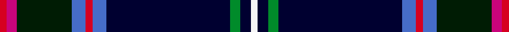

This page is one **sett** — a single exact thread-count. It belongs to the [tartan](/setts/r2m3ki16b4r2b4k36g3k3w2/)
(the same proportion at any scale), whose colour order is pattern [RRKBRBKGKW](/stripes/rrkbrbkgkw/).

Sourced from tartans-authority.  It is a [10 stripe tartan](/stripes/stripes10/).

Original link http://www.tartansauthority.com/tartan-ferret/display/1336/

## Register references

External register numbers recorded for this tartan.

- Scottish Tartans Authority (ITI): 1336

## Thread count
R/4 M6 Ki32 B8 R4 B8 K72 G6 K6 W/4

One full sett is **292 threads**.

## Palette
<table><thead><tr><th>Colour</th><th>Shade</th><th>OKLCh</th></tr></thead><tbody><tr><td>G</td><td><code style="background-color:#008B2A;">#008B2A</code> <small style="color:#888">#008B2A</small></td><td><small style="color:#888">oklch(55.4% 0.170 145.9)</small></td></tr><tr><td>B</td><td><code style="background-color:#466CC8;">#466CC8</code> <small style="color:#888">#466CC8</small></td><td><small style="color:#888">oklch(55.1% 0.149 265.0)</small></td></tr><tr><td>K</td><td><code style="background-color:#000030;">#000030</code> <small style="color:#888">#000030</small></td><td><small style="color:#888">oklch(14.0% 0.097 264.1)</small></td></tr><tr><td>K</td><td><code style="background-color:#001C04;">#001C04</code> <small style="color:#888">#001C04</small></td><td><small style="color:#888">oklch(19.7% 0.059 146.5)</small></td></tr><tr><td>M</td><td><code style="background-color:#CA047B;">#CA047B</code> <small style="color:#888">#CA047B</small></td><td><small style="color:#888">oklch(55.0% 0.225 353.8)</small></td></tr><tr><td>R</td><td><code style="background-color:#D60020;">#D60020</code> <small style="color:#888">#D60020</small></td><td><small style="color:#888">oklch(55.2% 0.224 25.5)</small></td></tr><tr><td>W</td><td><code style="background-color:#F7F7F7;">#F7F7F7</code> <small style="color:#888">#F7F7F7</small></td><td><small style="color:#888">oklch(97.6% 0.000 89.9)</small></td></tr></tbody></table>

# Sample pattern

## Nearest tartan variants

The nearest existing variants by ΔTartan distance, with this cloth at the top so the swatches line up against it.

ΔTartan

Threads

Variant

Sett

—

292

<a href="/variants/s10/r2m3ki16b4r2b4k36g3k3w2~x2~ki0802138-k0604259/">Fitzgerald Htg (Name)</a>

<a href="/ttd/edit/#slug=r3w6r2dg32db36k2db4lo2~x2&amp;base=r2m3ki16b4r2b4k36g3k3w2~x2~ki0802138-k0604259" title="compare in the TTD">2.69</a>

338

<a href="/variants/s8/r3w6r2dg32db36k2db4lo2~x2/">Canadian Centennial (Commemorative)</a>

<a href="/ttd/edit/#slug=r3w6r2dg32db36k2db4y2~x2&amp;base=r2m3ki16b4r2b4k36g3k3w2~x2~ki0802138-k0604259" title="compare in the TTD">2.69</a>

338

<a href="/variants/s8/r3w6r2dg32db36k2db4y2~x2/">Canadian Centennial</a>

## Neighbour map

Every grey dot is one of 13620 variants placed by the first two principal components of the ΔTartan feature space (42% of its variance). Red is this tartan; blue dots are its nearest — click one to open its page.

<svg viewBox="0 0 640 380" role="img" style="max-width:100%;height:auto;border:1px solid #e0e0e0;border-radius:4px;display:block" xmlns="http://www.w3.org/2000/svg"><image href="/nn/cloud.v1.png" width="640" height="380"/><a href="/variants/s8/r3w6r2dg32db36k2db4lo2~x2/"><circle cx="236.4" cy="116.4" r="4" fill="#3465a4"><title>Canadian Centennial (Commemorative)</title></circle></a><a href="/variants/s8/r3w6r2dg32db36k2db4y2~x2/"><circle cx="241.8" cy="118.5" r="4" fill="#3465a4"><title>Canadian Centennial</title></circle></a><circle cx="222.1" cy="77.4" r="5" fill="#c00000"/><text x="320" y="376" text-anchor="middle" font-size="11" fill="#999">ground</text><text x="11" y="190" text-anchor="middle" font-size="11" fill="#999" transform="rotate(-90 11 190)">complexity</text></svg>

ID: /variants/s10/r2m3ki16b4r2b4k36g3k3w2~x2~ki0802138-k0604259/
