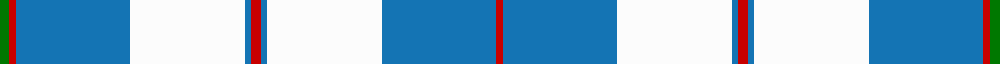

This page is one **sett** — a single exact thread-count. It belongs to the [tartan](/setts/r3b2w35b35r2g3/)
(the same proportion at any scale), whose colour order is pattern [GRBWBRBWBR](/stripes/grbwbrbwbr/).

Part of the [Galloway](/tartans/galloway/) tartan — the named design grouping this sett with its other cloths.

Sourced from register-of-tartans.  It is a [10 stripe tartan](/stripes/stripes10/).

Original link https://www.tartanregister.gov.uk/tartanDetails.aspx?ref=1302

## Also known as

This cloth is also recorded under:

- Galloway Family
- Galloway Green
- Galloway Red
- Galloway, Green
- Galloway, Red

## Register references

External register numbers recorded for this tartan.

- Scottish Register of Tartans: [1302](https://www.tartanregister.gov.uk/tartanDetails.aspx?ref=1302)
- Scottish Tartans Authority (ITI): 4953

## Thread count
G/6 R4 B70 W70 B4 R6 B4 W70 B70 R/4

One full sett is **606 threads**.

## Palette

Palette: <strong>Tartan Register</strong>
<table><thead><tr><th>Colour</th><th>Threads</th><th>Shade</th><th>Base</th><th>OKLCh</th></tr></thead><tbody><tr><td>G/</td><td style="text-align:right;font-variant-numeric:tabular-nums">6</td><td><code style="background-color:#007800;">#007800</code> <small style="color:#888">#007800</small></td><td>G <code style="background-color:#006100;">#006100</code></td><td><small style="color:#888">oklch(49.6% 0.169 142.5)</small></td></tr><tr><td>R</td><td style="text-align:right;font-variant-numeric:tabular-nums">4</td><td><code style="background-color:#C80000;">#C80000</code> <small style="color:#888">#C80000</small></td><td>R <code style="background-color:#CC0000;">#CC0000</code></td><td><small style="color:#888">oklch(52.3% 0.215 29.2)</small></td></tr><tr><td>B</td><td style="text-align:right;font-variant-numeric:tabular-nums">70</td><td><code style="background-color:#1474B4;">#1474B4</code> <small style="color:#888">#1474B4</small></td><td>B <code style="background-color:#2A418A;">#2A418A</code></td><td><small style="color:#888">oklch(54.0% 0.129 245.1)</small></td></tr><tr><td>W</td><td style="text-align:right;font-variant-numeric:tabular-nums">70</td><td><code style="background-color:#FCFCFC;">#FCFCFC</code> <small style="color:#888">#FCFCFC</small></td><td>W <code style="background-color:#F7F7F7;">#F7F7F7</code></td><td><small style="color:#888">oklch(99.1% 0.000 89.9)</small></td></tr><tr><td>B</td><td style="text-align:right;font-variant-numeric:tabular-nums">4</td><td><code style="background-color:#1474B4;">#1474B4</code> <small style="color:#888">#1474B4</small></td><td>B <code style="background-color:#2A418A;">#2A418A</code></td><td><small style="color:#888">oklch(54.0% 0.129 245.1)</small></td></tr><tr><td>R</td><td style="text-align:right;font-variant-numeric:tabular-nums">6</td><td><code style="background-color:#C80000;">#C80000</code> <small style="color:#888">#C80000</small></td><td>R <code style="background-color:#CC0000;">#CC0000</code></td><td><small style="color:#888">oklch(52.3% 0.215 29.2)</small></td></tr><tr><td>B</td><td style="text-align:right;font-variant-numeric:tabular-nums">4</td><td><code style="background-color:#1474B4;">#1474B4</code> <small style="color:#888">#1474B4</small></td><td>B <code style="background-color:#2A418A;">#2A418A</code></td><td><small style="color:#888">oklch(54.0% 0.129 245.1)</small></td></tr><tr><td>W</td><td style="text-align:right;font-variant-numeric:tabular-nums">70</td><td><code style="background-color:#FCFCFC;">#FCFCFC</code> <small style="color:#888">#FCFCFC</small></td><td>W <code style="background-color:#F7F7F7;">#F7F7F7</code></td><td><small style="color:#888">oklch(99.1% 0.000 89.9)</small></td></tr><tr><td>B</td><td style="text-align:right;font-variant-numeric:tabular-nums">70</td><td><code style="background-color:#1474B4;">#1474B4</code> <small style="color:#888">#1474B4</small></td><td>B <code style="background-color:#2A418A;">#2A418A</code></td><td><small style="color:#888">oklch(54.0% 0.129 245.1)</small></td></tr><tr><td>R/</td><td style="text-align:right;font-variant-numeric:tabular-nums">4</td><td><code style="background-color:#C80000;">#C80000</code> <small style="color:#888">#C80000</small></td><td>R <code style="background-color:#CC0000;">#CC0000</code></td><td><small style="color:#888">oklch(52.3% 0.215 29.2)</small></td></tr></tbody></table>

## Nearest tartans

The nearest existing variants by ΔTartan distance, with this tartan at the top so the swatches line up against it.

ΔTartan

Tartan

Sett

—

<a href="/ttd/edit/#slug=r3b2w35b35r2g3~x2">Galloway (Dance)</a> <a class="nn-out" href="/variants/s10/r3b2w35b35r2g3~x2/" title="open its dictionary page">↗</a>

1.08

<a href="/variants/s12/w2db1w15t12w1ly3db1~x6/">St John's</a>

1.11

<a href="/ttd/edit/#slug=w4k2w26t23w3t8p3~x2&amp;base=r3b2w35b35r2g3~x2">MacPherson Turquoise Dress Tartan</a> <a class="nn-out" href="/variants/s7/w4k2w26t23w3t8p3~x2/" title="open its dictionary page">↗</a>

1.13

<a href="/ttd/edit/#slug=r3b2w35b35r2g3~x2">Galloway (Dance)</a> <a class="nn-out" href="/variants/s6/r3b2w35b35r2g3~x2/" title="open its dictionary page">↗</a>

1.20

<a href="/ttd/edit/#slug=w2db1w15t12w1ly3db1~x6&amp;base=r3b2w35b35r2g3~x2">St. John's (Corporate)</a> <a class="nn-out" href="/variants/s7/w2db1w15t12w1ly3db1~x6/" title="open its dictionary page">↗</a>

1.21

<a href="/ttd/edit/#slug=w24b24lr6w1db4w20b10lr3w4~x2&amp;base=r3b2w35b35r2g3~x2">Silver (Personal)</a> <a class="nn-out" href="/variants/s9/w24b24lr6w1db4w20b10lr3w4~x2/" title="open its dictionary page">↗</a>

1.21

<a href="/ttd/edit/#slug=dt3n2w2n30w30r2w3~x2&amp;base=r3b2w35b35r2g3~x2">Torridon, Royal Blue (Dance)</a> <a class="nn-out" href="/variants/s7/dt3n2w2n30w30r2w3~x2/" title="open its dictionary page">↗</a>

1.26

<a href="/ttd/edit/#slug=t42k2w2k2t5n12w32t4~x2&amp;base=r3b2w35b35r2g3~x2">Longniddry, dress (Turquoise)</a> <a class="nn-out" href="/variants/s8/t42k2w2k2t5n12w32t4~x2/" title="open its dictionary page">↗</a>

1.31

<a href="/ttd/edit/#slug=t8db2t24db5w26k2w8~x2&amp;base=r3b2w35b35r2g3~x2">Lennox Turquoise Dress District Tartan</a> <a class="nn-out" href="/variants/s7/t8db2t24db5w26k2w8~x2/" title="open its dictionary page">↗</a>

1.37

<a href="/ttd/edit/#slug=k9w4k2w4k2w29k9w4b14lo2~x2&amp;base=r3b2w35b35r2g3~x2">Hannay</a> <a class="nn-out" href="/variants/s10/k9w4k2w4k2w29k9w4b14lo2~x2/" title="open its dictionary page">↗</a>

1.39

<a href="/ttd/edit/#slug=db9lb27db2ly4db2lb10db2w3~x2&amp;base=r3b2w35b35r2g3~x2">Alaska Highlanders P &amp; D (Corporate)</a> <a class="nn-out" href="/variants/s8/db9lb27db2ly4db2lb10db2w3~x2/" title="open its dictionary page">↗</a>

## Neighbour map

Every grey dot is one of 14360 variants placed by the first two principal components of the ΔTartan feature space (44% of its variance). Red is this tartan; blue dots are its nearest — click one to open its page.

<svg viewBox="0 0 640 380" role="img" style="max-width:100%;height:auto;border:1px solid #e0e0e0;border-radius:4px;display:block" xmlns="http://www.w3.org/2000/svg"><image href="/nn/cloud.v1.png" width="640" height="380"/><a href="/variants/s12/w2db1w15t12w1ly3db1~x6/"><circle cx="273.2" cy="138.8" r="4" fill="#3465a4"><title>St John's</title></circle></a><a href="/variants/s7/w4k2w26t23w3t8p3~x2/"><circle cx="277.7" cy="173.1" r="4" fill="#3465a4"><title>MacPherson Turquoise Dress Tartan</title></circle></a><a href="/variants/s6/r3b2w35b35r2g3~x2/"><circle cx="270.5" cy="144.6" r="4" fill="#3465a4"><title>Galloway (Dance)</title></circle></a><a href="/variants/s7/w2db1w15t12w1ly3db1~x6/"><circle cx="286.3" cy="154.5" r="4" fill="#3465a4"><title>St. John's (Corporate)</title></circle></a><a href="/variants/s9/w24b24lr6w1db4w20b10lr3w4~x2/"><circle cx="283.1" cy="150.6" r="4" fill="#3465a4"><title>Silver (Personal)</title></circle></a><a href="/variants/s7/dt3n2w2n30w30r2w3~x2/"><circle cx="284.2" cy="142.4" r="4" fill="#3465a4"><title>Torridon, Royal Blue (Dance)</title></circle></a><a href="/variants/s8/t42k2w2k2t5n12w32t4~x2/"><circle cx="296.5" cy="138.3" r="4" fill="#3465a4"><title>Longniddry, dress (Turquoise)</title></circle></a><a href="/variants/s7/t8db2t24db5w26k2w8~x2/"><circle cx="248.9" cy="177.7" r="4" fill="#3465a4"><title>Lennox Turquoise Dress District Tartan</title></circle></a><a href="/variants/s10/k9w4k2w4k2w29k9w4b14lo2~x2/"><circle cx="233.2" cy="128.7" r="4" fill="#3465a4"><title>Hannay</title></circle></a><a href="/variants/s8/db9lb27db2ly4db2lb10db2w3~x2/"><circle cx="332.5" cy="153.9" r="4" fill="#3465a4"><title>Alaska Highlanders P &amp; D (Corporate)</title></circle></a><circle cx="270.2" cy="131.7" r="5" fill="#c00000"/></svg>

ID: /variants/s10/r3b2w35b35r2g3~x2/
