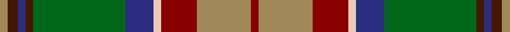

This page is one **sett** — a single exact thread-count. It belongs to the [tartan](/setts/r3lo21r14lb3db11g36do3db3do4lo3/)
(the same proportion at any scale), whose colour order is pattern [RYRWBGBBBY](/stripes/ryrwbgbbby/).

Sourced from tartans-authority.  It is a [10 stripe tartan](/stripes/stripes10/).

Original link http://www.tartansauthority.com/tartan-ferret/display/8623/

## Register references

External register numbers recorded for this tartan.

- Scottish Register of Tartans: [8623](https://www.tartanregister.gov.uk/tartanDetails?ref=8623)
- Scottish Tartans Authority (ITI): 8623

## Thread count
LT/6 DR8 DB6 DR6 G72 DB22 LR6 DRa28 LT42 DRa/6

One full sett is **392 threads**.

## Palette

Palette: <strong>Tartan Register</strong>
<table><thead><tr><th>Colour</th><th>Threads</th><th>Shade</th><th>Base</th><th>OKLCh</th></tr></thead><tbody><tr><td>LT/</td><td style="text-align:right;font-variant-numeric:tabular-nums">6</td><td><code style="background-color:#A08858;">#A08858</code> <small style="color:#888">#A08858</small></td><td>Y <code style="background-color:#F2BF00;">#F2BF00</code></td><td><small style="color:#888">oklch(63.7% 0.071 84.0)</small></td></tr><tr><td>DR</td><td style="text-align:right;font-variant-numeric:tabular-nums">8</td><td><code style="background-color:#441800;">#441800</code> <small style="color:#888">#441800</small></td><td>B <code style="background-color:#2A418A;">#2A418A</code></td><td><small style="color:#888">oklch(27.3% 0.076 46.3)</small></td></tr><tr><td>DB</td><td style="text-align:right;font-variant-numeric:tabular-nums">6</td><td><code style="background-color:#2C2C80;">#2C2C80</code> <small style="color:#888">#2C2C80</small></td><td>B <code style="background-color:#2A418A;">#2A418A</code></td><td><small style="color:#888">oklch(35.0% 0.138 276.6)</small></td></tr><tr><td>DR</td><td style="text-align:right;font-variant-numeric:tabular-nums">6</td><td><code style="background-color:#441800;">#441800</code> <small style="color:#888">#441800</small></td><td>B <code style="background-color:#2A418A;">#2A418A</code></td><td><small style="color:#888">oklch(27.3% 0.076 46.3)</small></td></tr><tr><td>G</td><td style="text-align:right;font-variant-numeric:tabular-nums">72</td><td><code style="background-color:#006818;">#006818</code> <small style="color:#888">#006818</small></td><td>G <code style="background-color:#006100;">#006100</code></td><td><small style="color:#888">oklch(45.0% 0.142 145.0)</small></td></tr><tr><td>DB</td><td style="text-align:right;font-variant-numeric:tabular-nums">22</td><td><code style="background-color:#2C2C80;">#2C2C80</code> <small style="color:#888">#2C2C80</small></td><td>B <code style="background-color:#2A418A;">#2A418A</code></td><td><small style="color:#888">oklch(35.0% 0.138 276.6)</small></td></tr><tr><td>LR</td><td style="text-align:right;font-variant-numeric:tabular-nums">6</td><td><code style="background-color:#E8CCB8;">#E8CCB8</code> <small style="color:#888">#E8CCB8</small></td><td>W <code style="background-color:#F7F7F7;">#F7F7F7</code></td><td><small style="color:#888">oklch(86.3% 0.042 57.7)</small></td></tr><tr><td>DRa</td><td style="text-align:right;font-variant-numeric:tabular-nums">28</td><td><code style="background-color:#880000;">#880000</code> <small style="color:#888">#880000</small></td><td>R <code style="background-color:#CC0000;">#CC0000</code></td><td><small style="color:#888">oklch(39.4% 0.162 29.2)</small></td></tr><tr><td>LT</td><td style="text-align:right;font-variant-numeric:tabular-nums">42</td><td><code style="background-color:#A08858;">#A08858</code> <small style="color:#888">#A08858</small></td><td>Y <code style="background-color:#F2BF00;">#F2BF00</code></td><td><small style="color:#888">oklch(63.7% 0.071 84.0)</small></td></tr><tr><td>DRa/</td><td style="text-align:right;font-variant-numeric:tabular-nums">6</td><td><code style="background-color:#880000;">#880000</code> <small style="color:#888">#880000</small></td><td>R <code style="background-color:#CC0000;">#CC0000</code></td><td><small style="color:#888">oklch(39.4% 0.162 29.2)</small></td></tr></tbody></table>

## Nearest tartans

The nearest existing variants by ΔTartan distance, with this tartan at the top so the swatches line up against it.

ΔTartan

Tartan

Sett

—

<a href="/ttd/edit/#slug=r3lo21r14lb3db11g36do3db3do4lo3~x2">State Seal of Florida (Fashion)</a> <a class="nn-out" href="/variants/s10/r3lo21r14lb3db11g36do3db3do4lo3~x2/" title="open its dictionary page">↗</a>

0.72

<a href="/ttd/edit/#slug=dy2o2dg19o6dg2o6lo14r4w2~x2&amp;base=r3lo21r14lb3db11g36do3db3do4lo3~x2">Royal Pharmaceutical Society (Corp)</a> <a class="nn-out" href="/variants/s9/dy2o2dg19o6dg2o6lo14r4w2~x2/" title="open its dictionary page">↗</a>

0.73

<a href="/ttd/edit/#slug=dy3o2dg19o6dg2o6lo14r4w2~x2&amp;base=r3lo21r14lb3db11g36do3db3do4lo3~x2">Royal Pharmaceutical Society</a> <a class="nn-out" href="/variants/s9/dy3o2dg19o6dg2o6lo14r4w2~x2/" title="open its dictionary page">↗</a>

0.94

<a href="/ttd/edit/#slug=lb5o49lb3dg24r5lo4dy30lb4~x2&amp;base=r3lo21r14lb3db11g36do3db3do4lo3~x2">State Seal of New Mexico (Fashion)</a> <a class="nn-out" href="/variants/s8/lb5o49lb3dg24r5lo4dy30lb4~x2/" title="open its dictionary page">↗</a>

0.96

<a href="/ttd/edit/#slug=y8g2k4lo1k1lb1k1do8y3k1y1lb1~x4&amp;base=r3lo21r14lb3db11g36do3db3do4lo3~x2">Wcwm 9275-1258</a> <a class="nn-out" href="/variants/s12/y8g2k4lo1k1lb1k1do8y3k1y1lb1~x4/" title="open its dictionary page">↗</a>

0.97

<a href="/ttd/edit/#slug=r4lo3dt24dy26g3lo21dp2lo4~x2&amp;base=r3lo21r14lb3db11g36do3db3do4lo3~x2">Goddin mab Gododdin (Personal)</a> <a class="nn-out" href="/variants/s8/r4lo3dt24dy26g3lo21dp2lo4~x2/" title="open its dictionary page">↗</a>

1.05

<a href="/ttd/edit/#slug=k4r1k3ly1k1w1k1y8g12r1g2k1~x4&amp;base=r3lo21r14lb3db11g36do3db3do4lo3~x2">Murphy (District)</a> <a class="nn-out" href="/variants/s12/k4r1k3ly1k1w1k1y8g12r1g2k1~x4/" title="open its dictionary page">↗</a>

1.07

<a href="/ttd/edit/#slug=o20dp2o2dp2o3dp8dg9g8y8dg1lr2~x2&amp;base=r3lo21r14lb3db11g36do3db3do4lo3~x2">Isle of Skye</a> <a class="nn-out" href="/variants/s11/o20dp2o2dp2o3dp8dg9g8y8dg1lr2~x2/" title="open its dictionary page">↗</a>

1.07

<a href="/ttd/edit/#slug=dy22y22dr2lb6dr2lo2dr16g5dy8lb2~x2&amp;base=r3lo21r14lb3db11g36do3db3do4lo3~x2">Bruce of Kinnaird (Vivienne Westwood Design)</a> <a class="nn-out" href="/variants/s10/dy22y22dr2lb6dr2lo2dr16g5dy8lb2~x2/" title="open its dictionary page">↗</a>

1.09

<a href="/ttd/edit/#slug=do3db2g19db6g2db6lo14w2dp4w2~x2&amp;base=r3lo21r14lb3db11g36do3db3do4lo3~x2">Royal Pharmaceutical Society Commemorative Tartan</a> <a class="nn-out" href="/variants/s10/do3db2g19db6g2db6lo14w2dp4w2~x2/" title="open its dictionary page">↗</a>

1.10

<a href="/ttd/edit/#slug=db4dg41lo4g4lo4g9o18lo4w4~x2&amp;base=r3lo21r14lb3db11g36do3db3do4lo3~x2">Gallagher Irish Fashion Tartan</a> <a class="nn-out" href="/variants/s9/db4dg41lo4g4lo4g9o18lo4w4~x2/" title="open its dictionary page">↗</a>

## Neighbour map

Every grey dot is one of 14360 variants placed by the first two principal components of the ΔTartan feature space (44% of its variance). Red is this tartan; blue dots are its nearest — click one to open its page.

<svg viewBox="0 0 640 380" role="img" style="max-width:100%;height:auto;border:1px solid #e0e0e0;border-radius:4px;display:block" xmlns="http://www.w3.org/2000/svg"><image href="/nn/cloud.v1.png" width="640" height="380"/><a href="/variants/s9/dy2o2dg19o6dg2o6lo14r4w2~x2/"><circle cx="157.2" cy="162.8" r="4" fill="#3465a4"><title>Royal Pharmaceutical Society (Corp)</title></circle></a><a href="/variants/s9/dy3o2dg19o6dg2o6lo14r4w2~x2/"><circle cx="151.5" cy="165.3" r="4" fill="#3465a4"><title>Royal Pharmaceutical Society</title></circle></a><a href="/variants/s8/lb5o49lb3dg24r5lo4dy30lb4~x2/"><circle cx="196.5" cy="136.2" r="4" fill="#3465a4"><title>State Seal of New Mexico (Fashion)</title></circle></a><a href="/variants/s12/y8g2k4lo1k1lb1k1do8y3k1y1lb1~x4/"><circle cx="148.2" cy="151.2" r="4" fill="#3465a4"><title>Wcwm 9275-1258</title></circle></a><a href="/variants/s8/r4lo3dt24dy26g3lo21dp2lo4~x2/"><circle cx="175.1" cy="160.6" r="4" fill="#3465a4"><title>Goddin mab Gododdin (Personal)</title></circle></a><a href="/variants/s12/k4r1k3ly1k1w1k1y8g12r1g2k1~x4/"><circle cx="175.2" cy="125.4" r="4" fill="#3465a4"><title>Murphy (District)</title></circle></a><a href="/variants/s11/o20dp2o2dp2o3dp8dg9g8y8dg1lr2~x2/"><circle cx="192.2" cy="138.6" r="4" fill="#3465a4"><title>Isle of Skye</title></circle></a><a href="/variants/s10/dy22y22dr2lb6dr2lo2dr16g5dy8lb2~x2/"><circle cx="170.0" cy="160.5" r="4" fill="#3465a4"><title>Bruce of Kinnaird (Vivienne Westwood Design)</title></circle></a><a href="/variants/s10/do3db2g19db6g2db6lo14w2dp4w2~x2/"><circle cx="128.8" cy="152.4" r="4" fill="#3465a4"><title>Royal Pharmaceutical Society Commemorative Tartan</title></circle></a><a href="/variants/s9/db4dg41lo4g4lo4g9o18lo4w4~x2/"><circle cx="209.3" cy="147.4" r="4" fill="#3465a4"><title>Gallagher Irish Fashion Tartan</title></circle></a><circle cx="164.4" cy="142.9" r="5" fill="#c00000"/></svg>

ID: /variants/s10/r3lo21r14lb3db11g36do3db3do4lo3~x2/
