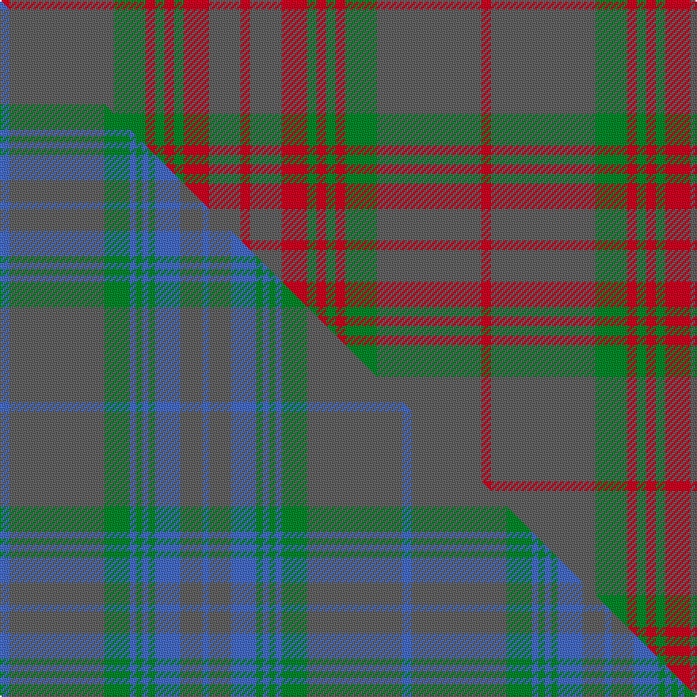

This page is one **sett** — a single exact thread-count. It belongs to the [tartan](/setts/r3n33g10r3g3r3g3r8n10r3/)
(the same proportion at any scale), whose colour order is pattern [RBGRGRGRBR](/stripes/rbgrgrgrbr/).

Part of the [Gray](/tartans/gray/) tartan — the named design grouping this sett with its other cloths.

Sourced from tartans-authority.  It is a [10 stripe tartan](/stripes/stripes10/).

Original link https://www.tartanregister.gov.uk/tartanDetails.aspx?ref=2148

Dataset <small>— provenance for this record, inherited from the source manifest</small>

<dl class="dataset-prov">
<dt>source</dt><dd><a href="/sources/tartans-authority/">Scottish Tartans Authority</a></dd>
<dt>data captured from</dt><dd><a href="https://github.com/thetartan/tartan-database/blob/master/data/tartans-authority/data.csv">https://github.com/thetartan/tartan-database/blob/master/data/tartans-authority/data.csv</a></dd>
<dt>data date</dt><dd>1986 February <small>(this record)</small></dd>
<dt>licence</dt><dd><a href="https://creativecommons.org/licenses/by-nc-nd/4.0/">CC BY-NC-ND 4.0</a></dd>
</dl>

Capture chain <small>— the hands this data passed through, oldest first; each capture carries its own licence</small>

<ol class="capture-chain">
<li><a href="https://www.tartansauthority.com/">Scottish Tartans Authority</a> <small>the heritage body's archive — its tartan-ferret record browser is retired (links repaired to the SRT, above)</small></li>
<li><a href="https://github.com/thetartan/tartan-database">thetartan/tartan-database</a> <small>2016-2017</small> · <a href="https://creativecommons.org/licenses/by-nc-nd/4.0/">CC BY-NC-ND 4.0</a> <small>Levko Kravets's frozen compilation — the capture we vendored, and where its CC licence text came from</small></li>
<li>this dictionary <small>captured 2026-06-10 · commit 5bf86c7566</small> <small>each re-capture is a git commit to data/sources</small></li>
</ol>

## Register references

External register numbers recorded for this tartan.

- Scottish Tartans Authority (ITI): 2148

## Thread count
R/6 N66 G20 R6 G6 R6 G6 R16 N20 R/6

One full sett is **304 threads**.

## Palette
<table><thead><tr><th>Colour</th><th>Shade</th><th>OKLCh</th></tr></thead><tbody><tr><td>R</td><td><code style="background-color:#D60020;">#D60020</code> <small style="color:#888">#D60020</small></td><td><small style="color:#888">oklch(55.2% 0.224 25.5)</small></td></tr><tr><td>G</td><td><code style="background-color:#008B2A;">#008B2A</code> <small style="color:#888">#008B2A</small></td><td><small style="color:#888">oklch(55.4% 0.170 145.9)</small></td></tr><tr><td>N</td><td><code style="background-color:#636363;">#636363</code> <small style="color:#888">#636363</small></td><td><small style="color:#888">oklch(50.0% 0.000 89.9)</small></td></tr></tbody></table>

# Sample pattern

## Compared to the master

This cloth is one sett of its design; the master sett (the exemplar the design is anchored on) is below for comparison.

Its **ΔTartan distance** from the master is **6.64** — the same measure the nearest-tartans table ranks by (0 is identical; a re-scale of the same cloth is near 0, a recolour or a different proportion further).

<figure class="master-compare" style="margin:0">

this sett
master sett ★

<figcaption style="color:#888;font-size:smaller">One weave of this sett against the <a href="/setts/b3n30g8b2g2b2g2b8n7b2/">master sett ★</a>, split on the diagonal: a shared proportion runs seamlessly across it with only the shades shifting; a different proportion breaks on it.</figcaption>
</figure>

## Nearest tartan variants

The nearest existing variants by ΔTartan distance, with this cloth at the top so the swatches line up against it.

ΔTartan

Threads

Variant

Sett

—

304

<a href="/variants/s10/r3n33g10r3g3r3g3r8n10r3~x2/">Gray (Name)</a>

<a href="/ttd/edit/#slug=dr3n30g8dr2g2dr2g2dr8n7dr2~x2&amp;base=r3n33g10r3g3r3g3r8n10r3~x2" title="compare in the TTD">0.36</a>

254

<a href="/variants/s10/dr3n30g8dr2g2dr2g2dr8n7dr2~x2/">Gray Family Tartan</a>

<a href="/ttd/edit/#slug=n33g10r3g3r3g3r8n10r3n10r8g3r3g3r3g10n33r3~x2&amp;base=r3n33g10r3g3r3g3r8n10r3~x2" title="compare in the TTD">2.65</a>

536

<a href="/variants/s18/n33g10r3g3r3g3r8n10r3n10r8g3r3g3r3g10n33r3~x2/">Gray (Personal)</a>

<a href="/ttd/edit/#slug=y5dg14o4db4o27dg3o4y5~x2&amp;base=r3n33g10r3g3r3g3r8n10r3~x2" title="compare in the TTD">3.13</a>

244

<a href="/variants/s8/y5dg14o4db4o27dg3o4y5~x2/">Invertere</a>

<a href="/ttd/edit/#slug=r4y34do20y4do8y6ri2y5do2y3r4~r1706009-ri2109032&amp;base=r3n33g10r3g3r3g3r8n10r3~x2" title="compare in the TTD">3.16</a>

176

<a href="/variants/s11/r4y34do20y4do8y6ri2y5do2y3r4~r1706009-ri2109032/">Morgan Welsh Name Tartan</a>

<a href="/ttd/edit/#slug=db5n15o4n4o24n4o4db5&amp;base=r3n33g10r3g3r3g3r8n10r3~x2" title="compare in the TTD">3.26</a>

120

<a href="/variants/s8/db5n15o4n4o24n4o4db5/">Daks, (Muted Skye)</a>

<a href="/ttd/edit/#slug=dr4y34do20y4do8y6r2y5do2y3dr4&amp;base=r3n33g10r3g3r3g3r8n10r3~x2" title="compare in the TTD">3.31</a>

176

<a href="/variants/s11/dr4y34do20y4do8y6r2y5do2y3dr4/">Morgan of Wales</a>

<a href="/ttd/edit/#slug=dp3o23dp3o26dp3o3dp25o3g24o3~x2~dp1607327&amp;base=r3n33g10r3g3r3g3r8n10r3~x2" title="compare in the TTD">3.38</a>

452

<a href="/variants/s10/dp3o23dp3o26dp3o3dp25o3g24o3~x2~dp1607327/">Unidentified 18th Century</a>

<a href="/ttd/edit/#slug=g4o2g2o2g2o3db1o1g4o1db1o12db2o3~x2&amp;base=r3n33g10r3g3r3g3r8n10r3~x2" title="compare in the TTD">3.48</a>

146

<a href="/variants/s14/g4o2g2o2g2o3db1o1g4o1db1o12db2o3~x2/">MacAlister of Glenbarr</a>

<a href="/ttd/edit/#slug=do12r1do2r1do2lb2do3n9r1n2r1n3~x4&amp;base=r3n33g10r3g3r3g3r8n10r3~x2" title="compare in the TTD">3.65</a>

252

<a href="/variants/s12/do12r1do2r1do2lb2do3n9r1n2r1n3~x4/">Shieldhall (Fashion)</a>

<a href="/ttd/edit/#slug=n3do18n4do3n4r13n21do2b3~x2&amp;base=r3n33g10r3g3r3g3r8n10r3~x2" title="compare in the TTD">3.67</a>

272

<a href="/variants/s9/n3do18n4do3n4r13n21do2b3~x2/">Leitrim</a>

## Neighbour map

Every grey dot is one of 13620 variants placed by the first two principal components of the ΔTartan feature space (42% of its variance). Red is this tartan; blue dots are its nearest — click one to open its page.

<svg viewBox="0 0 640 380" role="img" style="max-width:100%;height:auto;border:1px solid #e0e0e0;border-radius:4px;display:block" xmlns="http://www.w3.org/2000/svg"><image href="/nn/cloud.v1.png" width="640" height="380"/><a href="/variants/s10/dr3n30g8dr2g2dr2g2dr8n7dr2~x2/"><circle cx="476.3" cy="215.7" r="4" fill="#3465a4"><title>Gray Family Tartan</title></circle></a><a href="/variants/s18/n33g10r3g3r3g3r8n10r3n10r8g3r3g3r3g10n33r3~x2/"><circle cx="423.9" cy="196.5" r="4" fill="#3465a4"><title>Gray (Personal)</title></circle></a><a href="/variants/s8/y5dg14o4db4o27dg3o4y5~x2/"><circle cx="364.8" cy="224.2" r="4" fill="#3465a4"><title>Invertere</title></circle></a><a href="/variants/s11/r4y34do20y4do8y6ri2y5do2y3r4~r1706009-ri2109032/"><circle cx="430.6" cy="176.4" r="4" fill="#3465a4"><title>Morgan Welsh Name Tartan</title></circle></a><a href="/variants/s8/db5n15o4n4o24n4o4db5/"><circle cx="391.5" cy="272.8" r="4" fill="#3465a4"><title>Daks, (Muted Skye)</title></circle></a><a href="/variants/s11/dr4y34do20y4do8y6r2y5do2y3dr4/"><circle cx="428.2" cy="177.4" r="4" fill="#3465a4"><title>Morgan of Wales</title></circle></a><a href="/variants/s10/dp3o23dp3o26dp3o3dp25o3g24o3~x2~dp1607327/"><circle cx="344.9" cy="222.6" r="4" fill="#3465a4"><title>Unidentified 18th Century</title></circle></a><a href="/variants/s14/g4o2g2o2g2o3db1o1g4o1db1o12db2o3~x2/"><circle cx="418.7" cy="202.2" r="4" fill="#3465a4"><title>MacAlister of Glenbarr</title></circle></a><a href="/variants/s12/do12r1do2r1do2lb2do3n9r1n2r1n3~x4/"><circle cx="348.5" cy="187.1" r="4" fill="#3465a4"><title>Shieldhall (Fashion)</title></circle></a><a href="/variants/s9/n3do18n4do3n4r13n21do2b3~x2/"><circle cx="343.6" cy="223.7" r="4" fill="#3465a4"><title>Leitrim</title></circle></a><circle cx="421.8" cy="213.5" r="5" fill="#c00000"/><text x="320" y="376" text-anchor="middle" font-size="11" fill="#999">ground</text><text x="11" y="190" text-anchor="middle" font-size="11" fill="#999" transform="rotate(-90 11 190)">complexity</text></svg>

ID: /variants/s10/r3n33g10r3g3r3g3r8n10r3~x2/
