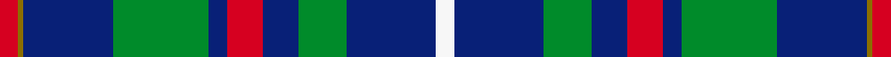

This page is one **sett** — a single exact thread-count. It belongs to the [tartan](/setts/r3y1db15g16db3r6db6g8db15w3/)
(the same proportion at any scale), whose colour order is pattern [RGBGBRBGBW](/stripes/rgbgbrbgbw/).

Sourced from register-of-tartans.  It is a [10 stripe tartan](/stripes/stripes10/).

Original link https://www.tartanregister.gov.uk/tartanDetails.aspx?ref=10891

2 attestations — the source records this cloth was collapsed from (oldest owns this page)

<ul>
<li>06/08/2013 — Steve Walls Commemorative (register-of-tartans, <a href="https://www.tartanregister.gov.uk/tartanDetails.aspx?ref=10891">record</a>)  <em>This tartan was created in memory of Steve Walls, a proud Scot who represented Scotland in Cheerleading and Dance, and was well-known for wearing kilts. The tartan incorporates green - the colour of The New Golf Club, St Andrews, of which he was a past captain; red and yellow for Scotcheer, the company Steve founded to promote Scottish Cheerleading throughout the world; blue and white for the Saltire and Dundee FC. The tartan will be used by friends and family and potentially by Scottish Cheerleading squads.</em></li>
<li>2013 — Steve Walls (tartans-authority, <a href="http://www.tartansauthority.com/tartan-ferret/display/10891/">record</a>)  <em>This tartan was created in memory of Steve Walls, a proud Scot who represented Scotland in Cheerleading and Dance, and was well-known for wearing kilts. The tartan incorporates green - the colour of The New Golf Club, St Andrews, of which he was a past captain; red and yellow for Scotcheer, the company Steve founded to promote Scottish Cheerleading throughout the world; blue and white for the Saltire and Dundee FC. The tartan will be used by friends and family and potentially by Scottish Cheerleading squads</em></li>
</ul>

## Register references

External register numbers recorded for this tartan.

- Scottish Register of Tartans: [10891](https://www.tartanregister.gov.uk/tartanDetails?ref=10891)
- Scottish Tartans Authority (ITI): 10891

## Thread count
R/6 Y2 DB30 G32 DB6 R12 DB12 G16 DB30 W/6

One full sett is **292 threads**.

## Palette
<table><thead><tr><th>Colour</th><th>Shade</th><th>OKLCh</th></tr></thead><tbody><tr><td>DB</td><td><code style="background-color:#082077;">#082077</code> <small style="color:#888">#082077</small></td><td><small style="color:#888">oklch(30.0% 0.149 265.1)</small></td></tr><tr><td>G</td><td><code style="background-color:#008B2A;">#008B2A</code> <small style="color:#888">#008B2A</small></td><td><small style="color:#888">oklch(55.4% 0.170 145.9)</small></td></tr><tr><td>R</td><td><code style="background-color:#D60020;">#D60020</code> <small style="color:#888">#D60020</small></td><td><small style="color:#888">oklch(55.2% 0.224 25.5)</small></td></tr><tr><td>W</td><td><code style="background-color:#F7F7F7;">#F7F7F7</code> <small style="color:#888">#F7F7F7</small></td><td><small style="color:#888">oklch(97.6% 0.000 89.9)</small></td></tr><tr><td>Y</td><td><code style="background-color:#8B6E00;">#8B6E00</code> <small style="color:#888">#8B6E00</small></td><td><small style="color:#888">oklch(55.1% 0.113 90.4)</small></td></tr></tbody></table>

# Sample pattern

## Nearest tartan variants

The nearest existing variants by ΔTartan distance, with this cloth at the top so the swatches line up against it.

ΔTartan

Threads

Variant

Sett

—

292

<a href="/variants/s10/r3y1db15g16db3r6db6g8db15w3~x2/">Steve Walls Commemorative</a>

<a href="/ttd/edit/#slug=db6r3g26db26w4db26r5g5~x2&amp;base=r3y1db15g16db3r6db6g8db15w3~x2" title="compare in the TTD">2.52</a>

382

<a href="/variants/s8/db6r3g26db26w4db26r5g5~x2/">MacHardy, Blue</a>

<a href="/ttd/edit/#slug=db2n10db1n1db10r1db10g10w2~x2&amp;base=r3y1db15g16db3r6db6g8db15w3~x2" title="compare in the TTD">2.66</a>

180

<a href="/variants/s9/db2n10db1n1db10r1db10g10w2~x2/">American Soc.of Travel Agents (Corp)</a>

<a href="/ttd/edit/#slug=db13g8r5db3g2r1y1~x4&amp;base=r3y1db15g16db3r6db6g8db15w3~x2" title="compare in the TTD">2.77</a>

208

<a href="/variants/s7/db13g8r5db3g2r1y1~x4/">Fibonacci7</a>

<a href="/ttd/edit/#slug=y2g20db8r3db2r2db16w1lb2~x2&amp;base=r3y1db15g16db3r6db6g8db15w3~x2" title="compare in the TTD">2.81</a>

216

<a href="/variants/s9/y2g20db8r3db2r2db16w1lb2~x2/">Scotland’s Golf Coast</a>

## Neighbour map

Every grey dot is one of 13620 variants placed by the first two principal components of the ΔTartan feature space (42% of its variance). Red is this tartan; blue dots are its nearest — click one to open its page.

<svg viewBox="0 0 640 380" role="img" style="max-width:100%;height:auto;border:1px solid #e0e0e0;border-radius:4px;display:block" xmlns="http://www.w3.org/2000/svg"><image href="/nn/cloud.v1.png" width="640" height="380"/><a href="/variants/s8/db6r3g26db26w4db26r5g5~x2/"><circle cx="294.8" cy="208.1" r="4" fill="#3465a4"><title>MacHardy, Blue</title></circle></a><a href="/variants/s9/db2n10db1n1db10r1db10g10w2~x2/"><circle cx="248.3" cy="196.7" r="4" fill="#3465a4"><title>American Soc.of Travel Agents (Corp)</title></circle></a><a href="/variants/s7/db13g8r5db3g2r1y1~x4/"><circle cx="273.5" cy="197.6" r="4" fill="#3465a4"><title>Fibonacci7</title></circle></a><a href="/variants/s9/y2g20db8r3db2r2db16w1lb2~x2/"><circle cx="245.7" cy="133.2" r="4" fill="#3465a4"><title>Scotland’s Golf Coast</title></circle></a><circle cx="246.0" cy="174.3" r="5" fill="#c00000"/><text x="320" y="376" text-anchor="middle" font-size="11" fill="#999">ground</text><text x="11" y="190" text-anchor="middle" font-size="11" fill="#999" transform="rotate(-90 11 190)">complexity</text></svg>

ID: /variants/s10/r3y1db15g16db3r6db6g8db15w3~x2/
