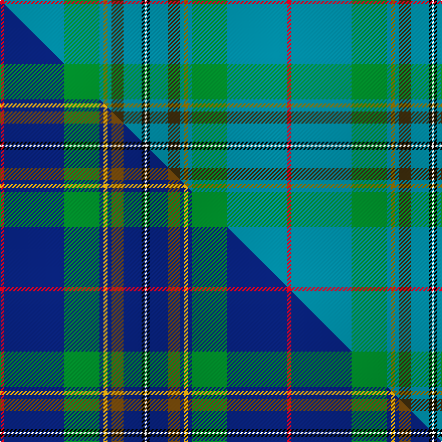

This is one **variant** — a specific cloth: this exact thread count and colourway, with its own
provenance below. It is one weaving of the [sett](/setts/r4t60g35t4y4t4dy12t18k3w2/) (the scale-free proportion — the
same cloth at any scale or shade), whose colour order is pattern [RBGBGBGBKW](/stripes/rbgbgbgbkw/).

Part of the [Fogarty](/tartans/f/fo/fogarty/) tartan — the named design grouping this sett with its other cloths.

Sourced from tartans-authority.  It is a [10 stripe tartan](/stripes/stripes10/).

Original link [https://www.tartanregister.gov.uk/tartanDetails.aspx?ref=10180](https://www.tartanregister.gov.uk/tartanDetails.aspx?ref=10180)

Dataset <small>— provenance for this record, inherited from the source manifest</small>

<dl class="dataset-prov">
<dt>source</dt><dd><a href="/sources/tartans-authority/">Scottish Tartans Authority</a></dd>
<dt>data captured from</dt><dd><a href="https://github.com/thetartan/tartan-database/blob/master/data/tartans-authority/data.csv">https://github.com/thetartan/tartan-database/blob/master/data/tartans-authority/data.csv</a></dd>
<dt>data date</dt><dd>27th Feb. 2010 <small>(this record)</small></dd>
<dt>licence</dt><dd><a href="https://creativecommons.org/licenses/by-nc-nd/4.0/">CC BY-NC-ND 4.0</a></dd>
</dl>

Capture chain <small>— the hands this data passed through, oldest first; each capture carries its own licence</small>

<ol class="capture-chain">
<li><a href="https://www.tartansauthority.com/">Scottish Tartans Authority</a> <small>the heritage body's archive — its tartan-ferret record browser is retired (links repaired to the SRT, above)</small></li>
<li><a href="https://github.com/thetartan/tartan-database">thetartan/tartan-database</a> <small>2016-2017</small> · <a href="https://creativecommons.org/licenses/by-nc-nd/4.0/">CC BY-NC-ND 4.0</a> <small>Levko Kravets's frozen compilation — the capture we vendored, and where its CC licence text came from</small></li>
<li>this dictionary <small>captured 2026-06-10 · commit 5bf86c7566</small> <small>each re-capture is a git commit to data/sources</small></li>
</ol>

## Register references

External register numbers recorded for this tartan.

- Scottish Register of Tartans: [10180](https://www.tartanregister.gov.uk/tartanDetails?ref=10180)
- Scottish Tartans Authority (ITI): 10180

## Thread count
R/4 T60 G35 T4 Y4 T4 DY12 T18 K3 W/2

One full sett is **286 threads**.

## Palette
<table><thead><tr><th>Colour</th><th>Shade</th><th>OKLCh</th></tr></thead><tbody><tr><td>T</td><td><code style="background-color:#00879F;">#00879F</code> <small style="color:#888">#00879F</small></td><td><small style="color:#888">oklch(57.4% 0.102 216.1)</small></td></tr><tr><td>G</td><td><code style="background-color:#008B2A;">#008B2A</code> <small style="color:#888">#008B2A</small></td><td><small style="color:#888">oklch(55.4% 0.170 145.9)</small></td></tr><tr><td>K</td><td><code style="background-color:#000000;">#000000</code> <small style="color:#888">#000000</small></td><td><small style="color:#888">oklch(0.0% 0.000 0.0)</small></td></tr><tr><td>W</td><td><code style="background-color:#F7F7F7;">#F7F7F7</code> <small style="color:#888">#F7F7F7</small></td><td><small style="color:#888">oklch(97.6% 0.000 89.9)</small></td></tr><tr><td>R</td><td><code style="background-color:#D60020;">#D60020</code> <small style="color:#888">#D60020</small></td><td><small style="color:#888">oklch(55.2% 0.224 25.5)</small></td></tr><tr><td>DY</td><td><code style="background-color:#3A2B0D;">#3A2B0D</code> <small style="color:#888">#3A2B0D</small></td><td><small style="color:#888">oklch(30.0% 0.049 82.0)</small></td></tr><tr><td>Y</td><td><code style="background-color:#8B6E00;">#8B6E00</code> <small style="color:#888">#8B6E00</small></td><td><small style="color:#888">oklch(55.1% 0.113 90.4)</small></td></tr></tbody></table>

# Sample pattern

## Compared to the master

This cloth is one sett of its design; the master sett (the exemplar the design is anchored on) is below for comparison.

Its **ΔTartan distance** from the master is **0.69** — the same measure the nearest-tartans table ranks by (0 is identical; a re-scale of the same cloth is near 0, a recolour or a different proportion further).

<figure class="master-compare" style="margin:0">

this sett
master sett ★

<figcaption style="color:#888;font-size:smaller">One weave of this sett against the <a href="/setts/r4db60g35db4ly4db4dy12db18k3w2/">master sett ★</a>, split on the diagonal: a shared proportion runs seamlessly across it with only the shades shifting; a different proportion breaks on it.</figcaption>
</figure>

## Nearest tartan variants

The nearest existing variants by ΔTartan distance, with this cloth at the top so the swatches line up against it.

ΔTartan

Threads

Variant

Sett

—

286

<a href="/variants/s10/r4t60g35t4y4t4dy12t18k3w2/">Fogarty (Name)</a>

<a href="/ttd/edit/#slug=r4db60g35db4ly4db4dy12db18k3w2~ly3206085-dy1804072&amp;base=r4t60g35t4y4t4dy12t18k3w2" title="compare in the TTD">0.69</a>

286

<a href="/variants/s10/r4db60g35db4ly4db4dy12db18k3w2~ly3206085-dy1804072/">Fogarty (Tipperary)</a>

<a href="/ttd/edit/#slug=t27w2t15ly1t1ly1t15k2w2g16r1~x2&amp;base=r4t60g35t4y4t4dy12t18k3w2" title="compare in the TTD">2.56</a>

276

<a href="/variants/s11/t27w2t15ly1t1ly1t15k2w2g16r1~x2/">Quigley of Knockcroghery Htg (Per.)</a>

<a href="/ttd/edit/#slug=r2g6dy2g3t4g14t36k2t3w2~x2&amp;base=r4t60g35t4y4t4dy12t18k3w2" title="compare in the TTD">2.70</a>

288

<a href="/variants/s10/r2g6dy2g3t4g14t36k2t3w2~x2/">Sarasota - Dunfermline (Commemorat)</a>

<a href="/ttd/edit/#slug=t36r2t4w1dy14g4y2g18~x2&amp;base=r4t60g35t4y4t4dy12t18k3w2" title="compare in the TTD">3.80</a>

216

<a href="/variants/s8/t36r2t4w1dy14g4y2g18~x2/">Yorkland (Personal)</a>

<a href="/ttd/edit/#slug=dg62n3dg3n31k4g5lb5r3~x2~dg1806142-g2408144&amp;base=r4t60g35t4y4t4dy12t18k3w2" title="compare in the TTD">3.80</a>

334

<a href="/variants/s8/dg62n3dg3n31k4g5lb5r3~x2~dg1806142-g2408144/">Sheffield, City of (District)</a>

<a href="/ttd/edit/#slug=n42r3n6y2n2lb2n2db10t6k2t4lb2~x2&amp;base=r4t60g35t4y4t4dy12t18k3w2" title="compare in the TTD">3.97</a>

244

<a href="/variants/s12/n42r3n6y2n2lb2n2db10t6k2t4lb2~x2/">Wcwm 849-2</a>

<a href="/ttd/edit/#slug=db5r3g2r3dg12t34g2w2~x2~dg1804158&amp;base=r4t60g35t4y4t4dy12t18k3w2" title="compare in the TTD">3.98</a>

238

<a href="/variants/s8/db5r3g2r3dg12t34g2w2~x2~dg1804158/">Moran (Drummond) Personal Tartan</a>

## Neighbour map

Every grey dot is one of 13621 variants placed by the first two principal components of the ΔTartan feature space (42% of its variance). Red is this tartan; blue dots are its nearest — click one to open its page.

<svg viewBox="0 0 640 380" role="img" style="max-width:100%;height:auto;border:1px solid #e0e0e0;border-radius:4px;display:block" xmlns="http://www.w3.org/2000/svg"><image href="/nn/cloud.v1.png" width="640" height="380"/><a href="/variants/s10/r4db60g35db4ly4db4dy12db18k3w2~ly3206085-dy1804072/"><circle cx="292.3" cy="75.6" r="4" fill="#3465a4"><title>Fogarty (Tipperary)</title></circle></a><a href="/variants/s11/t27w2t15ly1t1ly1t15k2w2g16r1~x2/"><circle cx="423.8" cy="118.0" r="4" fill="#3465a4"><title>Quigley of Knockcroghery Htg (Per.)</title></circle></a><a href="/variants/s10/r2g6dy2g3t4g14t36k2t3w2~x2/"><circle cx="361.9" cy="128.7" r="4" fill="#3465a4"><title>Sarasota - Dunfermline (Commemorat)</title></circle></a><a href="/variants/s8/t36r2t4w1dy14g4y2g18~x2/"><circle cx="350.6" cy="142.8" r="4" fill="#3465a4"><title>Yorkland (Personal)</title></circle></a><a href="/variants/s8/dg62n3dg3n31k4g5lb5r3~x2~dg1806142-g2408144/"><circle cx="374.2" cy="135.1" r="4" fill="#3465a4"><title>Sheffield, City of (District)</title></circle></a><a href="/variants/s12/n42r3n6y2n2lb2n2db10t6k2t4lb2~x2/"><circle cx="382.4" cy="88.0" r="4" fill="#3465a4"><title>Wcwm 849-2</title></circle></a><a href="/variants/s8/db5r3g2r3dg12t34g2w2~x2~dg1804158/"><circle cx="332.9" cy="148.8" r="4" fill="#3465a4"><title>Moran (Drummond) Personal Tartan</title></circle></a><circle cx="353.3" cy="103.8" r="5" fill="#c00000"/><text x="320" y="376" text-anchor="middle" font-size="11" fill="#999">ground</text><text x="11" y="190" text-anchor="middle" font-size="11" fill="#999" transform="rotate(-90 11 190)">complexity</text></svg>

ID: /variants/s10/r4t60g35t4y4t4dy12t18k3w2/
