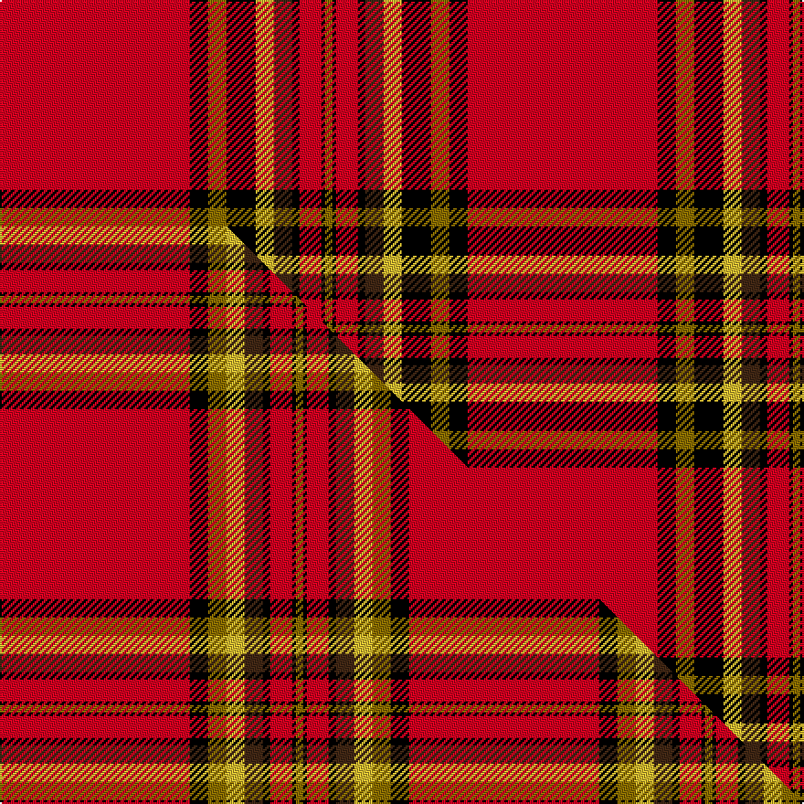

This is one **variant** — a specific cloth: this exact thread count and colourway, with its own
provenance below. It is one weaving of the [sett](/setts/r52k5y5k8ly5do5k2r6k1y2/) (the scale-free proportion — the
same cloth at any scale or shade), whose colour order is pattern [GKRKBYKGKR](/stripes/gkrkbykgkr/).

Part of the [Braemar Castle](/tartans/braemar-castle/) tartan — the named design grouping this sett with its other cloths.

Sourced from house-of-tartan.  It is a [10 stripe tartan](/stripes/stripes10/).

Original link [http://www.house-of-tartan.scotland.net/house/TartanViewjs.asp?colr=Def&tnam=1628](http://www.house-of-tartan.scotland.net/house/TartanViewjs.asp?colr=Def&tnam=1628)

## Provenance

Earliest known date: 1985 Nothing

Dataset <small>— provenance for this record, inherited from the source manifest</small>

<dl class="dataset-prov">
<dt>source</dt><dd><a href="/sources/house-of-tartan/">House of Tartan</a></dd>
<dt>data captured from</dt><dd><a href="https://github.com/thetartan/tartan-database/blob/master/data/house-of-tartan/data.csv">https://github.com/thetartan/tartan-database/blob/master/data/house-of-tartan/data.csv</a></dd>
<dt>data date</dt><dd>1985 <small>(this record)</small></dd>
<dt>licence</dt><dd><a href="https://creativecommons.org/licenses/by-nc-nd/4.0/">CC BY-NC-ND 4.0</a></dd>
</dl>

Capture chain <small>— the hands this data passed through, oldest first; each capture carries its own licence</small>

<ol class="capture-chain">
<li><a href="http://www.house-of-tartan.scotland.net/">House of Tartan</a> <small>the weaver/retailer's database — the site is now offline; the URL is kept as the ultimate source's identity</small></li>
<li><a href="https://github.com/thetartan/tartan-database">thetartan/tartan-database</a> <small>2016-2017</small> · <a href="https://creativecommons.org/licenses/by-nc-nd/4.0/">CC BY-NC-ND 4.0</a> <small>Levko Kravets's frozen compilation — the capture we vendored, and where its CC licence text came from</small></li>
<li>this dictionary <small>captured 2026-06-10 · commit 5bf86c7566</small> <small>each re-capture is a git commit to data/sources</small></li>
</ol>

## Thread count
R/104 K10 Y10 K16 LY10 DO10 K4 R12 K2 Y/4

One full sett is **256 threads**.

## Palette
<table><thead><tr><th>Colour</th><th>Shade</th><th>OKLCh</th></tr></thead><tbody><tr><td>DO</td><td><code style="background-color:#412714;">#412714</code> <small style="color:#888">#412714</small></td><td><small style="color:#888">oklch(30.1% 0.050 55.7)</small></td></tr><tr><td>K</td><td><code style="background-color:#000000;">#000000</code> <small style="color:#888">#000000</small></td><td><small style="color:#888">oklch(0.0% 0.000 0.0)</small></td></tr><tr><td>LY</td><td><code style="background-color:#DCBC32;">#DCBC32</code> <small style="color:#888">#DCBC32</small></td><td><small style="color:#888">oklch(80.0% 0.150 95.2)</small></td></tr><tr><td>R</td><td><code style="background-color:#D60020;">#D60020</code> <small style="color:#888">#D60020</small></td><td><small style="color:#888">oklch(55.2% 0.224 25.5)</small></td></tr><tr><td>Y</td><td><code style="background-color:#8B6E00;">#8B6E00</code> <small style="color:#888">#8B6E00</small></td><td><small style="color:#888">oklch(55.1% 0.113 90.4)</small></td></tr></tbody></table>

# Sample pattern

## Compared to the master

This cloth is one sett of its design; the master sett (the exemplar the design is anchored on) is below for comparison.

Its **ΔTartan distance** from the master is **2.71** — the same measure the nearest-tartans table ranks by (0 is identical; a re-scale of the same cloth is near 0, a recolour or a different proportion further).

<figure class="master-compare" style="margin:0">

this sett
master sett ★

<figcaption style="color:#888;font-size:smaller">One weave of this sett against the <a href="/setts/r52k5y5ly5do5k2r6k1y2/">master sett ★</a>, split on the diagonal: a shared proportion runs seamlessly across it with only the shades shifting; a different proportion breaks on it.</figcaption>
</figure>

## Nearest tartan variants

The nearest existing variants by ΔTartan distance, with this cloth at the top so the swatches line up against it.

ΔTartan

Threads

Variant

Sett

—

256

<a href="/variants/s10/r52k5y5k8ly5do5k2r6k1y2~x2/">Braemar Castle Corporate Tartan</a>

<a href="/ttd/edit/#slug=r52k5y5k8o5do5k2r6k1y2~x2&amp;base=r52k5y5k8ly5do5k2r6k1y2~x2" title="compare in the TTD">0.30</a>

256

<a href="/variants/s10/r52k5y5k8o5do5k2r6k1y2~x2/">Braemar, Castle</a>

<a href="/ttd/edit/#slug=r52k5y5ly5do5k2r6k1y2~x2&amp;base=r52k5y5k8ly5do5k2r6k1y2~x2" title="compare in the TTD">1.17</a>

224

<a href="/variants/s9/r52k5y5ly5do5k2r6k1y2~x2/">Braemar Castle (Fashion)</a>

<a href="/ttd/edit/#slug=r52k5y5o5do5k2r6k1y2~x2~o2503076-do1103038&amp;base=r52k5y5k8ly5do5k2r6k1y2~x2" title="compare in the TTD">1.17</a>

224

<a href="/variants/s9/r52k5y5ly5do5k2r6k1y2~x2~ly2503076-do1103038/">Braemar Castle</a>

<a href="/ttd/edit/#slug=r47k1r6w3db2w3r6k13g2w2r2k13~x2&amp;base=r52k5y5k8ly5do5k2r6k1y2~x2" title="compare in the TTD">1.97</a>

280

<a href="/variants/s12/r47k1r6w3db2w3r6k13g2w2r2k13~x2/">Trevison</a>

<a href="/ttd/edit/#slug=r33w1k3w1g13r7k3dp3w1~x2&amp;base=r52k5y5k8ly5do5k2r6k1y2~x2" title="compare in the TTD">2.33</a>

192

<a href="/variants/s9/r33w1k3w1g13r7k3dp3w1~x2/">Leach, Leech, Leitch, dress</a>

<a href="/ttd/edit/#slug=r48k1w1k6ly4r2ly4k8r2k1w2~x2&amp;base=r52k5y5k8ly5do5k2r6k1y2~x2" title="compare in the TTD">2.51</a>

216

<a href="/variants/s11/r48k1w1k6ly4r2ly4k8r2k1w2~x2/">Glennie (Personal)</a>

<a href="/ttd/edit/#slug=r36k3dy3dr1dy3k3r4dy6k1dr2~x4&amp;base=r52k5y5k8ly5do5k2r6k1y2~x2" title="compare in the TTD">2.55</a>

344

<a href="/variants/s10/r36k3dy3dr1dy3k3r4dy6k1dr2~x4/">Moulin</a>

<a href="/ttd/edit/#slug=r98k3dg21w5r5k2r5w5dg2dt21k7r7w8dg4~dt1204274&amp;base=r52k5y5k8ly5do5k2r6k1y2~x2" title="compare in the TTD">2.56</a>

284

<a href="/variants/s14/r98k3dg21w5r5k2r5w5dg2db21k7r7w8dg4~db1204274/">MacFarlane Red</a>

<a href="/ttd/edit/#slug=dg2r26db4r2k4r2dg8r4k1r1w2~x2&amp;base=r52k5y5k8ly5do5k2r6k1y2~x2" title="compare in the TTD">2.68</a>

216

<a href="/variants/s11/dg2r26db4r2k4r2dg8r4k1r1w2~x2/">Stewart/Stuart of Rothesay (Sobieski)</a>

<a href="/ttd/edit/#slug=r36y4r1y4r4k8r4k2r4w2r1w4~x2&amp;base=r52k5y5k8ly5do5k2r6k1y2~x2" title="compare in the TTD">2.68</a>

216

<a href="/variants/s12/r36y4r1y4r4k8r4k2r4w2r1w4~x2/">Manchester Reds</a>

## Neighbour map

Every grey dot is one of 13621 variants placed by the first two principal components of the ΔTartan feature space (42% of its variance). Red is this tartan; blue dots are its nearest — click one to open its page.

<svg viewBox="0 0 640 380" role="img" style="max-width:100%;height:auto;border:1px solid #e0e0e0;border-radius:4px;display:block" xmlns="http://www.w3.org/2000/svg"><image href="/nn/cloud.v1.png" width="640" height="380"/><a href="/variants/s10/r52k5y5k8o5do5k2r6k1y2~x2/"><circle cx="373.6" cy="39.4" r="4" fill="#3465a4"><title>Braemar, Castle</title></circle></a><a href="/variants/s9/r52k5y5ly5do5k2r6k1y2~x2/"><circle cx="431.4" cy="43.0" r="4" fill="#3465a4"><title>Braemar Castle (Fashion)</title></circle></a><a href="/variants/s9/r52k5y5ly5do5k2r6k1y2~x2~ly2503076-do1103038/"><circle cx="441.5" cy="46.0" r="4" fill="#3465a4"><title>Braemar Castle</title></circle></a><a href="/variants/s12/r47k1r6w3db2w3r6k13g2w2r2k13~x2/"><circle cx="326.5" cy="32.1" r="4" fill="#3465a4"><title>Trevison</title></circle></a><a href="/variants/s9/r33w1k3w1g13r7k3dp3w1~x2/"><circle cx="334.1" cy="72.4" r="4" fill="#3465a4"><title>Leach, Leech, Leitch, dress</title></circle></a><a href="/variants/s11/r48k1w1k6ly4r2ly4k8r2k1w2~x2/"><circle cx="390.2" cy="34.1" r="4" fill="#3465a4"><title>Glennie (Personal)</title></circle></a><a href="/variants/s10/r36k3dy3dr1dy3k3r4dy6k1dr2~x4/"><circle cx="404.2" cy="67.7" r="4" fill="#3465a4"><title>Moulin</title></circle></a><a href="/variants/s14/r98k3dg21w5r5k2r5w5dg2db21k7r7w8dg4~db1204274/"><circle cx="328.5" cy="21.1" r="4" fill="#3465a4"><title>MacFarlane Red</title></circle></a><a href="/variants/s11/dg2r26db4r2k4r2dg8r4k1r1w2~x2/"><circle cx="328.4" cy="72.0" r="4" fill="#3465a4"><title>Stewart/Stuart of Rothesay (Sobieski)</title></circle></a><a href="/variants/s12/r36y4r1y4r4k8r4k2r4w2r1w4~x2/"><circle cx="387.1" cy="58.0" r="4" fill="#3465a4"><title>Manchester Reds</title></circle></a><circle cx="364.6" cy="37.0" r="5" fill="#c00000"/><text x="320" y="376" text-anchor="middle" font-size="11" fill="#999">ground</text><text x="11" y="190" text-anchor="middle" font-size="11" fill="#999" transform="rotate(-90 11 190)">complexity</text></svg>

ID: /variants/s10/r52k5y5k8ly5do5k2r6k1y2~x2/
