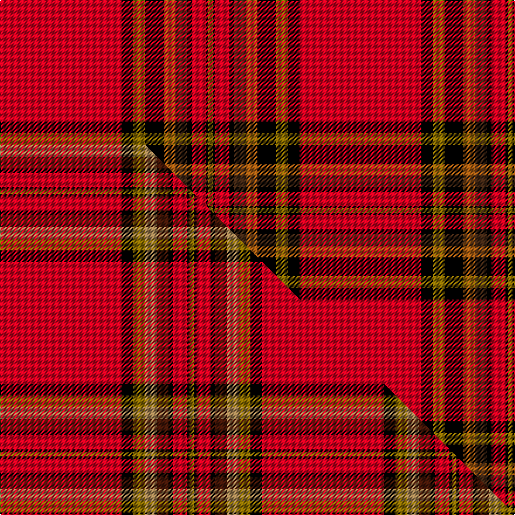

This page is one **sett** — a single exact thread-count. It belongs to the [tartan](/setts/r52k5y5k8o5do5k2r6k1y2/)
(the same proportion at any scale), whose colour order is pattern [GKRKBRKGKR](/stripes/gkrkbrkgkr/).

Part of the [Braemar Castle](/tartans/braemar-castle/) tartan — the named design grouping this sett with its other cloths.

Sourced from weddslist.  It is a [10 stripe tartan](/stripes/stripes10/).

Original link http://www.weddslist.com/cgi-bin/tartans/pg.pl?source=sts

## Thread count
R/104 K10 Y10 K16 O10 DO10 K4 R12 K2 Y/4

One full sett is **256 threads**.

## Palette
<table><thead><tr><th>Colour</th><th>Shade</th><th>OKLCh</th></tr></thead><tbody><tr><td>DO</td><td><code style="background-color:#412714;">#412714</code> <small style="color:#888">#412714</small></td><td><small style="color:#888">oklch(30.1% 0.050 55.7)</small></td></tr><tr><td>K</td><td><code style="background-color:#000000;">#000000</code> <small style="color:#888">#000000</small></td><td><small style="color:#888">oklch(0.0% 0.000 0.0)</small></td></tr><tr><td>O</td><td><code style="background-color:#A65C11;">#A65C11</code> <small style="color:#888">#A65C11</small></td><td><small style="color:#888">oklch(55.0% 0.125 58.3)</small></td></tr><tr><td>R</td><td><code style="background-color:#D60020;">#D60020</code> <small style="color:#888">#D60020</small></td><td><small style="color:#888">oklch(55.2% 0.224 25.5)</small></td></tr><tr><td>Y</td><td><code style="background-color:#8B6E00;">#8B6E00</code> <small style="color:#888">#8B6E00</small></td><td><small style="color:#888">oklch(55.1% 0.113 90.4)</small></td></tr></tbody></table>

# Sample pattern

## Compared to the master

This cloth is one sett of its design; the master sett (the exemplar the design is anchored on) is below for comparison.

Its **ΔTartan distance** from the master is **1.12** — the same measure the nearest-tartans table ranks by (0 is identical; a re-scale of the same cloth is near 0, a recolour or a different proportion further).

<figure class="master-compare" style="margin:0">

this sett
master sett ★

<figcaption style="color:#888;font-size:smaller">One weave of this sett against the <a href="/setts/r52k5y5ly5do5k2r6k1y2/">master sett ★</a>, split on the diagonal: a shared proportion runs seamlessly across it with only the shades shifting; a different proportion breaks on it.</figcaption>
</figure>

## Nearest tartan variants

The nearest existing variants by ΔTartan distance, with this cloth at the top so the swatches line up against it.

ΔTartan

Threads

Variant

Sett

—

256

<a href="/variants/s10/r52k5y5k8o5do5k2r6k1y2~x2/">Braemar, Castle</a>

<a href="/ttd/edit/#slug=r52k5y5k8ly5do5k2r6k1y2~x2&amp;base=r52k5y5k8o5do5k2r6k1y2~x2" title="compare in the TTD">0.30</a>

256

<a href="/variants/s10/r52k5y5k8ly5do5k2r6k1y2~x2/">Braemar Castle Corporate Tartan</a>

<a href="/ttd/edit/#slug=r52k5y5ly5do5k2r6k1y2~x2&amp;base=r52k5y5k8o5do5k2r6k1y2~x2" title="compare in the TTD">1.65</a>

224

<a href="/variants/s9/r52k5y5ly5do5k2r6k1y2~x2/">Braemar Castle (Fashion)</a>

1.65

—

<a href="/variants/s9/r52k5y5ly5do5k2r6k1y2~x2~ly2503076-do1103038/">Braemar Castle</a>

<a href="/ttd/edit/#slug=r48k1w1k6ly4r2ly4k8r2k1w2~x2&amp;base=r52k5y5k8o5do5k2r6k1y2~x2" title="compare in the TTD">2.55</a>

216

<a href="/variants/s11/r48k1w1k6ly4r2ly4k8r2k1w2~x2/">Glennie (Personal)</a>

<a href="/ttd/edit/#slug=r44db3k6o2k2o2k10r5k2r3w2~x2&amp;base=r52k5y5k8o5do5k2r6k1y2~x2" title="compare in the TTD">2.92</a>

232

<a href="/variants/s11/r44db3k6o2k2o2k10r5k2r3w2~x2/">Hilton Plaid</a>

<a href="/ttd/edit/#slug=r44db3k6ly2k2ly2k10r5k2r3w2~x2&amp;base=r52k5y5k8o5do5k2r6k1y2~x2" title="compare in the TTD">2.92</a>

232

<a href="/variants/s11/r44db3k6ly2k2ly2k10r5k2r3w2~x2/">Heritage Plaid</a>

## Neighbour map

Every grey dot is one of 13620 variants placed by the first two principal components of the ΔTartan feature space (42% of its variance). Red is this tartan; blue dots are its nearest — click one to open its page.

<svg viewBox="0 0 640 380" role="img" style="max-width:100%;height:auto;border:1px solid #e0e0e0;border-radius:4px;display:block" xmlns="http://www.w3.org/2000/svg"><image href="/nn/cloud.v1.png" width="640" height="380"/><a href="/variants/s10/r52k5y5k8ly5do5k2r6k1y2~x2/"><circle cx="364.7" cy="37.0" r="4" fill="#3465a4"><title>Braemar Castle Corporate Tartan</title></circle></a><a href="/variants/s9/r52k5y5ly5do5k2r6k1y2~x2/"><circle cx="431.6" cy="43.1" r="4" fill="#3465a4"><title>Braemar Castle (Fashion)</title></circle></a><a href="/variants/s9/r52k5y5ly5do5k2r6k1y2~x2~ly2503076-do1103038/"><circle cx="441.6" cy="46.1" r="4" fill="#3465a4"><title>Braemar Castle</title></circle></a><a href="/variants/s11/r48k1w1k6ly4r2ly4k8r2k1w2~x2/"><circle cx="390.3" cy="34.1" r="4" fill="#3465a4"><title>Glennie (Personal)</title></circle></a><a href="/variants/s11/r44db3k6o2k2o2k10r5k2r3w2~x2/"><circle cx="338.7" cy="58.4" r="4" fill="#3465a4"><title>Hilton Plaid</title></circle></a><a href="/variants/s11/r44db3k6ly2k2ly2k10r5k2r3w2~x2/"><circle cx="334.3" cy="57.6" r="4" fill="#3465a4"><title>Heritage Plaid</title></circle></a><circle cx="373.8" cy="39.5" r="5" fill="#c00000"/><text x="320" y="376" text-anchor="middle" font-size="11" fill="#999">ground</text><text x="11" y="190" text-anchor="middle" font-size="11" fill="#999" transform="rotate(-90 11 190)">complexity</text></svg>

ID: /variants/s10/r52k5y5k8o5do5k2r6k1y2~x2/
