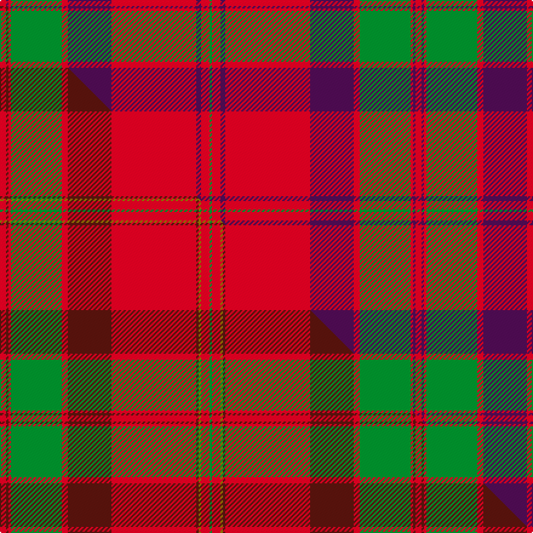

This is one **variant** — a specific cloth: this exact thread count and colourway, with its own
provenance below. It is one weaving of the [sett](/tartans/m/ma/macpherson-of-cluny/) (the scale-free proportion — the
same cloth at any scale or shade), whose colour order is pattern [GRBRBRGRBR](/stripes/grbrbrgrbr/).

Part of the [MacPherson Of Cluny](/tartans/m/ma/macpherson-of-cluny/) tartan — the named design grouping this sett with its other cloths.

Sourced from tartans-authority.  It is a [10 stripe tartan](/stripes/stripes10/).

Original link <code>http://www.tartansauthority.com/tartan-ferret/display/906/</code> — retired · [Internet Archive copy](https://web.archive.org/web/*/http://www.tartansauthority.com/tartan-ferret/display/906/*)

Dataset <small>— provenance for this record, inherited from the source manifest</small>

<dl class="dataset-prov">
<dt>source</dt><dd><a href="/sources/tartans-authority/">Scottish Tartans Authority</a></dd>
<dt>data captured from</dt><dd><a href="https://github.com/thetartan/tartan-database/blob/master/data/tartans-authority/data.csv">https://github.com/thetartan/tartan-database/blob/master/data/tartans-authority/data.csv</a></dd>
<dt>data date</dt><dd>1819 <small>(this record)</small></dd>
<dt>licence</dt><dd><a href="https://creativecommons.org/licenses/by-nc-nd/4.0/">CC BY-NC-ND 4.0</a></dd>
</dl>

Capture chain <small>— the hands this data passed through, oldest first; each capture carries its own licence</small>

<ol class="capture-chain">
<li><a href="https://www.tartansauthority.com/">Scottish Tartans Authority</a> <small>the heritage body’s archive — its tartan-ferret record browser is retired; dead record links are shown unlinked, with an Internet Archive copy (ITI numbers are not SRT references)</small></li>
<li><a href="https://github.com/thetartan/tartan-database">thetartan/tartan-database</a> <small>2016-2017</small> · <a href="https://creativecommons.org/licenses/by-nc-nd/4.0/">CC BY-NC-ND 4.0</a> <small>Levko Kravets's frozen compilation — the capture we vendored, and where its CC licence text came from</small></li>
<li>this dictionary <small>captured 2026-06-10 · commit 5bf86c7566</small> <small>each re-capture is a git commit to data/sources</small></li>
</ol>

## Register references

External register numbers recorded for this tartan.

- Scottish Tartans Authority (ITI): 906

## Thread count
R/5 DP2 R2 G42 R5 DP36 R70 DP4 R7 G/2

One full sett is **343 threads**.

## Palette
<table><thead><tr><th>Colour</th><th>Shade</th><th>OKLCh</th></tr></thead><tbody><tr><td>G</td><td><code style="background-color:#008B2A;">#008B2A</code> <small style="color:#888">#008B2A</small></td><td><small style="color:#888">oklch(55.4% 0.170 145.9)</small></td></tr><tr><td>R</td><td><code style="background-color:#D60020;">#D60020</code> <small style="color:#888">#D60020</small></td><td><small style="color:#888">oklch(55.2% 0.224 25.5)</small></td></tr><tr><td>DP</td><td><code style="background-color:#4B0B4F;">#4B0B4F</code> <small style="color:#888">#4B0B4F</small></td><td><small style="color:#888">oklch(30.1% 0.125 325.4)</small></td></tr></tbody></table>

# Sample pattern

## Compared to the master

This cloth is one sett of its design; the master sett (the exemplar the design is anchored on) is below for comparison.

Its **ΔTartan distance** from the master is **2.45** — the same measure the nearest-tartans table ranks by (0 is identical; a re-scale of the same cloth is near 0, a recolour or a different proportion further).

<figure class="master-compare" style="margin:0">

this sett
master sett ★

<figcaption style="color:#888;font-size:smaller">One weave of this sett against the <a href="/setts/r5dr2r2g42r5dr36r70dr2y2r7g2/">master sett ★</a>, split on the diagonal: a shared proportion runs seamlessly across it with only the shades shifting; a different proportion breaks on it.</figcaption>
</figure>

## Nearest tartan variants

The nearest existing variants by ΔTartan distance, with this cloth at the top so the swatches line up against it.

ΔTartan

Threads

Variant

Sett

—

343

<a href="/variants/s10/r5dp2r2g42r5dp36r70dp4r7g2/">MacPherson of Cluny</a>

<a href="/ttd/edit/#slug=r5dp2r2g42r5dp36r70dp2y2r7g2~x2&amp;base=r5dp2r2g42r5dp36r70dp4r7g2" title="compare in the TTD">0.32</a>

686

<a href="/variants/s11/r5dp2r2g42r5dp36r70dp2y2r7g2~x2/">MacPherson of Cluny</a>

<a href="/ttd/edit/#slug=r1g1r32dp32r8g1r1g1r8g32r32g1r1~x2&amp;base=r5dp2r2g42r5dp36r70dp4r7g2" title="compare in the TTD">1.61</a>

600

<a href="/variants/s13/r1g1r32dp32r8g1r1g1r8g32r32g1r1~x2/">Unnamed 18th century plaid from Rothiemurchus</a>

<a href="/ttd/edit/#slug=r1g1r32db32r8g1r1g1r8g32r32g1r1~x2&amp;base=r5dp2r2g42r5dp36r70dp4r7g2" title="compare in the TTD">1.97</a>

600

<a href="/variants/s13/r1g1r32db32r8g1r1g1r8g32r32g1r1~x2/">Grant of Rothiemurchus Artifact Tartan</a>

<a href="/ttd/edit/#slug=g2r3db2r48db60r21g2r21g60r48db2r3g2~x2&amp;base=r5dp2r2g42r5dp36r70dp4r7g2" title="compare in the TTD">2.21</a>

1088

<a href="/variants/s13/g2r3db2r48db60r21g2r21g60r48db2r3g2~x2/">Fraser, Wedding dress</a>

<a href="/ttd/edit/#slug=r6db2r2g24r2g2r2db8r34db2r2db1r6~x2&amp;base=r5dp2r2g42r5dp36r70dp4r7g2" title="compare in the TTD">2.25</a>

348

<a href="/variants/s13/r6db2r2g24r2g2r2db8r34db2r2db1r6~x2/">Grant of Glenmoriston (Clan)</a>

<a href="/ttd/edit/#slug=dg2r3db2r48dg60r21dg2r21db60r48db2r3dg2&amp;base=r5dp2r2g42r5dp36r70dp4r7g2" title="compare in the TTD">2.35</a>

544

<a href="/variants/s13/dg2r3db2r48dg60r21dg2r21db60r48db2r3dg2/">Fraser, Isabella (Artefact)</a>

<a href="/ttd/edit/#slug=r5dr2r2g42r5dr36r70dr2y2r7g2~x2&amp;base=r5dp2r2g42r5dp36r70dp4r7g2" title="compare in the TTD">2.45</a>

686

<a href="/variants/s11/r5dr2r2g42r5dr36r70dr2y2r7g2~x2/">MacPherson Of Cluny</a>

<a href="/ttd/edit/#slug=r5dr2r2g42r5dr36r70dr2y2r7g2&amp;base=r5dp2r2g42r5dp36r70dp4r7g2" title="compare in the TTD">2.45</a>

343

<a href="/variants/s11/r5dr2r2g42r5dr36r70dr2y2r7g2/">MacPherson Of Cluny</a>

<a href="/ttd/edit/#slug=g2r2db1r24db6r3g12r4db1~x2&amp;base=r5dp2r2g42r5dp36r70dp4r7g2" title="compare in the TTD">2.56</a>

214

<a href="/variants/s9/g2r2db1r24db6r3g12r4db1~x2/">MacDonald #7</a>

<a href="/ttd/edit/#slug=r3db1r1g21r3db18r35db1y1r4g1&amp;base=r5dp2r2g42r5dp36r70dp4r7g2" title="compare in the TTD">2.64</a>

174

<a href="/variants/s11/r3db1r1g21r3db18r35db1y1r4g1/">MacPherson Of Cluny</a>

## Neighbour map

Every grey dot is one of 13656 variants placed by the first two principal components of the ΔTartan feature space (42% of its variance). Red is this tartan; blue dots are its nearest — click one to open its page. The map is a flat projection of a many-dimensional space — [how to read it](/posts/neighbourhood-maps/).

<svg viewBox="0 0 640 380" role="img" style="max-width:100%;height:auto;border:1px solid #e0e0e0;border-radius:4px;display:block" xmlns="http://www.w3.org/2000/svg"><image href="/nn/cloud.v1.png" width="640" height="380"/><a href="/variants/s11/r5dp2r2g42r5dp36r70dp2y2r7g2~x2/"><circle cx="355.4" cy="105.0" r="4" fill="#3465a4"><title>MacPherson of Cluny</title></circle></a><a href="/variants/s13/r1g1r32dp32r8g1r1g1r8g32r32g1r1~x2/"><circle cx="378.6" cy="122.5" r="4" fill="#3465a4"><title>Unnamed 18th century plaid from Rothiemurchus</title></circle></a><a href="/variants/s13/r1g1r32db32r8g1r1g1r8g32r32g1r1~x2/"><circle cx="360.5" cy="119.6" r="4" fill="#3465a4"><title>Grant of Rothiemurchus Artifact Tartan</title></circle></a><a href="/variants/s13/g2r3db2r48db60r21g2r21g60r48db2r3g2~x2/"><circle cx="342.1" cy="130.2" r="4" fill="#3465a4"><title>Fraser, Wedding dress</title></circle></a><a href="/variants/s13/r6db2r2g24r2g2r2db8r34db2r2db1r6~x2/"><circle cx="397.1" cy="109.3" r="4" fill="#3465a4"><title>Grant of Glenmoriston (Clan)</title></circle></a><a href="/variants/s13/dg2r3db2r48dg60r21dg2r21db60r48db2r3dg2/"><circle cx="350.7" cy="130.4" r="4" fill="#3465a4"><title>Fraser, Isabella (Artefact)</title></circle></a><a href="/variants/s11/r5dr2r2g42r5dr36r70dr2y2r7g2~x2/"><circle cx="367.1" cy="109.3" r="4" fill="#3465a4"><title>MacPherson Of Cluny</title></circle></a><a href="/variants/s11/r5dr2r2g42r5dr36r70dr2y2r7g2/"><circle cx="367.1" cy="109.3" r="4" fill="#3465a4"><title>MacPherson Of Cluny</title></circle></a><a href="/variants/s9/g2r2db1r24db6r3g12r4db1~x2/"><circle cx="399.3" cy="147.9" r="4" fill="#3465a4"><title>MacDonald #7</title></circle></a><a href="/variants/s11/r3db1r1g21r3db18r35db1y1r4g1/"><circle cx="341.1" cy="103.8" r="4" fill="#3465a4"><title>MacPherson Of Cluny</title></circle></a><circle cx="370.5" cy="126.7" r="5" fill="#c00000"/><text x="320" y="376" text-anchor="middle" font-size="11" fill="#999">ground</text><text x="11" y="190" text-anchor="middle" font-size="11" fill="#999" transform="rotate(-90 11 190)">complexity</text></svg>

ID: /variants/s10/r5dp2r2g42r5dp36r70dp4r7g2/
