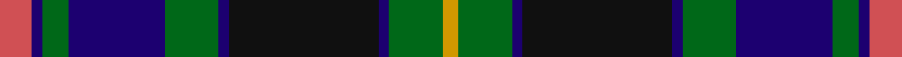

This page is one **sett** — a single exact thread-count. It belongs to the [tartan](/setts/r6db2g5db18g10db2k28db2g10lo3/)
(the same proportion at any scale), whose colour order is pattern [RBGBGBKBGY](/stripes/rbgbgbkbgy/).

Sourced from register-of-tartans.  It is a [10 stripe tartan](/stripes/stripes10/).

Original link https://www.tartanregister.gov.uk/tartanDetails.aspx?ref=4819

2 attestations — the source records this cloth was collapsed from (oldest owns this page)

<ul>
<li>01/01/1996 — Ofally, County (register-of-tartans, <a href="https://www.tartanregister.gov.uk/tartanDetails.aspx?ref=4819">record</a>)  <em>One of a series of Irish District tartans designed by Polly Wittering of the House of Edgar. These are not 'officially sanctioned' District tartans but have apparently proved popular and no doubt in time will be accepted as genuine District rather than Fashion tartans. Sample in Scottish Tartans Authority's Johnston Collection. Designed for Macnaughtons of Pitlochry as a collection of trade tartans.</em></li>
<li>1997 — Ofally, County (District) (tartans-authority, <a href="http://www.tartansauthority.com/tartan-ferret/display/2268/">record</a>)  <em>One of a series of Irish District tartans designed by Polly Wittering of the House of Edgar. These were not 'officially sanctioned' District tartans but, like many of their historic district tartan predecessors have apparently proved popular enough to be regarded as 'District' rather than their original categorisation of 'Fashion'. Sample in STA's Johnston Collection.</em></li>
</ul>

## Register references

External register numbers recorded for this tartan.

- Scottish Register of Tartans: [4819](https://www.tartanregister.gov.uk/tartanDetails.aspx?ref=4819)
- Scottish Tartans Authority (ITI): 2268
- Scottish Tartans World Register: 2268

## Thread count
R/12 DB4 G10 DB36 G20 DB4 K56 DB4 G20 LO/6

One full sett is **326 threads**.

## Palette
<table><thead><tr><th>Colour</th><th>Shade</th><th>OKLCh</th></tr></thead><tbody><tr><td>DB</td><td><code style="background-color:#082077;">#082077</code> <small style="color:#888">#082077</small></td><td><small style="color:#888">oklch(30.0% 0.149 265.1)</small></td></tr><tr><td>R</td><td><code style="background-color:#D60020;">#D60020</code> <small style="color:#888">#D60020</small></td><td><small style="color:#888">oklch(55.2% 0.224 25.5)</small></td></tr><tr><td>LO</td><td><code style="background-color:#FF9C34;">#FF9C34</code> <small style="color:#888">#FF9C34</small></td><td><small style="color:#888">oklch(77.9% 0.161 61.8)</small></td></tr><tr><td>G</td><td><code style="background-color:#008B2A;">#008B2A</code> <small style="color:#888">#008B2A</small></td><td><small style="color:#888">oklch(55.4% 0.170 145.9)</small></td></tr><tr><td>K</td><td><code style="background-color:#000000;">#000000</code> <small style="color:#888">#000000</small></td><td><small style="color:#888">oklch(0.0% 0.000 0.0)</small></td></tr></tbody></table>

# Sample pattern

## Nearest tartan variants

The nearest existing variants by ΔTartan distance, with this cloth at the top so the swatches line up against it.

ΔTartan

Threads

Variant

Sett

—

326

<a href="/variants/s10/r6db2g5db18g10db2k28db2g10lo3~x2/">Ofally, County</a>

<a href="/ttd/edit/#slug=r7db2g5db18g10db2k24db2g10y3~x2&amp;base=r6db2g5db18g10db2k28db2g10lo3~x2" title="compare in the TTD">0.46</a>

312

<a href="/variants/s10/r7db2g5db18g10db2k24db2g10y3~x2/">Offally</a>

<a href="/ttd/edit/#slug=r7db2g5k24db2g10db28g10w3~x2&amp;base=r6db2g5db18g10db2k28db2g10lo3~x2" title="compare in the TTD">2.79</a>

344

<a href="/variants/s9/r7db2g5k24db2g10db28g10w3~x2/">Colgan (Personal)</a>

## Neighbour map

Every grey dot is one of 13620 variants placed by the first two principal components of the ΔTartan feature space (42% of its variance). Red is this tartan; blue dots are its nearest — click one to open its page.

<svg viewBox="0 0 640 380" role="img" style="max-width:100%;height:auto;border:1px solid #e0e0e0;border-radius:4px;display:block" xmlns="http://www.w3.org/2000/svg"><image href="/nn/cloud.v1.png" width="640" height="380"/><a href="/variants/s10/r7db2g5db18g10db2k24db2g10y3~x2/"><circle cx="112.2" cy="158.7" r="4" fill="#3465a4"><title>Offally</title></circle></a><a href="/variants/s9/r7db2g5k24db2g10db28g10w3~x2/"><circle cx="132.3" cy="149.7" r="4" fill="#3465a4"><title>Colgan (Personal)</title></circle></a><circle cx="127.6" cy="144.3" r="5" fill="#c00000"/><text x="320" y="376" text-anchor="middle" font-size="11" fill="#999">ground</text><text x="11" y="190" text-anchor="middle" font-size="11" fill="#999" transform="rotate(-90 11 190)">complexity</text></svg>

ID: /variants/s10/r6db2g5db18g10db2k28db2g10lo3~x2/
