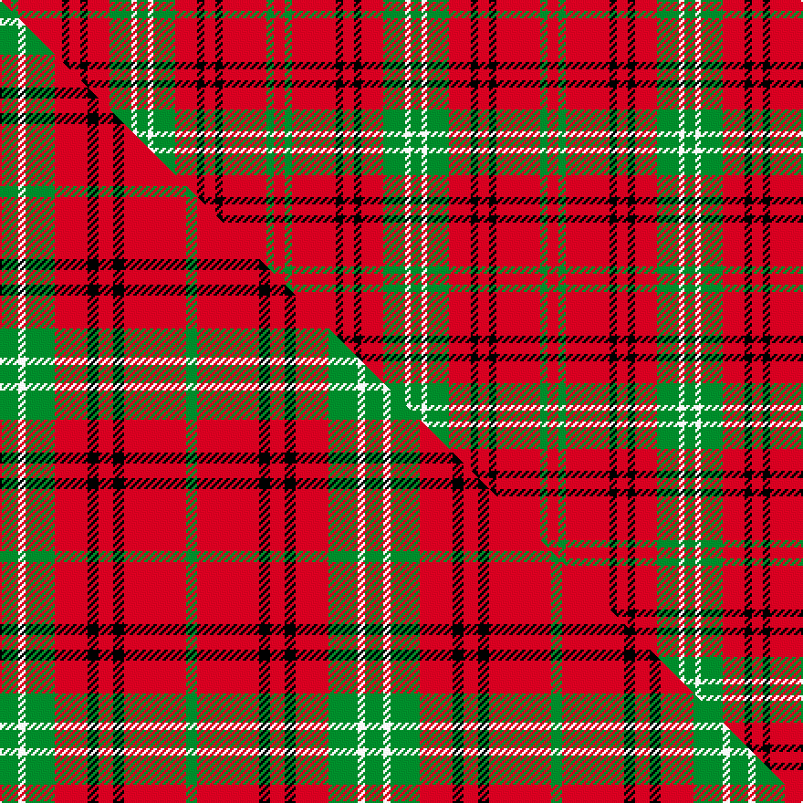

This page is one **sett** — a single exact thread-count. It belongs to the [tartan](/setts/r6g4r24k4r6k4r12g12w3g6/)
(the same proportion at any scale), whose colour order is pattern [GWGRKRKRGR](/stripes/gwgrkrkrgr/).

Part of the [Morrison](/tartans/morrison/) tartan — the named design grouping this sett with its other cloths.

Sourced from register-of-tartans.  It is a [10 stripe tartan](/stripes/stripes10/).

Original link https://www.tartanregister.gov.uk/tartanDetails.aspx?ref=3020

## Provenance

Earliest known date: 1745 This sett is very similar to the single green stripe version recorded by Lord Lyon in 1968. The date given by MacKinlay is 1745 whereas Lord Lyon gives 1747. Both setts are clearly based on the same pattern which was found in an old Morrison family bible during demolition work on a Black House in Lewis in 1935. [50%]

3 attestations — the source records this cloth was collapsed from (oldest owns this page)

<ul>
<li>undated — Morrison Ancient (register-of-tartans, <a href="https://www.tartanregister.gov.uk/tartanDetails.aspx?ref=3020">record</a>)  <em>This sett is very similar to the single green stripe version recorded by Lord Lyon in 1968. The date given by James MacKinlay a tartan collector between the wars, is 1745 whereas Lord Lyon gives 1747. Both setts are clearly based on the same pattern which was found in an old Morrison family bible during demolition work on a Black House in Lewis in 1935. [50%]</em></li>
<li>undated — Morrison, Ancient (weddslist, <a href="http://www.weddslist.com/cgi-bin/tartans/pg.pl?source=sts">record</a>) </li>
<li>undated — Morrison Old Clan Tartan (house-of-tartan, <a href="http://www.house-of-tartan.scotland.net/house/TartanViewjs.asp?colr=Def&tnam=933">record</a>) </li>
</ul>

## Register references

External register numbers recorded for this tartan.

- Scottish Register of Tartans: [3020](https://www.tartanregister.gov.uk/tartanDetails.aspx?ref=3020)
- Scottish Tartans World Register: 933

## Thread count
R/6 G4 R24 K4 R6 K4 R12 G12 W3 G/6

One full sett is **150 threads**.

## Palette
<table><thead><tr><th>Colour</th><th>Shade</th><th>OKLCh</th></tr></thead><tbody><tr><td>G</td><td><code style="background-color:#008B2A;">#008B2A</code> <small style="color:#888">#008B2A</small></td><td><small style="color:#888">oklch(55.4% 0.170 145.9)</small></td></tr><tr><td>K</td><td><code style="background-color:#000000;">#000000</code> <small style="color:#888">#000000</small></td><td><small style="color:#888">oklch(0.0% 0.000 0.0)</small></td></tr><tr><td>W</td><td><code style="background-color:#F7F7F7;">#F7F7F7</code> <small style="color:#888">#F7F7F7</small></td><td><small style="color:#888">oklch(97.6% 0.000 89.9)</small></td></tr><tr><td>R</td><td><code style="background-color:#D60020;">#D60020</code> <small style="color:#888">#D60020</small></td><td><small style="color:#888">oklch(55.2% 0.224 25.5)</small></td></tr></tbody></table>

# Sample pattern

## Compared to the master

This cloth is one sett of its design; the master sett (the exemplar the design is anchored on) is below for comparison.

Its **ΔTartan distance** from the master is **0.51** — the same measure the nearest-tartans table ranks by (0 is identical; a re-scale of the same cloth is near 0, a recolour or a different proportion further).

<figure class="master-compare" style="margin:0">

this sett
master sett ★

<figcaption style="color:#888;font-size:smaller">One weave of this sett against the <a href="/setts/g5w2g8r9k3r4k3r17g3/">master sett ★</a>, split on the diagonal: a shared proportion runs seamlessly across it with only the shades shifting; a different proportion breaks on it.</figcaption>
</figure>

## Nearest tartan variants

The nearest existing variants by ΔTartan distance, with this cloth at the top so the swatches line up against it.

ΔTartan

Threads

Variant

Sett

—

150

<a href="/variants/s10/r6g4r24k4r6k4r12g12w3g6/">Morrison Ancient</a>

<a href="/ttd/edit/#slug=g3w1g6r2dp2r1k2r10g1r2~x8&amp;base=r6g4r24k4r6k4r12g12w3g6" title="compare in the TTD">0.84</a>

440

<a href="/variants/s10/g3w1g6r2dp2r1k2r10g1r2~x8/">Seton (Clan)</a>

<a href="/ttd/edit/#slug=g9w4g15r17k5r7k5r32g5&amp;base=r6g4r24k4r6k4r12g12w3g6" title="compare in the TTD">1.13</a>

184

<a href="/variants/s9/g9w4g15r17k5r7k5r32g5/">Morrison LC</a>

<a href="/ttd/edit/#slug=g9w4g15r17k5r7k5r32g5~x2&amp;base=r6g4r24k4r6k4r12g12w3g6" title="compare in the TTD">1.13</a>

368

<a href="/variants/s9/g9w4g15r17k5r7k5r32g5~x2/">Morrison LC</a>

<a href="/ttd/edit/#slug=g5w2g8r9k3r4k3r17g3~x2&amp;base=r6g4r24k4r6k4r12g12w3g6" title="compare in the TTD">1.18</a>

200

<a href="/variants/s9/g5w2g8r9k3r4k3r17g3~x2/">Morrison</a>

<a href="/ttd/edit/#slug=r4g4w3g4r4g14r28k2r2g3~x2&amp;base=r6g4r24k4r6k4r12g12w3g6" title="compare in the TTD">1.63</a>

258

<a href="/variants/s10/r4g4w3g4r4g14r28k2r2g3~x2/">Scott Red Clan Tartan</a>

<a href="/ttd/edit/#slug=k1r9g2r2g4w1g4r1~x2&amp;base=r6g4r24k4r6k4r12g12w3g6" title="compare in the TTD">2.07</a>

92

<a href="/variants/s8/k1r9g2r2g4w1g4r1~x2/">Comyn</a>

<a href="/ttd/edit/#slug=r12g2r4g4k15lb4r4lb2r12~x2&amp;base=r6g4r24k4r6k4r12g12w3g6" title="compare in the TTD">2.98</a>

188

<a href="/variants/s9/r12g2r4g4k15lb4r4lb2r12~x2/">Alexander (Personal)</a>

<a href="/ttd/edit/#slug=r12db2r4db4k15g4r4g2r12~x2&amp;base=r6g4r24k4r6k4r12g12w3g6" title="compare in the TTD">2.98</a>

188

<a href="/variants/s9/r12db2r4db4k15g4r4g2r12~x2/">Alexander - 1985 (Name)</a>

## Neighbour map

Every grey dot is one of 13620 variants placed by the first two principal components of the ΔTartan feature space (42% of its variance). Red is this tartan; blue dots are its nearest — click one to open its page.

<svg viewBox="0 0 640 380" role="img" style="max-width:100%;height:auto;border:1px solid #e0e0e0;border-radius:4px;display:block" xmlns="http://www.w3.org/2000/svg"><image href="/nn/cloud.v1.png" width="640" height="380"/><a href="/variants/s10/g3w1g6r2dp2r1k2r10g1r2~x8/"><circle cx="218.0" cy="149.2" r="4" fill="#3465a4"><title>Seton (Clan)</title></circle></a><a href="/variants/s9/g9w4g15r17k5r7k5r32g5/"><circle cx="250.3" cy="179.4" r="4" fill="#3465a4"><title>Morrison LC</title></circle></a><a href="/variants/s9/g9w4g15r17k5r7k5r32g5~x2/"><circle cx="250.3" cy="179.4" r="4" fill="#3465a4"><title>Morrison LC</title></circle></a><a href="/variants/s9/g5w2g8r9k3r4k3r17g3~x2/"><circle cx="242.2" cy="180.4" r="4" fill="#3465a4"><title>Morrison</title></circle></a><a href="/variants/s10/r4g4w3g4r4g14r28k2r2g3~x2/"><circle cx="316.3" cy="136.4" r="4" fill="#3465a4"><title>Scott Red Clan Tartan</title></circle></a><a href="/variants/s8/k1r9g2r2g4w1g4r1~x2/"><circle cx="258.7" cy="184.4" r="4" fill="#3465a4"><title>Comyn</title></circle></a><a href="/variants/s9/r12g2r4g4k15lb4r4lb2r12~x2/"><circle cx="212.7" cy="183.4" r="4" fill="#3465a4"><title>Alexander (Personal)</title></circle></a><a href="/variants/s9/r12db2r4db4k15g4r4g2r12~x2/"><circle cx="217.8" cy="184.8" r="4" fill="#3465a4"><title>Alexander - 1985 (Name)</title></circle></a><circle cx="262.2" cy="177.2" r="5" fill="#c00000"/><text x="320" y="376" text-anchor="middle" font-size="11" fill="#999">ground</text><text x="11" y="190" text-anchor="middle" font-size="11" fill="#999" transform="rotate(-90 11 190)">complexity</text></svg>

ID: /variants/s10/r6g4r24k4r6k4r12g12w3g6/
