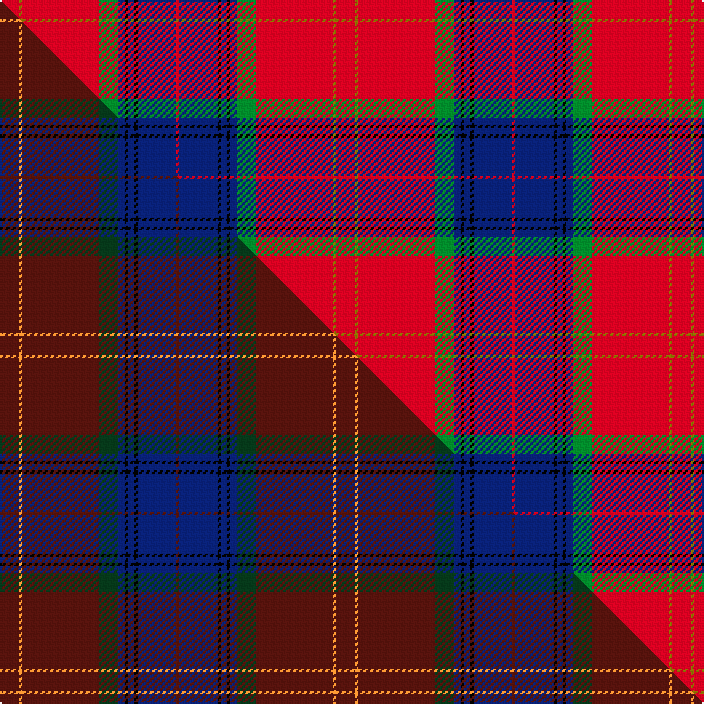

This page is one **sett** — a single exact thread-count. It belongs to the [tartan](/setts/r6y1r24g6db2k1db2k1db12r1/)
(the same proportion at any scale), whose colour order is pattern [RBKBKBGRGR](/stripes/rbkbkbgrgr/).

Part of the [MacEdward](/tartans/macedward/) tartan — the named design grouping this sett with its other cloths.

Sourced from weddslist.  It is a [10 stripe tartan](/stripes/stripes10/).

Original link [http://www.weddslist.com/cgi-bin/tartans/pg.pl?source=sts](http://www.weddslist.com/cgi-bin/tartans/pg.pl?source=sts)

Dataset <small>— provenance for this record, inherited from the source manifest</small>

<dl class="dataset-prov">
<dt>source</dt><dd><a href="/sources/weddslist/">Weddslist</a></dd>
<dt>data captured from</dt><dd><a href="https://github.com/thetartan/tartan-database/blob/master/data/weddslist/data.csv">https://github.com/thetartan/tartan-database/blob/master/data/weddslist/data.csv</a></dd>
<dt>data date</dt><dd>2016-11-17 <small>(dataset default)</small></dd>
<dt>licence</dt><dd><a href="https://creativecommons.org/licenses/by-nc-nd/4.0/">CC BY-NC-ND 4.0</a></dd>
</dl>

Capture chain <small>— the hands this data passed through, oldest first; each capture carries its own licence</small>

<ol class="capture-chain">
<li><a href="https://www.weddslist.com/tartans/">Weddslist</a> <small>the living privately compiled reference</small></li>
<li><a href="https://github.com/thetartan/tartan-database">thetartan/tartan-database</a> <small>2016-2017</small> · <a href="https://creativecommons.org/licenses/by-nc-nd/4.0/">CC BY-NC-ND 4.0</a> <small>Levko Kravets's frozen compilation — the capture we vendored, and where its CC licence text came from</small></li>
<li>this dictionary <small>captured 2026-06-10 · commit 5bf86c7566</small> <small>each re-capture is a git commit to data/sources</small></li>
</ol>

## Thread count
R/12 Y2 R48 G12 DB4 K2 DB4 K2 DB24 R/2

One full sett is **210 threads**.

## Palette
<table><thead><tr><th>Colour</th><th>Shade</th><th>OKLCh</th></tr></thead><tbody><tr><td>DB</td><td><code style="background-color:#082077;">#082077</code> <small style="color:#888">#082077</small></td><td><small style="color:#888">oklch(30.0% 0.149 265.1)</small></td></tr><tr><td>G</td><td><code style="background-color:#008B2A;">#008B2A</code> <small style="color:#888">#008B2A</small></td><td><small style="color:#888">oklch(55.4% 0.170 145.9)</small></td></tr><tr><td>K</td><td><code style="background-color:#000000;">#000000</code> <small style="color:#888">#000000</small></td><td><small style="color:#888">oklch(0.0% 0.000 0.0)</small></td></tr><tr><td>R</td><td><code style="background-color:#D60020;">#D60020</code> <small style="color:#888">#D60020</small></td><td><small style="color:#888">oklch(55.2% 0.224 25.5)</small></td></tr><tr><td>Y</td><td><code style="background-color:#8B6E00;">#8B6E00</code> <small style="color:#888">#8B6E00</small></td><td><small style="color:#888">oklch(55.1% 0.113 90.4)</small></td></tr></tbody></table>

# Sample pattern

## Compared to the master

This cloth is one sett of its design; the master sett (the exemplar the design is anchored on) is below for comparison.

Its **ΔTartan distance** from the master is **0.45** — the same measure the nearest-tartans table ranks by (0 is identical; a re-scale of the same cloth is near 0, a recolour or a different proportion further).

<figure class="master-compare" style="margin:0">

this sett
master sett ★

<figcaption style="color:#888;font-size:smaller">One weave of this sett against the <a href="/setts/dr6lo1dr24dg6db2k1db2k1db12dr1/">master sett ★</a>, split on the diagonal: a shared proportion runs seamlessly across it with only the shades shifting; a different proportion breaks on it.</figcaption>
</figure>

## Nearest tartan variants

The nearest existing variants by ΔTartan distance, with this cloth at the top so the swatches line up against it.

ΔTartan

Threads

Variant

Sett

—

210

<a href="/variants/s10/r6y1r24g6db2k1db2k1db12r1~x2/">MacEdward</a>

<a href="/ttd/edit/#slug=r60b15r4db10w2db10w2db10r4~x2&amp;base=r6y1r24g6db2k1db2k1db12r1~x2" title="compare in the TTD">1.26</a>

340

<a href="/variants/s9/r60b15r4db10w2db10w2db10r4~x2/">Robberstad</a>

<a href="/ttd/edit/#slug=r23db2r1o2r1db2r4db10k2lo2~x2&amp;base=r6y1r24g6db2k1db2k1db12r1~x2" title="compare in the TTD">1.67</a>

146

<a href="/variants/s10/r23db2r1o2r1db2r4db10k2lo2~x2/">Chang-Miller (Personal)</a>

<a href="/ttd/edit/#slug=r25k1y2k1y2k1r10db18w2db12~x2&amp;base=r6y1r24g6db2k1db2k1db12r1~x2" title="compare in the TTD">2.24</a>

222

<a href="/variants/s10/r25k1y2k1y2k1r10db18w2db12~x2/">Richardson</a>

<a href="/ttd/edit/#slug=r6w1r24db6g2k1g2k1g12r1~x2&amp;base=r6y1r24g6db2k1db2k1db12r1~x2" title="compare in the TTD">2.26</a>

210

<a href="/variants/s10/r6w1r24db6g2k1g2k1g12r1~x2/">Chisholm #2</a>

<a href="/ttd/edit/#slug=r6w1r24db6g2k1g2k1g12r1&amp;base=r6y1r24g6db2k1db2k1db12r1~x2" title="compare in the TTD">2.26</a>

105

<a href="/variants/s10/r6w1r24db6g2k1g2k1g12r1/">Chisholm VS</a>

<a href="/ttd/edit/#slug=y4k3w2db7r7k4r5db4r30w2db3~x2&amp;base=r6y1r24g6db2k1db2k1db12r1~x2" title="compare in the TTD">2.42</a>

270

<a href="/variants/s11/y4k3w2db7r7k4r5db4r30w2db3~x2/">Hart (Texas) (Personal)</a>

<a href="/ttd/edit/#slug=r27db4k4db4k4lb6y1~x4&amp;base=r6y1r24g6db2k1db2k1db12r1~x2" title="compare in the TTD">2.47</a>

288

<a href="/variants/s7/r27db4k4db4k4lb6y1~x4/">MacLeay</a>

<a href="/ttd/edit/#slug=dg2r26db4r2k4r2dg8r4k1r1w2~x2&amp;base=r6y1r24g6db2k1db2k1db12r1~x2" title="compare in the TTD">2.48</a>

216

<a href="/variants/s11/dg2r26db4r2k4r2dg8r4k1r1w2~x2/">Stewart/Stuart of Rothesay (Sobieski)</a>

<a href="/ttd/edit/#slug=lb4k2db3r33g9y3r5db10r6g2k2~x2&amp;base=r6y1r24g6db2k1db2k1db12r1~x2" title="compare in the TTD">2.60</a>

304

<a href="/variants/s11/lb4k2db3r33g9y3r5db10r6g2k2~x2/">MacArthur-Fox Dress</a>

<a href="/ttd/edit/#slug=r27g4k4g4k4db6lo1~x4&amp;base=r6y1r24g6db2k1db2k1db12r1~x2" title="compare in the TTD">2.64</a>

288

<a href="/variants/s7/r27g4k4g4k4db6lo1~x4/">MacLeay (Clan)</a>

## Neighbour map

Every grey dot is one of 13621 variants placed by the first two principal components of the ΔTartan feature space (42% of its variance). Red is this tartan; blue dots are its nearest — click one to open its page.

<svg viewBox="0 0 640 380" role="img" style="max-width:100%;height:auto;border:1px solid #e0e0e0;border-radius:4px;display:block" xmlns="http://www.w3.org/2000/svg"><image href="/nn/cloud.v1.png" width="640" height="380"/><a href="/variants/s9/r60b15r4db10w2db10w2db10r4~x2/"><circle cx="371.8" cy="111.2" r="4" fill="#3465a4"><title>Robberstad</title></circle></a><a href="/variants/s10/r23db2r1o2r1db2r4db10k2lo2~x2/"><circle cx="336.3" cy="90.2" r="4" fill="#3465a4"><title>Chang-Miller (Personal)</title></circle></a><a href="/variants/s10/r25k1y2k1y2k1r10db18w2db12~x2/"><circle cx="260.7" cy="100.4" r="4" fill="#3465a4"><title>Richardson</title></circle></a><a href="/variants/s10/r6w1r24db6g2k1g2k1g12r1~x2/"><circle cx="299.9" cy="95.8" r="4" fill="#3465a4"><title>Chisholm #2</title></circle></a><a href="/variants/s10/r6w1r24db6g2k1g2k1g12r1/"><circle cx="299.9" cy="95.8" r="4" fill="#3465a4"><title>Chisholm VS</title></circle></a><a href="/variants/s11/y4k3w2db7r7k4r5db4r30w2db3~x2/"><circle cx="277.3" cy="101.3" r="4" fill="#3465a4"><title>Hart (Texas) (Personal)</title></circle></a><a href="/variants/s7/r27db4k4db4k4lb6y1~x4/"><circle cx="271.4" cy="102.5" r="4" fill="#3465a4"><title>MacLeay</title></circle></a><a href="/variants/s11/dg2r26db4r2k4r2dg8r4k1r1w2~x2/"><circle cx="328.4" cy="72.2" r="4" fill="#3465a4"><title>Stewart/Stuart of Rothesay (Sobieski)</title></circle></a><a href="/variants/s11/lb4k2db3r33g9y3r5db10r6g2k2~x2/"><circle cx="255.0" cy="93.3" r="4" fill="#3465a4"><title>MacArthur-Fox Dress</title></circle></a><a href="/variants/s7/r27g4k4g4k4db6lo1~x4/"><circle cx="270.0" cy="103.1" r="4" fill="#3465a4"><title>MacLeay (Clan)</title></circle></a><circle cx="305.5" cy="95.7" r="5" fill="#c00000"/><text x="320" y="376" text-anchor="middle" font-size="11" fill="#999">ground</text><text x="11" y="190" text-anchor="middle" font-size="11" fill="#999" transform="rotate(-90 11 190)">complexity</text></svg>

ID: /variants/s10/r6y1r24g6db2k1db2k1db12r1~x2/
