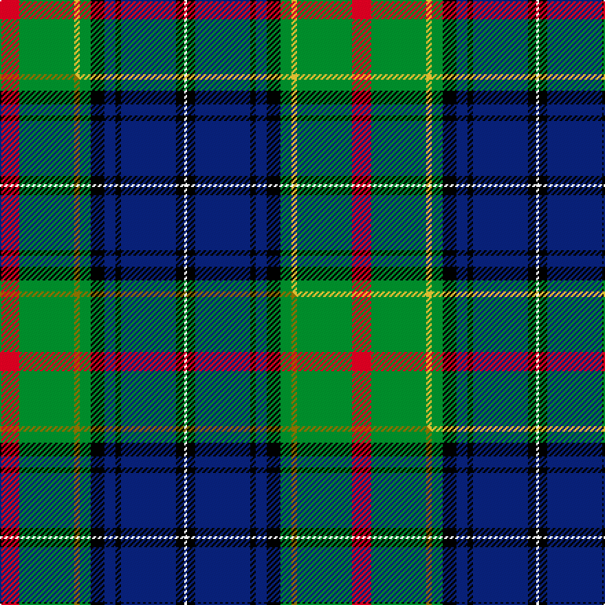

This is one **variant** — a specific cloth: this exact thread count and colourway, with its own
provenance below. It is one weaving of the [sett](/setts/r7g20ly2g4k5db4k2db20k3w1/) (the scale-free proportion — the
same cloth at any scale or shade), whose colour order is pattern [RGYGKBKBKW](/stripes/rgygkbkbkw/).

Part of the [McMeeken](/tartans/m/mc/mcmeeken/) tartan — the named design grouping this sett with its other cloths.

Sourced from tartans-authority.  It is a [10 stripe tartan](/stripes/stripes10/).

Original link [https://www.tartanregister.gov.uk/tartanDetails.aspx?ref=10089](https://www.tartanregister.gov.uk/tartanDetails.aspx?ref=10089)

Dataset <small>— provenance for this record, inherited from the source manifest</small>

<dl class="dataset-prov">
<dt>source</dt><dd><a href="/sources/tartans-authority/">Scottish Tartans Authority</a></dd>
<dt>data captured from</dt><dd><a href="https://github.com/thetartan/tartan-database/blob/master/data/tartans-authority/data.csv">https://github.com/thetartan/tartan-database/blob/master/data/tartans-authority/data.csv</a></dd>
<dt>data date</dt><dd>October 2009 <small>(this record)</small></dd>
<dt>licence</dt><dd><a href="https://creativecommons.org/licenses/by-nc-nd/4.0/">CC BY-NC-ND 4.0</a></dd>
</dl>

Capture chain <small>— the hands this data passed through, oldest first; each capture carries its own licence</small>

<ol class="capture-chain">
<li><a href="https://www.tartansauthority.com/">Scottish Tartans Authority</a> <small>the heritage body's archive — its tartan-ferret record browser is retired (links repaired to the SRT, above)</small></li>
<li><a href="https://github.com/thetartan/tartan-database">thetartan/tartan-database</a> <small>2016-2017</small> · <a href="https://creativecommons.org/licenses/by-nc-nd/4.0/">CC BY-NC-ND 4.0</a> <small>Levko Kravets's frozen compilation — the capture we vendored, and where its CC licence text came from</small></li>
<li>this dictionary <small>captured 2026-06-10 · commit 5bf86c7566</small> <small>each re-capture is a git commit to data/sources</small></li>
</ol>

## Register references

External register numbers recorded for this tartan.

- Scottish Register of Tartans: [10089](https://www.tartanregister.gov.uk/tartanDetails?ref=10089)
- Scottish Tartans Authority (ITI): 10089

## Thread count
R/14 G40 LY4 G8 K10 DB8 K4 DB40 K6 W/2

One full sett is **256 threads**.

## Palette
<table><thead><tr><th>Colour</th><th>Shade</th><th>OKLCh</th></tr></thead><tbody><tr><td>DB</td><td><code style="background-color:#082077;">#082077</code> <small style="color:#888">#082077</small></td><td><small style="color:#888">oklch(30.0% 0.149 265.1)</small></td></tr><tr><td>R</td><td><code style="background-color:#D60020;">#D60020</code> <small style="color:#888">#D60020</small></td><td><small style="color:#888">oklch(55.2% 0.224 25.5)</small></td></tr><tr><td>G</td><td><code style="background-color:#008B2A;">#008B2A</code> <small style="color:#888">#008B2A</small></td><td><small style="color:#888">oklch(55.4% 0.170 145.9)</small></td></tr><tr><td>K</td><td><code style="background-color:#000000;">#000000</code> <small style="color:#888">#000000</small></td><td><small style="color:#888">oklch(0.0% 0.000 0.0)</small></td></tr><tr><td>W</td><td><code style="background-color:#F7F7F7;">#F7F7F7</code> <small style="color:#888">#F7F7F7</small></td><td><small style="color:#888">oklch(97.6% 0.000 89.9)</small></td></tr><tr><td>LY</td><td><code style="background-color:#DCBC32;">#DCBC32</code> <small style="color:#888">#DCBC32</small></td><td><small style="color:#888">oklch(80.0% 0.150 95.2)</small></td></tr></tbody></table>

# Sample pattern

## Compared to the master

This cloth is one sett of its design; the master sett (the exemplar the design is anchored on) is below for comparison.

Its **ΔTartan distance** from the master is **0.02** — the same measure the nearest-tartans table ranks by (0 is identical; a re-scale of the same cloth is near 0, a recolour or a different proportion further).

<figure class="master-compare" style="margin:0">

this sett
master sett ★

<figcaption style="color:#888;font-size:smaller">One weave of this sett against the <a href="/setts/r7g20y2g4k5db4k2db20k3w1/">master sett ★</a>, split on the diagonal: a shared proportion runs seamlessly across it with only the shades shifting; a different proportion breaks on it.</figcaption>
</figure>

## Nearest tartan variants

The nearest existing variants by ΔTartan distance, with this cloth at the top so the swatches line up against it.

ΔTartan

Threads

Variant

Sett

—

256

<a href="/variants/s10/r7g20ly2g4k5db4k2db20k3w1~x2/">McMeeken (Name)</a>

<a href="/ttd/edit/#slug=r7g20y2g4k5db4k2db20k3w1~x2&amp;base=r7g20ly2g4k5db4k2db20k3w1~x2" title="compare in the TTD">0.02</a>

256

<a href="/variants/s10/r7g20y2g4k5db4k2db20k3w1~x2/">McMeeken</a>

<a href="/ttd/edit/#slug=db4k2db16k12w1g13r2g2y4~x2&amp;base=r7g20ly2g4k5db4k2db20k3w1~x2" title="compare in the TTD">1.45</a>

208

<a href="/variants/s9/db4k2db16k12w1g13r2g2y4~x2/">Cusack</a>

<a href="/ttd/edit/#slug=g4lb3g18k14o2k2dp18ly1dp2ly3~x2~o2203076-ly2705081&amp;base=r7g20ly2g4k5db4k2db20k3w1~x2" title="compare in the TTD">1.60</a>

254

<a href="/variants/s10/g4lb3g18k14y2k2dp18ly1dp2ly3~x2~y2203076-ly2705081/">Caisteal Leòdhais</a>

<a href="/ttd/edit/#slug=k2w2k8ly8db24g13k3dr1~x2&amp;base=r7g20ly2g4k5db4k2db20k3w1~x2" title="compare in the TTD">1.68</a>

238

<a href="/variants/s8/k2w2k8ly8db24g13k3dr1~x2/">Froben, Christian (Personal)</a>

<a href="/ttd/edit/#slug=k2w2k8y8db24g13k3dr1~x2&amp;base=r7g20ly2g4k5db4k2db20k3w1~x2" title="compare in the TTD">1.79</a>

238

<a href="/variants/s8/k2w2k8y8db24g13k3dr1~x2/">Froben, Christian (Personal)</a>

<a href="/ttd/edit/#slug=y4k1g10r2g10r4g10r2g10k16db28k1b4~x2&amp;base=r7g20ly2g4k5db4k2db20k3w1~x2" title="compare in the TTD">1.88</a>

392

<a href="/variants/s13/y4k1g10r2g10r4g10r2g10k16db28k1b4~x2/">California</a>

<a href="/ttd/edit/#slug=dg50db12n7db12dr10w7k2w7k2w7dr10~x2&amp;base=r7g20ly2g4k5db4k2db20k3w1~x2" title="compare in the TTD">1.99</a>

384

<a href="/variants/s11/dg50db12n7db12dr10w7k2w7k2w7dr10~x2/">Norham and Ladykirk</a>

<a href="/ttd/edit/#slug=r6g2r2g21k2w4k2db23y2db2y6~x2&amp;base=r7g20ly2g4k5db4k2db20k3w1~x2" title="compare in the TTD">2.04</a>

264

<a href="/variants/s11/r6g2r2g21k2w4k2db23y2db2y6~x2/">Glasgow, City of Culture</a>

<a href="/ttd/edit/#slug=w4k1g19y1k19db13r2db4r2~x2&amp;base=r7g20ly2g4k5db4k2db20k3w1~x2" title="compare in the TTD">2.05</a>

248

<a href="/variants/s9/w4k1g19y1k19db13r2db4r2~x2/">Whitson Family Tartan</a>

<a href="/ttd/edit/#slug=g9w9k2w2k2y2dg28g2db12g4~x2&amp;base=r7g20ly2g4k5db4k2db20k3w1~x2" title="compare in the TTD">2.15</a>

262

<a href="/variants/s10/g9w9k2w2k2y2dg28g2db12g4~x2/">Order of Saint Lazarus</a>

## Neighbour map

Every grey dot is one of 13621 variants placed by the first two principal components of the ΔTartan feature space (42% of its variance). Red is this tartan; blue dots are its nearest — click one to open its page.

<svg viewBox="0 0 640 380" role="img" style="max-width:100%;height:auto;border:1px solid #e0e0e0;border-radius:4px;display:block" xmlns="http://www.w3.org/2000/svg"><image href="/nn/cloud.v1.png" width="640" height="380"/><a href="/variants/s10/r7g20y2g4k5db4k2db20k3w1~x2/"><circle cx="141.6" cy="114.7" r="4" fill="#3465a4"><title>McMeeken</title></circle></a><a href="/variants/s9/db4k2db16k12w1g13r2g2y4~x2/"><circle cx="124.9" cy="136.8" r="4" fill="#3465a4"><title>Cusack</title></circle></a><a href="/variants/s10/g4lb3g18k14y2k2dp18ly1dp2ly3~x2~y2203076-ly2705081/"><circle cx="117.4" cy="114.7" r="4" fill="#3465a4"><title>Caisteal Leòdhais</title></circle></a><a href="/variants/s8/k2w2k8ly8db24g13k3dr1~x2/"><circle cx="141.0" cy="114.4" r="4" fill="#3465a4"><title>Froben, Christian (Personal)</title></circle></a><a href="/variants/s8/k2w2k8y8db24g13k3dr1~x2/"><circle cx="154.4" cy="118.2" r="4" fill="#3465a4"><title>Froben, Christian (Personal)</title></circle></a><a href="/variants/s13/y4k1g10r2g10r4g10r2g10k16db28k1b4~x2/"><circle cx="148.6" cy="96.9" r="4" fill="#3465a4"><title>California</title></circle></a><a href="/variants/s11/dg50db12n7db12dr10w7k2w7k2w7dr10~x2/"><circle cx="161.5" cy="98.8" r="4" fill="#3465a4"><title>Norham and Ladykirk</title></circle></a><a href="/variants/s11/r6g2r2g21k2w4k2db23y2db2y6~x2/"><circle cx="121.2" cy="122.8" r="4" fill="#3465a4"><title>Glasgow, City of Culture</title></circle></a><a href="/variants/s9/w4k1g19y1k19db13r2db4r2~x2/"><circle cx="103.4" cy="116.1" r="4" fill="#3465a4"><title>Whitson Family Tartan</title></circle></a><a href="/variants/s10/g9w9k2w2k2y2dg28g2db12g4~x2/"><circle cx="125.7" cy="121.8" r="4" fill="#3465a4"><title>Order of Saint Lazarus</title></circle></a><circle cx="139.0" cy="114.3" r="5" fill="#c00000"/><text x="320" y="376" text-anchor="middle" font-size="11" fill="#999">ground</text><text x="11" y="190" text-anchor="middle" font-size="11" fill="#999" transform="rotate(-90 11 190)">complexity</text></svg>

ID: /variants/s10/r7g20ly2g4k5db4k2db20k3w1~x2/
