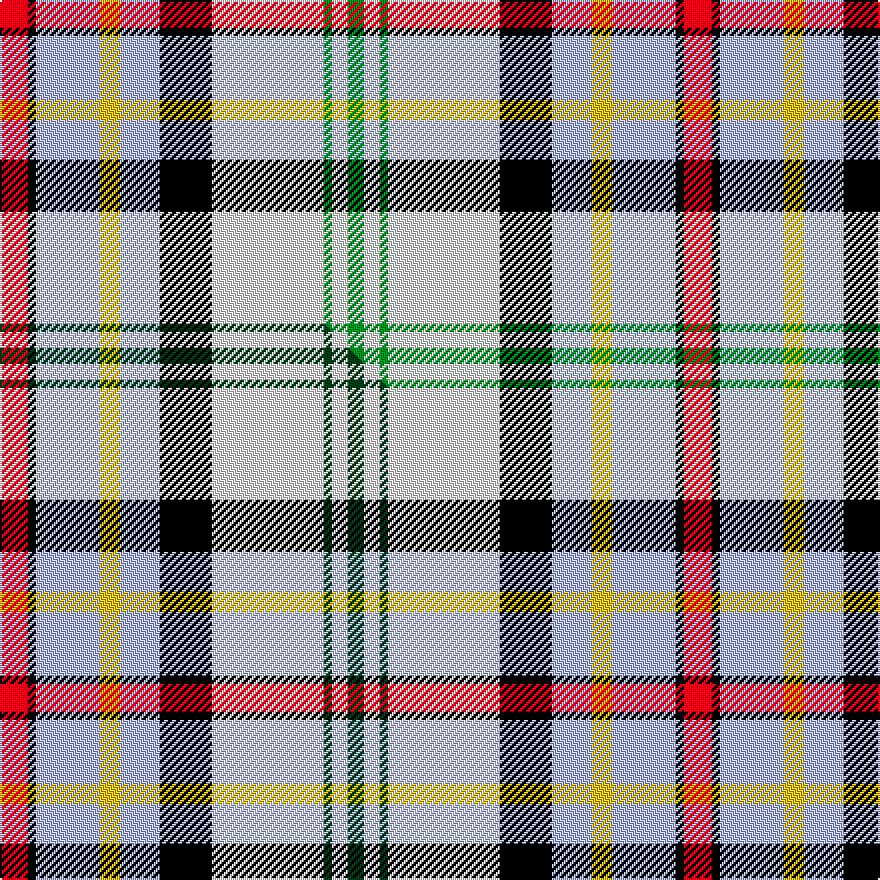

This is one **variant** — a specific cloth: this exact thread count and colourway, with its own
provenance below. It is one weaving of the [sett](/setts/r7k2lb16ly5lb10k13w28g2w4g4/) (the scale-free proportion — the
same cloth at any scale or shade), whose colour order is pattern [GWGWKWYWKR](/stripes/gwgwkwywkr/).

Part of the [Gillies Dress](/tartans/gillies-dress-2/) tartan — the named design grouping this sett with its other cloths.

Sourced from tartans-authority.  It is a [10 stripe tartan](/stripes/stripes10/).

Original link [https://www.tartanregister.gov.uk/tartanDetails.aspx?ref=934](https://www.tartanregister.gov.uk/tartanDetails.aspx?ref=934)

Dataset <small>— provenance for this record, inherited from the source manifest</small>

<dl class="dataset-prov">
<dt>source</dt><dd><a href="/sources/tartans-authority/">Scottish Tartans Authority</a></dd>
<dt>data captured from</dt><dd><a href="https://github.com/thetartan/tartan-database/blob/master/data/tartans-authority/data.csv">https://github.com/thetartan/tartan-database/blob/master/data/tartans-authority/data.csv</a></dd>
<dt>data date</dt><dd>pre 2002 <small>(this record)</small></dd>
<dt>licence</dt><dd><a href="https://creativecommons.org/licenses/by-nc-nd/4.0/">CC BY-NC-ND 4.0</a></dd>
</dl>

Capture chain <small>— the hands this data passed through, oldest first; each capture carries its own licence</small>

<ol class="capture-chain">
<li><a href="https://www.tartansauthority.com/">Scottish Tartans Authority</a> <small>the heritage body's archive — its tartan-ferret record browser is retired (links repaired to the SRT, above)</small></li>
<li><a href="https://github.com/thetartan/tartan-database">thetartan/tartan-database</a> <small>2016-2017</small> · <a href="https://creativecommons.org/licenses/by-nc-nd/4.0/">CC BY-NC-ND 4.0</a> <small>Levko Kravets's frozen compilation — the capture we vendored, and where its CC licence text came from</small></li>
<li>this dictionary <small>captured 2026-06-10 · commit 5bf86c7566</small> <small>each re-capture is a git commit to data/sources</small></li>
</ol>

## Register references

External register numbers recorded for this tartan.

- Scottish Tartans Authority (ITI): 934

## Thread count
R/14 K4 LB32 LY10 LB20 K26 W56 G4 W8 G/8

One full sett is **342 threads**.

## Palette
<table><thead><tr><th>Colour</th><th>Shade</th><th>OKLCh</th></tr></thead><tbody><tr><td>LB</td><td><code style="background-color:#B5BBDE;">#B5BBDE</code> <small style="color:#888">#B5BBDE</small></td><td><small style="color:#888">oklch(79.9% 0.050 277.6)</small></td></tr><tr><td>G</td><td><code style="background-color:#008B2A;">#008B2A</code> <small style="color:#888">#008B2A</small></td><td><small style="color:#888">oklch(55.4% 0.170 145.9)</small></td></tr><tr><td>K</td><td><code style="background-color:#000000;">#000000</code> <small style="color:#888">#000000</small></td><td><small style="color:#888">oklch(0.0% 0.000 0.0)</small></td></tr><tr><td>R</td><td><code style="background-color:#D60020;">#D60020</code> <small style="color:#888">#D60020</small></td><td><small style="color:#888">oklch(55.2% 0.224 25.5)</small></td></tr><tr><td>W</td><td><code style="background-color:#F7F7F7;">#F7F7F7</code> <small style="color:#888">#F7F7F7</small></td><td><small style="color:#888">oklch(97.6% 0.000 89.9)</small></td></tr><tr><td>LY</td><td><code style="background-color:#DCBC32;">#DCBC32</code> <small style="color:#888">#DCBC32</small></td><td><small style="color:#888">oklch(80.0% 0.150 95.2)</small></td></tr></tbody></table>

# Sample pattern

## Compared to the master

This cloth is one sett of its design; the master sett (the exemplar the design is anchored on) is below for comparison.

Its **ΔTartan distance** from the master is **0.04** — the same measure the nearest-tartans table ranks by (0 is identical; a re-scale of the same cloth is near 0, a recolour or a different proportion further).

<figure class="master-compare" style="margin:0">

this sett
master sett ★

<figcaption style="color:#888;font-size:smaller">One weave of this sett against the <a href="/setts/r7k2lb16ly5lb10k13w28dg2w4dg4/">master sett ★</a>, split on the diagonal: a shared proportion runs seamlessly across it with only the shades shifting; a different proportion breaks on it.</figcaption>
</figure>

## Nearest tartan variants

The nearest existing variants by ΔTartan distance, with this cloth at the top so the swatches line up against it.

ΔTartan

Threads

Variant

Sett

—

342

<a href="/variants/s10/r7k2lb16ly5lb10k13w28g2w4g4~x2/">Gillies Dress, Blue #1 (Dance)</a>

<a href="/ttd/edit/#slug=r7k2lb16ly5lb10k13w28dg2w4dg4~x2&amp;base=r7k2lb16ly5lb10k13w28g2w4g4~x2" title="compare in the TTD">0.04</a>

342

<a href="/variants/s10/r7k2lb16ly5lb10k13w28dg2w4dg4~x2/">Gillies Dress Blue #1 (Dance)</a>

<a href="/ttd/edit/#slug=r7k2lb16y5lb10k13w28g2w4g2~x2&amp;base=r7k2lb16ly5lb10k13w28g2w4g4~x2" title="compare in the TTD">0.07</a>

338

<a href="/variants/s10/r7k2lb16y5lb10k13w28g2w4g2~x2/">Gillies Blue Dress Clan Tartan</a>

<a href="/ttd/edit/#slug=y6k2lb15r5lb9k13w25db2w3db2~x2&amp;base=r7k2lb16ly5lb10k13w28g2w4g4~x2" title="compare in the TTD">1.29</a>

312

<a href="/variants/s10/y6k2lb15r5lb9k13w25db2w3db2~x2/">Gillies, dress Blue</a>

<a href="/ttd/edit/#slug=db5w30lb9k9dp9g2dp2g5~x2&amp;base=r7k2lb16ly5lb10k13w28g2w4g4~x2" title="compare in the TTD">2.40</a>

264

<a href="/variants/s8/db5w30lb9k9dp9g2dp2g5~x2/">Alexander of Menstry Dress</a>

<a href="/ttd/edit/#slug=r5w23db5w5k7y3k3w2k3g16r8g3r6w3~x2&amp;base=r7k2lb16ly5lb10k13w28g2w4g4~x2" title="compare in the TTD">2.40</a>

352

<a href="/variants/s14/r5w23db5w5k7y3k3w2k3g16r8g3r6w3~x2/">Victoria Highland Dress</a>

<a href="/ttd/edit/#slug=y6k2g15r6g8k12w25lb2w3lb2~x2&amp;base=r7k2lb16ly5lb10k13w28g2w4g4~x2" title="compare in the TTD">2.44</a>

308

<a href="/variants/s10/y6k2g15r6g8k12w25lb2w3lb2~x2/">Gillies, dress Green</a>

<a href="/ttd/edit/#slug=w4lb5lo3lb22dy4k3g16lo7k2lo7dy2~x2&amp;base=r7k2lb16ly5lb10k13w28g2w4g4~x2" title="compare in the TTD">2.46</a>

288

<a href="/variants/s11/w4lb5lo3lb22dy4k3g16lo7k2lo7dy2~x2/">Cossar (Personal)</a>

<a href="/ttd/edit/#slug=w37k4db12g12w2lr2r23w4r6~x2~lr2805035-r1506019&amp;base=r7k2lb16ly5lb10k13w28g2w4g4~x2" title="compare in the TTD">2.47</a>

322

<a href="/variants/s9/w37k4db12g12w2lr2r23w4r6~x2~lr2805035-r1506019/">Hebridean Arisaid, Red/White (Dance)</a>

<a href="/ttd/edit/#slug=w4g3w19g8k1dr4k1b18k1lo2~x2&amp;base=r7k2lb16ly5lb10k13w28g2w4g4~x2" title="compare in the TTD">2.53</a>

232

<a href="/variants/s10/w4g3w19g8k1dr4k1b18k1lo2~x2/">Alberta Dress</a>

<a href="/ttd/edit/#slug=db4w2r6k1db12g4w2r6b6w2g8r2w16r4~x2&amp;base=r7k2lb16ly5lb10k13w28g2w4g4~x2" title="compare in the TTD">2.55</a>

284

<a href="/variants/s14/db4w2r6k1db12g4w2r6b6w2g8r2w16r4~x2/">MacFarlane, dress</a>

## Neighbour map

Every grey dot is one of 13621 variants placed by the first two principal components of the ΔTartan feature space (42% of its variance). Red is this tartan; blue dots are its nearest — click one to open its page.

<svg viewBox="0 0 640 380" role="img" style="max-width:100%;height:auto;border:1px solid #e0e0e0;border-radius:4px;display:block" xmlns="http://www.w3.org/2000/svg"><image href="/nn/cloud.v1.png" width="640" height="380"/><a href="/variants/s10/r7k2lb16ly5lb10k13w28dg2w4dg4~x2/"><circle cx="82.8" cy="128.3" r="4" fill="#3465a4"><title>Gillies Dress Blue #1 (Dance)</title></circle></a><a href="/variants/s10/r7k2lb16y5lb10k13w28g2w4g2~x2/"><circle cx="91.7" cy="125.6" r="4" fill="#3465a4"><title>Gillies Blue Dress Clan Tartan</title></circle></a><a href="/variants/s10/y6k2lb15r5lb9k13w25db2w3db2~x2/"><circle cx="81.5" cy="132.8" r="4" fill="#3465a4"><title>Gillies, dress Blue</title></circle></a><a href="/variants/s8/db5w30lb9k9dp9g2dp2g5~x2/"><circle cx="122.5" cy="128.3" r="4" fill="#3465a4"><title>Alexander of Menstry Dress</title></circle></a><a href="/variants/s14/r5w23db5w5k7y3k3w2k3g16r8g3r6w3~x2/"><circle cx="71.4" cy="121.1" r="4" fill="#3465a4"><title>Victoria Highland Dress</title></circle></a><a href="/variants/s10/y6k2g15r6g8k12w25lb2w3lb2~x2/"><circle cx="77.3" cy="134.8" r="4" fill="#3465a4"><title>Gillies, dress Green</title></circle></a><a href="/variants/s11/w4lb5lo3lb22dy4k3g16lo7k2lo7dy2~x2/"><circle cx="104.9" cy="142.2" r="4" fill="#3465a4"><title>Cossar (Personal)</title></circle></a><a href="/variants/s9/w37k4db12g12w2lr2r23w4r6~x2~lr2805035-r1506019/"><circle cx="148.7" cy="113.7" r="4" fill="#3465a4"><title>Hebridean Arisaid, Red/White (Dance)</title></circle></a><a href="/variants/s10/w4g3w19g8k1dr4k1b18k1lo2~x2/"><circle cx="135.7" cy="109.9" r="4" fill="#3465a4"><title>Alberta Dress</title></circle></a><a href="/variants/s14/db4w2r6k1db12g4w2r6b6w2g8r2w16r4~x2/"><circle cx="61.2" cy="122.0" r="4" fill="#3465a4"><title>MacFarlane, dress</title></circle></a><circle cx="84.1" cy="129.5" r="5" fill="#c00000"/><text x="320" y="376" text-anchor="middle" font-size="11" fill="#999">ground</text><text x="11" y="190" text-anchor="middle" font-size="11" fill="#999" transform="rotate(-90 11 190)">complexity</text></svg>

ID: /variants/s10/r7k2lb16ly5lb10k13w28g2w4g4~x2/
