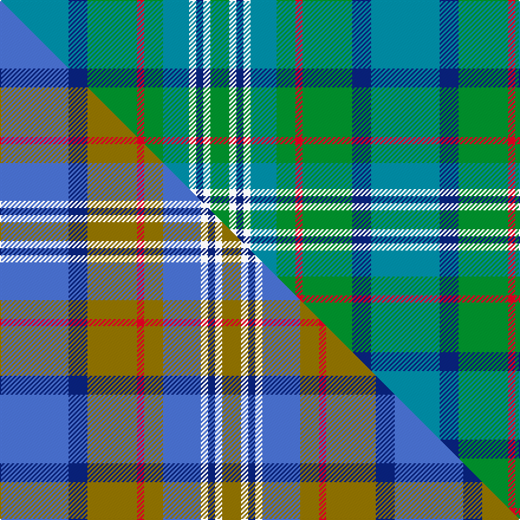

This is one **variant** — a specific cloth: this exact thread count and colourway, with its own
provenance below. It is one weaving of the [sett](/setts/t29db8g21r3g8t11w3db3w3g8/) (the scale-free proportion — the
same cloth at any scale or shade), whose colour order is pattern [BBGRGBWBWG](/stripes/bbgrgbwbwg/).

Part of the [Morneau , Richard](/tartans/m/mo/morneau-richard/) tartan — the named design grouping this sett with its other cloths.

Sourced from tartans-authority.  It is a [10 stripe tartan](/stripes/stripes10/).

Original link [https://www.tartanregister.gov.uk/tartanDetails.aspx?ref=10358](https://www.tartanregister.gov.uk/tartanDetails.aspx?ref=10358)

Dataset <small>— provenance for this record, inherited from the source manifest</small>

<dl class="dataset-prov">
<dt>source</dt><dd><a href="/sources/tartans-authority/">Scottish Tartans Authority</a></dd>
<dt>data captured from</dt><dd><a href="https://github.com/thetartan/tartan-database/blob/master/data/tartans-authority/data.csv">https://github.com/thetartan/tartan-database/blob/master/data/tartans-authority/data.csv</a></dd>
<dt>data date</dt><dd>10th Dec. 2010 <small>(this record)</small></dd>
<dt>licence</dt><dd><a href="https://creativecommons.org/licenses/by-nc-nd/4.0/">CC BY-NC-ND 4.0</a></dd>
</dl>

Capture chain <small>— the hands this data passed through, oldest first; each capture carries its own licence</small>

<ol class="capture-chain">
<li><a href="https://www.tartansauthority.com/">Scottish Tartans Authority</a> <small>the heritage body's archive — its tartan-ferret record browser is retired (links repaired to the SRT, above)</small></li>
<li><a href="https://github.com/thetartan/tartan-database">thetartan/tartan-database</a> <small>2016-2017</small> · <a href="https://creativecommons.org/licenses/by-nc-nd/4.0/">CC BY-NC-ND 4.0</a> <small>Levko Kravets's frozen compilation — the capture we vendored, and where its CC licence text came from</small></li>
<li>this dictionary <small>captured 2026-06-10 · commit 5bf86c7566</small> <small>each re-capture is a git commit to data/sources</small></li>
</ol>

## Register references

External register numbers recorded for this tartan.

- Scottish Register of Tartans: [10358](https://www.tartanregister.gov.uk/tartanDetails?ref=10358)
- Scottish Tartans Authority (ITI): 10358

## Thread count
T/58 DB16 G42 R6 G16 T22 W6 DB6 W6 G/16

One full sett is **314 threads**.

## Palette
<table><thead><tr><th>Colour</th><th>Shade</th><th>OKLCh</th></tr></thead><tbody><tr><td>T</td><td><code style="background-color:#00879F;">#00879F</code> <small style="color:#888">#00879F</small></td><td><small style="color:#888">oklch(57.4% 0.102 216.1)</small></td></tr><tr><td>DB</td><td><code style="background-color:#082077;">#082077</code> <small style="color:#888">#082077</small></td><td><small style="color:#888">oklch(30.0% 0.149 265.1)</small></td></tr><tr><td>G</td><td><code style="background-color:#008B2A;">#008B2A</code> <small style="color:#888">#008B2A</small></td><td><small style="color:#888">oklch(55.4% 0.170 145.9)</small></td></tr><tr><td>R</td><td><code style="background-color:#D60020;">#D60020</code> <small style="color:#888">#D60020</small></td><td><small style="color:#888">oklch(55.2% 0.224 25.5)</small></td></tr><tr><td>W</td><td><code style="background-color:#F7F7F7;">#F7F7F7</code> <small style="color:#888">#F7F7F7</small></td><td><small style="color:#888">oklch(97.6% 0.000 89.9)</small></td></tr></tbody></table>

# Sample pattern

## Compared to the master

This cloth is one sett of its design; the master sett (the exemplar the design is anchored on) is below for comparison.

Its **ΔTartan distance** from the master is **3.96** — the same measure the nearest-tartans table ranks by (0 is identical; a re-scale of the same cloth is near 0, a recolour or a different proportion further).

<figure class="master-compare" style="margin:0">

this sett
master sett ★

<figcaption style="color:#888;font-size:smaller">One weave of this sett against the <a href="/setts/b29db8y21r3y8b16w3db3w3y8/">master sett ★</a>, split on the diagonal: a shared proportion runs seamlessly across it with only the shades shifting; a different proportion breaks on it.</figcaption>
</figure>

## Nearest tartan variants

The nearest existing variants by ΔTartan distance, with this cloth at the top so the swatches line up against it.

ΔTartan

Threads

Variant

Sett

—

314

<a href="/variants/s10/t29db8g21r3g8t11w3db3w3g8~x2/">Morneau, Richard (Personal)</a>

<a href="/ttd/edit/#slug=b3db3b12db26g26r3g26db28w3~b2603265-db1404245&amp;base=t29db8g21r3g8t11w3db3w3g8~x2" title="compare in the TTD">2.17</a>

254

<a href="/variants/s9/b3db3b12db26g26r3g26db28w3~b2603265-db1404245/">Seaford House</a>

<a href="/ttd/edit/#slug=g6db1g1db1g3lb2r1lb2t3db1t1db1t6~x4&amp;base=t29db8g21r3g8t11w3db3w3g8~x2" title="compare in the TTD">2.86</a>

184

<a href="/variants/s13/g6db1g1db1g3lb2r1lb2t3db1t1db1t6~x4/">McCulloch, Grant (Personal)</a>

<a href="/ttd/edit/#slug=b16w3b2dy4g24r2g4r5g4r2t8~x2&amp;base=t29db8g21r3g8t11w3db3w3g8~x2" title="compare in the TTD">3.03</a>

248

<a href="/variants/s11/b16w3b2dy4g24r2g4r5g4r2t8~x2/">Currie of Arran</a>

<a href="/ttd/edit/#slug=g10db42r5dg42g42y5g10&amp;base=t29db8g21r3g8t11w3db3w3g8~x2" title="compare in the TTD">3.05</a>

292

<a href="/variants/s7/g10db42r5dg42g42y5g10/">New Mexico</a>

<a href="/ttd/edit/#slug=t5lb2t2lb9k3t9g3t3g25w2~x2&amp;base=t29db8g21r3g8t11w3db3w3g8~x2" title="compare in the TTD">3.06</a>

238

<a href="/variants/s10/t5lb2t2lb9k3t9g3t3g25w2~x2/">Un-named (D C Dalgliesh) #2</a>

<a href="/ttd/edit/#slug=r3dg28g19dg3db19dg3db19dg3g19dg28w3~x2&amp;base=t29db8g21r3g8t11w3db3w3g8~x2" title="compare in the TTD">3.08</a>

576

<a href="/variants/s11/r3dg28g19dg3db19dg3db19dg3g19dg28w3~x2/">Boys Brigade</a>

<a href="/ttd/edit/#slug=o3b2g19b6g2b6dg14dr4w2~x2&amp;base=t29db8g21r3g8t11w3db3w3g8~x2" title="compare in the TTD">3.23</a>

222

<a href="/variants/s9/o3b2g19b6g2b6dg14dr4w2~x2/">Royal Pharmaceutical, Society</a>

<a href="/ttd/edit/#slug=g5dt2g17ly2db5ly2o5db17g2ly4~x2&amp;base=t29db8g21r3g8t11w3db3w3g8~x2" title="compare in the TTD">3.32</a>

226

<a href="/variants/s10/g5dt2g17ly2db5ly2o5db17g2ly4~x2/">Antrim Irish County Tartan</a>

<a href="/ttd/edit/#slug=dg9g1b2g1db4r1~x12~dg1806142-g2408144&amp;base=t29db8g21r3g8t11w3db3w3g8~x2" title="compare in the TTD">3.36</a>

312

<a href="/variants/s6/dg9g1b2g1db4r1~x12~dg1806142-g2408144/">Gorman, George (Personal)</a>

<a href="/ttd/edit/#slug=dg70y6lb28g56lb5g11lb5g11r12~dg1405139-g2106142&amp;base=t29db8g21r3g8t11w3db3w3g8~x2" title="compare in the TTD">3.37</a>

326

<a href="/variants/s9/dg70y6lb28g56lb5g11lb5g11r12~dg1405139-g2106142/">Dalwhinnie</a>

## Neighbour map

Every grey dot is one of 13656 variants placed by the first two principal components of the ΔTartan feature space (42% of its variance). Red is this tartan; blue dots are its nearest — click one to open its page. The map is a flat projection of a many-dimensional space — [how to read it](/posts/neighbourhood-maps/).

<svg viewBox="0 0 640 380" role="img" style="max-width:100%;height:auto;border:1px solid #e0e0e0;border-radius:4px;display:block" xmlns="http://www.w3.org/2000/svg"><image href="/nn/cloud.v1.png" width="640" height="380"/><a href="/variants/s9/b3db3b12db26g26r3g26db28w3~b2603265-db1404245/"><circle cx="249.9" cy="213.4" r="4" fill="#3465a4"><title>Seaford House</title></circle></a><a href="/variants/s13/g6db1g1db1g3lb2r1lb2t3db1t1db1t6~x4/"><circle cx="186.7" cy="226.6" r="4" fill="#3465a4"><title>McCulloch, Grant (Personal)</title></circle></a><a href="/variants/s11/b16w3b2dy4g24r2g4r5g4r2t8~x2/"><circle cx="216.0" cy="162.3" r="4" fill="#3465a4"><title>Currie of Arran</title></circle></a><a href="/variants/s7/g10db42r5dg42g42y5g10/"><circle cx="218.7" cy="227.3" r="4" fill="#3465a4"><title>New Mexico</title></circle></a><a href="/variants/s10/t5lb2t2lb9k3t9g3t3g25w2~x2/"><circle cx="230.7" cy="162.8" r="4" fill="#3465a4"><title>Un-named (D C Dalgliesh) #2</title></circle></a><a href="/variants/s11/r3dg28g19dg3db19dg3db19dg3g19dg28w3~x2/"><circle cx="230.5" cy="206.2" r="4" fill="#3465a4"><title>Boys Brigade</title></circle></a><a href="/variants/s9/o3b2g19b6g2b6dg14dr4w2~x2/"><circle cx="173.6" cy="189.1" r="4" fill="#3465a4"><title>Royal Pharmaceutical, Society</title></circle></a><a href="/variants/s10/g5dt2g17ly2db5ly2o5db17g2ly4~x2/"><circle cx="188.4" cy="189.7" r="4" fill="#3465a4"><title>Antrim Irish County Tartan</title></circle></a><a href="/variants/s6/dg9g1b2g1db4r1~x12~dg1806142-g2408144/"><circle cx="283.1" cy="214.9" r="4" fill="#3465a4"><title>Gorman, George (Personal)</title></circle></a><a href="/variants/s9/dg70y6lb28g56lb5g11lb5g11r12~dg1405139-g2106142/"><circle cx="238.8" cy="181.0" r="4" fill="#3465a4"><title>Dalwhinnie</title></circle></a><circle cx="239.8" cy="206.1" r="5" fill="#c00000"/><text x="320" y="376" text-anchor="middle" font-size="11" fill="#999">ground</text><text x="11" y="190" text-anchor="middle" font-size="11" fill="#999" transform="rotate(-90 11 190)">complexity</text></svg>

ID: /variants/s10/t29db8g21r3g8t11w3db3w3g8~x2/
