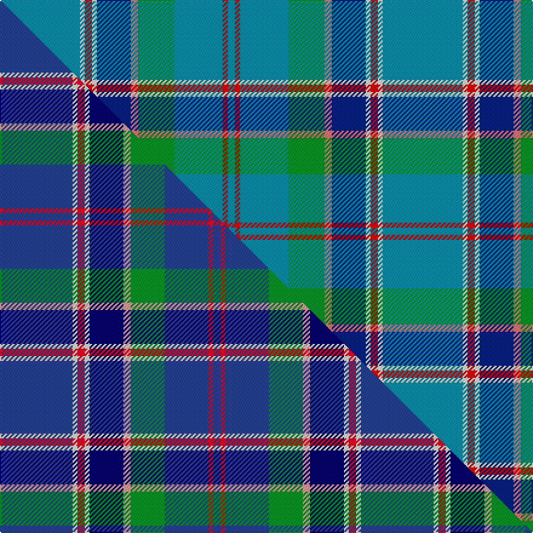

This is one **variant** — a specific cloth: this exact thread count and colourway, with its own
provenance below. It is one weaving of the [sett](/setts/t33w2r3w2db14ri3g15t20r2t3/) (the scale-free proportion — the
same cloth at any scale or shade), whose colour order is pattern [BRBGRBWRWB](/stripes/brbgrbwrwb/).

Part of the [Kansai St Andrews Society](/tartans/k/ka/kansai-st-andrews-society/) tartan — the named design grouping this sett with its other cloths.

Sourced from tartans-authority.  It is a [10 stripe tartan](/stripes/stripes10/).

Original link [https://www.tartanregister.gov.uk/tartanDetails.aspx?ref=3987](https://www.tartanregister.gov.uk/tartanDetails.aspx?ref=3987)

Dataset <small>— provenance for this record, inherited from the source manifest</small>

<dl class="dataset-prov">
<dt>source</dt><dd><a href="/sources/tartans-authority/">Scottish Tartans Authority</a></dd>
<dt>data captured from</dt><dd><a href="https://github.com/thetartan/tartan-database/blob/master/data/tartans-authority/data.csv">https://github.com/thetartan/tartan-database/blob/master/data/tartans-authority/data.csv</a></dd>
<dt>data date</dt><dd>2002 <small>(this record)</small></dd>
<dt>licence</dt><dd><a href="https://creativecommons.org/licenses/by-nc-nd/4.0/">CC BY-NC-ND 4.0</a></dd>
</dl>

Capture chain <small>— the hands this data passed through, oldest first; each capture carries its own licence</small>

<ol class="capture-chain">
<li><a href="https://www.tartansauthority.com/">Scottish Tartans Authority</a> <small>the heritage body's archive — its tartan-ferret record browser is retired (links repaired to the SRT, above)</small></li>
<li><a href="https://github.com/thetartan/tartan-database">thetartan/tartan-database</a> <small>2016-2017</small> · <a href="https://creativecommons.org/licenses/by-nc-nd/4.0/">CC BY-NC-ND 4.0</a> <small>Levko Kravets's frozen compilation — the capture we vendored, and where its CC licence text came from</small></li>
<li>this dictionary <small>captured 2026-06-10 · commit 5bf86c7566</small> <small>each re-capture is a git commit to data/sources</small></li>
</ol>

## Register references

External register numbers recorded for this tartan.

- Scottish Tartans Authority (ITI): 3987

## Thread count
T/66 W4 R6 W4 DB28 Ri6 G30 T40 R4 T/6

One full sett is **316 threads**.

## Palette
<table><thead><tr><th>Colour</th><th>Shade</th><th>OKLCh</th></tr></thead><tbody><tr><td>DB</td><td><code style="background-color:#082077;">#082077</code> <small style="color:#888">#082077</small></td><td><small style="color:#888">oklch(30.0% 0.149 265.1)</small></td></tr><tr><td>G</td><td><code style="background-color:#008B2A;">#008B2A</code> <small style="color:#888">#008B2A</small></td><td><small style="color:#888">oklch(55.4% 0.170 145.9)</small></td></tr><tr><td>R</td><td><code style="background-color:#E87878;">#E87878</code> <small style="color:#888">#E87878</small></td><td><small style="color:#888">oklch(70.0% 0.139 21.2)</small></td></tr><tr><td>T</td><td><code style="background-color:#00879F;">#00879F</code> <small style="color:#888">#00879F</small></td><td><small style="color:#888">oklch(57.4% 0.102 216.1)</small></td></tr><tr><td>R</td><td><code style="background-color:#C80000;">#C80000</code> <small style="color:#888">#C80000</small></td><td><small style="color:#888">oklch(52.3% 0.215 29.2)</small></td></tr><tr><td>W</td><td><code style="background-color:#F7F7F7;">#F7F7F7</code> <small style="color:#888">#F7F7F7</small></td><td><small style="color:#888">oklch(97.6% 0.000 89.9)</small></td></tr></tbody></table>

# Sample pattern

## Compared to the master

This cloth is one sett of its design; the master sett (the exemplar the design is anchored on) is below for comparison.

Its **ΔTartan distance** from the master is **0.28** — the same measure the nearest-tartans table ranks by (0 is identical; a re-scale of the same cloth is near 0, a recolour or a different proportion further).

<figure class="master-compare" style="margin:0">

this sett
master sett ★

<figcaption style="color:#888;font-size:smaller">One weave of this sett against the <a href="/setts/dbi30w2r3w2db14lr3g14dbi18r2dbi3/">master sett ★</a>, split on the diagonal: a shared proportion runs seamlessly across it with only the shades shifting; a different proportion breaks on it.</figcaption>
</figure>

## Nearest tartan variants

The nearest existing variants by ΔTartan distance, with this cloth at the top so the swatches line up against it.

ΔTartan

Threads

Variant

Sett

—

316

<a href="/variants/s10/t33w2r3w2db14ri3g15t20r2t3~x2~r2109032-ri2806019/">Kansai St Andrews Society (Corp)</a>

<a href="/ttd/edit/#slug=dbi30w2r3w2db14lr3g14dbi18r2dbi3~x2~dbi1605267-db0906265&amp;base=t33w2r3w2db14ri3g15t20r2t3~x2~r2109032-ri2806019" title="compare in the TTD">0.28</a>

298

<a href="/variants/s10/dbi30w2r3w2db14lr3g14dbi18r2dbi3~x2~dbi1605267-db0906265/">Kansai St Andrews Society</a>

<a href="/ttd/edit/#slug=dy6y3t42w4dg18y2t12r3~x2&amp;base=t33w2r3w2db14ri3g15t20r2t3~x2~r2109032-ri2806019" title="compare in the TTD">1.82</a>

342

<a href="/variants/s8/dy6y3t42w4dg18y2t12r3~x2/">Glasgow High (School)</a>

<a href="/ttd/edit/#slug=db5r3g2r3dg12t34g2w2~x2&amp;base=t33w2r3w2db14ri3g15t20r2t3~x2~r2109032-ri2806019" title="compare in the TTD">2.30</a>

238

<a href="/variants/s8/db5r3g2r3dg12t34g2w2~x2/">Moran (Wedding) (Personal)</a>

<a href="/ttd/edit/#slug=db5r3g2r3dg12t34g2w2~x2~dg1804158&amp;base=t33w2r3w2db14ri3g15t20r2t3~x2~r2109032-ri2806019" title="compare in the TTD">2.48</a>

238

<a href="/variants/s8/db5r3g2r3dg12t34g2w2~x2~dg1804158/">Moran (Drummond) Personal Tartan</a>

<a href="/ttd/edit/#slug=t40r2t7db5ly2db3w2db10n6t2n4w2~x2&amp;base=t33w2r3w2db14ri3g15t20r2t3~x2~r2109032-ri2806019" title="compare in the TTD">2.61</a>

256

<a href="/variants/s12/t40r2t7db5ly2db3w2db10n6t2n4w2~x2/">Plymouth Armada (Commemorative)</a>

<a href="/ttd/edit/#slug=n18y1n2y1n2db6w4o1g6~x2&amp;base=t33w2r3w2db14ri3g15t20r2t3~x2~r2109032-ri2806019" title="compare in the TTD">2.68</a>

116

<a href="/variants/s9/n18y1n2y1n2db6w4o1g6~x2/">Nickel Lodge, Centennial</a>

<a href="/ttd/edit/#slug=db3g6db2t11dr3dy4dr3t28w3~x2&amp;base=t33w2r3w2db14ri3g15t20r2t3~x2~r2109032-ri2806019" title="compare in the TTD">3.17</a>

240

<a href="/variants/s9/db3g6db2t11dr3dy4dr3t28w3~x2/">Bains of Caithness</a>

<a href="/ttd/edit/#slug=lr8db10t69w6t6r8lb19lr3~lr3200000-t2503227-lb3203246&amp;base=t33w2r3w2db14ri3g15t20r2t3~x2~r2109032-ri2806019" title="compare in the TTD">3.22</a>

247

<a href="/variants/s8/lb8db10t69w6t6r8lbi19lb3~lb3200000-t2503227-lbi3203246/">Virginia International Tattoo Hixon</a>

<a href="/ttd/edit/#slug=db6y2g24db4g8db6g6db8g3db10n14db4r3db34lb4&amp;base=t33w2r3w2db14ri3g15t20r2t3~x2~r2109032-ri2806019" title="compare in the TTD">3.26</a>

262

<a href="/variants/s15/db6y2g24db4g8db6g6db8g3db10n14db4r3db34lb4/">Matchpoint Hunting</a>

<a href="/ttd/edit/#slug=db40r4db10dg10g22ly3g4lyi3g4~x2~dg1806142-g1903114-ly2705081-lyi3407090&amp;base=t33w2r3w2db14ri3g15t20r2t3~x2~r2109032-ri2806019" title="compare in the TTD">3.28</a>

312

<a href="/variants/s9/db40r4db10dg10g22ly3g4lyi3g4~x2~dg1806142-g1903114-ly2705081-lyi3407090/">Keith Stanhope Society (Commem.)</a>

## Neighbour map

Every grey dot is one of 13656 variants placed by the first two principal components of the ΔTartan feature space (42% of its variance). Red is this tartan; blue dots are its nearest — click one to open its page. The map is a flat projection of a many-dimensional space — [how to read it](/posts/neighbourhood-maps/).

<svg viewBox="0 0 640 380" role="img" style="max-width:100%;height:auto;border:1px solid #e0e0e0;border-radius:4px;display:block" xmlns="http://www.w3.org/2000/svg"><image href="/nn/cloud.v1.png" width="640" height="380"/><a href="/variants/s10/dbi30w2r3w2db14lr3g14dbi18r2dbi3~x2~dbi1605267-db0906265/"><circle cx="280.6" cy="145.4" r="4" fill="#3465a4"><title>Kansai St Andrews Society</title></circle></a><a href="/variants/s8/dy6y3t42w4dg18y2t12r3~x2/"><circle cx="346.9" cy="142.2" r="4" fill="#3465a4"><title>Glasgow High (School)</title></circle></a><a href="/variants/s8/db5r3g2r3dg12t34g2w2~x2/"><circle cx="302.5" cy="137.0" r="4" fill="#3465a4"><title>Moran (Wedding) (Personal)</title></circle></a><a href="/variants/s8/db5r3g2r3dg12t34g2w2~x2~dg1804158/"><circle cx="332.8" cy="149.1" r="4" fill="#3465a4"><title>Moran (Drummond) Personal Tartan</title></circle></a><a href="/variants/s12/t40r2t7db5ly2db3w2db10n6t2n4w2~x2/"><circle cx="346.5" cy="115.8" r="4" fill="#3465a4"><title>Plymouth Armada (Commemorative)</title></circle></a><a href="/variants/s9/n18y1n2y1n2db6w4o1g6~x2/"><circle cx="293.1" cy="140.4" r="4" fill="#3465a4"><title>Nickel Lodge, Centennial</title></circle></a><a href="/variants/s9/db3g6db2t11dr3dy4dr3t28w3~x2/"><circle cx="360.8" cy="168.5" r="4" fill="#3465a4"><title>Bains of Caithness</title></circle></a><a href="/variants/s8/lb8db10t69w6t6r8lbi19lb3~lb3200000-t2503227-lbi3203246/"><circle cx="363.7" cy="138.1" r="4" fill="#3465a4"><title>Virginia International Tattoo Hixon</title></circle></a><a href="/variants/s15/db6y2g24db4g8db6g6db8g3db10n14db4r3db34lb4/"><circle cx="274.4" cy="135.9" r="4" fill="#3465a4"><title>Matchpoint Hunting</title></circle></a><a href="/variants/s9/db40r4db10dg10g22ly3g4lyi3g4~x2~dg1806142-g1903114-ly2705081-lyi3407090/"><circle cx="276.9" cy="157.6" r="4" fill="#3465a4"><title>Keith Stanhope Society (Commem.)</title></circle></a><circle cx="317.9" cy="152.1" r="5" fill="#c00000"/><text x="320" y="376" text-anchor="middle" font-size="11" fill="#999">ground</text><text x="11" y="190" text-anchor="middle" font-size="11" fill="#999" transform="rotate(-90 11 190)">complexity</text></svg>

ID: /variants/s10/t33w2r3w2db14ri3g15t20r2t3~x2~r2109032-ri2806019/
