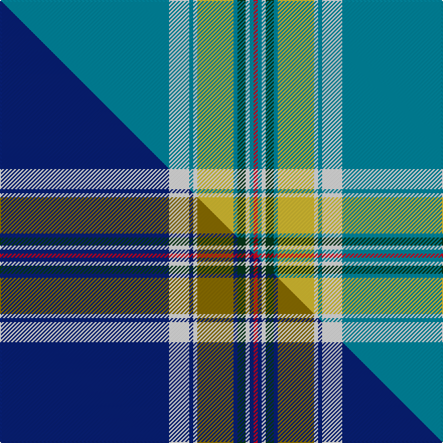

This is one **variant** — a specific cloth: this exact thread count and colourway, with its own
provenance below. It is one weaving of the [sett](/setts/t42w5t1w1ly9t1dg2w1t1r1/) (the scale-free proportion — the
same cloth at any scale or shade), whose colour order is pattern [BWBWYBGWBR](/stripes/bwbwybgwbr/).

Part of the [Stratford , City of](/tartans/s/st/stratford-city-of/) tartan — the named design grouping this sett with its other cloths.

Sourced from tartans-authority.  It is a [10 stripe tartan](/stripes/stripes10/).

Original link [https://www.tartanregister.gov.uk/tartanDetails.aspx?ref=10363](https://www.tartanregister.gov.uk/tartanDetails.aspx?ref=10363)

Dataset <small>— provenance for this record, inherited from the source manifest</small>

<dl class="dataset-prov">
<dt>source</dt><dd><a href="/sources/tartans-authority/">Scottish Tartans Authority</a></dd>
<dt>data captured from</dt><dd><a href="https://github.com/thetartan/tartan-database/blob/master/data/tartans-authority/data.csv">https://github.com/thetartan/tartan-database/blob/master/data/tartans-authority/data.csv</a></dd>
<dt>data date</dt><dd>1st Oct. 2010 <small>(this record)</small></dd>
<dt>licence</dt><dd><a href="https://creativecommons.org/licenses/by-nc-nd/4.0/">CC BY-NC-ND 4.0</a></dd>
</dl>

Capture chain <small>— the hands this data passed through, oldest first; each capture carries its own licence</small>

<ol class="capture-chain">
<li><a href="https://www.tartansauthority.com/">Scottish Tartans Authority</a> <small>the heritage body's archive — its tartan-ferret record browser is retired (links repaired to the SRT, above)</small></li>
<li><a href="https://github.com/thetartan/tartan-database">thetartan/tartan-database</a> <small>2016-2017</small> · <a href="https://creativecommons.org/licenses/by-nc-nd/4.0/">CC BY-NC-ND 4.0</a> <small>Levko Kravets's frozen compilation — the capture we vendored, and where its CC licence text came from</small></li>
<li>this dictionary <small>captured 2026-06-10 · commit 5bf86c7566</small> <small>each re-capture is a git commit to data/sources</small></li>
</ol>

## Register references

External register numbers recorded for this tartan.

- Scottish Register of Tartans: [10363](https://www.tartanregister.gov.uk/tartanDetails?ref=10363)
- Scottish Tartans Authority (ITI): 10363

## Thread count
T/168 W20 T4 W4 LY36 T4 DG8 W4 T4 R/4

One full sett is **340 threads**.

## Palette
<table><thead><tr><th>Colour</th><th>Shade</th><th>OKLCh</th></tr></thead><tbody><tr><td>T</td><td><code style="background-color:#00879F;">#00879F</code> <small style="color:#888">#00879F</small></td><td><small style="color:#888">oklch(57.4% 0.102 216.1)</small></td></tr><tr><td>LY</td><td><code style="background-color:#DCBC32;">#DCBC32</code> <small style="color:#888">#DCBC32</small></td><td><small style="color:#888">oklch(80.0% 0.150 95.2)</small></td></tr><tr><td>DG</td><td><code style="background-color:#053819;">#053819</code> <small style="color:#888">#053819</small></td><td><small style="color:#888">oklch(30.0% 0.075 151.3)</small></td></tr><tr><td>W</td><td><code style="background-color:#F7F7F7;">#F7F7F7</code> <small style="color:#888">#F7F7F7</small></td><td><small style="color:#888">oklch(97.6% 0.000 89.9)</small></td></tr><tr><td>R</td><td><code style="background-color:#D60020;">#D60020</code> <small style="color:#888">#D60020</small></td><td><small style="color:#888">oklch(55.2% 0.224 25.5)</small></td></tr></tbody></table>

# Sample pattern

## Compared to the master

This cloth is one sett of its design; the master sett (the exemplar the design is anchored on) is below for comparison.

Its **ΔTartan distance** from the master is **0.23** — the same measure the nearest-tartans table ranks by (0 is identical; a re-scale of the same cloth is near 0, a recolour or a different proportion further).

<figure class="master-compare" style="margin:0">

this sett
master sett ★

<figcaption style="color:#888;font-size:smaller">One weave of this sett against the <a href="/setts/db42w5db1w1y9db1dg2w1db1r1/">master sett ★</a>, split on the diagonal: a shared proportion runs seamlessly across it with only the shades shifting; a different proportion breaks on it.</figcaption>
</figure>

## Nearest tartan variants

The nearest existing variants by ΔTartan distance, with this cloth at the top so the swatches line up against it.

ΔTartan

Threads

Variant

Sett

—

340

<a href="/variants/s10/t42w5t1w1ly9t1dg2w1t1r1~x4/">Stratford, (Oregon) City of (Dist.)</a>

<a href="/ttd/edit/#slug=db42w5db1w1y9db1dg2w1db1r1~x4&amp;base=t42w5t1w1ly9t1dg2w1t1r1~x4" title="compare in the TTD">0.23</a>

340

<a href="/variants/s10/db42w5db1w1y9db1dg2w1db1r1~x4/">Stratford (Ontario), City of</a>

<a href="/ttd/edit/#slug=b72w12b2ly2b2r12b1w9~x2&amp;base=t42w5t1w1ly9t1dg2w1t1r1~x4" title="compare in the TTD">1.64</a>

286

<a href="/variants/s8/b72w12b2ly2b2r12b1w9~x2/">Tennessee Pioneer Blanket</a>

<a href="/ttd/edit/#slug=w4t8w4lg8w2lg2w4t42r1ly2r1t2~x2&amp;base=t42w5t1w1ly9t1dg2w1t1r1~x4" title="compare in the TTD">2.48</a>

308

<a href="/variants/s12/w4t8w4lg8w2lg2w4t42r1ly2r1t2~x2/">StammBar</a>

<a href="/ttd/edit/#slug=t106r3t4r6t8k28g8w4g12k8&amp;base=t42w5t1w1ly9t1dg2w1t1r1~x4" title="compare in the TTD">2.64</a>

260

<a href="/variants/s10/t106r3t4r6t8k28g8w4g12k8/">Parr</a>

<a href="/ttd/edit/#slug=lb20dp4r4w4g4y4lb4y1lb2y1lb20~x4~r2109032-g2408144&amp;base=t42w5t1w1ly9t1dg2w1t1r1~x4" title="compare in the TTD">2.68</a>

384

<a href="/variants/s11/lb20dp4r4w4g4y4lb4y1lb2y1lb20~x4~r2109032-g2408144/">Yukon</a>

<a href="/ttd/edit/#slug=lb20dp4r4w4g4y4lb4y1lb2y1lb20~x4&amp;base=t42w5t1w1ly9t1dg2w1t1r1~x4" title="compare in the TTD">2.68</a>

384

<a href="/variants/s11/lb20dp4r4w4g4y4lb4y1lb2y1lb20~x4/">Yukon (District)</a>

<a href="/ttd/edit/#slug=n56db9w2db2r2n9lb4db2lb2y3~x2&amp;base=t42w5t1w1ly9t1dg2w1t1r1~x4" title="compare in the TTD">2.85</a>

246

<a href="/variants/s10/n56db9w2db2r2n9lb4db2lb2y3~x2/">Blue Toon</a>

<a href="/ttd/edit/#slug=lb144k9lb13lr9lb4k9lb4ly13lr9lb4lr13k4&amp;base=t42w5t1w1ly9t1dg2w1t1r1~x4" title="compare in the TTD">2.93</a>

322

<a href="/variants/s12/lb144k9lb13lr9lb4k9lb4ly13lr9lb4lr13k4/">London Fog Blue (Fashion)</a>

<a href="/ttd/edit/#slug=t62dt22w3dt2w2dt3r1~x2~dt1204274-w3600000&amp;base=t42w5t1w1ly9t1dg2w1t1r1~x4" title="compare in the TTD">3.12</a>

254

<a href="/variants/s7/t62db22w3db2w2db3r1~x2~db1204274-w3600000/">North Tyneside Pipe Band</a>

<a href="/ttd/edit/#slug=t27w2t15ly1t1ly1t15k2w2g16r1~x2&amp;base=t42w5t1w1ly9t1dg2w1t1r1~x4" title="compare in the TTD">3.13</a>

276

<a href="/variants/s11/t27w2t15ly1t1ly1t15k2w2g16r1~x2/">Quigley of Knockcroghery Htg (Per.)</a>

## Neighbour map

Every grey dot is one of 13621 variants placed by the first two principal components of the ΔTartan feature space (42% of its variance). Red is this tartan; blue dots are its nearest — click one to open its page. The map is a flat projection of a many-dimensional space — [how to read it](/posts/neighbourhood-maps/).

<svg viewBox="0 0 640 380" role="img" style="max-width:100%;height:auto;border:1px solid #e0e0e0;border-radius:4px;display:block" xmlns="http://www.w3.org/2000/svg"><image href="/nn/cloud.v1.png" width="640" height="380"/><a href="/variants/s10/db42w5db1w1y9db1dg2w1db1r1~x4/"><circle cx="436.2" cy="63.5" r="4" fill="#3465a4"><title>Stratford (Ontario), City of</title></circle></a><a href="/variants/s8/b72w12b2ly2b2r12b1w9~x2/"><circle cx="468.4" cy="97.7" r="4" fill="#3465a4"><title>Tennessee Pioneer Blanket</title></circle></a><a href="/variants/s12/w4t8w4lg8w2lg2w4t42r1ly2r1t2~x2/"><circle cx="425.1" cy="89.0" r="4" fill="#3465a4"><title>StammBar</title></circle></a><a href="/variants/s10/t106r3t4r6t8k28g8w4g12k8/"><circle cx="340.7" cy="70.8" r="4" fill="#3465a4"><title>Parr</title></circle></a><a href="/variants/s11/lb20dp4r4w4g4y4lb4y1lb2y1lb20~x4~r2109032-g2408144/"><circle cx="383.5" cy="129.8" r="4" fill="#3465a4"><title>Yukon</title></circle></a><a href="/variants/s11/lb20dp4r4w4g4y4lb4y1lb2y1lb20~x4/"><circle cx="383.6" cy="129.7" r="4" fill="#3465a4"><title>Yukon (District)</title></circle></a><a href="/variants/s10/n56db9w2db2r2n9lb4db2lb2y3~x2/"><circle cx="493.0" cy="97.3" r="4" fill="#3465a4"><title>Blue Toon</title></circle></a><a href="/variants/s12/lb144k9lb13lr9lb4k9lb4ly13lr9lb4lr13k4/"><circle cx="444.3" cy="65.5" r="4" fill="#3465a4"><title>London Fog Blue (Fashion)</title></circle></a><a href="/variants/s7/t62db22w3db2w2db3r1~x2~db1204274-w3600000/"><circle cx="481.0" cy="120.3" r="4" fill="#3465a4"><title>North Tyneside Pipe Band</title></circle></a><a href="/variants/s11/t27w2t15ly1t1ly1t15k2w2g16r1~x2/"><circle cx="423.8" cy="118.0" r="4" fill="#3465a4"><title>Quigley of Knockcroghery Htg (Per.)</title></circle></a><circle cx="475.1" cy="84.2" r="5" fill="#c00000"/><text x="320" y="376" text-anchor="middle" font-size="11" fill="#999">ground</text><text x="11" y="190" text-anchor="middle" font-size="11" fill="#999" transform="rotate(-90 11 190)">complexity</text></svg>

ID: /variants/s10/t42w5t1w1ly9t1dg2w1t1r1~x4/
