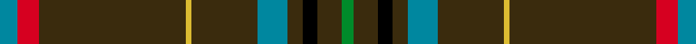

This page is one **sett** — a single exact thread-count. It belongs to the [tartan](/setts/t6r7dy49ly2dy22t10dy5k5dy8g4/)
(the same proportion at any scale), whose colour order is pattern [BRGYGBGKGG](/stripes/brgygbgkgg/).

Sourced from tartans-authority.  It is a [10 stripe tartan](/stripes/stripes10/).

Original link http://www.tartansauthority.com/tartan-ferret/display/8639/

## Register references

External register numbers recorded for this tartan.

- Scottish Register of Tartans: [8639](https://www.tartanregister.gov.uk/tartanDetails?ref=8639)
- Scottish Tartans Authority (ITI): 8639

## Thread count
T/12 R14 DY98 LY4 DY44 T20 DY10 K10 DY16 G/8

One full sett is **452 threads**.

## Palette
<table><thead><tr><th>Colour</th><th>Shade</th><th>OKLCh</th></tr></thead><tbody><tr><td>T</td><td><code style="background-color:#00879F;">#00879F</code> <small style="color:#888">#00879F</small></td><td><small style="color:#888">oklch(57.4% 0.102 216.1)</small></td></tr><tr><td>LY</td><td><code style="background-color:#DCBC32;">#DCBC32</code> <small style="color:#888">#DCBC32</small></td><td><small style="color:#888">oklch(80.0% 0.150 95.2)</small></td></tr><tr><td>G</td><td><code style="background-color:#008B2A;">#008B2A</code> <small style="color:#888">#008B2A</small></td><td><small style="color:#888">oklch(55.4% 0.170 145.9)</small></td></tr><tr><td>K</td><td><code style="background-color:#000000;">#000000</code> <small style="color:#888">#000000</small></td><td><small style="color:#888">oklch(0.0% 0.000 0.0)</small></td></tr><tr><td>R</td><td><code style="background-color:#D60020;">#D60020</code> <small style="color:#888">#D60020</small></td><td><small style="color:#888">oklch(55.2% 0.224 25.5)</small></td></tr><tr><td>DY</td><td><code style="background-color:#3A2B0D;">#3A2B0D</code> <small style="color:#888">#3A2B0D</small></td><td><small style="color:#888">oklch(30.0% 0.049 82.0)</small></td></tr></tbody></table>

# Sample pattern

## Nearest variants

The nearest existing variants by ΔTartan distance, with this cloth at the top so the swatches line up against it.

ΔTartan

Threads

Variant

Sett

—

452

<a href="/variants/s10/t6r7dy49ly2dy22t10dy5k5dy8g4~x2/">State Seal of Missouri (Fashion)</a>

<a href="/ttd/edit/#slug=k3y3lo2y30k2y3m12y6mi6k3y3~x2~y2103114-lo2706066-m1907352-mi2506332&amp;base=t6r7dy49ly2dy22t10dy5k5dy8g4~x2" title="compare in the TTD">2.79</a>

280

<a href="/variants/s11/k3y3lo2y30k2y3m12y6mi6k3y3~x2~y2103114-lo2706066-m1907352-mi2506332/">McAlifyfe (Personal)</a>

## Neighbour map

Every grey dot is one of 13620 variants placed by the first two principal components of the ΔTartan feature space (42% of its variance). Red is this tartan; blue dots are its nearest — click one to open its page.

<svg viewBox="0 0 640 380" role="img" style="max-width:100%;height:auto;border:1px solid #e0e0e0;border-radius:4px;display:block" xmlns="http://www.w3.org/2000/svg"><image href="/nn/cloud.v1.png" width="640" height="380"/><a href="/variants/s11/k3y3lo2y30k2y3m12y6mi6k3y3~x2~y2103114-lo2706066-m1907352-mi2506332/"><circle cx="326.0" cy="122.1" r="4" fill="#3465a4"><title>McAlifyfe (Personal)</title></circle></a><circle cx="409.8" cy="104.0" r="5" fill="#c00000"/><text x="320" y="376" text-anchor="middle" font-size="11" fill="#999">ground</text><text x="11" y="190" text-anchor="middle" font-size="11" fill="#999" transform="rotate(-90 11 190)">complexity</text></svg>

ID: /variants/s10/t6r7dy49ly2dy22t10dy5k5dy8g4~x2/
