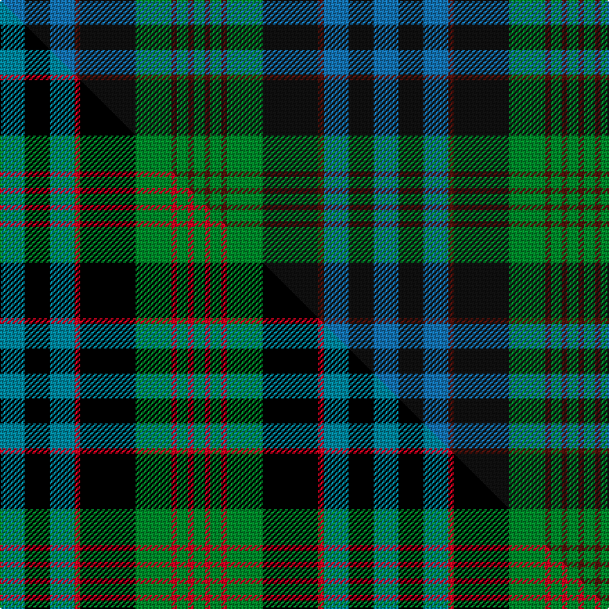

This is one **variant** — a specific cloth: this exact thread count and colourway, with its own
provenance below. It is one weaving of the [sett](/setts/t9k9t9dr2k20g13dr2g4dr2g4/) (the scale-free proportion — the
same cloth at any scale or shade), whose colour order is pattern [BKBBKGBGBG](/stripes/bkbbkgbgbg/).

Part of the [Newlands of Lauriston](/tartans/newlands-of-lauriston/) tartan — the named design grouping this sett with its other cloths.

Sourced from tartans-authority.  It is a [10 stripe tartan](/stripes/stripes10/).

Original link [https://www.tartanregister.gov.uk/tartanDetails.aspx?ref=2175](https://www.tartanregister.gov.uk/tartanDetails.aspx?ref=2175)

Dataset <small>— provenance for this record, inherited from the source manifest</small>

<dl class="dataset-prov">
<dt>source</dt><dd><a href="/sources/tartans-authority/">Scottish Tartans Authority</a></dd>
<dt>data captured from</dt><dd><a href="https://github.com/thetartan/tartan-database/blob/master/data/tartans-authority/data.csv">https://github.com/thetartan/tartan-database/blob/master/data/tartans-authority/data.csv</a></dd>
<dt>data date</dt><dd>March 1986 <small>(this record)</small></dd>
<dt>licence</dt><dd><a href="https://creativecommons.org/licenses/by-nc-nd/4.0/">CC BY-NC-ND 4.0</a></dd>
</dl>

Capture chain <small>— the hands this data passed through, oldest first; each capture carries its own licence</small>

<ol class="capture-chain">
<li><a href="https://www.tartansauthority.com/">Scottish Tartans Authority</a> <small>the heritage body's archive — its tartan-ferret record browser is retired (links repaired to the SRT, above)</small></li>
<li><a href="https://github.com/thetartan/tartan-database">thetartan/tartan-database</a> <small>2016-2017</small> · <a href="https://creativecommons.org/licenses/by-nc-nd/4.0/">CC BY-NC-ND 4.0</a> <small>Levko Kravets's frozen compilation — the capture we vendored, and where its CC licence text came from</small></li>
<li>this dictionary <small>captured 2026-06-10 · commit 5bf86c7566</small> <small>each re-capture is a git commit to data/sources</small></li>
</ol>

## Register references

External register numbers recorded for this tartan.

- Scottish Tartans Authority (ITI): 2175

## Thread count
T/18 K18 T18 DR4 K40 G26 DR4 G8 DR4 G/8

One full sett is **270 threads**.

## Palette
<table><thead><tr><th>Colour</th><th>Shade</th><th>OKLCh</th></tr></thead><tbody><tr><td>T</td><td><code style="background-color:#1474B4;">#1474B4</code> <small style="color:#888">#1474B4</small></td><td><small style="color:#888">oklch(54.0% 0.129 245.1)</small></td></tr><tr><td>G</td><td><code style="background-color:#008B2A;">#008B2A</code> <small style="color:#888">#008B2A</small></td><td><small style="color:#888">oklch(55.4% 0.170 145.9)</small></td></tr><tr><td>K</td><td><code style="background-color:#101010;">#101010</code> <small style="color:#888">#101010</small></td><td><small style="color:#888">oklch(17.3% 0.000 89.9)</small></td></tr><tr><td>DR</td><td><code style="background-color:#55120C;">#55120C</code> <small style="color:#888">#55120C</small></td><td><small style="color:#888">oklch(30.0% 0.099 29.3)</small></td></tr></tbody></table>

# Sample pattern

## Compared to the master

This cloth is one sett of its design; the master sett (the exemplar the design is anchored on) is below for comparison.

Its **ΔTartan distance** from the master is **0.17** — the same measure the nearest-tartans table ranks by (0 is identical; a re-scale of the same cloth is near 0, a recolour or a different proportion further).

<figure class="master-compare" style="margin:0">

this sett
master sett ★

<figcaption style="color:#888;font-size:smaller">One weave of this sett against the <a href="/setts/t9k9t9r2k20g13r2g4r2g4/">master sett ★</a>, split on the diagonal: a shared proportion runs seamlessly across it with only the shades shifting; a different proportion breaks on it.</figcaption>
</figure>

## Nearest tartan variants

The nearest existing variants by ΔTartan distance, with this cloth at the top so the swatches line up against it.

ΔTartan

Threads

Variant

Sett

—

270

<a href="/variants/s10/t9k9t9dr2k20g13dr2g4dr2g4~x2~t2205244-k0700000/">Newlands of Lauriston (Name)</a>

<a href="/ttd/edit/#slug=t9k9t9r2k20g13r2g4r2g4~x2&amp;base=t9k9t9dr2k20g13dr2g4dr2g4~x2~t2205244-k0700000" title="compare in the TTD">0.17</a>

270

<a href="/variants/s10/t9k9t9r2k20g13r2g4r2g4~x2/">Newlands of Lauriston</a>

<a href="/ttd/edit/#slug=db9k9db9r2k18g12r2g4r2g4~x2&amp;base=t9k9t9dr2k20g13dr2g4dr2g4~x2~t2205244-k0700000" title="compare in the TTD">0.25</a>

258

<a href="/variants/s10/db9k9db9r2k18g12r2g4r2g4~x2/">Newlands Family Tartan</a>

<a href="/ttd/edit/#slug=db12r4db18r2k19g18r4g3y2g8~x2&amp;base=t9k9t9dr2k20g13dr2g4dr2g4~x2~t2205244-k0700000" title="compare in the TTD">1.88</a>

320

<a href="/variants/s10/db12r4db18r2k19g18r4g3y2g8~x2/">Biskup (Personal)</a>

<a href="/ttd/edit/#slug=dr3g1dr1g8k8db8k2db3~x2&amp;base=t9k9t9dr2k20g13dr2g4dr2g4~x2~t2205244-k0700000" title="compare in the TTD">1.89</a>

124

<a href="/variants/s8/dr3g1dr1g8k8db8k2db3~x2/">Baird</a>

<a href="/ttd/edit/#slug=k4g2db10y1db2g13k11g13db13y2~x2&amp;base=t9k9t9dr2k20g13dr2g4dr2g4~x2~t2205244-k0700000" title="compare in the TTD">2.11</a>

272

<a href="/variants/s10/k4g2db10y1db2g13k11g13db13y2~x2/">Pinney's of Scotland</a>

<a href="/ttd/edit/#slug=k4g24db6dp3k6dp12g3dp4~x2&amp;base=t9k9t9dr2k20g13dr2g4dr2g4~x2~t2205244-k0700000" title="compare in the TTD">2.25</a>

232

<a href="/variants/s8/k4g24db6dp3k6dp12g3dp4~x2/">Gary/Garry (Name)</a>

<a href="/ttd/edit/#slug=db8r1db2r3db12r1k12g12r3g2r1g8~x2&amp;base=t9k9t9dr2k20g13dr2g4dr2g4~x2~t2205244-k0700000" title="compare in the TTD">2.32</a>

228

<a href="/variants/s12/db8r1db2r3db12r1k12g12r3g2r1g8~x2/">MacDonald Clan Tartan</a>

<a href="/ttd/edit/#slug=db8r1db2r3db12r1k12g12r3g2r1g8&amp;base=t9k9t9dr2k20g13dr2g4dr2g4~x2~t2205244-k0700000" title="compare in the TTD">2.32</a>

114

<a href="/variants/s12/db8r1db2r3db12r1k12g12r3g2r1g8/">MacDonald</a>

<a href="/ttd/edit/#slug=db4k3db12k11dg13g1dg1g3~x2~dg1806142-g2408144&amp;base=t9k9t9dr2k20g13dr2g4dr2g4~x2~t2205244-k0700000" title="compare in the TTD">2.56</a>

178

<a href="/variants/s8/db4k3db12k11dg13g1dg1g3~x2~dg1806142-g2408144/">Bedford High School</a>

<a href="/ttd/edit/#slug=db3k2db8k8g8dp1g1dp3~x4&amp;base=t9k9t9dr2k20g13dr2g4dr2g4~x2~t2205244-k0700000" title="compare in the TTD">2.57</a>

248

<a href="/variants/s8/db3k2db8k8g8dp1g1dp3~x4/">Baird (Modern)</a>

## Neighbour map

Every grey dot is one of 13621 variants placed by the first two principal components of the ΔTartan feature space (42% of its variance). Red is this tartan; blue dots are its nearest — click one to open its page.

<svg viewBox="0 0 640 380" role="img" style="max-width:100%;height:auto;border:1px solid #e0e0e0;border-radius:4px;display:block" xmlns="http://www.w3.org/2000/svg"><image href="/nn/cloud.v1.png" width="640" height="380"/><a href="/variants/s10/t9k9t9r2k20g13r2g4r2g4~x2/"><circle cx="136.5" cy="180.6" r="4" fill="#3465a4"><title>Newlands of Lauriston</title></circle></a><a href="/variants/s10/db9k9db9r2k18g12r2g4r2g4~x2/"><circle cx="133.5" cy="189.1" r="4" fill="#3465a4"><title>Newlands Family Tartan</title></circle></a><a href="/variants/s10/db12r4db18r2k19g18r4g3y2g8~x2/"><circle cx="106.0" cy="173.3" r="4" fill="#3465a4"><title>Biskup (Personal)</title></circle></a><a href="/variants/s8/dr3g1dr1g8k8db8k2db3~x2/"><circle cx="129.7" cy="211.8" r="4" fill="#3465a4"><title>Baird</title></circle></a><a href="/variants/s10/k4g2db10y1db2g13k11g13db13y2~x2/"><circle cx="170.9" cy="184.8" r="4" fill="#3465a4"><title>Pinney's of Scotland</title></circle></a><a href="/variants/s8/k4g24db6dp3k6dp12g3dp4~x2/"><circle cx="189.1" cy="194.5" r="4" fill="#3465a4"><title>Gary/Garry (Name)</title></circle></a><a href="/variants/s12/db8r1db2r3db12r1k12g12r3g2r1g8~x2/"><circle cx="135.7" cy="164.5" r="4" fill="#3465a4"><title>MacDonald Clan Tartan</title></circle></a><a href="/variants/s12/db8r1db2r3db12r1k12g12r3g2r1g8/"><circle cx="135.7" cy="164.5" r="4" fill="#3465a4"><title>MacDonald</title></circle></a><a href="/variants/s8/db4k3db12k11dg13g1dg1g3~x2~dg1806142-g2408144/"><circle cx="161.3" cy="188.0" r="4" fill="#3465a4"><title>Bedford High School</title></circle></a><a href="/variants/s8/db3k2db8k8g8dp1g1dp3~x4/"><circle cx="130.3" cy="211.9" r="4" fill="#3465a4"><title>Baird (Modern)</title></circle></a><circle cx="182.5" cy="197.8" r="5" fill="#c00000"/><text x="320" y="376" text-anchor="middle" font-size="11" fill="#999">ground</text><text x="11" y="190" text-anchor="middle" font-size="11" fill="#999" transform="rotate(-90 11 190)">complexity</text></svg>

ID: /variants/s10/t9k9t9dr2k20g13dr2g4dr2g4~x2~t2205244-k0700000/
