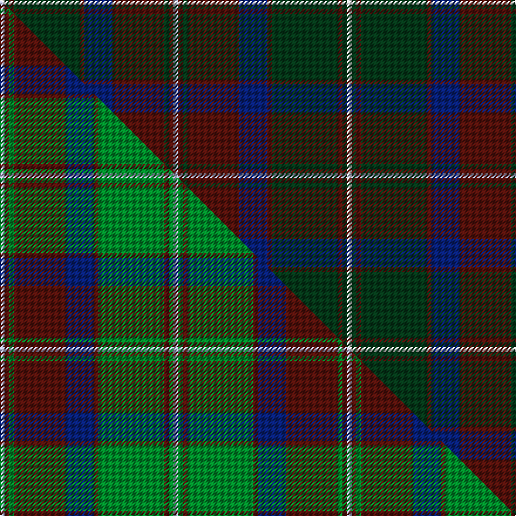

This is one **variant** — a specific cloth: this exact thread count and colourway, with its own
provenance below. It is one weaving of the [sett](/tartans/g/gl/glen-tilt/) (the scale-free proportion — the
same cloth at any scale or shade), whose colour order is pattern [WBGBBBGBGW](/stripes/wbgbbbgbgw/).

Part of the [Glen Tilt](/tartans/g/gl/glen-tilt/) tartan — the named design grouping this sett with its other cloths.

Sourced from tartans-authority.  It is a [10 stripe tartan](/stripes/stripes10/).

Original link <code>http://www.tartansauthority.com/tartan-ferret/display/2076/</code> — retired · [Internet Archive copy](https://web.archive.org/web/*/http://www.tartansauthority.com/tartan-ferret/display/2076/*)

Dataset <small>— provenance for this record, inherited from the source manifest</small>

<dl class="dataset-prov">
<dt>source</dt><dd><a href="/sources/tartans-authority/">Scottish Tartans Authority</a></dd>
<dt>data captured from</dt><dd><a href="https://github.com/thetartan/tartan-database/blob/master/data/tartans-authority/data.csv">https://github.com/thetartan/tartan-database/blob/master/data/tartans-authority/data.csv</a></dd>
<dt>data date</dt><dd>pre 1800 <small>(this record)</small></dd>
<dt>licence</dt><dd><a href="https://creativecommons.org/licenses/by-nc-nd/4.0/">CC BY-NC-ND 4.0</a></dd>
</dl>

Capture chain <small>— the hands this data passed through, oldest first; each capture carries its own licence</small>

<ol class="capture-chain">
<li><a href="https://www.tartansauthority.com/">Scottish Tartans Authority</a> <small>the heritage body’s archive — its tartan-ferret record browser is retired; dead record links are shown unlinked, with an Internet Archive copy (ITI numbers are not SRT references)</small></li>
<li><a href="https://github.com/thetartan/tartan-database">thetartan/tartan-database</a> <small>2016-2017</small> · <a href="https://creativecommons.org/licenses/by-nc-nd/4.0/">CC BY-NC-ND 4.0</a> <small>Levko Kravets's frozen compilation — the capture we vendored, and where its CC licence text came from</small></li>
<li>this dictionary <small>captured 2026-06-10 · commit 5bf86c7566</small> <small>each re-capture is a git commit to data/sources</small></li>
</ol>

## Register references

External register numbers recorded for this tartan.

- Scottish Tartans Authority (ITI): 2076

## Thread count
W/4 DG4 DR4 DG56 DR4 DB24 DR44 DG4 DR4 LB/4

One full sett is **296 threads**.

## Palette
<table><thead><tr><th>Colour</th><th>Shade</th><th>OKLCh</th></tr></thead><tbody><tr><td>DB</td><td><code style="background-color:#082077;">#082077</code> <small style="color:#888">#082077</small></td><td><small style="color:#888">oklch(30.0% 0.149 265.1)</small></td></tr><tr><td>DR</td><td><code style="background-color:#55120C;">#55120C</code> <small style="color:#888">#55120C</small></td><td><small style="color:#888">oklch(30.0% 0.099 29.3)</small></td></tr><tr><td>DG</td><td><code style="background-color:#053819;">#053819</code> <small style="color:#888">#053819</small></td><td><small style="color:#888">oklch(30.0% 0.075 151.3)</small></td></tr><tr><td>W</td><td><code style="background-color:#F7F7F7;">#F7F7F7</code> <small style="color:#888">#F7F7F7</small></td><td><small style="color:#888">oklch(97.6% 0.000 89.9)</small></td></tr><tr><td>LB</td><td><code style="background-color:#B5BBDE;">#B5BBDE</code> <small style="color:#888">#B5BBDE</small></td><td><small style="color:#888">oklch(79.9% 0.050 277.6)</small></td></tr></tbody></table>

# Sample pattern

## Compared to the master

This cloth is one sett of its design; the master sett (the exemplar the design is anchored on) is below for comparison.

Its **ΔTartan distance** from the master is **0.42** — the same measure the nearest-tartans table ranks by (0 is identical; a re-scale of the same cloth is near 0, a recolour or a different proportion further).

<figure class="master-compare" style="margin:0">

this sett
master sett ★

<figcaption style="color:#888;font-size:smaller">One weave of this sett against the <a href="/setts/lb1dr1g1dr11db6dr1g14dr1g1lb1/">master sett ★</a>, split on the diagonal: a shared proportion runs seamlessly across it with only the shades shifting; a different proportion breaks on it.</figcaption>
</figure>

## Nearest tartan variants

The nearest existing variants by ΔTartan distance, with this cloth at the top so the swatches line up against it.

ΔTartan

Threads

Variant

Sett

—

296

<a href="/variants/s10/w1dg1dr1dg14dr1db6dr11dg1dr1lb1~x4/">Glen Tilt #1 (District)</a>

<a href="/ttd/edit/#slug=db4dr24dg2dr3dg19y2dr2db8dr2dg2w2dr2~x2&amp;base=w1dg1dr1dg14dr1db6dr11dg1dr1lb1~x4" title="compare in the TTD">2.08</a>

276

<a href="/variants/s12/db4dr24dg2dr3dg19y2dr2db8dr2dg2w2dr2~x2/">Michael from Appin (Personal)</a>

<a href="/ttd/edit/#slug=dr3db2dr24db8dg2db2dg2db2dg10dr3w2~x2&amp;base=w1dg1dr1dg14dr1db6dr11dg1dr1lb1~x4" title="compare in the TTD">2.61</a>

230

<a href="/variants/s11/dr3db2dr24db8dg2db2dg2db2dg10dr3w2~x2/">Waddell (Fife), Greg</a>

<a href="/ttd/edit/#slug=dr3dy15g4db6w2dr30db6y3~x2&amp;base=w1dg1dr1dg14dr1db6dr11dg1dr1lb1~x4" title="compare in the TTD">2.92</a>

264

<a href="/variants/s8/dr3dy15g4db6w2dr30db6y3~x2/">Round Table Sweden</a>

<a href="/ttd/edit/#slug=dr26w1db10w1dg32dr11db8lb3w1~x2&amp;base=w1dg1dr1dg14dr1db6dr11dg1dr1lb1~x4" title="compare in the TTD">3.11</a>

318

<a href="/variants/s9/dr26w1db10w1dg32dr11db8lb3w1~x2/">Spens/Spence (Clan)</a>

<a href="/ttd/edit/#slug=w2t4dy3dt3dy3dt20dy3t16dt8lb2~x2~t2102222-dt1102249&amp;base=w1dg1dr1dg14dr1db6dr11dg1dr1lb1~x4" title="compare in the TTD">3.26</a>

248

<a href="/variants/s10/w2t4dy3dt3dy3dt20dy3t16dt8lb2~x2~t2102222-dt1102249/">Sverker</a>

<a href="/ttd/edit/#slug=g7ly2g5dg37db6dr16db5t2~x2&amp;base=w1dg1dr1dg14dr1db6dr11dg1dr1lb1~x4" title="compare in the TTD">3.27</a>

302

<a href="/variants/s8/g7ly2g5dg37db6dr16db5t2~x2/">Telfer Green (Name)</a>

<a href="/ttd/edit/#slug=dr3r1db1dr1dg13dr3db4lb1dr16dg2dr2r1dg3~x2&amp;base=w1dg1dr1dg14dr1db6dr11dg1dr1lb1~x4" title="compare in the TTD">3.32</a>

192

<a href="/variants/s13/dr3r1db1dr1dg13dr3db4lb1dr16dg2dr2r1dg3~x2/">MacDonald of Glencoe</a>

<a href="/ttd/edit/#slug=w1dy2dr15db2dr2db15dr2g15dr2db2dr15dy2w1~x2&amp;base=w1dg1dr1dg14dr1db6dr11dg1dr1lb1~x4" title="compare in the TTD">3.32</a>

300

<a href="/variants/s13/w1dy2dr15db2dr2db15dr2g15dr2db2dr15dy2w1~x2/">Robbie (Stirling) (Personal)</a>

<a href="/ttd/edit/#slug=db4dr4dt44w6dt5dy4dt3dy8dt3dy16db4dr22w4~db1106275-dt1204274&amp;base=w1dg1dr1dg14dr1db6dr11dg1dr1lb1~x4" title="compare in the TTD">3.39</a>

246

<a href="/variants/s13/db4dr4dbi44w6dbi5dy4dbi3dy8dbi3dy16db4dr22w4~db1106275-dbi1204274/">Largs District Tartan</a>

<a href="/ttd/edit/#slug=g1dr7g7n2dr1dg15lb1~x4&amp;base=w1dg1dr1dg14dr1db6dr11dg1dr1lb1~x4" title="compare in the TTD">3.50</a>

264

<a href="/variants/s7/g1dr7g7n2dr1dg15lb1~x4/">Ramsay (Green Fashion)</a>

## Neighbour map

Every grey dot is one of 13656 variants placed by the first two principal components of the ΔTartan feature space (42% of its variance). Red is this tartan; blue dots are its nearest — click one to open its page. The map is a flat projection of a many-dimensional space — [how to read it](/posts/neighbourhood-maps/).

<svg viewBox="0 0 640 380" role="img" style="max-width:100%;height:auto;border:1px solid #e0e0e0;border-radius:4px;display:block" xmlns="http://www.w3.org/2000/svg"><image href="/nn/cloud.v1.png" width="640" height="380"/><a href="/variants/s12/db4dr24dg2dr3dg19y2dr2db8dr2dg2w2dr2~x2/"><circle cx="345.3" cy="181.7" r="4" fill="#3465a4"><title>Michael from Appin (Personal)</title></circle></a><a href="/variants/s11/dr3db2dr24db8dg2db2dg2db2dg10dr3w2~x2/"><circle cx="375.9" cy="196.4" r="4" fill="#3465a4"><title>Waddell (Fife), Greg</title></circle></a><a href="/variants/s8/dr3dy15g4db6w2dr30db6y3~x2/"><circle cx="320.5" cy="179.9" r="4" fill="#3465a4"><title>Round Table Sweden</title></circle></a><a href="/variants/s9/dr26w1db10w1dg32dr11db8lb3w1~x2/"><circle cx="320.4" cy="161.6" r="4" fill="#3465a4"><title>Spens/Spence (Clan)</title></circle></a><a href="/variants/s10/w2t4dy3dt3dy3dt20dy3t16dt8lb2~x2~t2102222-dt1102249/"><circle cx="309.7" cy="205.2" r="4" fill="#3465a4"><title>Sverker</title></circle></a><a href="/variants/s8/g7ly2g5dg37db6dr16db5t2~x2/"><circle cx="312.8" cy="173.6" r="4" fill="#3465a4"><title>Telfer Green (Name)</title></circle></a><a href="/variants/s13/dr3r1db1dr1dg13dr3db4lb1dr16dg2dr2r1dg3~x2/"><circle cx="388.6" cy="165.5" r="4" fill="#3465a4"><title>MacDonald of Glencoe</title></circle></a><a href="/variants/s13/w1dy2dr15db2dr2db15dr2g15dr2db2dr15dy2w1~x2/"><circle cx="292.6" cy="163.5" r="4" fill="#3465a4"><title>Robbie (Stirling) (Personal)</title></circle></a><a href="/variants/s13/db4dr4dbi44w6dbi5dy4dbi3dy8dbi3dy16db4dr22w4~db1106275-dbi1204274/"><circle cx="278.0" cy="160.3" r="4" fill="#3465a4"><title>Largs District Tartan</title></circle></a><a href="/variants/s7/g1dr7g7n2dr1dg15lb1~x4/"><circle cx="320.9" cy="209.3" r="4" fill="#3465a4"><title>Ramsay (Green Fashion)</title></circle></a><circle cx="331.0" cy="181.0" r="5" fill="#c00000"/><text x="320" y="376" text-anchor="middle" font-size="11" fill="#999">ground</text><text x="11" y="190" text-anchor="middle" font-size="11" fill="#999" transform="rotate(-90 11 190)">complexity</text></svg>

ID: /variants/s10/w1dg1dr1dg14dr1db6dr11dg1dr1lb1~x4/
