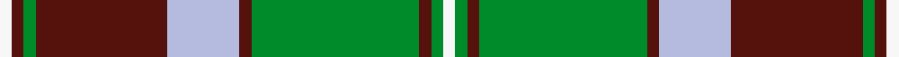
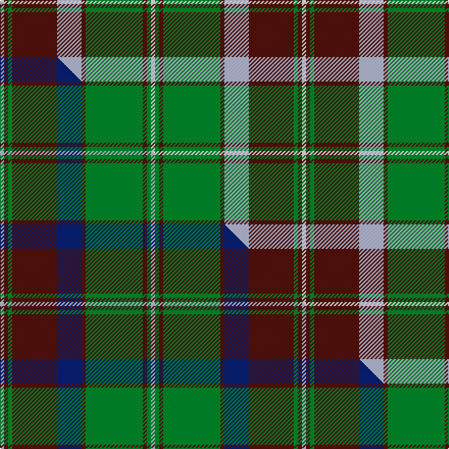

This page is one **sett** — a single exact thread-count. It belongs to the [tartan](/setts/w1dr1g1dr11lb6dr1g14dr1g1w1/)
(the same proportion at any scale), whose colour order is pattern [WBGBWBGBGW](/stripes/wbgbwbgbgw/).

Part of the [Glen Tilt](/tartans/glen-tilt/) tartan — the named design grouping this sett with its other cloths.

Sourced from register-of-tartans.  It is a [10 stripe tartan](/stripes/stripes10/).

Original link https://www.tartanregister.gov.uk/tartanDetails.aspx?ref=1400

## Register references

External register numbers recorded for this tartan.

- Scottish Register of Tartans: [1400](https://www.tartanregister.gov.uk/tartanDetails.aspx?ref=1400)
- Scottish Tartans Authority (ITI): 4758

## Thread count
W/4 DR4 G4 DR44 LB24 DR4 G56 DR4 G4 W/4

One full sett is **296 threads**.

## Palette
<table><thead><tr><th>Colour</th><th>Shade</th><th>OKLCh</th></tr></thead><tbody><tr><td>LB</td><td><code style="background-color:#B5BBDE;">#B5BBDE</code> <small style="color:#888">#B5BBDE</small></td><td><small style="color:#888">oklch(79.9% 0.050 277.6)</small></td></tr><tr><td>DR</td><td><code style="background-color:#55120C;">#55120C</code> <small style="color:#888">#55120C</small></td><td><small style="color:#888">oklch(30.0% 0.099 29.3)</small></td></tr><tr><td>G</td><td><code style="background-color:#008B2A;">#008B2A</code> <small style="color:#888">#008B2A</small></td><td><small style="color:#888">oklch(55.4% 0.170 145.9)</small></td></tr><tr><td>W</td><td><code style="background-color:#F7F7F7;">#F7F7F7</code> <small style="color:#888">#F7F7F7</small></td><td><small style="color:#888">oklch(97.6% 0.000 89.9)</small></td></tr></tbody></table>

# Sample pattern

## Compared to the master

This cloth is one sett of its design; the master sett (the exemplar the design is anchored on) is below for comparison.

Its **ΔTartan distance** from the master is **0.98** — the same measure the nearest-tartans table ranks by (0 is identical; a re-scale of the same cloth is near 0, a recolour or a different proportion further).

<figure class="master-compare" style="margin:0">

this sett
master sett ★

<figcaption style="color:#888;font-size:smaller">One weave of this sett against the <a href="/setts/lb1dr1g1dr11db6dr1g14dr1g1lb1/">master sett ★</a>, split on the diagonal: a shared proportion runs seamlessly across it with only the shades shifting; a different proportion breaks on it.</figcaption>
</figure>

## Nearest tartan variants

The nearest existing variants by ΔTartan distance, with this cloth at the top so the swatches line up against it.

ΔTartan

Threads

Variant

Sett

—

296

<a href="/variants/s10/w1dr1g1dr11lb6dr1g14dr1g1w1~x4/">Glen Tilt #2</a>

<a href="/ttd/edit/#slug=w1r1g1r11db6r1g14r1g1w1~x4&amp;base=w1dr1g1dr11lb6dr1g14dr1g1w1~x4" title="compare in the TTD">0.00</a>

296

<a href="/variants/s10/w1r1g1r11db6r1g14r1g1w1~x4/">Unidentified Specimen #2</a>

<a href="/ttd/edit/#slug=lb1dr1g1dr11db6dr1g14dr1g1lb1~x4&amp;base=w1dr1g1dr11lb6dr1g14dr1g1w1~x4" title="compare in the TTD">0.60</a>

296

<a href="/variants/s10/lb1dr1g1dr11db6dr1g14dr1g1lb1~x4/">Glen Tilt #1</a>

<a href="/ttd/edit/#slug=r4lb3r32db30r4g32r3g32r3g3~x2&amp;base=w1dr1g1dr11lb6dr1g14dr1g1w1~x4" title="compare in the TTD">2.32</a>

570

<a href="/variants/s10/r4lb3r32db30r4g32r3g32r3g3~x2/">Unidentified Plaid #15</a>

<a href="/ttd/edit/#slug=g22dr2g4dr2g4dr18w24dr1lo3~x2&amp;base=w1dr1g1dr11lb6dr1g14dr1g1w1~x4" title="compare in the TTD">2.41</a>

270

<a href="/variants/s9/g22dr2g4dr2g4dr18w24dr1lo3~x2/">Prince Edward Island, Dress</a>

## Neighbour map

Every grey dot is one of 13620 variants placed by the first two principal components of the ΔTartan feature space (42% of its variance). Red is this tartan; blue dots are its nearest — click one to open its page.

<svg viewBox="0 0 640 380" role="img" style="max-width:100%;height:auto;border:1px solid #e0e0e0;border-radius:4px;display:block" xmlns="http://www.w3.org/2000/svg"><image href="/nn/cloud.v1.png" width="640" height="380"/><a href="/variants/s10/w1r1g1r11db6r1g14r1g1w1~x4/"><circle cx="253.1" cy="152.7" r="4" fill="#3465a4"><title>Unidentified Specimen #2</title></circle></a><a href="/variants/s10/lb1dr1g1dr11db6dr1g14dr1g1lb1~x4/"><circle cx="291.9" cy="177.9" r="4" fill="#3465a4"><title>Glen Tilt #1</title></circle></a><a href="/variants/s10/r4lb3r32db30r4g32r3g32r3g3~x2/"><circle cx="252.9" cy="184.4" r="4" fill="#3465a4"><title>Unidentified Plaid #15</title></circle></a><a href="/variants/s9/g22dr2g4dr2g4dr18w24dr1lo3~x2/"><circle cx="233.5" cy="164.2" r="4" fill="#3465a4"><title>Prince Edward Island, Dress</title></circle></a><circle cx="269.4" cy="170.9" r="5" fill="#c00000"/><text x="320" y="376" text-anchor="middle" font-size="11" fill="#999">ground</text><text x="11" y="190" text-anchor="middle" font-size="11" fill="#999" transform="rotate(-90 11 190)">complexity</text></svg>

ID: /variants/s10/w1dr1g1dr11lb6dr1g14dr1g1w1~x4/
