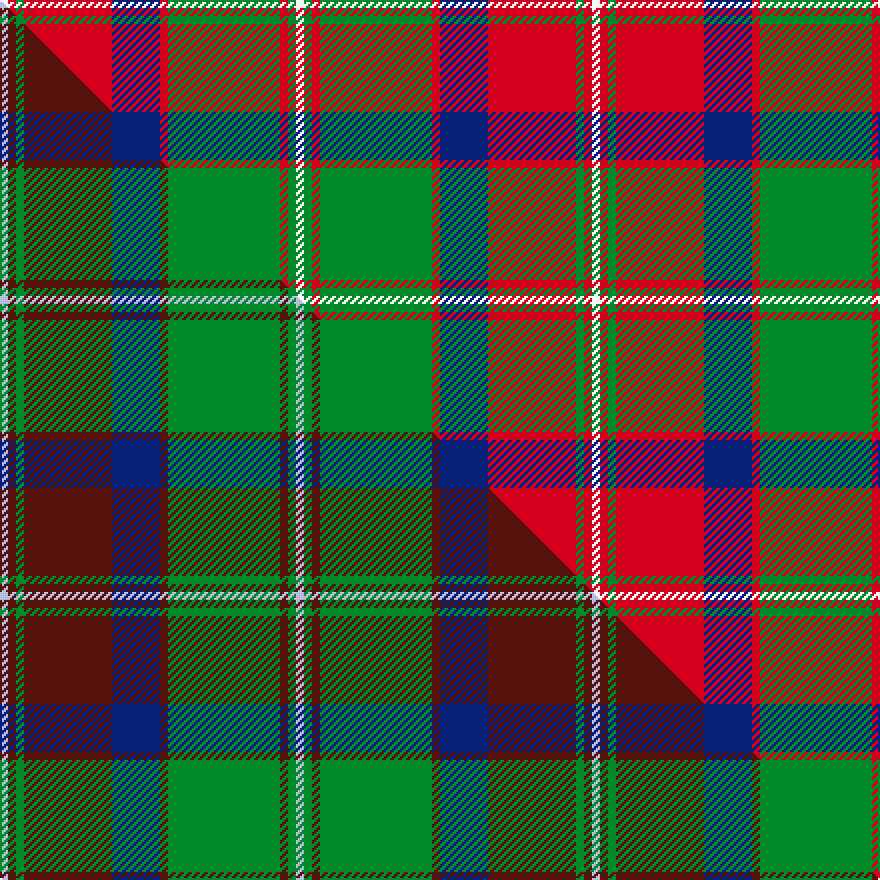

This is one **variant** — a specific cloth: this exact thread count and colourway, with its own
provenance below. It is one weaving of the [sett](/setts/w1r1g1r11db6r1g14r1g1w1/) (the scale-free proportion — the
same cloth at any scale or shade), whose colour order is pattern [WGRGRBRGRW](/stripes/wgrgrbrgrw/).

Part of the [Glen Tilt](/tartans/g/gl/glen-tilt/) tartan — the named design grouping this sett with its other cloths.

Sourced from house-of-tartan.  It is a [10 stripe tartan](/stripes/stripes10/).

Original link [http://www.house-of-tartan.scotland.net/house/TartanViewjs.asp?colr=Def&tnam=2076](http://www.house-of-tartan.scotland.net/house/TartanViewjs.asp?colr=Def&tnam=2076)

## Provenance

Earliest known date: pre 1923 Recorded as having been woven at 'Clunes Farm' which is probably Clunes Lodge near the southern entrance to Glen Tilt. The thread count is taken from a home-woven, home dyed sample in the archives of Perth museum.

4 attestations — the source records this cloth was collapsed from (oldest owns this page)

<ul>
<li>pre 1923 — Glen Tilt District Tartan (house-of-tartan, <a href="http://www.house-of-tartan.scotland.net/house/TartanViewjs.asp?colr=Def&tnam=2076">record</a>) </li>
<li>undated — Unidentified Specimen #2 (register-of-tartans, <a href="https://www.tartanregister.gov.uk/tartanDetails.aspx?ref=4387">record</a>)  <em>Said to have been made at Clunes Farm, Perthshire.</em></li>
<li>undated — Glen Tilt (weddslist, <a href="http://www.weddslist.com/cgi-bin/tartans/pg.pl?source=sts">record</a>) </li>
<li>undated — Unidentified, Specimen (weddslist, <a href="http://www.weddslist.com/cgi-bin/tartans/pg.pl?source=sts">record</a>) </li>
</ul>

Dataset <small>— provenance for this record, inherited from the source manifest</small>

<dl class="dataset-prov">
<dt>source</dt><dd><a href="/sources/house-of-tartan/">House of Tartan</a></dd>
<dt>data captured from</dt><dd><a href="https://github.com/thetartan/tartan-database/blob/master/data/house-of-tartan/data.csv">https://github.com/thetartan/tartan-database/blob/master/data/house-of-tartan/data.csv</a></dd>
<dt>data date</dt><dd>pre 1923 <small>(this record)</small></dd>
<dt>licence</dt><dd><a href="https://creativecommons.org/licenses/by-nc-nd/4.0/">CC BY-NC-ND 4.0</a></dd>
</dl>

Capture chain <small>— the hands this data passed through, oldest first; each capture carries its own licence</small>

<ol class="capture-chain">
<li><a href="http://www.house-of-tartan.scotland.net/">House of Tartan</a> <small>the weaver/retailer's database — the site is now offline; the URL is kept as the ultimate source's identity</small></li>
<li><a href="https://github.com/thetartan/tartan-database">thetartan/tartan-database</a> <small>2016-2017</small> · <a href="https://creativecommons.org/licenses/by-nc-nd/4.0/">CC BY-NC-ND 4.0</a> <small>Levko Kravets's frozen compilation — the capture we vendored, and where its CC licence text came from</small></li>
<li>this dictionary <small>captured 2026-06-10 · commit 5bf86c7566</small> <small>each re-capture is a git commit to data/sources</small></li>
</ol>

## Register references

External register numbers recorded for this tartan.

- Scottish Register of Tartans: [4387](https://www.tartanregister.gov.uk/tartanDetails.aspx?ref=4387)
- Scottish Tartans World Register: 1807

## Thread count
W/4 R4 G4 R44 DB24 R4 G56 R4 G4 W/4

One full sett is **296 threads**.

## Palette
<table><thead><tr><th>Colour</th><th>Shade</th><th>OKLCh</th></tr></thead><tbody><tr><td>DB</td><td><code style="background-color:#082077;">#082077</code> <small style="color:#888">#082077</small></td><td><small style="color:#888">oklch(30.0% 0.149 265.1)</small></td></tr><tr><td>G</td><td><code style="background-color:#008B2A;">#008B2A</code> <small style="color:#888">#008B2A</small></td><td><small style="color:#888">oklch(55.4% 0.170 145.9)</small></td></tr><tr><td>W</td><td><code style="background-color:#F7F7F7;">#F7F7F7</code> <small style="color:#888">#F7F7F7</small></td><td><small style="color:#888">oklch(97.6% 0.000 89.9)</small></td></tr><tr><td>R</td><td><code style="background-color:#D60020;">#D60020</code> <small style="color:#888">#D60020</small></td><td><small style="color:#888">oklch(55.2% 0.224 25.5)</small></td></tr></tbody></table>

# Sample pattern

## Compared to the master

This cloth is one sett of its design; the master sett (the exemplar the design is anchored on) is below for comparison.

Its **ΔTartan distance** from the master is **0.67** — the same measure the nearest-tartans table ranks by (0 is identical; a re-scale of the same cloth is near 0, a recolour or a different proportion further).

<figure class="master-compare" style="margin:0">

this sett
master sett ★

<figcaption style="color:#888;font-size:smaller">One weave of this sett against the <a href="/setts/lb1dr1g1dr11db6dr1g14dr1g1lb1/">master sett ★</a>, split on the diagonal: a shared proportion runs seamlessly across it with only the shades shifting; a different proportion breaks on it.</figcaption>
</figure>

## Nearest tartan variants

The nearest existing variants by ΔTartan distance, with this cloth at the top so the swatches line up against it.

ΔTartan

Threads

Variant

Sett

—

296

<a href="/variants/s10/w1r1g1r11db6r1g14r1g1w1~x4/">Glen Tilt District Tartan</a>

<a href="/ttd/edit/#slug=w1dr1g1dr11lb6dr1g14dr1g1w1~x4&amp;base=w1r1g1r11db6r1g14r1g1w1~x4" title="compare in the TTD">0.21</a>

296

<a href="/variants/s10/w1dr1g1dr11lb6dr1g14dr1g1w1~x4/">Glen Tilt #2</a>

<a href="/ttd/edit/#slug=g3r9lb1g9r1g1r8db9r1~x4&amp;base=w1r1g1r11db6r1g14r1g1w1~x4" title="compare in the TTD">1.45</a>

320

<a href="/variants/s9/g3r9lb1g9r1g1r8db9r1~x4/">Baronage</a>

<a href="/ttd/edit/#slug=g12w1r1w4r1w1r8dy2r1~x4&amp;base=w1r1g1r11db6r1g14r1g1w1~x4" title="compare in the TTD">2.10</a>

196

<a href="/variants/s9/g12w1r1w4r1w1r8dy2r1~x4/">Karibu (Corporate)</a>

<a href="/ttd/edit/#slug=r3dr14g8r2g2w2g2r1~x2&amp;base=w1r1g1r11db6r1g14r1g1w1~x4" title="compare in the TTD">2.13</a>

128

<a href="/variants/s8/r3dr14g8r2g2w2g2r1~x2/">Scott Hunting Clan Tartan</a>

<a href="/ttd/edit/#slug=r30db3r2db3r6db14g26dg6~g2408144-dg1806142&amp;base=w1r1g1r11db6r1g14r1g1w1~x4" title="compare in the TTD">2.28</a>

144

<a href="/variants/s8/r30db3r2db3r6db14g26dg6~g2408144-dg1806142/">Cranston Dress Family Tartan</a>

<a href="/ttd/edit/#slug=g20db2g2db2g2db8r24db2r3&amp;base=w1r1g1r11db6r1g14r1g1w1~x4" title="compare in the TTD">2.29</a>

107

<a href="/variants/s9/g20db2g2db2g2db8r24db2r3/">Lindsay</a>

<a href="/ttd/edit/#slug=g20db2g2db2g2db8r24db2r3~x2&amp;base=w1r1g1r11db6r1g14r1g1w1~x4" title="compare in the TTD">2.29</a>

214

<a href="/variants/s9/g20db2g2db2g2db8r24db2r3~x2/">Lindsay</a>

<a href="/ttd/edit/#slug=g12w1r1w4r1w1r8y2r1~x4&amp;base=w1r1g1r11db6r1g14r1g1w1~x4" title="compare in the TTD">2.29</a>

196

<a href="/variants/s9/g12w1r1w4r1w1r8y2r1~x4/">Karibu</a>

<a href="/ttd/edit/#slug=g3r2db2r14t1db4r2g12r2db2~x8&amp;base=w1r1g1r11db6r1g14r1g1w1~x4" title="compare in the TTD">2.30</a>

664

<a href="/variants/s10/g3r2db2r14t1db4r2g12r2db2~x8/">MacKillop (Clan)</a>

<a href="/ttd/edit/#slug=db4r17db4g4db2g4db4g27db4ly4~x2&amp;base=w1r1g1r11db6r1g14r1g1w1~x4" title="compare in the TTD">2.30</a>

280

<a href="/variants/s10/db4r17db4g4db2g4db4g27db4ly4~x2/">Cape Breton University</a>

## Neighbour map

Every grey dot is one of 13621 variants placed by the first two principal components of the ΔTartan feature space (42% of its variance). Red is this tartan; blue dots are its nearest — click one to open its page.

<svg viewBox="0 0 640 380" role="img" style="max-width:100%;height:auto;border:1px solid #e0e0e0;border-radius:4px;display:block" xmlns="http://www.w3.org/2000/svg"><image href="/nn/cloud.v1.png" width="640" height="380"/><a href="/variants/s10/w1dr1g1dr11lb6dr1g14dr1g1w1~x4/"><circle cx="269.5" cy="171.2" r="4" fill="#3465a4"><title>Glen Tilt #2</title></circle></a><a href="/variants/s9/g3r9lb1g9r1g1r8db9r1~x4/"><circle cx="238.7" cy="202.6" r="4" fill="#3465a4"><title>Baronage</title></circle></a><a href="/variants/s9/g12w1r1w4r1w1r8dy2r1~x4/"><circle cx="218.0" cy="169.6" r="4" fill="#3465a4"><title>Karibu (Corporate)</title></circle></a><a href="/variants/s8/r3dr14g8r2g2w2g2r1~x2/"><circle cx="242.1" cy="175.5" r="4" fill="#3465a4"><title>Scott Hunting Clan Tartan</title></circle></a><a href="/variants/s8/r30db3r2db3r6db14g26dg6~g2408144-dg1806142/"><circle cx="242.0" cy="179.6" r="4" fill="#3465a4"><title>Cranston Dress Family Tartan</title></circle></a><a href="/variants/s9/g20db2g2db2g2db8r24db2r3/"><circle cx="277.5" cy="183.7" r="4" fill="#3465a4"><title>Lindsay</title></circle></a><a href="/variants/s9/g20db2g2db2g2db8r24db2r3~x2/"><circle cx="277.5" cy="183.7" r="4" fill="#3465a4"><title>Lindsay</title></circle></a><a href="/variants/s9/g12w1r1w4r1w1r8y2r1~x4/"><circle cx="226.3" cy="172.7" r="4" fill="#3465a4"><title>Karibu</title></circle></a><a href="/variants/s10/g3r2db2r14t1db4r2g12r2db2~x8/"><circle cx="271.0" cy="168.1" r="4" fill="#3465a4"><title>MacKillop (Clan)</title></circle></a><a href="/variants/s10/db4r17db4g4db2g4db4g27db4ly4~x2/"><circle cx="263.8" cy="172.8" r="4" fill="#3465a4"><title>Cape Breton University</title></circle></a><circle cx="253.1" cy="153.0" r="5" fill="#c00000"/><text x="320" y="376" text-anchor="middle" font-size="11" fill="#999">ground</text><text x="11" y="190" text-anchor="middle" font-size="11" fill="#999" transform="rotate(-90 11 190)">complexity</text></svg>

ID: /variants/s10/w1r1g1r11db6r1g14r1g1w1~x4/
