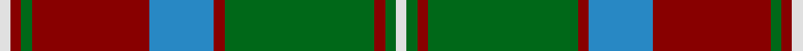

This page is one **sett** — a single exact thread-count. It belongs to the [tartan](/setts/w1r1g1r11t6r1g14r1g1w1/)
(the same proportion at any scale), whose colour order is pattern [WGRGRBRGRW](/stripes/wgrgrbrgrw/).

Sourced from register-of-tartans.  It is a [10 stripe tartan](/stripes/stripes10/).

Original link https://www.tartanregister.gov.uk/tartanDetails.aspx?ref=1400

## Register references

External register numbers recorded for this tartan.

- Scottish Register of Tartans: [1400](https://www.tartanregister.gov.uk/tartanDetails.aspx?ref=1400)
- Scottish Tartans Authority (ITI): 4758

## Thread count
LN/4 DR4 G4 DR44 B24 DR4 G56 DR4 G4 LN/4

One full sett is **296 threads**.

## Palette

Palette: <strong>Tartan Register</strong>
<table><thead><tr><th>Colour</th><th>Threads</th><th>Shade</th><th>Base</th><th>OKLCh</th></tr></thead><tbody><tr><td>LN/</td><td style="text-align:right;font-variant-numeric:tabular-nums">4</td><td><code style="background-color:#E0E0E0;">#E0E0E0</code> <small style="color:#888">#E0E0E0</small></td><td>W <code style="background-color:#F7F7F7;">#F7F7F7</code></td><td><small style="color:#888">oklch(90.7% 0.000 89.9)</small></td></tr><tr><td>DR</td><td style="text-align:right;font-variant-numeric:tabular-nums">4</td><td><code style="background-color:#880000;">#880000</code> <small style="color:#888">#880000</small></td><td>R <code style="background-color:#CC0000;">#CC0000</code></td><td><small style="color:#888">oklch(39.4% 0.162 29.2)</small></td></tr><tr><td>G</td><td style="text-align:right;font-variant-numeric:tabular-nums">4</td><td><code style="background-color:#006818;">#006818</code> <small style="color:#888">#006818</small></td><td>G <code style="background-color:#006100;">#006100</code></td><td><small style="color:#888">oklch(45.0% 0.142 145.0)</small></td></tr><tr><td>DR</td><td style="text-align:right;font-variant-numeric:tabular-nums">44</td><td><code style="background-color:#880000;">#880000</code> <small style="color:#888">#880000</small></td><td>R <code style="background-color:#CC0000;">#CC0000</code></td><td><small style="color:#888">oklch(39.4% 0.162 29.2)</small></td></tr><tr><td>B</td><td style="text-align:right;font-variant-numeric:tabular-nums">24</td><td><code style="background-color:#2888C4;">#2888C4</code> <small style="color:#888">#2888C4</small></td><td>B <code style="background-color:#2A418A;">#2A418A</code></td><td><small style="color:#888">oklch(60.1% 0.125 241.5)</small></td></tr><tr><td>DR</td><td style="text-align:right;font-variant-numeric:tabular-nums">4</td><td><code style="background-color:#880000;">#880000</code> <small style="color:#888">#880000</small></td><td>R <code style="background-color:#CC0000;">#CC0000</code></td><td><small style="color:#888">oklch(39.4% 0.162 29.2)</small></td></tr><tr><td>G</td><td style="text-align:right;font-variant-numeric:tabular-nums">56</td><td><code style="background-color:#006818;">#006818</code> <small style="color:#888">#006818</small></td><td>G <code style="background-color:#006100;">#006100</code></td><td><small style="color:#888">oklch(45.0% 0.142 145.0)</small></td></tr><tr><td>DR</td><td style="text-align:right;font-variant-numeric:tabular-nums">4</td><td><code style="background-color:#880000;">#880000</code> <small style="color:#888">#880000</small></td><td>R <code style="background-color:#CC0000;">#CC0000</code></td><td><small style="color:#888">oklch(39.4% 0.162 29.2)</small></td></tr><tr><td>G</td><td style="text-align:right;font-variant-numeric:tabular-nums">4</td><td><code style="background-color:#006818;">#006818</code> <small style="color:#888">#006818</small></td><td>G <code style="background-color:#006100;">#006100</code></td><td><small style="color:#888">oklch(45.0% 0.142 145.0)</small></td></tr><tr><td>LN/</td><td style="text-align:right;font-variant-numeric:tabular-nums">4</td><td><code style="background-color:#E0E0E0;">#E0E0E0</code> <small style="color:#888">#E0E0E0</small></td><td>W <code style="background-color:#F7F7F7;">#F7F7F7</code></td><td><small style="color:#888">oklch(90.7% 0.000 89.9)</small></td></tr></tbody></table>

## Nearest tartans

The nearest existing variants by ΔTartan distance, with this tartan at the top so the swatches line up against it.

ΔTartan

Tartan

Sett

—

<a href="/ttd/edit/#slug=w1r1g1r11t6r1g14r1g1w1~x4">Glen Tilt #2</a> <a class="nn-out" href="/variants/s10/w1r1g1r11t6r1g14r1g1w1~x4/" title="open its dictionary page">↗</a>

0.67

<a href="/ttd/edit/#slug=w1r1g1r11db6r1g14r1g1w1~x4&amp;base=w1r1g1r11t6r1g14r1g1w1~x4">Glen Tilt</a> <a class="nn-out" href="/variants/s10/w1r1g1r11db6r1g14r1g1w1~x4/" title="open its dictionary page">↗</a>

0.91

<a href="/ttd/edit/#slug=db4o17db4g4db2g4db4g27db4ly4~x2&amp;base=w1r1g1r11t6r1g14r1g1w1~x4">Cape Breton University</a> <a class="nn-out" href="/variants/s10/db4o17db4g4db2g4db4g27db4ly4~x2/" title="open its dictionary page">↗</a>

0.96

<a href="/ttd/edit/#slug=r4t3r32db30r4g32r3g32r3g3~x2&amp;base=w1r1g1r11t6r1g14r1g1w1~x4">Unidentified Plaid 6</a> <a class="nn-out" href="/variants/s10/r4t3r32db30r4g32r3g32r3g3~x2/" title="open its dictionary page">↗</a>

0.97

<a href="/ttd/edit/#slug=g36k2g2k2g3k12t10r20~x2&amp;base=w1r1g1r11t6r1g14r1g1w1~x4">Georgia, State of</a> <a class="nn-out" href="/variants/s8/g36k2g2k2g3k12t10r20~x2/" title="open its dictionary page">↗</a>

0.98

<a href="/ttd/edit/#slug=lo15k1lo2k1lo2k10y14w2~x2&amp;base=w1r1g1r11t6r1g14r1g1w1~x4">Buccleuch (Fashion)</a> <a class="nn-out" href="/variants/s8/lo15k1lo2k1lo2k10y14w2~x2/" title="open its dictionary page">↗</a>

0.99

<a href="/ttd/edit/#slug=lb1dr1g1dr11db6dr1g14dr1g1lb1~x4&amp;base=w1r1g1r11t6r1g14r1g1w1~x4">Glen Tilt #1</a> <a class="nn-out" href="/variants/s10/lb1dr1g1dr11db6dr1g14dr1g1lb1~x4/" title="open its dictionary page">↗</a>

0.99

<a href="/ttd/edit/#slug=lo15k1lo2k1lo2k10dy14w2~x2&amp;base=w1r1g1r11t6r1g14r1g1w1~x4">Buccleuch Weavers Tartan</a> <a class="nn-out" href="/variants/s8/lo15k1lo2k1lo2k10dy14w2~x2/" title="open its dictionary page">↗</a>

1.00

<a href="/ttd/edit/#slug=r6g3k3o24g4k10g4r2g24r6g2~x2&amp;base=w1r1g1r11t6r1g14r1g1w1~x4">MacNeish Htg</a> <a class="nn-out" href="/variants/s11/r6g3k3o24g4k10g4r2g24r6g2~x2/" title="open its dictionary page">↗</a>

1.01

<a href="/ttd/edit/#slug=w1dg1r1dg14r1db6r11dg1r1w1~x4&amp;base=w1r1g1r11t6r1g14r1g1w1~x4">Unidentified Specimen #2</a> <a class="nn-out" href="/variants/s10/w1dg1r1dg14r1db6r11dg1r1w1~x4/" title="open its dictionary page">↗</a>

1.06

<a href="/ttd/edit/#slug=db4o17db4y4db2y4db4y27db4ly4~x2&amp;base=w1r1g1r11t6r1g14r1g1w1~x4">Cape Breton University Chemistry Society</a> <a class="nn-out" href="/variants/s10/db4o17db4y4db2y4db4y27db4ly4~x2/" title="open its dictionary page">↗</a>

## Neighbour map

Every grey dot is one of 14360 variants placed by the first two principal components of the ΔTartan feature space (44% of its variance). Red is this tartan; blue dots are its nearest — click one to open its page.

<svg viewBox="0 0 640 380" role="img" style="max-width:100%;height:auto;border:1px solid #e0e0e0;border-radius:4px;display:block" xmlns="http://www.w3.org/2000/svg"><image href="/nn/cloud.v1.png" width="640" height="380"/><a href="/variants/s10/w1r1g1r11db6r1g14r1g1w1~x4/"><circle cx="259.2" cy="144.8" r="4" fill="#3465a4"><title>Glen Tilt</title></circle></a><a href="/variants/s10/db4o17db4g4db2g4db4g27db4ly4~x2/"><circle cx="250.9" cy="159.9" r="4" fill="#3465a4"><title>Cape Breton University</title></circle></a><a href="/variants/s10/r4t3r32db30r4g32r3g32r3g3~x2/"><circle cx="260.7" cy="183.6" r="4" fill="#3465a4"><title>Unidentified Plaid 6</title></circle></a><a href="/variants/s8/g36k2g2k2g3k12t10r20~x2/"><circle cx="273.2" cy="166.1" r="4" fill="#3465a4"><title>Georgia, State of</title></circle></a><a href="/variants/s8/lo15k1lo2k1lo2k10y14w2~x2/"><circle cx="229.8" cy="169.6" r="4" fill="#3465a4"><title>Buccleuch (Fashion)</title></circle></a><a href="/variants/s10/lb1dr1g1dr11db6dr1g14dr1g1lb1~x4/"><circle cx="267.3" cy="160.9" r="4" fill="#3465a4"><title>Glen Tilt #1</title></circle></a><a href="/variants/s8/lo15k1lo2k1lo2k10dy14w2~x2/"><circle cx="229.3" cy="169.8" r="4" fill="#3465a4"><title>Buccleuch Weavers Tartan</title></circle></a><a href="/variants/s11/r6g3k3o24g4k10g4r2g24r6g2~x2/"><circle cx="234.6" cy="178.4" r="4" fill="#3465a4"><title>MacNeish Htg</title></circle></a><a href="/variants/s10/w1dg1r1dg14r1db6r11dg1r1w1~x4/"><circle cx="259.3" cy="142.5" r="4" fill="#3465a4"><title>Unidentified Specimen #2</title></circle></a><a href="/variants/s10/db4o17db4y4db2y4db4y27db4ly4~x2/"><circle cx="280.5" cy="176.0" r="4" fill="#3465a4"><title>Cape Breton University Chemistry Society</title></circle></a><circle cx="266.4" cy="154.1" r="5" fill="#c00000"/></svg>

ID: /variants/s10/w1r1g1r11t6r1g14r1g1w1~x4/
