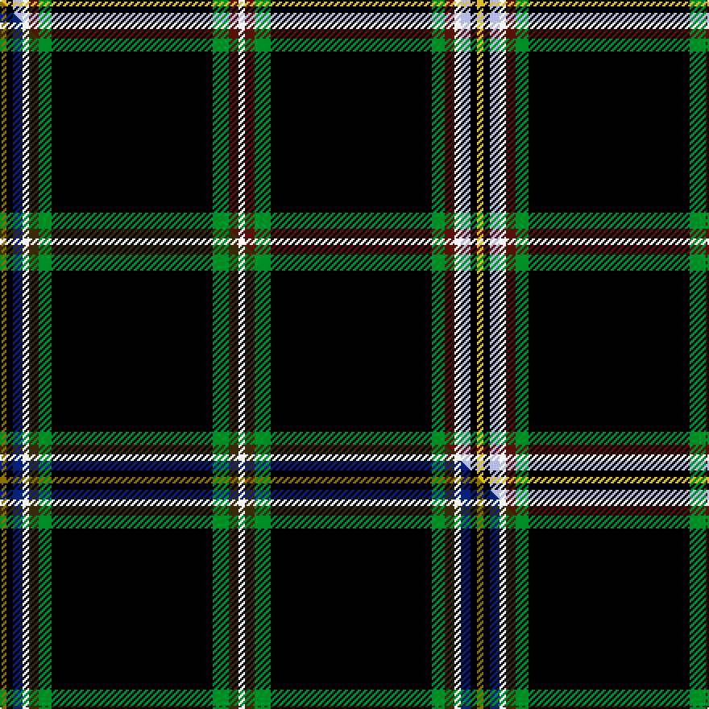

This page is one **sett** — a single exact thread-count. It belongs to the [tartan](/setts/w2dr3g5k50g4dr3w2lb3k2ly2/)
(the same proportion at any scale), whose colour order is pattern [WBGKGBWWKY](/stripes/wbgkgbwwky/).

Part of the [Hawes](/tartans/hawes/) tartan — the named design grouping this sett with its other cloths.

Sourced from tartans-authority.  It is a [10 stripe tartan](/stripes/stripes10/).

Original link [https://www.tartanregister.gov.uk/tartanDetails.aspx?ref=8357](https://www.tartanregister.gov.uk/tartanDetails.aspx?ref=8357)

Dataset <small>— provenance for this record, inherited from the source manifest</small>

<dl class="dataset-prov">
<dt>source</dt><dd><a href="/sources/tartans-authority/">Scottish Tartans Authority</a></dd>
<dt>data captured from</dt><dd><a href="https://github.com/thetartan/tartan-database/blob/master/data/tartans-authority/data.csv">https://github.com/thetartan/tartan-database/blob/master/data/tartans-authority/data.csv</a></dd>
<dt>data date</dt><dd>January 2011 <small>(this record)</small></dd>
<dt>licence</dt><dd><a href="https://creativecommons.org/licenses/by-nc-nd/4.0/">CC BY-NC-ND 4.0</a></dd>
</dl>

Capture chain <small>— the hands this data passed through, oldest first; each capture carries its own licence</small>

<ol class="capture-chain">
<li><a href="https://www.tartansauthority.com/">Scottish Tartans Authority</a> <small>the heritage body's archive — its tartan-ferret record browser is retired (links repaired to the SRT, above)</small></li>
<li><a href="https://github.com/thetartan/tartan-database">thetartan/tartan-database</a> <small>2016-2017</small> · <a href="https://creativecommons.org/licenses/by-nc-nd/4.0/">CC BY-NC-ND 4.0</a> <small>Levko Kravets's frozen compilation — the capture we vendored, and where its CC licence text came from</small></li>
<li>this dictionary <small>captured 2026-06-10 · commit 5bf86c7566</small> <small>each re-capture is a git commit to data/sources</small></li>
</ol>

## Register references

External register numbers recorded for this tartan.

- Scottish Register of Tartans: [8357](https://www.tartanregister.gov.uk/tartanDetails?ref=8357)
- Scottish Tartans Authority (ITI): 8357

## Thread count
LY/4 K4 LB6 W4 DR6 G8 K100 G10 DR6 W/4

One full sett is **296 threads**.

## Palette
<table><thead><tr><th>Colour</th><th>Shade</th><th>OKLCh</th></tr></thead><tbody><tr><td>LB</td><td><code style="background-color:#B5BBDE;">#B5BBDE</code> <small style="color:#888">#B5BBDE</small></td><td><small style="color:#888">oklch(79.9% 0.050 277.6)</small></td></tr><tr><td>DR</td><td><code style="background-color:#55120C;">#55120C</code> <small style="color:#888">#55120C</small></td><td><small style="color:#888">oklch(30.0% 0.099 29.3)</small></td></tr><tr><td>LY</td><td><code style="background-color:#DCBC32;">#DCBC32</code> <small style="color:#888">#DCBC32</small></td><td><small style="color:#888">oklch(80.0% 0.150 95.2)</small></td></tr><tr><td>G</td><td><code style="background-color:#008B2A;">#008B2A</code> <small style="color:#888">#008B2A</small></td><td><small style="color:#888">oklch(55.4% 0.170 145.9)</small></td></tr><tr><td>K</td><td><code style="background-color:#000000;">#000000</code> <small style="color:#888">#000000</small></td><td><small style="color:#888">oklch(0.0% 0.000 0.0)</small></td></tr><tr><td>W</td><td><code style="background-color:#F7F7F7;">#F7F7F7</code> <small style="color:#888">#F7F7F7</small></td><td><small style="color:#888">oklch(97.6% 0.000 89.9)</small></td></tr></tbody></table>

# Sample pattern

## Compared to the master

This cloth is one sett of its design; the master sett (the exemplar the design is anchored on) is below for comparison.

Its **ΔTartan distance** from the master is **0.91** — the same measure the nearest-tartans table ranks by (0 is identical; a re-scale of the same cloth is near 0, a recolour or a different proportion further).

<figure class="master-compare" style="margin:0">

this sett
master sett ★

<figcaption style="color:#888;font-size:smaller">One weave of this sett against the <a href="/setts/y2k2db3w2dy3g4k50g5dy3w2/">master sett ★</a>, split on the diagonal: a shared proportion runs seamlessly across it with only the shades shifting; a different proportion breaks on it.</figcaption>
</figure>

## Nearest tartan variants

The nearest existing variants by ΔTartan distance, with this cloth at the top so the swatches line up against it.

ΔTartan

Threads

Variant

Sett

—

296

<a href="/variants/s10/w2dr3g5k50g4dr3w2lb3k2ly2~x2/">Hawes (Personal)</a>

<a href="/ttd/edit/#slug=w2do3g5k50g4do3w2db3k2ly2~x2&amp;base=w2dr3g5k50g4dr3w2lb3k2ly2~x2" title="compare in the TTD">0.62</a>

296

<a href="/variants/s10/w2do3g5k50g4do3w2db3k2ly2~x2/">Hawks (2014)</a>

<a href="/ttd/edit/#slug=y2k2db3w2dy3g4k50g5dy3w2~x2&amp;base=w2dr3g5k50g4dr3w2lb3k2ly2~x2" title="compare in the TTD">0.91</a>

296

<a href="/variants/s10/y2k2db3w2dy3g4k50g5dy3w2~x2/">Hawes (2014)</a>

<a href="/ttd/edit/#slug=k24t2k3ly1k1lr1k1g4dr2k1dr2lr1~x4&amp;base=w2dr3g5k50g4dr3w2lb3k2ly2~x2" title="compare in the TTD">1.33</a>

244

<a href="/variants/s12/k24t2k3ly1k1lr1k1g4dr2k1dr2lr1~x4/">Stewart/Stuart (Black)</a>

<a href="/ttd/edit/#slug=dy3k48dy5w3dy3dg2g5lb3~x2~dg1806142-g2304202&amp;base=w2dr3g5k50g4dr3w2lb3k2ly2~x2" title="compare in the TTD">1.54</a>

276

<a href="/variants/s8/dy3k48dy5w3dy3dg2g5lb3~x2~dg1806142-g2304202/">Pavelka Ltd</a>

<a href="/ttd/edit/#slug=k48db4k8y2k3w3k3g12r6k3r3w3~x2&amp;base=w2dr3g5k50g4dr3w2lb3k2ly2~x2" title="compare in the TTD">1.72</a>

290

<a href="/variants/s12/k48db4k8y2k3w3k3g12r6k3r3w3~x2/">Stewart Black Clan Tartan</a>

<a href="/ttd/edit/#slug=k36db4k6y1k1w1k1g8r4k1r2w1~x2&amp;base=w2dr3g5k50g4dr3w2lb3k2ly2~x2" title="compare in the TTD">1.74</a>

190

<a href="/variants/s12/k36db4k6y1k1w1k1g8r4k1r2w1~x2/">Stewart, Black ground</a>

<a href="/ttd/edit/#slug=k96db8k12dp3k3dp3k3g20r8k3r4w4&amp;base=w2dr3g5k50g4dr3w2lb3k2ly2~x2" title="compare in the TTD">1.76</a>

234

<a href="/variants/s12/k96db8k12dp3k3dp3k3g20r8k3r4w4/">Watt (Corporate/Name)</a>

<a href="/ttd/edit/#slug=db5k35lb3k2r3k2g3k2w3k2~x2&amp;base=w2dr3g5k50g4dr3w2lb3k2ly2~x2" title="compare in the TTD">2.14</a>

226

<a href="/variants/s10/db5k35lb3k2r3k2g3k2w3k2~x2/">Thin Blue Line UK</a>

<a href="/ttd/edit/#slug=k43b3k7dg3k2dg3k2g11r6k2r3w3~x2&amp;base=w2dr3g5k50g4dr3w2lb3k2ly2~x2" title="compare in the TTD">2.16</a>

260

<a href="/variants/s12/k43b3k7dg3k2dg3k2g11r6k2r3w3~x2/">Braveheart - ( Warrior)</a>

<a href="/ttd/edit/#slug=k48n4k6lr2k2dr2k2n10ly6k2ly3dr2~x2&amp;base=w2dr3g5k50g4dr3w2lb3k2ly2~x2" title="compare in the TTD">2.19</a>

256

<a href="/variants/s12/k48n4k6lr2k2dr2k2n10ly6k2ly3dr2~x2/">Glen Ross (WCWM - 2)</a>

## Neighbour map

Every grey dot is one of 13621 variants placed by the first two principal components of the ΔTartan feature space (42% of its variance). Red is this tartan; blue dots are its nearest — click one to open its page.

<svg viewBox="0 0 640 380" role="img" style="max-width:100%;height:auto;border:1px solid #e0e0e0;border-radius:4px;display:block" xmlns="http://www.w3.org/2000/svg"><image href="/nn/cloud.v1.png" width="640" height="380"/><a href="/variants/s10/w2do3g5k50g4do3w2db3k2ly2~x2/"><circle cx="341.5" cy="46.3" r="4" fill="#3465a4"><title>Hawks (2014)</title></circle></a><a href="/variants/s10/y2k2db3w2dy3g4k50g5dy3w2~x2/"><circle cx="344.0" cy="46.9" r="4" fill="#3465a4"><title>Hawes (2014)</title></circle></a><a href="/variants/s12/k24t2k3ly1k1lr1k1g4dr2k1dr2lr1~x4/"><circle cx="348.3" cy="45.5" r="4" fill="#3465a4"><title>Stewart/Stuart (Black)</title></circle></a><a href="/variants/s8/dy3k48dy5w3dy3dg2g5lb3~x2~dg1806142-g2304202/"><circle cx="333.8" cy="66.7" r="4" fill="#3465a4"><title>Pavelka Ltd</title></circle></a><a href="/variants/s12/k48db4k8y2k3w3k3g12r6k3r3w3~x2/"><circle cx="301.9" cy="49.9" r="4" fill="#3465a4"><title>Stewart Black Clan Tartan</title></circle></a><a href="/variants/s12/k36db4k6y1k1w1k1g8r4k1r2w1~x2/"><circle cx="342.2" cy="27.4" r="4" fill="#3465a4"><title>Stewart, Black ground</title></circle></a><a href="/variants/s12/k96db8k12dp3k3dp3k3g20r8k3r4w4/"><circle cx="359.4" cy="29.1" r="4" fill="#3465a4"><title>Watt (Corporate/Name)</title></circle></a><a href="/variants/s10/db5k35lb3k2r3k2g3k2w3k2~x2/"><circle cx="339.2" cy="62.3" r="4" fill="#3465a4"><title>Thin Blue Line UK</title></circle></a><a href="/variants/s12/k43b3k7dg3k2dg3k2g11r6k2r3w3~x2/"><circle cx="284.3" cy="56.2" r="4" fill="#3465a4"><title>Braveheart - ( Warrior)</title></circle></a><a href="/variants/s12/k48n4k6lr2k2dr2k2n10ly6k2ly3dr2~x2/"><circle cx="346.5" cy="60.5" r="4" fill="#3465a4"><title>Glen Ross (WCWM - 2)</title></circle></a><circle cx="336.8" cy="44.4" r="5" fill="#c00000"/><text x="320" y="376" text-anchor="middle" font-size="11" fill="#999">ground</text><text x="11" y="190" text-anchor="middle" font-size="11" fill="#999" transform="rotate(-90 11 190)">complexity</text></svg>

ID: /variants/s10/w2dr3g5k50g4dr3w2lb3k2ly2~x2/
