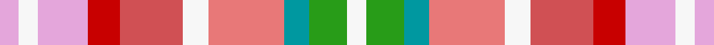

This is one **variant** — a specific cloth: this exact thread count and colourway, with its own
provenance below. It is one weaving of the [sett](/setts/w3g6gi4rii12w4ri10r5lp8w3lp3/) (the scale-free proportion — the
same cloth at any scale or shade), whose colour order is pattern [WGGRWRRWWW](/stripes/wggrwrrwww/).

Part of the [Ribbons of Hope](/tartans/r/ri/ribbons-of-hope/) tartan — the named design grouping this sett with its other cloths.

Sourced from tartans-authority.  It is a [10 stripe tartan](/stripes/stripes10/).

Original link [https://www.tartanregister.gov.uk/tartanDetails.aspx?ref=8436](https://www.tartanregister.gov.uk/tartanDetails.aspx?ref=8436)

Dataset <small>— provenance for this record, inherited from the source manifest</small>

<dl class="dataset-prov">
<dt>source</dt><dd><a href="/sources/tartans-authority/">Scottish Tartans Authority</a></dd>
<dt>data captured from</dt><dd><a href="https://github.com/thetartan/tartan-database/blob/master/data/tartans-authority/data.csv">https://github.com/thetartan/tartan-database/blob/master/data/tartans-authority/data.csv</a></dd>
<dt>data date</dt><dd>28th June 2011 <small>(this record)</small></dd>
<dt>licence</dt><dd><a href="https://creativecommons.org/licenses/by-nc-nd/4.0/">CC BY-NC-ND 4.0</a></dd>
</dl>

Capture chain <small>— the hands this data passed through, oldest first; each capture carries its own licence</small>

<ol class="capture-chain">
<li><a href="https://www.tartansauthority.com/">Scottish Tartans Authority</a> <small>the heritage body's archive — its tartan-ferret record browser is retired (links repaired to the SRT, above)</small></li>
<li><a href="https://github.com/thetartan/tartan-database">thetartan/tartan-database</a> <small>2016-2017</small> · <a href="https://creativecommons.org/licenses/by-nc-nd/4.0/">CC BY-NC-ND 4.0</a> <small>Levko Kravets's frozen compilation — the capture we vendored, and where its CC licence text came from</small></li>
<li>this dictionary <small>captured 2026-06-10 · commit 5bf86c7566</small> <small>each re-capture is a git commit to data/sources</small></li>
</ol>

## Register references

External register numbers recorded for this tartan.

- Scottish Register of Tartans: [8436](https://www.tartanregister.gov.uk/tartanDetails?ref=8436)
- Scottish Tartans Authority (ITI): 8436

## Thread count
LP/6 W6 LP16 R10 Ri20 W8 Rii24 Gi8 G12 W/6

One full sett is **220 threads**.

## Palette
<table><thead><tr><th>Colour</th><th>Shade</th><th>OKLCh</th></tr></thead><tbody><tr><td>G</td><td><code style="background-color:#0098A0;">#0098A0</code> <small style="color:#888">#0098A0</small></td><td><small style="color:#888">oklch(61.8% 0.105 201.4)</small></td></tr><tr><td>R</td><td><code style="background-color:#D05054;">#D05054</code> <small style="color:#888">#D05054</small></td><td><small style="color:#888">oklch(60.2% 0.162 21.5)</small></td></tr><tr><td>G</td><td><code style="background-color:#289C18;">#289C18</code> <small style="color:#888">#289C18</small></td><td><small style="color:#888">oklch(60.6% 0.191 141.6)</small></td></tr><tr><td>W</td><td><code style="background-color:#F7F7F7;">#F7F7F7</code> <small style="color:#888">#F7F7F7</small></td><td><small style="color:#888">oklch(97.6% 0.000 89.9)</small></td></tr><tr><td>LP</td><td><code style="background-color:#E4A6DB;">#E4A6DB</code> <small style="color:#888">#E4A6DB</small></td><td><small style="color:#888">oklch(80.0% 0.100 331.6)</small></td></tr><tr><td>R</td><td><code style="background-color:#E87878;">#E87878</code> <small style="color:#888">#E87878</small></td><td><small style="color:#888">oklch(70.0% 0.139 21.2)</small></td></tr><tr><td>R</td><td><code style="background-color:#C80000;">#C80000</code> <small style="color:#888">#C80000</small></td><td><small style="color:#888">oklch(52.3% 0.215 29.2)</small></td></tr></tbody></table>

# Sample pattern

## Nearest tartan variants

The nearest existing variants by ΔTartan distance, with this cloth at the top so the swatches line up against it.

ΔTartan

Threads

Variant

Sett

—

220

<a href="/variants/s10/w3g6gi4rii12w4ri10r5lp8w3lp3~x2~g2408144-gi2504202-rii2806019-ri2406019-r2109032/">Ribbons of Hope</a>

<a href="/ttd/edit/#slug=lb19lo12r4ly8n4dg6g16~x2~dg1806142-g2203152&amp;base=w3g6gi4rii12w4ri10r5lp8w3lp3~x2~g2408144-gi2504202-rii2806019-ri2406019-r2109032" title="compare in the TTD">3.92</a>

206

<a href="/variants/s7/lb19lo12r4ly8n4dg6g16~x2~dg1806142-g2203152/">Aberdeenshire Home Colours</a>

## Neighbour map

Every grey dot is one of 13621 variants placed by the first two principal components of the ΔTartan feature space (42% of its variance). Red is this tartan; blue dots are its nearest — click one to open its page. The map is a flat projection of a many-dimensional space — [how to read it](/posts/neighbourhood-maps/).

<svg viewBox="0 0 640 380" role="img" style="max-width:100%;height:auto;border:1px solid #e0e0e0;border-radius:4px;display:block" xmlns="http://www.w3.org/2000/svg"><image href="/nn/cloud.v1.png" width="640" height="380"/><a href="/variants/s7/lb19lo12r4ly8n4dg6g16~x2~dg1806142-g2203152/"><circle cx="98.5" cy="252.6" r="4" fill="#3465a4"><title>Aberdeenshire Home Colours</title></circle></a><circle cx="39.7" cy="237.0" r="5" fill="#c00000"/><text x="320" y="376" text-anchor="middle" font-size="11" fill="#999">ground</text><text x="11" y="190" text-anchor="middle" font-size="11" fill="#999" transform="rotate(-90 11 190)">complexity</text></svg>

ID: /variants/s10/w3g6gi4rii12w4ri10r5lp8w3lp3~x2~g2408144-gi2504202-rii2806019-ri2406019-r2109032/
