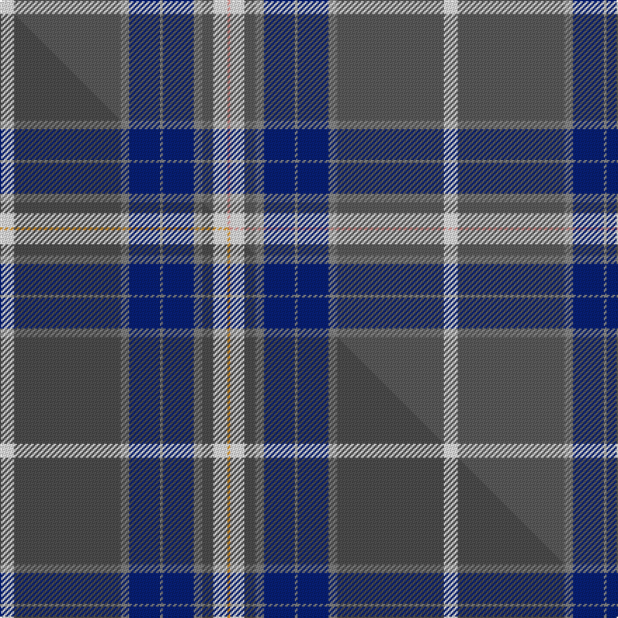

This is one **variant** — a specific cloth: this exact thread count and colourway, with its own
provenance below. It is one weaving of the [sett](/tartans/b/ba/ballarat/) (the scale-free proportion — the
same cloth at any scale or shade), whose colour order is pattern [WBRBRBRBWY](/stripes/wbrbrbrbwy/).

Part of the [Ballarat](/tartans/b/ba/ballarat/) tartan — the named design grouping this sett with its other cloths.

Sourced from tartans-authority.  It is a [10 stripe tartan](/stripes/stripes10/).

Original link <code>http://www.tartansauthority.com/tartan-ferret/display/10988/</code> — retired · [Internet Archive copy](https://web.archive.org/web/*/http://www.tartansauthority.com/tartan-ferret/display/10988/*)

Dataset <small>— provenance for this record, inherited from the source manifest</small>

<dl class="dataset-prov">
<dt>source</dt><dd><a href="/sources/tartans-authority/">Scottish Tartans Authority</a></dd>
<dt>data captured from</dt><dd><a href="https://github.com/thetartan/tartan-database/blob/master/data/tartans-authority/data.csv">https://github.com/thetartan/tartan-database/blob/master/data/tartans-authority/data.csv</a></dd>
<dt>data date</dt><dd>2014 <small>(this record)</small></dd>
<dt>licence</dt><dd><a href="https://creativecommons.org/licenses/by-nc-nd/4.0/">CC BY-NC-ND 4.0</a></dd>
</dl>

Capture chain <small>— the hands this data passed through, oldest first; each capture carries its own licence</small>

<ol class="capture-chain">
<li><a href="https://www.tartansauthority.com/">Scottish Tartans Authority</a> <small>the heritage body’s archive — its tartan-ferret record browser is retired; dead record links are shown unlinked, with an Internet Archive copy (ITI numbers are not SRT references)</small></li>
<li><a href="https://github.com/thetartan/tartan-database">thetartan/tartan-database</a> <small>2016-2017</small> · <a href="https://creativecommons.org/licenses/by-nc-nd/4.0/">CC BY-NC-ND 4.0</a> <small>Levko Kravets's frozen compilation — the capture we vendored, and where its CC licence text came from</small></li>
<li>this dictionary <small>captured 2026-06-10 · commit 5bf86c7566</small> <small>each re-capture is a git commit to data/sources</small></li>
</ol>

## Register references

External register numbers recorded for this tartan.

- Scottish Register of Tartans: [10988](https://www.tartanregister.gov.uk/tartanDetails?ref=10988)
- Scottish Tartans Authority (ITI): 10988

## Thread count
W/10 N76 O6 DB22 O2 DB22 O6 N8 W10 LR/2

One full sett is **316 threads**.

## Palette
<table><thead><tr><th>Colour</th><th>Shade</th><th>OKLCh</th></tr></thead><tbody><tr><td>DB</td><td><code style="background-color:#082077;">#082077</code> <small style="color:#888">#082077</small></td><td><small style="color:#888">oklch(30.0% 0.149 265.1)</small></td></tr><tr><td>LR</td><td><code style="background-color:#FF9C97;">#FF9C97</code> <small style="color:#888">#FF9C97</small></td><td><small style="color:#888">oklch(79.3% 0.119 23.2)</small></td></tr><tr><td>N</td><td><code style="background-color:#5C5C5C;">#5C5C5C</code> <small style="color:#888">#5C5C5C</small></td><td><small style="color:#888">oklch(47.5% 0.000 89.9)</small></td></tr><tr><td>O</td><td><code style="background-color:#888888;">#888888</code> <small style="color:#888">#888888</small></td><td><small style="color:#888">oklch(62.7% 0.000 89.9)</small></td></tr><tr><td>W</td><td><code style="background-color:#F7F7F7;">#F7F7F7</code> <small style="color:#888">#F7F7F7</small></td><td><small style="color:#888">oklch(97.6% 0.000 89.9)</small></td></tr></tbody></table>

# Sample pattern

## Compared to the master

This cloth is one sett of its design; the master sett (the exemplar the design is anchored on) is below for comparison.

Its **ΔTartan distance** from the master is **0.34** — the same measure the nearest-tartans table ranks by (0 is identical; a re-scale of the same cloth is near 0, a recolour or a different proportion further).

<figure class="master-compare" style="margin:0">

this sett
master sett ★

<figcaption style="color:#888;font-size:smaller">One weave of this sett against the <a href="/setts/w5n38y3db11y1db11y3n4w5lo1/">master sett ★</a>, split on the diagonal: a shared proportion runs seamlessly across it with only the shades shifting; a different proportion breaks on it.</figcaption>
</figure>

## Nearest tartan variants

The nearest existing variants by ΔTartan distance, with this cloth at the top so the swatches line up against it.

ΔTartan

Threads

Variant

Sett

—

316

<a href="/variants/s10/w5n38o3db11o1db11o3n4w5lr1~x2~n1900000-o2500000/">Ballarat</a>

<a href="/ttd/edit/#slug=w5dt38y3db11y1db11y3dt4w5lo1~x2~dt1700000-y2400000&amp;base=w5n38o3db11o1db11o3n4w5lr1~x2~n1900000-o2500000" title="compare in the TTD">0.34</a>

316

<a href="/variants/s10/w5n38y3db11y1db11y3n4w5lo1~x2~n1700000-y2400000/">Ballarat</a>

<a href="/ttd/edit/#slug=db20m1w3dt1w2dt8g3w1~x4~db1804259-dt1302222&amp;base=w5n38o3db11o1db11o3n4w5lr1~x2~n1900000-o2500000" title="compare in the TTD">2.67</a>

228

<a href="/variants/s8/db20m1w3dt1w2dt8g3w1~x4~db1804259-dt1302222/">Kruenaegel-Schropp Name Tartan</a>

<a href="/ttd/edit/#slug=w3db2w2db40r3y1r10g10r1~x2&amp;base=w5n38o3db11o1db11o3n4w5lr1~x2~n1900000-o2500000" title="compare in the TTD">2.78</a>

280

<a href="/variants/s9/w3db2w2db40r3y1r10g10r1~x2/">Russian Scottish</a>

<a href="/ttd/edit/#slug=w10db2w1db35dg10dy3dg10r4~x2&amp;base=w5n38o3db11o1db11o3n4w5lr1~x2~n1900000-o2500000" title="compare in the TTD">2.78</a>

272

<a href="/variants/s8/w10db2w1db35dg10dy3dg10r4~x2/">Sandelin #2 (Personal)</a>

<a href="/ttd/edit/#slug=db37w2db2y2r17w2db2g17y2db2~x2&amp;base=w5n38o3db11o1db11o3n4w5lr1~x2~n1900000-o2500000" title="compare in the TTD">2.82</a>

262

<a href="/variants/s10/db37w2db2y2r17w2db2g17y2db2~x2/">MDF (Personal)</a>

<a href="/ttd/edit/#slug=w4dp40g2dp2g2dp2g2dp3g16db15m3~x2&amp;base=w5n38o3db11o1db11o3n4w5lr1~x2~n1900000-o2500000" title="compare in the TTD">2.93</a>

350

<a href="/variants/s11/w4dp40g2dp2g2dp2g2dp3g16db15m3~x2/">Solway Spirit (District)</a>

<a href="/ttd/edit/#slug=g3r12g15r2w1db30w1g2r2~x2&amp;base=w5n38o3db11o1db11o3n4w5lr1~x2~n1900000-o2500000" title="compare in the TTD">2.95</a>

262

<a href="/variants/s9/g3r12g15r2w1db30w1g2r2~x2/">Christmas Morning</a>

<a href="/ttd/edit/#slug=w10db2w1db35g10ly3g10r4~x2&amp;base=w5n38o3db11o1db11o3n4w5lr1~x2~n1900000-o2500000" title="compare in the TTD">2.96</a>

272

<a href="/variants/s8/w10db2w1db35g10ly3g10r4~x2/">Sandelin (Personal)</a>

<a href="/ttd/edit/#slug=w2ly4db1ly1db40n6g18r2g2w1~x2&amp;base=w5n38o3db11o1db11o3n4w5lr1~x2~n1900000-o2500000" title="compare in the TTD">2.99</a>

302

<a href="/variants/s10/w2ly4db1ly1db40n6g18r2g2w1~x2/">O'Mahony, The (Commemorative)</a>

<a href="/ttd/edit/#slug=dbi66w1db10w1db10w1db12r2lb24~x2~dbi1406275-db1404245&amp;base=w5n38o3db11o1db11o3n4w5lr1~x2~n1900000-o2500000" title="compare in the TTD">3.15</a>

328

<a href="/variants/s9/dbi66w1db10w1db10w1db12r2lb24~x2~dbi1406275-db1404245/">RAAF #2</a>

## Neighbour map

Every grey dot is one of 13656 variants placed by the first two principal components of the ΔTartan feature space (42% of its variance). Red is this tartan; blue dots are its nearest — click one to open its page. The map is a flat projection of a many-dimensional space — [how to read it](/posts/neighbourhood-maps/).

<svg viewBox="0 0 640 380" role="img" style="max-width:100%;height:auto;border:1px solid #e0e0e0;border-radius:4px;display:block" xmlns="http://www.w3.org/2000/svg"><image href="/nn/cloud.v1.png" width="640" height="380"/><a href="/variants/s10/w5n38y3db11y1db11y3n4w5lo1~x2~n1700000-y2400000/"><circle cx="336.4" cy="119.2" r="4" fill="#3465a4"><title>Ballarat</title></circle></a><a href="/variants/s8/db20m1w3dt1w2dt8g3w1~x4~db1804259-dt1302222/"><circle cx="294.0" cy="142.4" r="4" fill="#3465a4"><title>Kruenaegel-Schropp Name Tartan</title></circle></a><a href="/variants/s9/w3db2w2db40r3y1r10g10r1~x2/"><circle cx="340.4" cy="83.6" r="4" fill="#3465a4"><title>Russian Scottish</title></circle></a><a href="/variants/s8/w10db2w1db35dg10dy3dg10r4~x2/"><circle cx="269.0" cy="117.9" r="4" fill="#3465a4"><title>Sandelin #2 (Personal)</title></circle></a><a href="/variants/s10/db37w2db2y2r17w2db2g17y2db2~x2/"><circle cx="269.7" cy="120.9" r="4" fill="#3465a4"><title>MDF (Personal)</title></circle></a><a href="/variants/s11/w4dp40g2dp2g2dp2g2dp3g16db15m3~x2/"><circle cx="300.2" cy="117.5" r="4" fill="#3465a4"><title>Solway Spirit (District)</title></circle></a><a href="/variants/s9/g3r12g15r2w1db30w1g2r2~x2/"><circle cx="279.6" cy="127.3" r="4" fill="#3465a4"><title>Christmas Morning</title></circle></a><a href="/variants/s8/w10db2w1db35g10ly3g10r4~x2/"><circle cx="259.5" cy="118.0" r="4" fill="#3465a4"><title>Sandelin (Personal)</title></circle></a><a href="/variants/s10/w2ly4db1ly1db40n6g18r2g2w1~x2/"><circle cx="301.0" cy="73.5" r="4" fill="#3465a4"><title>O'Mahony, The (Commemorative)</title></circle></a><a href="/variants/s9/dbi66w1db10w1db10w1db12r2lb24~x2~dbi1406275-db1404245/"><circle cx="356.3" cy="99.9" r="4" fill="#3465a4"><title>RAAF #2</title></circle></a><circle cx="316.6" cy="105.9" r="5" fill="#c00000"/><text x="320" y="376" text-anchor="middle" font-size="11" fill="#999">ground</text><text x="11" y="190" text-anchor="middle" font-size="11" fill="#999" transform="rotate(-90 11 190)">complexity</text></svg>

ID: /variants/s10/w5n38o3db11o1db11o3n4w5lr1~x2~n1900000-o2500000/
