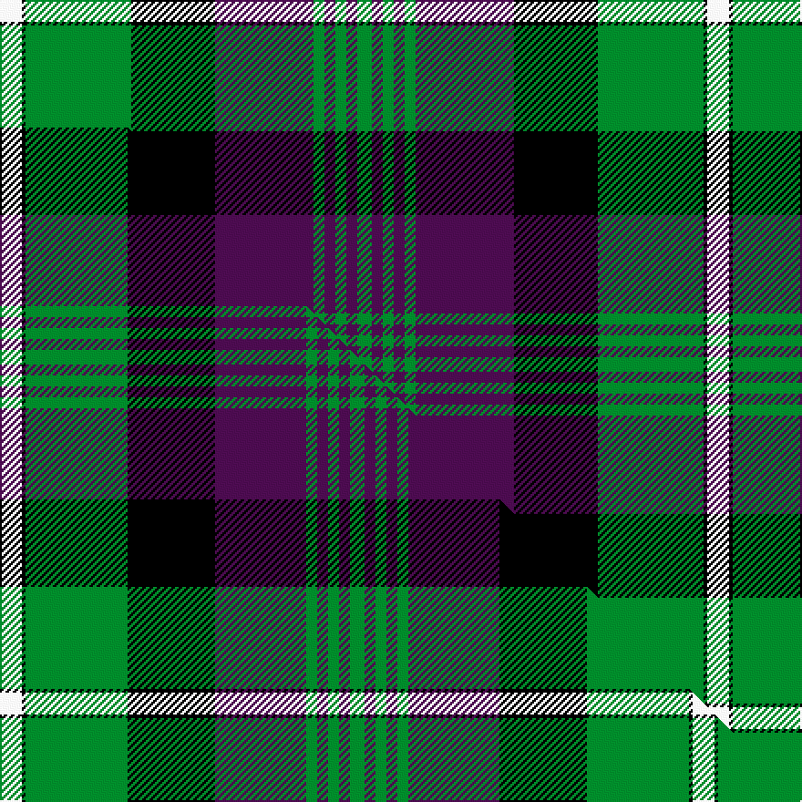

This is one **variant** — a specific cloth: this exact thread count and colourway, with its own
provenance below. It is one weaving of the [sett](/setts/w6k1g29k23dp27g3dp3g3dp3g4/) (the scale-free proportion — the
same cloth at any scale or shade), whose colour order is pattern [GBGBGBKGKW](/stripes/gbgbgbkgkw/).

Part of the [Rennie](/tartans/rennie/) tartan — the named design grouping this sett with its other cloths.

Sourced from house-of-tartan.  It is a [10 stripe tartan](/stripes/stripes10/).

Original link [http://www.house-of-tartan.scotland.net/house/TartanViewjs.asp?colr=Def&tnam=716](http://www.house-of-tartan.scotland.net/house/TartanViewjs.asp?colr=Def&tnam=716)

## Provenance

Earliest known date: 1981. For Robin Rennie. The accreditation list gives the author and weaver, James Scarlett, as the designer in 1980. The tartan register records the designer as Peter MacDonald who worked as a weaver for the Scottish Tartans Society in 1981. Rennies, Rainys and Rainnies (from 'Ranald') are listed as a sept of MacDonell of Keppoch.

2 attestations — the source records this cloth was collapsed from (oldest owns this page)

<ul>
<li>1981 — Rennie Family Tartan (house-of-tartan, <a href="http://www.house-of-tartan.scotland.net/house/TartanViewjs.asp?colr=Def&tnam=716">record</a>) </li>
<li>undated — Rennie (weddslist, <a href="http://www.weddslist.com/cgi-bin/tartans/pg.pl?source=sts">record</a>) </li>
</ul>

Dataset <small>— provenance for this record, inherited from the source manifest</small>

<dl class="dataset-prov">
<dt>source</dt><dd><a href="/sources/house-of-tartan/">House of Tartan</a></dd>
<dt>data captured from</dt><dd><a href="https://github.com/thetartan/tartan-database/blob/master/data/house-of-tartan/data.csv">https://github.com/thetartan/tartan-database/blob/master/data/house-of-tartan/data.csv</a></dd>
<dt>data date</dt><dd>1981 <small>(this record)</small></dd>
<dt>licence</dt><dd><a href="https://creativecommons.org/licenses/by-nc-nd/4.0/">CC BY-NC-ND 4.0</a></dd>
</dl>

Capture chain <small>— the hands this data passed through, oldest first; each capture carries its own licence</small>

<ol class="capture-chain">
<li><a href="http://www.house-of-tartan.scotland.net/">House of Tartan</a> <small>the weaver/retailer's database — the site is now offline; the URL is kept as the ultimate source's identity</small></li>
<li><a href="https://github.com/thetartan/tartan-database">thetartan/tartan-database</a> <small>2016-2017</small> · <a href="https://creativecommons.org/licenses/by-nc-nd/4.0/">CC BY-NC-ND 4.0</a> <small>Levko Kravets's frozen compilation — the capture we vendored, and where its CC licence text came from</small></li>
<li>this dictionary <small>captured 2026-06-10 · commit 5bf86c7566</small> <small>each re-capture is a git commit to data/sources</small></li>
</ol>

## Thread count
W/12 K2 G58 K46 DP54 G6 DP6 G6 DP6 G/8

One full sett is **388 threads**.

## Palette
<table><thead><tr><th>Colour</th><th>Shade</th><th>OKLCh</th></tr></thead><tbody><tr><td>G</td><td><code style="background-color:#008B2A;">#008B2A</code> <small style="color:#888">#008B2A</small></td><td><small style="color:#888">oklch(55.4% 0.170 145.9)</small></td></tr><tr><td>K</td><td><code style="background-color:#000000;">#000000</code> <small style="color:#888">#000000</small></td><td><small style="color:#888">oklch(0.0% 0.000 0.0)</small></td></tr><tr><td>W</td><td><code style="background-color:#F7F7F7;">#F7F7F7</code> <small style="color:#888">#F7F7F7</small></td><td><small style="color:#888">oklch(97.6% 0.000 89.9)</small></td></tr><tr><td>DP</td><td><code style="background-color:#4B0B4F;">#4B0B4F</code> <small style="color:#888">#4B0B4F</small></td><td><small style="color:#888">oklch(30.1% 0.125 325.4)</small></td></tr></tbody></table>

# Sample pattern

## Compared to the master

This cloth is one sett of its design; the master sett (the exemplar the design is anchored on) is below for comparison.

Its **ΔTartan distance** from the master is **0.07** — the same measure the nearest-tartans table ranks by (0 is identical; a re-scale of the same cloth is near 0, a recolour or a different proportion further).

<figure class="master-compare" style="margin:0">

this sett
master sett ★

<figcaption style="color:#888;font-size:smaller">One weave of this sett against the <a href="/setts/w6k1g28k24dp25g3dp3g3dp3g4/">master sett ★</a>, split on the diagonal: a shared proportion runs seamlessly across it with only the shades shifting; a different proportion breaks on it.</figcaption>
</figure>

## Nearest tartan variants

The nearest existing variants by ΔTartan distance, with this cloth at the top so the swatches line up against it.

ΔTartan

Threads

Variant

Sett

—

388

<a href="/variants/s10/w6k1g29k23dp27g3dp3g3dp3g4~x2/">Rennie Family Tartan</a>

<a href="/ttd/edit/#slug=w6k1g28k24dp25g3dp3g3dp3g4~x2&amp;base=w6k1g29k23dp27g3dp3g3dp3g4~x2" title="compare in the TTD">0.07</a>

380

<a href="/variants/s10/w6k1g28k24dp25g3dp3g3dp3g4~x2/">Rennie (Personal)</a>

<a href="/ttd/edit/#slug=y3k1g22k20dp20g2dp2g2dp2g3~x4&amp;base=w6k1g29k23dp27g3dp3g3dp3g4~x2" title="compare in the TTD">0.60</a>

592

<a href="/variants/s10/y3k1g22k20dp20g2dp2g2dp2g3~x4/">Urbino (Fashion)</a>

<a href="/ttd/edit/#slug=y3k1g22k20dp20g2dp2g2dp2g3~x4~dp1607327&amp;base=w6k1g29k23dp27g3dp3g3dp3g4~x2" title="compare in the TTD">0.63</a>

592

<a href="/variants/s10/y3k1g22k20dp20g2dp2g2dp2g3~x4~dp1607327/">Urbino</a>

<a href="/ttd/edit/#slug=w6k1g28k24dp25g3dp3g3dp3g4dp3~x2&amp;base=w6k1g29k23dp27g3dp3g3dp3g4~x2" title="compare in the TTD">1.08</a>

394

<a href="/variants/s11/w6k1g28k24dp25g3dp3g3dp3g4dp3~x2/">Rennie (Name)</a>

<a href="/ttd/edit/#slug=k9o2k2n2o18n2k2r1k20n33r2~x2~o2500000-n1900000&amp;base=w6k1g29k23dp27g3dp3g3dp3g4~x2" title="compare in the TTD">1.88</a>

350

<a href="/variants/s11/k9o2k2n2o18n2k2r1k20n33r2~x2~o2500000-n1900000/">Pride of Scotland Silver</a>

<a href="/ttd/edit/#slug=r3k2db25k28g25k2r1db2~x2&amp;base=w6k1g29k23dp27g3dp3g3dp3g4~x2" title="compare in the TTD">2.30</a>

342

<a href="/variants/s8/r3k2db25k28g25k2r1db2~x2/">Common Kilt Tartan</a>

<a href="/ttd/edit/#slug=g24y3g4y1g17k25db2k2db2k2db22~x2&amp;base=w6k1g29k23dp27g3dp3g3dp3g4~x2" title="compare in the TTD">2.34</a>

324

<a href="/variants/s11/g24y3g4y1g17k25db2k2db2k2db22~x2/">Hunting, The</a>

<a href="/ttd/edit/#slug=dr4db12k18db4y22lb1y2lb2y3lb2~x4&amp;base=w6k1g29k23dp27g3dp3g3dp3g4~x2" title="compare in the TTD">2.46</a>

536

<a href="/variants/s10/dr4db12k18db4y22lb1y2lb2y3lb2~x4/">Windsor</a>

<a href="/ttd/edit/#slug=db17r2db2r6db32r2k34g32r6g2r2g17~x2&amp;base=w6k1g29k23dp27g3dp3g3dp3g4~x2" title="compare in the TTD">2.46</a>

548

<a href="/variants/s12/db17r2db2r6db32r2k34g32r6g2r2g17~x2/">MacDonald #4</a>

<a href="/ttd/edit/#slug=lr6g34db4g4k32g4db34g4db2g5&amp;base=w6k1g29k23dp27g3dp3g3dp3g4~x2" title="compare in the TTD">2.48</a>

247

<a href="/variants/s10/lr6g34db4g4k32g4db34g4db2g5/">Sardar Chadha (Personal)</a>

## Neighbour map

Every grey dot is one of 13621 variants placed by the first two principal components of the ΔTartan feature space (42% of its variance). Red is this tartan; blue dots are its nearest — click one to open its page.

<svg viewBox="0 0 640 380" role="img" style="max-width:100%;height:auto;border:1px solid #e0e0e0;border-radius:4px;display:block" xmlns="http://www.w3.org/2000/svg"><image href="/nn/cloud.v1.png" width="640" height="380"/><a href="/variants/s10/w6k1g28k24dp25g3dp3g3dp3g4~x2/"><circle cx="190.0" cy="119.5" r="4" fill="#3465a4"><title>Rennie (Personal)</title></circle></a><a href="/variants/s10/y3k1g22k20dp20g2dp2g2dp2g3~x4/"><circle cx="200.5" cy="127.1" r="4" fill="#3465a4"><title>Urbino (Fashion)</title></circle></a><a href="/variants/s10/y3k1g22k20dp20g2dp2g2dp2g3~x4~dp1607327/"><circle cx="182.1" cy="103.0" r="4" fill="#3465a4"><title>Urbino</title></circle></a><a href="/variants/s11/w6k1g28k24dp25g3dp3g3dp3g4dp3~x2/"><circle cx="188.2" cy="113.2" r="4" fill="#3465a4"><title>Rennie (Name)</title></circle></a><a href="/variants/s11/k9o2k2n2o18n2k2r1k20n33r2~x2~o2500000-n1900000/"><circle cx="225.4" cy="97.4" r="4" fill="#3465a4"><title>Pride of Scotland Silver</title></circle></a><a href="/variants/s8/r3k2db25k28g25k2r1db2~x2/"><circle cx="199.7" cy="129.2" r="4" fill="#3465a4"><title>Common Kilt Tartan</title></circle></a><a href="/variants/s11/g24y3g4y1g17k25db2k2db2k2db22~x2/"><circle cx="214.3" cy="127.0" r="4" fill="#3465a4"><title>Hunting, The</title></circle></a><a href="/variants/s10/dr4db12k18db4y22lb1y2lb2y3lb2~x4/"><circle cx="171.4" cy="118.9" r="4" fill="#3465a4"><title>Windsor</title></circle></a><a href="/variants/s12/db17r2db2r6db32r2k34g32r6g2r2g17~x2/"><circle cx="152.5" cy="138.7" r="4" fill="#3465a4"><title>MacDonald #4</title></circle></a><a href="/variants/s10/lr6g34db4g4k32g4db34g4db2g5/"><circle cx="188.7" cy="143.5" r="4" fill="#3465a4"><title>Sardar Chadha (Personal)</title></circle></a><circle cx="194.6" cy="117.4" r="5" fill="#c00000"/><text x="320" y="376" text-anchor="middle" font-size="11" fill="#999">ground</text><text x="11" y="190" text-anchor="middle" font-size="11" fill="#999" transform="rotate(-90 11 190)">complexity</text></svg>

ID: /variants/s10/w6k1g29k23dp27g3dp3g3dp3g4~x2/
