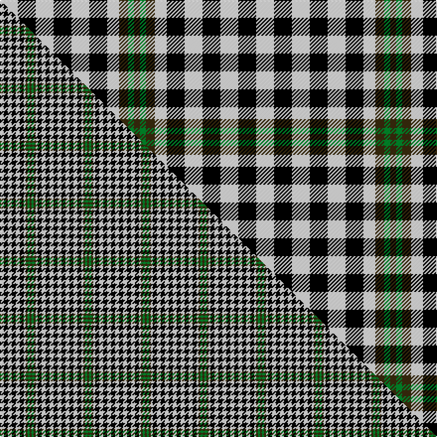

This page is one **sett** — a single exact thread-count. It belongs to the [tartan](/setts/w6k6w6k6w6k6w4dy3g2dy2/)
(the same proportion at any scale), whose colour order is pattern [GGGWKWKWKW](/stripes/gggwkwkwkw/).

Part of the [Burns Check](/tartans/burns-check/) tartan — the named design grouping this sett with its other cloths.

Sourced from tartans-authority.  It is a [10 stripe tartan](/stripes/stripes10/).

Original link https://www.tartanregister.gov.uk/tartanDetails.aspx?ref=1736

Dataset <small>— provenance for this record, inherited from the source manifest</small>

<dl class="dataset-prov">
<dt>source</dt><dd><a href="/sources/tartans-authority/">Scottish Tartans Authority</a></dd>
<dt>data captured from</dt><dd><a href="https://github.com/thetartan/tartan-database/blob/master/data/tartans-authority/data.csv">https://github.com/thetartan/tartan-database/blob/master/data/tartans-authority/data.csv</a></dd>
<dt>data date</dt><dd>1959 <small>(this record)</small></dd>
<dt>licence</dt><dd><a href="https://creativecommons.org/licenses/by-nc-nd/4.0/">CC BY-NC-ND 4.0</a></dd>
</dl>

Capture chain <small>— the hands this data passed through, oldest first; each capture carries its own licence</small>

<ol class="capture-chain">
<li><a href="https://www.tartansauthority.com/">Scottish Tartans Authority</a> <small>the heritage body's archive — its tartan-ferret record browser is retired (links repaired to the SRT, above)</small></li>
<li><a href="https://github.com/thetartan/tartan-database">thetartan/tartan-database</a> <small>2016-2017</small> · <a href="https://creativecommons.org/licenses/by-nc-nd/4.0/">CC BY-NC-ND 4.0</a> <small>Levko Kravets's frozen compilation — the capture we vendored, and where its CC licence text came from</small></li>
<li>this dictionary <small>captured 2026-06-10 · commit 5bf86c7566</small> <small>each re-capture is a git commit to data/sources</small></li>
</ol>

## Register references

External register numbers recorded for this tartan.

- Scottish Tartans Authority (ITI): 1736

## Thread count
W/18 K18 W18 K18 W18 K18 W12 DY9 G6 DY/6

One full sett is **258 threads**.

## Palette
<table><thead><tr><th>Colour</th><th>Shade</th><th>OKLCh</th></tr></thead><tbody><tr><td>G</td><td><code style="background-color:#008B2A;">#008B2A</code> <small style="color:#888">#008B2A</small></td><td><small style="color:#888">oklch(55.4% 0.170 145.9)</small></td></tr><tr><td>K</td><td><code style="background-color:#000000;">#000000</code> <small style="color:#888">#000000</small></td><td><small style="color:#888">oklch(0.0% 0.000 0.0)</small></td></tr><tr><td>DY</td><td><code style="background-color:#3A2B0D;">#3A2B0D</code> <small style="color:#888">#3A2B0D</small></td><td><small style="color:#888">oklch(30.0% 0.049 82.0)</small></td></tr><tr><td>W</td><td><code style="background-color:#F7F7F7;">#F7F7F7</code> <small style="color:#888">#F7F7F7</small></td><td><small style="color:#888">oklch(97.6% 0.000 89.9)</small></td></tr></tbody></table>

# Sample pattern

## Compared to the master

This cloth is one sett of its design; the master sett (the exemplar the design is anchored on) is below for comparison.

Its **ΔTartan distance** from the master is **0.42** — the same measure the nearest-tartans table ranks by (0 is identical; a re-scale of the same cloth is near 0, a recolour or a different proportion further).

<figure class="master-compare" style="margin:0">

this sett
master sett ★

<figcaption style="color:#888;font-size:smaller">One weave of this sett against the <a href="/setts/w2k2w2k2w2k2w1dy1g1dy1/">master sett ★</a>, split on the diagonal: a shared proportion runs seamlessly across it with only the shades shifting; a different proportion breaks on it.</figcaption>
</figure>

## Nearest tartan variants

The nearest existing variants by ΔTartan distance, with this cloth at the top so the swatches line up against it.

ΔTartan

Threads

Variant

Sett

—

258

<a href="/variants/s10/w6k6w6k6w6k6w4dy3g2dy2~x3/">Burns Check (District)</a>

<a href="/ttd/edit/#slug=w2k2w2k2w2k2w1dy1g1dy1~x2&amp;base=w6k6w6k6w6k6w4dy3g2dy2~x3" title="compare in the TTD">0.39</a>

58

<a href="/variants/s10/w2k2w2k2w2k2w1dy1g1dy1~x2/">Burns Check Trade Tartan</a>

<a href="/ttd/edit/#slug=w2k2w2k2w2k2w1dy1g1dy1~x8~w4000000-g2203152&amp;base=w6k6w6k6w6k6w4dy3g2dy2~x3" title="compare in the TTD">0.41</a>

232

<a href="/variants/s10/w2k2w2k2w2k2w1dy1g1dy1~x8~w4000000-g2203152/">Burns Check</a>

<a href="/ttd/edit/#slug=w2k2w2k2w2k2w1o1g1o1~x4&amp;base=w6k6w6k6w6k6w4dy3g2dy2~x3" title="compare in the TTD">1.01</a>

116

<a href="/variants/s10/w2k2w2k2w2k2w1o1g1o1~x4/">Robert, Burns check</a>

<a href="/ttd/edit/#slug=k4w4k4w4k4w4db3w2r2&amp;base=w6k6w6k6w6k6w4dy3g2dy2~x3" title="compare in the TTD">1.62</a>

56

<a href="/variants/s9/k4w4k4w4k4w4db3w2r2/">Scott, Sir Walter #3</a>

<a href="/ttd/edit/#slug=dg1lb1dg1lb2k2lb2k2lb2k2lb2ly1lb1ly1~x4&amp;base=w6k6w6k6w6k6w4dy3g2dy2~x3" title="compare in the TTD">2.05</a>

152

<a href="/variants/s13/dg1lb1dg1lb2k2lb2k2lb2k2lb2ly1lb1ly1~x4/">Glen Flesk</a>

<a href="/ttd/edit/#slug=k6w6k6w6g7w4dy3g2dy3~x2~g2203152&amp;base=w6k6w6k6w6k6w4dy3g2dy2~x3" title="compare in the TTD">2.09</a>

154

<a href="/variants/s9/k6w6k6w6g7w4dy3g2dy3~x2~g2203152/">Burns Heritage Check</a>

<a href="/ttd/edit/#slug=k6w6k6w6g7w4dy3g2dy3~x2&amp;base=w6k6w6k6w6k6w4dy3g2dy2~x3" title="compare in the TTD">2.09</a>

154

<a href="/variants/s9/k6w6k6w6g7w4dy3g2dy3~x2/">Burns Heritage Check (Corporate)</a>

<a href="/ttd/edit/#slug=w4k4w21k12w4k12ly4&amp;base=w6k6w6k6w6k6w4dy3g2dy2~x3" title="compare in the TTD">2.10</a>

114

<a href="/variants/s7/w4k4w21k12w4k12ly4/">Mazda</a>

<a href="/ttd/edit/#slug=w4k4w4k4w4db3w2r2~x2&amp;base=w6k6w6k6w6k6w4dy3g2dy2~x3" title="compare in the TTD">2.53</a>

96

<a href="/variants/s8/w4k4w4k4w4db3w2r2~x2/">Scott, Sir Walter #2</a>

<a href="/ttd/edit/#slug=o1w1o1w2k2w2k2w2k2w2g1w1g1~x4&amp;base=w6k6w6k6w6k6w4dy3g2dy2~x3" title="compare in the TTD">2.58</a>

152

<a href="/variants/s13/o1w1o1w2k2w2k2w2k2w2g1w1g1~x4/">Glen Flesk</a>

## Neighbour map

Every grey dot is one of 13620 variants placed by the first two principal components of the ΔTartan feature space (42% of its variance). Red is this tartan; blue dots are its nearest — click one to open its page.

<svg viewBox="0 0 640 380" role="img" style="max-width:100%;height:auto;border:1px solid #e0e0e0;border-radius:4px;display:block" xmlns="http://www.w3.org/2000/svg"><image href="/nn/cloud.v1.png" width="640" height="380"/><a href="/variants/s10/w2k2w2k2w2k2w1dy1g1dy1~x2/"><circle cx="68.7" cy="294.6" r="4" fill="#3465a4"><title>Burns Check Trade Tartan</title></circle></a><a href="/variants/s10/w2k2w2k2w2k2w1dy1g1dy1~x8~w4000000-g2203152/"><circle cx="68.7" cy="294.2" r="4" fill="#3465a4"><title>Burns Check</title></circle></a><a href="/variants/s10/w2k2w2k2w2k2w1o1g1o1~x4/"><circle cx="69.4" cy="294.2" r="4" fill="#3465a4"><title>Robert, Burns check</title></circle></a><a href="/variants/s9/k4w4k4w4k4w4db3w2r2/"><circle cx="62.3" cy="301.1" r="4" fill="#3465a4"><title>Scott, Sir Walter #3</title></circle></a><a href="/variants/s13/dg1lb1dg1lb2k2lb2k2lb2k2lb2ly1lb1ly1~x4/"><circle cx="92.8" cy="281.7" r="4" fill="#3465a4"><title>Glen Flesk</title></circle></a><a href="/variants/s9/k6w6k6w6g7w4dy3g2dy3~x2~g2203152/"><circle cx="43.0" cy="267.6" r="4" fill="#3465a4"><title>Burns Heritage Check</title></circle></a><a href="/variants/s9/k6w6k6w6g7w4dy3g2dy3~x2/"><circle cx="41.3" cy="268.6" r="4" fill="#3465a4"><title>Burns Heritage Check (Corporate)</title></circle></a><a href="/variants/s7/w4k4w21k12w4k12ly4/"><circle cx="205.1" cy="232.9" r="4" fill="#3465a4"><title>Mazda</title></circle></a><a href="/variants/s8/w4k4w4k4w4db3w2r2~x2/"><circle cx="80.2" cy="291.3" r="4" fill="#3465a4"><title>Scott, Sir Walter #2</title></circle></a><a href="/variants/s13/o1w1o1w2k2w2k2w2k2w2g1w1g1~x4/"><circle cx="86.8" cy="281.0" r="4" fill="#3465a4"><title>Glen Flesk</title></circle></a><circle cx="106.1" cy="270.6" r="5" fill="#c00000"/><text x="320" y="376" text-anchor="middle" font-size="11" fill="#999">ground</text><text x="11" y="190" text-anchor="middle" font-size="11" fill="#999" transform="rotate(-90 11 190)">complexity</text></svg>

ID: /variants/s10/w6k6w6k6w6k6w4dy3g2dy2~x3/
