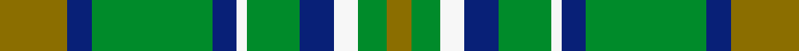

This is one **variant** — a specific cloth: this exact thread count and colourway, with its own
provenance below. It is one weaving of the [sett](/setts/y14db5g25db5w2g11db7w5g6y5/) (the scale-free proportion — the
same cloth at any scale or shade), whose colour order is pattern [GBGBWGBWGG](/stripes/gbgbwgbwgg/).

Part of the [Kerry County Crest](/tartans/k/ke/kerry-county-crest/) tartan — the named design grouping this sett with its other cloths.

Sourced from tartans-authority.  It is a [10 stripe tartan](/stripes/stripes10/).

Original link [https://www.tartanregister.gov.uk/tartanDetails.aspx?ref=7453](https://www.tartanregister.gov.uk/tartanDetails.aspx?ref=7453)

2 attestations — the source records this cloth was collapsed from (oldest owns this page)

<ul>
<li>2004 — Kerry County Crest (Fashion) (tartans-authority, <a href="https://www.tartanregister.gov.uk/tartanDetails.aspx?ref=7453">record</a>)  <em>This tartan is part of the 'County Crest' range of Irish tartans originally designed by Viking Technology and woven by Marton Mills in 2004. The range of tartans - the ownership and copyright of which were transferred to USA Kilts Inc. in 2012 - are based on the colours found in each of the 32 Irish County crests. This tartan may not be reproduced in any form without the express written consent of USA Kilts Inc.</em></li>
<li>01/05/2005 — Kerry County, Crest Range (register-of-tartans, <a href="https://www.tartanregister.gov.uk/tartanDetails.aspx?ref=5504">record</a>)  <em>Designed by Viking Technology Limited (now Tartan Web Scotland Ltd) in 2005 as one of a set of Irish County and Irish National tartans. Ownership transferred to USA Kilts Inc in Dec 2012.</em></li>
</ul>

Dataset <small>— provenance for this record, inherited from the source manifest</small>

<dl class="dataset-prov">
<dt>source</dt><dd><a href="/sources/tartans-authority/">Scottish Tartans Authority</a></dd>
<dt>data captured from</dt><dd><a href="https://github.com/thetartan/tartan-database/blob/master/data/tartans-authority/data.csv">https://github.com/thetartan/tartan-database/blob/master/data/tartans-authority/data.csv</a></dd>
<dt>data date</dt><dd>2004 <small>(this record)</small></dd>
<dt>licence</dt><dd><a href="https://creativecommons.org/licenses/by-nc-nd/4.0/">CC BY-NC-ND 4.0</a></dd>
</dl>

Capture chain <small>— the hands this data passed through, oldest first; each capture carries its own licence</small>

<ol class="capture-chain">
<li><a href="https://www.tartansauthority.com/">Scottish Tartans Authority</a> <small>the heritage body's archive — its tartan-ferret record browser is retired (links repaired to the SRT, above)</small></li>
<li><a href="https://github.com/thetartan/tartan-database">thetartan/tartan-database</a> <small>2016-2017</small> · <a href="https://creativecommons.org/licenses/by-nc-nd/4.0/">CC BY-NC-ND 4.0</a> <small>Levko Kravets's frozen compilation — the capture we vendored, and where its CC licence text came from</small></li>
<li>this dictionary <small>captured 2026-06-10 · commit 5bf86c7566</small> <small>each re-capture is a git commit to data/sources</small></li>
</ol>

## Register references

External register numbers recorded for this tartan.

- Scottish Register of Tartans: [5504](https://www.tartanregister.gov.uk/tartanDetails.aspx?ref=5504)
- Scottish Tartans Authority (ITI): 7453
- Scottish Tartans World Register: 3086

## Thread count
Y/28 DB10 G50 DB10 W4 G22 DB14 W10 G12 Y/10

One full sett is **302 threads**.

## Palette
<table><thead><tr><th>Colour</th><th>Shade</th><th>OKLCh</th></tr></thead><tbody><tr><td>DB</td><td><code style="background-color:#082077;">#082077</code> <small style="color:#888">#082077</small></td><td><small style="color:#888">oklch(30.0% 0.149 265.1)</small></td></tr><tr><td>G</td><td><code style="background-color:#008B2A;">#008B2A</code> <small style="color:#888">#008B2A</small></td><td><small style="color:#888">oklch(55.4% 0.170 145.9)</small></td></tr><tr><td>W</td><td><code style="background-color:#F7F7F7;">#F7F7F7</code> <small style="color:#888">#F7F7F7</small></td><td><small style="color:#888">oklch(97.6% 0.000 89.9)</small></td></tr><tr><td>Y</td><td><code style="background-color:#8B6E00;">#8B6E00</code> <small style="color:#888">#8B6E00</small></td><td><small style="color:#888">oklch(55.1% 0.113 90.4)</small></td></tr></tbody></table>

# Sample pattern

## Nearest tartan variants

The nearest existing variants by ΔTartan distance, with this cloth at the top so the swatches line up against it.

ΔTartan

Threads

Variant

Sett

—

302

<a href="/variants/s10/y14db5g25db5w2g11db7w5g6y5~x2/">Kerry County Crest (Fashion)</a>

<a href="/ttd/edit/#slug=lb4dg26dgi8lb8dgi8g3lb2~x2~dgi1806142-g2408144&amp;base=y14db5g25db5w2g11db7w5g6y5~x2" title="compare in the TTD">2.39</a>

224

<a href="/variants/s7/lb4dg26dgi8lb8dgi8g3lb2~x2~dgi1806142-g2408144/">Valley of the Green (The ) Canadian Tartan</a>

<a href="/ttd/edit/#slug=lb4dg26g8lb8g8b3lb2~x2&amp;base=y14db5g25db5w2g11db7w5g6y5~x2" title="compare in the TTD">2.49</a>

224

<a href="/variants/s7/lb4dg26g8lb8g8b3lb2~x2/">Valley, of the Green. (The )</a>

<a href="/ttd/edit/#slug=g23dy5db13g5db5w3db5g5dy9g9~x2&amp;base=y14db5g25db5w2g11db7w5g6y5~x2" title="compare in the TTD">2.53</a>

264

<a href="/variants/s10/g23dy5db13g5db5w3db5g5dy9g9~x2/">MacScott Family (America) (Personal)</a>

<a href="/ttd/edit/#slug=g28dr12g4db20lo2db3lo2db3g7~x2&amp;base=y14db5g25db5w2g11db7w5g6y5~x2" title="compare in the TTD">2.75</a>

254

<a href="/variants/s9/g28dr12g4db20lo2db3lo2db3g7~x2/">Cork Irish County Tartan</a>

<a href="/ttd/edit/#slug=lb12dg2lb2dg2lb2dy8g8dy1~x2~dg1806142-g2408144&amp;base=y14db5g25db5w2g11db7w5g6y5~x2" title="compare in the TTD">2.84</a>

122

<a href="/variants/s8/lb12dg2lb2dg2lb2dy8g8dy1~x2~dg1806142-g2408144/">Universal Ancient International Tartan</a>

<a href="/ttd/edit/#slug=lb12dg2lb2dg2lb2dy8g8dy1~x2~dg1504144-g2408144&amp;base=y14db5g25db5w2g11db7w5g6y5~x2" title="compare in the TTD">2.96</a>

122

<a href="/variants/s8/lb12dg2lb2dg2lb2dy8g8dy1~x2~dg1504144-g2408144/">Universal Ancient</a>

<a href="/ttd/edit/#slug=g20y2n5w4g2n2g2n2db6~x2&amp;base=y14db5g25db5w2g11db7w5g6y5~x2" title="compare in the TTD">3.21</a>

128

<a href="/variants/s9/g20y2n5w4g2n2g2n2db6~x2/">Boucherville (Tartan de..) District Tartan</a>

<a href="/ttd/edit/#slug=y2dr6g1dg2g12lb1g1lb2~x4&amp;base=y14db5g25db5w2g11db7w5g6y5~x2" title="compare in the TTD">3.34</a>

200

<a href="/variants/s8/y2dr6g1dg2g12lb1g1lb2~x4/">Manitoba District Tartan</a>

<a href="/ttd/edit/#slug=db3dy7g2y2g14dy2g2db3~x2&amp;base=y14db5g25db5w2g11db7w5g6y5~x2" title="compare in the TTD">3.37</a>

128

<a href="/variants/s8/db3dy7g2y2g14dy2g2db3~x2/">Daks (Loden)</a>

<a href="/ttd/edit/#slug=g22dg3g3dg3g3dg9lb28dg3lb6~x2&amp;base=y14db5g25db5w2g11db7w5g6y5~x2" title="compare in the TTD">3.40</a>

264

<a href="/variants/s9/g22dg3g3dg3g3dg9lb28dg3lb6~x2/">Kildonan Green (Fashion)</a>

## Neighbour map

Every grey dot is one of 13621 variants placed by the first two principal components of the ΔTartan feature space (42% of its variance). Red is this tartan; blue dots are its nearest — click one to open its page. The map is a flat projection of a many-dimensional space — [how to read it](/posts/neighbourhood-maps/).

<svg viewBox="0 0 640 380" role="img" style="max-width:100%;height:auto;border:1px solid #e0e0e0;border-radius:4px;display:block" xmlns="http://www.w3.org/2000/svg"><image href="/nn/cloud.v1.png" width="640" height="380"/><a href="/variants/s7/lb4dg26dgi8lb8dgi8g3lb2~x2~dgi1806142-g2408144/"><circle cx="272.2" cy="218.5" r="4" fill="#3465a4"><title>Valley of the Green (The ) Canadian Tartan</title></circle></a><a href="/variants/s7/lb4dg26g8lb8g8b3lb2~x2/"><circle cx="264.9" cy="216.0" r="4" fill="#3465a4"><title>Valley, of the Green. (The )</title></circle></a><a href="/variants/s10/g23dy5db13g5db5w3db5g5dy9g9~x2/"><circle cx="268.3" cy="240.3" r="4" fill="#3465a4"><title>MacScott Family (America) (Personal)</title></circle></a><a href="/variants/s9/g28dr12g4db20lo2db3lo2db3g7~x2/"><circle cx="296.6" cy="196.5" r="4" fill="#3465a4"><title>Cork Irish County Tartan</title></circle></a><a href="/variants/s8/lb12dg2lb2dg2lb2dy8g8dy1~x2~dg1806142-g2408144/"><circle cx="240.0" cy="215.4" r="4" fill="#3465a4"><title>Universal Ancient International Tartan</title></circle></a><a href="/variants/s8/lb12dg2lb2dg2lb2dy8g8dy1~x2~dg1504144-g2408144/"><circle cx="237.7" cy="214.1" r="4" fill="#3465a4"><title>Universal Ancient</title></circle></a><a href="/variants/s9/g20y2n5w4g2n2g2n2db6~x2/"><circle cx="303.3" cy="194.1" r="4" fill="#3465a4"><title>Boucherville (Tartan de..) District Tartan</title></circle></a><a href="/variants/s8/y2dr6g1dg2g12lb1g1lb2~x4/"><circle cx="305.5" cy="192.2" r="4" fill="#3465a4"><title>Manitoba District Tartan</title></circle></a><a href="/variants/s8/db3dy7g2y2g14dy2g2db3~x2/"><circle cx="317.5" cy="243.8" r="4" fill="#3465a4"><title>Daks (Loden)</title></circle></a><a href="/variants/s9/g22dg3g3dg3g3dg9lb28dg3lb6~x2/"><circle cx="275.3" cy="223.4" r="4" fill="#3465a4"><title>Kildonan Green (Fashion)</title></circle></a><circle cx="275.4" cy="218.9" r="5" fill="#c00000"/><text x="320" y="376" text-anchor="middle" font-size="11" fill="#999">ground</text><text x="11" y="190" text-anchor="middle" font-size="11" fill="#999" transform="rotate(-90 11 190)">complexity</text></svg>

ID: /variants/s10/y14db5g25db5w2g11db7w5g6y5~x2/
