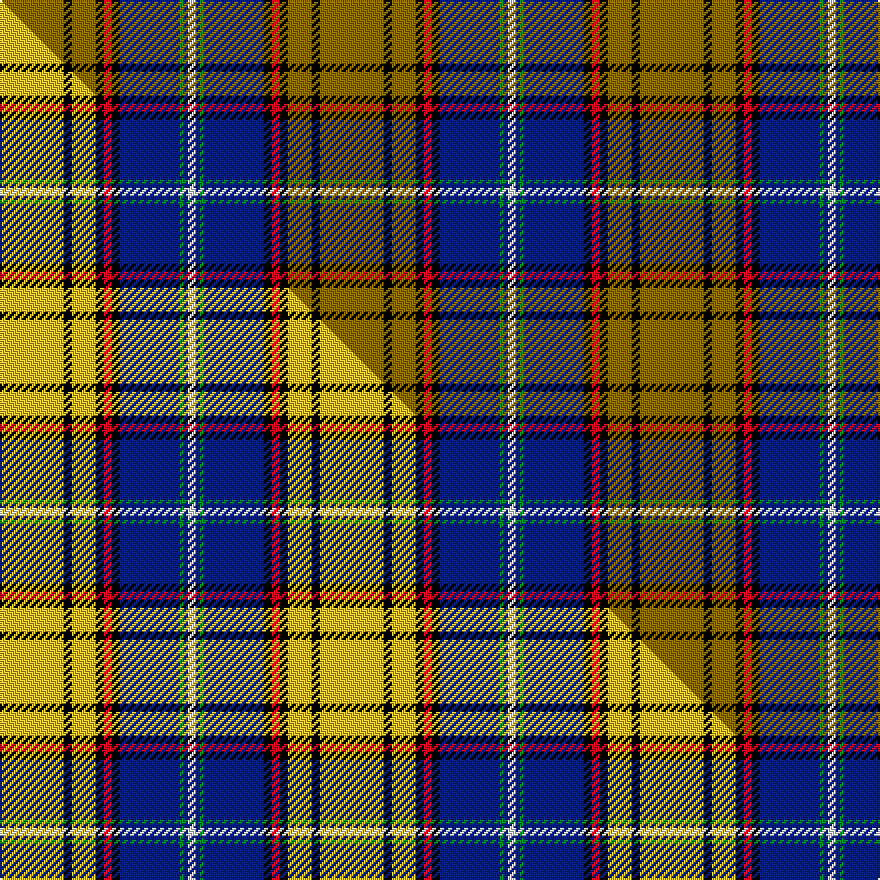

This page is one **sett** — a single exact thread-count. It belongs to the [tartan](/setts/y16k2y6k2r2k2db15g1db1w2/)
(the same proportion at any scale), whose colour order is pattern [GKGKRKBGBW](/stripes/gkgkrkbgbw/).

Part of the [Otago](/tartans/otago/) tartan — the named design grouping this sett with its other cloths.

Sourced from weddslist.  It is a [10 stripe tartan](/stripes/stripes10/).

Original link [http://www.weddslist.com/cgi-bin/tartans/pg.pl?source=sts](http://www.weddslist.com/cgi-bin/tartans/pg.pl?source=sts)

## Provenance

Earliest known date: 1996 Otago's colours are blue and gold. White on blue is the St Andrews Cross, gold is for the gold discovered in Otago. The black divides the gold to show that the miners came from the four quarters of the world. Red is for the blood ties in the Old Country and black for mourning loved ones never to be seen again.

2 attestations — the source records this cloth was collapsed from (oldest owns this page)

<ul>
<li>undated — Otago (weddslist, <a href="http://www.weddslist.com/cgi-bin/tartans/pg.pl?source=sts">record</a>) </li>
<li>undated — Otago Corporate District Tartan (house-of-tartan, <a href="http://www.house-of-tartan.scotland.net/house/TartanViewjs.asp?colr=Def&tnam=2317">record</a>) </li>
</ul>

Dataset <small>— provenance for this record, inherited from the source manifest</small>

<dl class="dataset-prov">
<dt>source</dt><dd><a href="/sources/weddslist/">Weddslist</a></dd>
<dt>data captured from</dt><dd><a href="https://github.com/thetartan/tartan-database/blob/master/data/weddslist/data.csv">https://github.com/thetartan/tartan-database/blob/master/data/weddslist/data.csv</a></dd>
<dt>data date</dt><dd>2016-11-17 <small>(dataset default)</small></dd>
<dt>licence</dt><dd><a href="https://creativecommons.org/licenses/by-nc-nd/4.0/">CC BY-NC-ND 4.0</a></dd>
</dl>

Capture chain <small>— the hands this data passed through, oldest first; each capture carries its own licence</small>

<ol class="capture-chain">
<li><a href="https://www.weddslist.com/tartans/">Weddslist</a> <small>the living privately compiled reference</small></li>
<li><a href="https://github.com/thetartan/tartan-database">thetartan/tartan-database</a> <small>2016-2017</small> · <a href="https://creativecommons.org/licenses/by-nc-nd/4.0/">CC BY-NC-ND 4.0</a> <small>Levko Kravets's frozen compilation — the capture we vendored, and where its CC licence text came from</small></li>
<li>this dictionary <small>captured 2026-06-10 · commit 5bf86c7566</small> <small>each re-capture is a git commit to data/sources</small></li>
</ol>

## Thread count
Y/32 K4 Y12 K4 R4 K4 DB30 G2 DB2 W/4

One full sett is **160 threads**.

## Palette
<table><thead><tr><th>Colour</th><th>Shade</th><th>OKLCh</th></tr></thead><tbody><tr><td>DB</td><td><code style="background-color:#082077;">#082077</code> <small style="color:#888">#082077</small></td><td><small style="color:#888">oklch(30.0% 0.149 265.1)</small></td></tr><tr><td>G</td><td><code style="background-color:#008B2A;">#008B2A</code> <small style="color:#888">#008B2A</small></td><td><small style="color:#888">oklch(55.4% 0.170 145.9)</small></td></tr><tr><td>K</td><td><code style="background-color:#000000;">#000000</code> <small style="color:#888">#000000</small></td><td><small style="color:#888">oklch(0.0% 0.000 0.0)</small></td></tr><tr><td>Y</td><td><code style="background-color:#8B6E00;">#8B6E00</code> <small style="color:#888">#8B6E00</small></td><td><small style="color:#888">oklch(55.1% 0.113 90.4)</small></td></tr><tr><td>W</td><td><code style="background-color:#F7F7F7;">#F7F7F7</code> <small style="color:#888">#F7F7F7</small></td><td><small style="color:#888">oklch(97.6% 0.000 89.9)</small></td></tr><tr><td>R</td><td><code style="background-color:#D60020;">#D60020</code> <small style="color:#888">#D60020</small></td><td><small style="color:#888">oklch(55.2% 0.224 25.5)</small></td></tr></tbody></table>

# Sample pattern

## Compared to the master

This cloth is one sett of its design; the master sett (the exemplar the design is anchored on) is below for comparison.

Its **ΔTartan distance** from the master is **0.17** — the same measure the nearest-tartans table ranks by (0 is identical; a re-scale of the same cloth is near 0, a recolour or a different proportion further).

<figure class="master-compare" style="margin:0">

this sett
master sett ★

<figcaption style="color:#888;font-size:smaller">One weave of this sett against the <a href="/setts/ly16k2ly6k2r2k2db15g1db1w2/">master sett ★</a>, split on the diagonal: a shared proportion runs seamlessly across it with only the shades shifting; a different proportion breaks on it.</figcaption>
</figure>

## Nearest tartan variants

The nearest existing variants by ΔTartan distance, with this cloth at the top so the swatches line up against it.

ΔTartan

Threads

Variant

Sett

—

160

<a href="/variants/s10/y16k2y6k2r2k2db15g1db1w2~x2/">Otago</a>

<a href="/ttd/edit/#slug=dt10r3dt32y12k5y2k4y2k17o4k2lb2~x2~dt1600000-y2200000&amp;base=y16k2y6k2r2k2db15g1db1w2~x2" title="compare in the TTD">1.87</a>

356

<a href="/variants/s12/dt10r3dt32y12k5y2k4y2k17o4k2lb2~x2~dt1600000-y2200000/">Scottish Spirit Fashion Tartan</a>

<a href="/ttd/edit/#slug=w3db25r3ri3r3ri5g10r3k2~x2~r1506028-ri2008029&amp;base=y16k2y6k2r2k2db15g1db1w2~x2" title="compare in the TTD">2.14</a>

218

<a href="/variants/s9/w3db25r3ri3r3ri5g10r3k2~x2~r1506028-ri2008029/">Edinburgh District</a>

<a href="/ttd/edit/#slug=r4dg2y2dg24k2dg3k3dg3k10b10w2b4~x2&amp;base=y16k2y6k2r2k2db15g1db1w2~x2" title="compare in the TTD">2.29</a>

260

<a href="/variants/s12/r4dg2y2dg24k2dg3k3dg3k10b10w2b4~x2/">Kerby, from the Tennessee Cumberland Basin</a>

<a href="/ttd/edit/#slug=o38k4w4k4n10k4n10k4w2dp3~x2~o2500000-n1900000&amp;base=y16k2y6k2r2k2db15g1db1w2~x2" title="compare in the TTD">2.33</a>

250

<a href="/variants/s10/o38k4w4k4n10k4n10k4w2dp3~x2~o2500000-n1900000/">Penman Grey (Personal)</a>

<a href="/ttd/edit/#slug=db12k3ly2k3r12db12k2o28k2ly2k2n2k2o28k2db12~x2~ly3104101-o2503076&amp;base=y16k2y6k2r2k2db15g1db1w2~x2" title="compare in the TTD">2.35</a>

456

<a href="/variants/s16/db12k3lyi2k3r12db12k2ly28k2lyi2k2n2k2ly28k2db12~x2~lyi3104101-ly2503076/">Oneness</a>

<a href="/ttd/edit/#slug=dt9r3dt32n12k5n2k4n2k17dp4k2lb2~x2~dt1700000&amp;base=y16k2y6k2r2k2db15g1db1w2~x2" title="compare in the TTD">2.39</a>

354

<a href="/variants/s12/ni9r3ni32n12k5n2k4n2k17dp4k2lb2~x2~ni1700000/">Scottish Spirit</a>

<a href="/ttd/edit/#slug=k2r2k15lb2k4lb2n9dt27w2~x2~n1800000-dt1200000&amp;base=y16k2y6k2r2k2db15g1db1w2~x2" title="compare in the TTD">2.39</a>

252

<a href="/variants/s9/k2r2k15lb2k4lb2n9dt27w2~x2~n1800000-dt1200000/">Real Mary King's Close, The</a>

<a href="/ttd/edit/#slug=w3db25dr3r3dr3r5g10dr3k2~x2&amp;base=y16k2y6k2r2k2db15g1db1w2~x2" title="compare in the TTD">2.40</a>

218

<a href="/variants/s9/w3db25dr3r3dr3r5g10dr3k2~x2/">Edinburgh District</a>

<a href="/ttd/edit/#slug=r8g2k2ly2k2y2k2g18db2g2db29k3~x2&amp;base=y16k2y6k2r2k2db15g1db1w2~x2" title="compare in the TTD">2.41</a>

274

<a href="/variants/s12/r8g2k2ly2k2y2k2g18db2g2db29k3~x2/">Cats Winter (Fashion)</a>

<a href="/ttd/edit/#slug=k14r2k2r2k2g18r2g18w1db12lb1r8~x2&amp;base=y16k2y6k2r2k2db15g1db1w2~x2" title="compare in the TTD">2.42</a>

284

<a href="/variants/s12/k14r2k2r2k2g18r2g18w1db12lb1r8~x2/">Princess Diana</a>

## Neighbour map

Every grey dot is one of 13621 variants placed by the first two principal components of the ΔTartan feature space (42% of its variance). Red is this tartan; blue dots are its nearest — click one to open its page.

<svg viewBox="0 0 640 380" role="img" style="max-width:100%;height:auto;border:1px solid #e0e0e0;border-radius:4px;display:block" xmlns="http://www.w3.org/2000/svg"><image href="/nn/cloud.v1.png" width="640" height="380"/><a href="/variants/s12/dt10r3dt32y12k5y2k4y2k17o4k2lb2~x2~dt1600000-y2200000/"><circle cx="186.2" cy="105.1" r="4" fill="#3465a4"><title>Scottish Spirit Fashion Tartan</title></circle></a><a href="/variants/s9/w3db25r3ri3r3ri5g10r3k2~x2~r1506028-ri2008029/"><circle cx="167.3" cy="123.5" r="4" fill="#3465a4"><title>Edinburgh District</title></circle></a><a href="/variants/s12/r4dg2y2dg24k2dg3k3dg3k10b10w2b4~x2/"><circle cx="172.7" cy="118.1" r="4" fill="#3465a4"><title>Kerby, from the Tennessee Cumberland Basin</title></circle></a><a href="/variants/s10/o38k4w4k4n10k4n10k4w2dp3~x2~o2500000-n1900000/"><circle cx="206.0" cy="107.1" r="4" fill="#3465a4"><title>Penman Grey (Personal)</title></circle></a><a href="/variants/s16/db12k3lyi2k3r12db12k2ly28k2lyi2k2n2k2ly28k2db12~x2~lyi3104101-ly2503076/"><circle cx="161.7" cy="94.4" r="4" fill="#3465a4"><title>Oneness</title></circle></a><a href="/variants/s12/ni9r3ni32n12k5n2k4n2k17dp4k2lb2~x2~ni1700000/"><circle cx="197.2" cy="111.2" r="4" fill="#3465a4"><title>Scottish Spirit</title></circle></a><a href="/variants/s9/k2r2k15lb2k4lb2n9dt27w2~x2~n1800000-dt1200000/"><circle cx="168.0" cy="116.4" r="4" fill="#3465a4"><title>Real Mary King's Close, The</title></circle></a><a href="/variants/s9/w3db25dr3r3dr3r5g10dr3k2~x2/"><circle cx="171.7" cy="127.8" r="4" fill="#3465a4"><title>Edinburgh District</title></circle></a><a href="/variants/s12/r8g2k2ly2k2y2k2g18db2g2db29k3~x2/"><circle cx="167.4" cy="95.0" r="4" fill="#3465a4"><title>Cats Winter (Fashion)</title></circle></a><a href="/variants/s12/k14r2k2r2k2g18r2g18w1db12lb1r8~x2/"><circle cx="145.5" cy="105.5" r="4" fill="#3465a4"><title>Princess Diana</title></circle></a><circle cx="185.0" cy="107.3" r="5" fill="#c00000"/><text x="320" y="376" text-anchor="middle" font-size="11" fill="#999">ground</text><text x="11" y="190" text-anchor="middle" font-size="11" fill="#999" transform="rotate(-90 11 190)">complexity</text></svg>

ID: /variants/s10/y16k2y6k2r2k2db15g1db1w2~x2/
