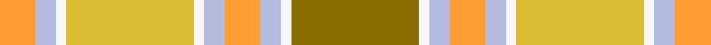

This is one **variant** — a specific cloth: this exact thread count and colourway, with its own
provenance below. It is one weaving of the [sett](/tartans/o/o/o-monaghan/) (the scale-free proportion — the
same cloth at any scale or shade), whose colour order is pattern [GWWYWWYWWY](/stripes/gwwywwywwy/).

Part of the [O'Monaghan](/tartans/o/o/o-monaghan/) tartan — the named design grouping this sett with its other cloths.

Sourced from register-of-tartans.  It is a [10 stripe tartan](/stripes/stripes10/).

Original link [https://www.tartanregister.gov.uk/tartanDetails.aspx?ref=3247](https://www.tartanregister.gov.uk/tartanDetails.aspx?ref=3247)

2 attestations — the source records this cloth was collapsed from (oldest owns this page)

<ul>
<li>01/01/2004 — O'Monaghan (Personal) (register-of-tartans, <a href="https://www.tartanregister.gov.uk/tartanDetails.aspx?ref=3247">record</a>)  <em>No details apart from Jamie Scarlett MBE's comments: 'There are two pieces of O'Monaghan, a large piece of Lochcarron with mustard yellow squares and a standard 18ins x 12ins of mine with buff squares. My client claimed to be The O'Monaghan.' Sample of buff squared version in the Scottish Tartans Authority's Scarlett Collection.</em></li>
<li>pre 2004 — O'Monaghan (Personal) (tartans-authority, <a href="https://web.archive.org/web/*/http://www.tartansauthority.com/tartan-ferret/display/6266/*">record</a>)  <em>. No details apart from Jamie's comments: "There are two pieces of O'Monaghan , a large piece of Lochcarron with mustard yellow squares and a standard 18ins x 12ins of mine with buff squares. My client claimed to be THE O'Monaghan." Sample of buff squared version in the Scarlett Collection.</em></li>
</ul>

Dataset <small>— provenance for this record, inherited from the source manifest</small>

<dl class="dataset-prov">
<dt>source</dt><dd><a href="/sources/register-of-tartans/">Scottish Register of Tartans</a></dd>
<dt>data captured from</dt><dd><a href="https://github.com/thetartan/tartan-database/blob/master/data/register-of-tartans/data.csv">https://github.com/thetartan/tartan-database/blob/master/data/register-of-tartans/data.csv</a></dd>
<dt>data date</dt><dd>2004 <small>(this record)</small></dd>
<dt>licence</dt><dd><a href="https://www.tartanregister.gov.uk/copyright">Crown copyright</a></dd>
</dl>

Capture chain <small>— the hands this data passed through, oldest first; each capture carries its own licence</small>

<ol class="capture-chain">
<li><a href="https://www.tartanregister.gov.uk/">Scottish Register of Tartans</a> · <a href="https://www.tartanregister.gov.uk/copyright">Crown copyright</a> <small>the living register — still published by National Records of Scotland</small></li>
<li><a href="https://github.com/thetartan/tartan-database">thetartan/tartan-database</a> <small>2016-2017</small> · <a href="https://creativecommons.org/licenses/by-nc-nd/4.0/">CC BY-NC-ND 4.0</a> <small>Levko Kravets's frozen compilation — the capture we vendored, and where its CC licence text came from</small></li>
<li>this dictionary <small>captured 2026-06-10 · commit 5bf86c7566</small> <small>each re-capture is a git commit to data/sources</small></li>
</ol>

## Register references

External register numbers recorded for this tartan.

- Scottish Register of Tartans: [3247](https://www.tartanregister.gov.uk/tartanDetails.aspx?ref=3247)
- Scottish Tartans Authority (ITI): 6266

## Thread count
Y/50 W4 LB8 LO14 LB8 W4 LY50 W4 LB8 LO/14

One full sett is **264 threads**.

The source recorded this cloth as LO/14 LB8 W4 LY50 W4 LB8 LO14 LB8 W4 Y50 W4 LB8 LO14 LB8 W4 LY50 W4 LB/8 — 506 threads; it folds to the canonical 264-thread sett above.

## Palette
<table><thead><tr><th>Colour</th><th>Shade</th><th>OKLCh</th></tr></thead><tbody><tr><td>LB</td><td><code style="background-color:#B5BBDE;">#B5BBDE</code> <small style="color:#888">#B5BBDE</small></td><td><small style="color:#888">oklch(79.9% 0.050 277.6)</small></td></tr><tr><td>LY</td><td><code style="background-color:#DCBC32;">#DCBC32</code> <small style="color:#888">#DCBC32</small></td><td><small style="color:#888">oklch(80.0% 0.150 95.2)</small></td></tr><tr><td>Y</td><td><code style="background-color:#8B6E00;">#8B6E00</code> <small style="color:#888">#8B6E00</small></td><td><small style="color:#888">oklch(55.1% 0.113 90.4)</small></td></tr><tr><td>LO</td><td><code style="background-color:#FF9C34;">#FF9C34</code> <small style="color:#888">#FF9C34</small></td><td><small style="color:#888">oklch(77.9% 0.161 61.8)</small></td></tr><tr><td>R</td><td><code style="background-color:#D60020;">#D60020</code> <small style="color:#888">#D60020</small></td><td><small style="color:#888">oklch(55.2% 0.224 25.5)</small></td></tr><tr><td>W</td><td><code style="background-color:#F7F7F7;">#F7F7F7</code> <small style="color:#888">#F7F7F7</small></td><td><small style="color:#888">oklch(97.6% 0.000 89.9)</small></td></tr></tbody></table>

# Sample pattern

[Sample sheet (PDF)](swatch.pdf) — the woven sample, thread count and palette on one printable A4, rendered on demand (the same sheet the TTD print page downloads).

ID: /variants/s10/y25w2lb4lo7lb4w2ly25w2lb4lo7~x2/
