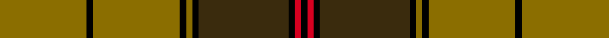

This page is one **sett** — a single exact thread-count. It belongs to the [tartan](/setts/y28k2y28k2y2k2dy29k2r2k2/)
(the same proportion at any scale), whose colour order is pattern [GKGKGKGKRK](/stripes/gkgkgkgkrk/).

Sourced from tartans-authority.  It is a [10 stripe tartan](/stripes/stripes10/).

Original link http://www.tartansauthority.com/tartan-ferret/display/1196/

2 attestations — the source records this cloth was collapsed from (oldest owns this page)

<ul>
<li>1590-1650 — Ulster (Peat) (District (tartans-authority, <a href="http://www.tartansauthority.com/tartan-ferret/display/1196/">record</a>)  <em>Interpretation of the fabric dug out in1956 from an earth bank on the farm of a Mr William Dixon in the townland of Flanders, near Dungiven, County Londonderry. The peaty soil had preserved the material which was analysed as being ca end of 16th C. Parts of the fabric weren't quite so faded which allowed another reconstruction of the original colours - see Ulster, Red. Count said (STS notes) to be from A & W Law Ltd., Darn and Lydgate Mills, Littleborough. Original count extrapolated by Audrey Henshall from National Museum of Antiquities in Edinburgh. Lochcarron sample.</em></li>
<li>01/01/1600 — Ulster (Peat) (register-of-tartans, <a href="https://www.tartanregister.gov.uk/tartanDetails.aspx?ref=4196">record</a>)  <em>Interpretation of the fabric dug out in 1956 from an earth bank on the farm of a Mr William Dixon in the townland of Flanders, near Dungiven, County Londonderry. The peaty soil had preserved the material which was analysed as being ca end of 16th C. Parts of the fabric weren't quite so faded which allowed another reconstruction of the original colours - see Ulster, Red. Count said (Scottish Tartans Society notes) to be from A & W Law Ltd, Darn and Lydgate Mills, Littleborough. Original count extrapolated by Audrey Henshall from National Museum of Antiquities in Edinburgh. Lochcarron sample.</em></li>
</ul>

## Register references

External register numbers recorded for this tartan.

- Scottish Register of Tartans: [4196](https://www.tartanregister.gov.uk/tartanDetails.aspx?ref=4196)
- Scottish Tartans Authority (ITI): 1196
- Scottish Tartans World Register: 1196

## Thread count
Y/56 K4 Y56 K4 Y4 K4 DY58 K4 R4 K/4

One full sett is **336 threads**.

## Palette
<table><thead><tr><th>Colour</th><th>Shade</th><th>OKLCh</th></tr></thead><tbody><tr><td>K</td><td><code style="background-color:#000000;">#000000</code> <small style="color:#888">#000000</small></td><td><small style="color:#888">oklch(0.0% 0.000 0.0)</small></td></tr><tr><td>R</td><td><code style="background-color:#D60020;">#D60020</code> <small style="color:#888">#D60020</small></td><td><small style="color:#888">oklch(55.2% 0.224 25.5)</small></td></tr><tr><td>T</td><td><code style="background-color:#3A2B0D;">#3A2B0D</code> <small style="color:#888">#3A2B0D</small></td><td><small style="color:#888">oklch(30.0% 0.049 82.0)</small></td></tr><tr><td>Ta</td><td><code style="background-color:#8B6E00;">#8B6E00</code> <small style="color:#888">#8B6E00</small></td><td><small style="color:#888">oklch(55.1% 0.113 90.4)</small></td></tr></tbody></table>

# Sample pattern

## Nearest variants

The nearest existing variants by ΔTartan distance, with this cloth at the top so the swatches line up against it.

ΔTartan

Threads

Variant

Sett

—

336

<a href="/variants/s10/y28k2y28k2y2k2dy29k2r2k2~x2/">Ulster (Peat) (District</a>

<a href="/ttd/edit/#slug=y28k2y28k2y2k2ly29k2r2k2~x2&amp;base=y28k2y28k2y2k2dy29k2r2k2~x2" title="compare in the TTD">2.44</a>

336

<a href="/variants/s10/y28k2y28k2y2k2ly29k2r2k2~x2/">Ulster Irish District Tartan</a>

## Neighbour map

Every grey dot is one of 13620 variants placed by the first two principal components of the ΔTartan feature space (42% of its variance). Red is this tartan; blue dots are its nearest — click one to open its page.

<svg viewBox="0 0 640 380" role="img" style="max-width:100%;height:auto;border:1px solid #e0e0e0;border-radius:4px;display:block" xmlns="http://www.w3.org/2000/svg"><image href="/nn/cloud.v1.png" width="640" height="380"/><a href="/variants/s10/y28k2y28k2y2k2ly29k2r2k2~x2/"><circle cx="311.4" cy="133.1" r="4" fill="#3465a4"><title>Ulster Irish District Tartan</title></circle></a><circle cx="340.6" cy="140.5" r="5" fill="#c00000"/><text x="320" y="376" text-anchor="middle" font-size="11" fill="#999">ground</text><text x="11" y="190" text-anchor="middle" font-size="11" fill="#999" transform="rotate(-90 11 190)">complexity</text></svg>

ID: /variants/s10/y28k2y28k2y2k2dy29k2r2k2~x2/
