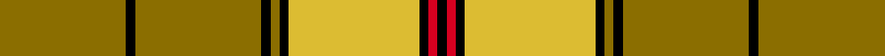

This is one **variant** — a specific cloth: this exact thread count and colourway, with its own
provenance below. It is one weaving of the [sett](/setts/y28k2y28k2y2k2ly29k2r2k2/) (the scale-free proportion — the
same cloth at any scale or shade), whose colour order is pattern [GKGKGKYKRK](/stripes/gkgkgkykrk/).

Part of the [Ulster](/tartans/u/ul/ulster-2/) tartan — the named design grouping this sett with its other cloths.

Sourced from house-of-tartan.  It is a [10 stripe tartan](/stripes/stripes10/).

Original link [http://www.house-of-tartan.scotland.net/house/TartanViewjs.asp?colr=Def&tnam=1196](http://www.house-of-tartan.scotland.net/house/TartanViewjs.asp?colr=Def&tnam=1196)

## Provenance

Earliest known date: c.1590-1650 The Dungiven costume was discovered in 1956 by Mr William Dixon, a farmer at 'The Hill', Flanders Townland, Dungiven, County Derry, Northern Ireland. The tartan cloth was probably green but had been stained brown and tan by the peat.

Dataset <small>— provenance for this record, inherited from the source manifest</small>

<dl class="dataset-prov">
<dt>source</dt><dd><a href="/sources/house-of-tartan/">House of Tartan</a></dd>
<dt>data captured from</dt><dd><a href="https://github.com/thetartan/tartan-database/blob/master/data/house-of-tartan/data.csv">https://github.com/thetartan/tartan-database/blob/master/data/house-of-tartan/data.csv</a></dd>
<dt>data date</dt><dd>c.1590-1650 <small>(this record)</small></dd>
<dt>licence</dt><dd><a href="https://creativecommons.org/licenses/by-nc-nd/4.0/">CC BY-NC-ND 4.0</a></dd>
</dl>

Capture chain <small>— the hands this data passed through, oldest first; each capture carries its own licence</small>

<ol class="capture-chain">
<li><a href="http://www.house-of-tartan.scotland.net/">House of Tartan</a> <small>the weaver/retailer's database — the site is now offline; the URL is kept as the ultimate source's identity</small></li>
<li><a href="https://github.com/thetartan/tartan-database">thetartan/tartan-database</a> <small>2016-2017</small> · <a href="https://creativecommons.org/licenses/by-nc-nd/4.0/">CC BY-NC-ND 4.0</a> <small>Levko Kravets's frozen compilation — the capture we vendored, and where its CC licence text came from</small></li>
<li>this dictionary <small>captured 2026-06-10 · commit 5bf86c7566</small> <small>each re-capture is a git commit to data/sources</small></li>
</ol>

## Thread count
Y/56 K4 Y56 K4 Y4 K4 LY58 K4 R4 K/4

One full sett is **336 threads**.

## Palette
<table><thead><tr><th>Colour</th><th>Shade</th><th>OKLCh</th></tr></thead><tbody><tr><td>K</td><td><code style="background-color:#000000;">#000000</code> <small style="color:#888">#000000</small></td><td><small style="color:#888">oklch(0.0% 0.000 0.0)</small></td></tr><tr><td>LY</td><td><code style="background-color:#DCBC32;">#DCBC32</code> <small style="color:#888">#DCBC32</small></td><td><small style="color:#888">oklch(80.0% 0.150 95.2)</small></td></tr><tr><td>R</td><td><code style="background-color:#D60020;">#D60020</code> <small style="color:#888">#D60020</small></td><td><small style="color:#888">oklch(55.2% 0.224 25.5)</small></td></tr><tr><td>Y</td><td><code style="background-color:#8B6E00;">#8B6E00</code> <small style="color:#888">#8B6E00</small></td><td><small style="color:#888">oklch(55.1% 0.113 90.4)</small></td></tr></tbody></table>

# Sample pattern

## Nearest tartan variants

The nearest existing variants by ΔTartan distance, with this cloth at the top so the swatches line up against it.

ΔTartan

Threads

Variant

Sett

—

336

<a href="/variants/s10/y28k2y28k2y2k2ly29k2r2k2~x2/">Ulster Irish District Tartan</a>

<a href="/ttd/edit/#slug=g13k1g13r1g1k1g1k1r13k1y1k1~x3&amp;base=y28k2y28k2y2k2ly29k2r2k2~x2" title="compare in the TTD">2.13</a>

246

<a href="/variants/s12/g13k1g13r1g1k1g1k1r13k1y1k1~x3/">Ulster Red Irish District Tartan</a>

<a href="/ttd/edit/#slug=ly30r2ly2k5ly3o2ly3o22ly3k2ly3~x2~ly3307090-o2203076&amp;base=y28k2y28k2y2k2ly29k2r2k2~x2" title="compare in the TTD">2.21</a>

242

<a href="/variants/s11/ly30r2ly2k5ly3y2ly3y22ly3k2ly3~x2~ly3307090-y2203076/">Dunbarton (Quebec)</a>

<a href="/ttd/edit/#slug=do1lr2k5do3k1ly4k1ly10k1ly1~x4&amp;base=y28k2y28k2y2k2ly29k2r2k2~x2" title="compare in the TTD">2.33</a>

224

<a href="/variants/s10/do1lr2k5do3k1ly4k1ly10k1ly1~x4/">Campbell 'Camel'</a>

<a href="/ttd/edit/#slug=y5k9y2k7ly35r4ly35k4~x2&amp;base=y28k2y28k2y2k2ly29k2r2k2~x2" title="compare in the TTD">2.48</a>

386

<a href="/variants/s8/y5k9y2k7ly35r4ly35k4~x2/">Wilbers</a>

<a href="/ttd/edit/#slug=y28k2y28k2y2k2dy29k2r2k2~x2&amp;base=y28k2y28k2y2k2ly29k2r2k2~x2" title="compare in the TTD">2.53</a>

336

<a href="/variants/s10/y28k2y28k2y2k2dy29k2r2k2~x2/">Ulster (Peat) (District</a>

<a href="/ttd/edit/#slug=y4r4k2r10g30y2g3r2~x2&amp;base=y28k2y28k2y2k2ly29k2r2k2~x2" title="compare in the TTD">2.74</a>

216

<a href="/variants/s8/y4r4k2r10g30y2g3r2~x2/">Beard</a>

<a href="/ttd/edit/#slug=r4ly24k13ly2k4ly3k1ly3lb2~x2&amp;base=y28k2y28k2y2k2ly29k2r2k2~x2" title="compare in the TTD">2.79</a>

212

<a href="/variants/s9/r4ly24k13ly2k4ly3k1ly3lb2~x2/">Cardiff City Football Club (Corp)</a>

<a href="/ttd/edit/#slug=k2r2k1r18g24k1g2lo2~x2&amp;base=y28k2y28k2y2k2ly29k2r2k2~x2" title="compare in the TTD">2.82</a>

200

<a href="/variants/s8/k2r2k1r18g24k1g2lo2~x2/">Gleneil (Spoof)</a>

<a href="/ttd/edit/#slug=k3y3lr3y3k12y24k1y3k3w3~x2&amp;base=y28k2y28k2y2k2ly29k2r2k2~x2" title="compare in the TTD">2.93</a>

220

<a href="/variants/s10/k3y3lr3y3k12y24k1y3k3w3~x2/">Bruichladdich (Corporate)</a>

<a href="/ttd/edit/#slug=r4g4w3g4r4g14r28k2r2g3~x2&amp;base=y28k2y28k2y2k2ly29k2r2k2~x2" title="compare in the TTD">2.99</a>

258

<a href="/variants/s10/r4g4w3g4r4g14r28k2r2g3~x2/">Scott Red Clan Tartan</a>

## Neighbour map

Every grey dot is one of 13621 variants placed by the first two principal components of the ΔTartan feature space (42% of its variance). Red is this tartan; blue dots are its nearest — click one to open its page. The map is a flat projection of a many-dimensional space — [how to read it](/posts/neighbourhood-maps/).

<svg viewBox="0 0 640 380" role="img" style="max-width:100%;height:auto;border:1px solid #e0e0e0;border-radius:4px;display:block" xmlns="http://www.w3.org/2000/svg"><image href="/nn/cloud.v1.png" width="640" height="380"/><a href="/variants/s12/g13k1g13r1g1k1g1k1r13k1y1k1~x3/"><circle cx="299.6" cy="125.6" r="4" fill="#3465a4"><title>Ulster Red Irish District Tartan</title></circle></a><a href="/variants/s11/ly30r2ly2k5ly3y2ly3y22ly3k2ly3~x2~ly3307090-y2203076/"><circle cx="306.9" cy="127.8" r="4" fill="#3465a4"><title>Dunbarton (Quebec)</title></circle></a><a href="/variants/s10/do1lr2k5do3k1ly4k1ly10k1ly1~x4/"><circle cx="205.4" cy="157.2" r="4" fill="#3465a4"><title>Campbell 'Camel'</title></circle></a><a href="/variants/s8/y5k9y2k7ly35r4ly35k4~x2/"><circle cx="341.7" cy="135.5" r="4" fill="#3465a4"><title>Wilbers</title></circle></a><a href="/variants/s10/y28k2y28k2y2k2dy29k2r2k2~x2/"><circle cx="340.6" cy="140.6" r="4" fill="#3465a4"><title>Ulster (Peat) (District</title></circle></a><a href="/variants/s8/y4r4k2r10g30y2g3r2~x2/"><circle cx="346.4" cy="152.5" r="4" fill="#3465a4"><title>Beard</title></circle></a><a href="/variants/s9/r4ly24k13ly2k4ly3k1ly3lb2~x2/"><circle cx="287.6" cy="115.7" r="4" fill="#3465a4"><title>Cardiff City Football Club (Corp)</title></circle></a><a href="/variants/s8/k2r2k1r18g24k1g2lo2~x2/"><circle cx="298.5" cy="118.2" r="4" fill="#3465a4"><title>Gleneil (Spoof)</title></circle></a><a href="/variants/s10/k3y3lr3y3k12y24k1y3k3w3~x2/"><circle cx="289.4" cy="108.9" r="4" fill="#3465a4"><title>Bruichladdich (Corporate)</title></circle></a><a href="/variants/s10/r4g4w3g4r4g14r28k2r2g3~x2/"><circle cx="316.3" cy="136.7" r="4" fill="#3465a4"><title>Scott Red Clan Tartan</title></circle></a><circle cx="311.4" cy="133.3" r="5" fill="#c00000"/><text x="320" y="376" text-anchor="middle" font-size="11" fill="#999">ground</text><text x="11" y="190" text-anchor="middle" font-size="11" fill="#999" transform="rotate(-90 11 190)">complexity</text></svg>

ID: /variants/s10/y28k2y28k2y2k2ly29k2r2k2~x2/
