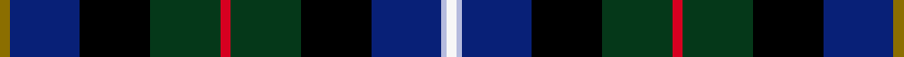

This page is one **sett** — a single exact thread-count. It belongs to the [tartan](/setts/y2db14k14dg14r2dg14k14db14lb1w2/)
(the same proportion at any scale), whose colour order is pattern [GBKGRGKBWW](/stripes/gbkgrgkbww/).

Sourced from register-of-tartans.  It is a [10 stripe tartan](/stripes/stripes10/).

Original link https://www.tartanregister.gov.uk/tartanDetails.aspx?ref=5870

2 attestations — the source records this cloth was collapsed from (oldest owns this page)

<ul>
<li>01/04/2006 — Erskine Veterans (register-of-tartans, <a href="https://www.tartanregister.gov.uk/tartanDetails.aspx?ref=5870">record</a>)  <em>A tartan to commemorate the 90th aniversary of Eskine, a charity which cares for ex-service men and women throughout Scotland. It provides an identity of which they are proud, raises awareness and money for Care Homes.</em></li>
<li>August 2006 — Erskine Veterans (Corporate) (tartans-authority, <a href="http://www.tartansauthority.com/tartan-ferret/display/7008/">record</a>)  <em>In 2005, when it was decided that the existing regiments in Scotland would be merged into the Royal Regiment of Scotland, Kinloch Anderson of Edinburgh was approached by Colonel Robert Watson with the idea of a tartan, which was a composite identity and included colours found in all existing regiments. The background to the design was the Government Tartan number 1A (known as The Black Watch), worn by the Argyll & Sutherland Highlanders. However, following a period of consultation it was decided that the new tartan would not be adopted. There was an opportunity to use the design, which relates to the heritage and history of the Scottish Regiments and adapt it one stage further to include not only the Regiments of Scotland, but also to identify dark blue as representing the Royal Nay and in addition to feature azure blue for the Royal Airforce. Erskine's Chief Executive Colonel Martin Gibson, saw the opportunity to adopt the unique Tartan and launch it as the Erskine Veterans Tartan.</em></li>
</ul>

## Register references

External register numbers recorded for this tartan.

- Scottish Register of Tartans: [5870](https://www.tartanregister.gov.uk/tartanDetails.aspx?ref=5870)
- Scottish Tartans Authority (ITI): 7008
- Scottish Tartans World Register: 3154

## Thread count
Y/4 DB28 K28 DG28 R4 DG28 K28 DB28 LB2 W/4

One full sett is **356 threads**.

## Palette
<table><thead><tr><th>Colour</th><th>Shade</th><th>OKLCh</th></tr></thead><tbody><tr><td>B</td><td><code style="background-color:#B5BBDE;">#B5BBDE</code> <small style="color:#888">#B5BBDE</small></td><td><small style="color:#888">oklch(79.9% 0.050 277.6)</small></td></tr><tr><td>DB</td><td><code style="background-color:#082077;">#082077</code> <small style="color:#888">#082077</small></td><td><small style="color:#888">oklch(30.0% 0.149 265.1)</small></td></tr><tr><td>DG</td><td><code style="background-color:#053819;">#053819</code> <small style="color:#888">#053819</small></td><td><small style="color:#888">oklch(30.0% 0.075 151.3)</small></td></tr><tr><td>K</td><td><code style="background-color:#000000;">#000000</code> <small style="color:#888">#000000</small></td><td><small style="color:#888">oklch(0.0% 0.000 0.0)</small></td></tr><tr><td>LN</td><td><code style="background-color:#F7F7F7;">#F7F7F7</code> <small style="color:#888">#F7F7F7</small></td><td><small style="color:#888">oklch(97.6% 0.000 89.9)</small></td></tr><tr><td>R</td><td><code style="background-color:#D60020;">#D60020</code> <small style="color:#888">#D60020</small></td><td><small style="color:#888">oklch(55.2% 0.224 25.5)</small></td></tr><tr><td>Y</td><td><code style="background-color:#8B6E00;">#8B6E00</code> <small style="color:#888">#8B6E00</small></td><td><small style="color:#888">oklch(55.1% 0.113 90.4)</small></td></tr></tbody></table>

# Sample pattern

## Nearest variants

The nearest existing variants by ΔTartan distance, with this cloth at the top so the swatches line up against it.

ΔTartan

Threads

Variant

Sett

—

356

<a href="/variants/s10/y2db14k14dg14r2dg14k14db14lb1w2~x2/">Erskine Veterans</a>

<a href="/ttd/edit/#slug=db22r3db2n3k14dg20dy2dg20k14db11do6~x2&amp;base=y2db14k14dg14r2dg14k14db14lb1w2~x2" title="compare in the TTD">2.85</a>

412

<a href="/variants/s11/db22r3db2n3k14dg20dy2dg20k14db11do6~x2/">Wisconsin</a>

<a href="/ttd/edit/#slug=db2r2db2w1db8k8dg8r2dg2y2~x2&amp;base=y2db14k14dg14r2dg14k14db14lb1w2~x2" title="compare in the TTD">2.96</a>

140

<a href="/variants/s10/db2r2db2w1db8k8dg8r2dg2y2~x2/">Logan Rogers</a>

<a href="/ttd/edit/#slug=db2r2db2w1db8k8dg8r2dg2ly2~x2&amp;base=y2db14k14dg14r2dg14k14db14lb1w2~x2" title="compare in the TTD">2.96</a>

140

<a href="/variants/s10/db2r2db2w1db8k8dg8r2dg2ly2~x2/">Logan Rogers (Personal)</a>

## Neighbour map

Every grey dot is one of 13620 variants placed by the first two principal components of the ΔTartan feature space (42% of its variance). Red is this tartan; blue dots are its nearest — click one to open its page.

<svg viewBox="0 0 640 380" role="img" style="max-width:100%;height:auto;border:1px solid #e0e0e0;border-radius:4px;display:block" xmlns="http://www.w3.org/2000/svg"><image href="/nn/cloud.v1.png" width="640" height="380"/><a href="/variants/s11/db22r3db2n3k14dg20dy2dg20k14db11do6~x2/"><circle cx="146.3" cy="166.2" r="4" fill="#3465a4"><title>Wisconsin</title></circle></a><a href="/variants/s10/db2r2db2w1db8k8dg8r2dg2y2~x2/"><circle cx="90.7" cy="168.4" r="4" fill="#3465a4"><title>Logan Rogers</title></circle></a><a href="/variants/s10/db2r2db2w1db8k8dg8r2dg2ly2~x2/"><circle cx="79.6" cy="164.9" r="4" fill="#3465a4"><title>Logan Rogers (Personal)</title></circle></a><circle cx="103.6" cy="150.6" r="5" fill="#c00000"/><text x="320" y="376" text-anchor="middle" font-size="11" fill="#999">ground</text><text x="11" y="190" text-anchor="middle" font-size="11" fill="#999" transform="rotate(-90 11 190)">complexity</text></svg>

ID: /variants/s10/y2db14k14dg14r2dg14k14db14lb1w2~x2/
