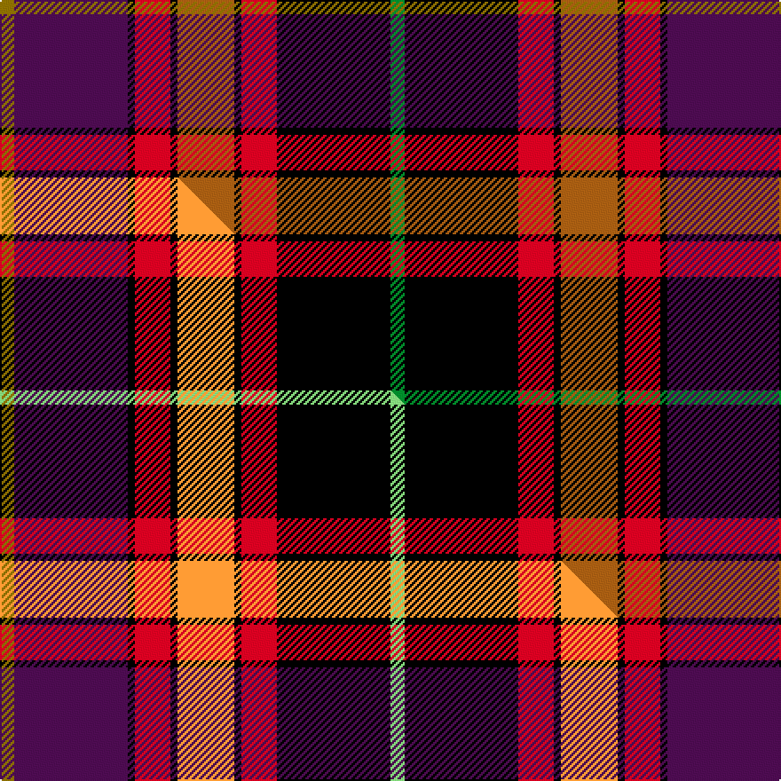

This is one **variant** — a specific cloth: this exact thread count and colourway, with its own
provenance below. It is one weaving of the [sett](/setts/y2dp16k1r5k1o8k1r5k16g2/) (the scale-free proportion — the
same cloth at any scale or shade), whose colour order is pattern [GBKRKRKRKG](/stripes/gbkrkrkrkg/).

Part of the [Tribal](/tartans/tribal/) tartan — the named design grouping this sett with its other cloths.

Sourced from register-of-tartans.  It is a [10 stripe tartan](/stripes/stripes10/).

Original link [https://www.tartanregister.gov.uk/tartanDetails.aspx?ref=4150](https://www.tartanregister.gov.uk/tartanDetails.aspx?ref=4150)

2 attestations — the source records this cloth was collapsed from (oldest owns this page)

<ul>
<li>01/01/2000 — Tribal #2 (register-of-tartans, <a href="https://www.tartanregister.gov.uk/tartanDetails.aspx?ref=4150">record</a>)  <em>Designed for Tom Todd of Tribal Tartans, North Berwick, Scotland for his wedding in October 2003 and thereafter for corporate use. Lochcarron swatch.</em></li>
<li>July 2003 — Tribal (Corporate) (tartans-authority, <a href="https://www.tartanregister.gov.uk/tartanDetails.aspx?ref=5886">record</a>)  <em>Designed for Tom Todd of Tribal Tartans, North Berwick, Scotland for his wedding in October 2003 and thereafter for corporate use. Lochcarron swatch.</em></li>
</ul>

Dataset <small>— provenance for this record, inherited from the source manifest</small>

<dl class="dataset-prov">
<dt>source</dt><dd><a href="/sources/register-of-tartans/">Scottish Register of Tartans</a></dd>
<dt>data captured from</dt><dd><a href="https://github.com/thetartan/tartan-database/blob/master/data/register-of-tartans/data.csv">https://github.com/thetartan/tartan-database/blob/master/data/register-of-tartans/data.csv</a></dd>
<dt>data date</dt><dd>2000 <small>(this record)</small></dd>
<dt>licence</dt><dd><a href="https://www.tartanregister.gov.uk/copyright">Crown copyright</a></dd>
</dl>

Capture chain <small>— the hands this data passed through, oldest first; each capture carries its own licence</small>

<ol class="capture-chain">
<li><a href="https://www.tartanregister.gov.uk/">Scottish Register of Tartans</a> · <a href="https://www.tartanregister.gov.uk/copyright">Crown copyright</a> <small>the living register — still published by National Records of Scotland</small></li>
<li><a href="https://github.com/thetartan/tartan-database">thetartan/tartan-database</a> <small>2016-2017</small> · <a href="https://creativecommons.org/licenses/by-nc-nd/4.0/">CC BY-NC-ND 4.0</a> <small>Levko Kravets's frozen compilation — the capture we vendored, and where its CC licence text came from</small></li>
<li>this dictionary <small>captured 2026-06-10 · commit 5bf86c7566</small> <small>each re-capture is a git commit to data/sources</small></li>
</ol>

## Register references

External register numbers recorded for this tartan.

- Scottish Register of Tartans: [4150](https://www.tartanregister.gov.uk/tartanDetails.aspx?ref=4150)
- Scottish Tartans Authority (ITI): 5886
- Scottish Tartans World Register: 2963

## Thread count
Y/8 DP64 K4 R20 K4 O32 K4 R20 K64 G/8

One full sett is **440 threads**.

## Palette
<table><thead><tr><th>Colour</th><th>Shade</th><th>OKLCh</th></tr></thead><tbody><tr><td>O</td><td><code style="background-color:#A65C11;">#A65C11</code> <small style="color:#888">#A65C11</small></td><td><small style="color:#888">oklch(55.0% 0.125 58.3)</small></td></tr><tr><td>G</td><td><code style="background-color:#008B2A;">#008B2A</code> <small style="color:#888">#008B2A</small></td><td><small style="color:#888">oklch(55.4% 0.170 145.9)</small></td></tr><tr><td>K</td><td><code style="background-color:#000000;">#000000</code> <small style="color:#888">#000000</small></td><td><small style="color:#888">oklch(0.0% 0.000 0.0)</small></td></tr><tr><td>DP</td><td><code style="background-color:#4B0B4F;">#4B0B4F</code> <small style="color:#888">#4B0B4F</small></td><td><small style="color:#888">oklch(30.1% 0.125 325.4)</small></td></tr><tr><td>R</td><td><code style="background-color:#D60020;">#D60020</code> <small style="color:#888">#D60020</small></td><td><small style="color:#888">oklch(55.2% 0.224 25.5)</small></td></tr><tr><td>Y</td><td><code style="background-color:#8B6E00;">#8B6E00</code> <small style="color:#888">#8B6E00</small></td><td><small style="color:#888">oklch(55.1% 0.113 90.4)</small></td></tr></tbody></table>

# Sample pattern

## Compared to the master

This cloth is one sett of its design; the master sett (the exemplar the design is anchored on) is below for comparison.

Its **ΔTartan distance** from the master is **0.08** — the same measure the nearest-tartans table ranks by (0 is identical; a re-scale of the same cloth is near 0, a recolour or a different proportion further).

<figure class="master-compare" style="margin:0">

this sett
master sett ★

<figcaption style="color:#888;font-size:smaller">One weave of this sett against the <a href="/setts/y2dp16k1r5k1lo8k1r5k16lg2/">master sett ★</a>, split on the diagonal: a shared proportion runs seamlessly across it with only the shades shifting; a different proportion breaks on it.</figcaption>
</figure>

## Nearest tartan variants

The nearest existing variants by ΔTartan distance, with this cloth at the top so the swatches line up against it.

ΔTartan

Threads

Variant

Sett

—

440

<a href="/variants/s10/y2dp16k1r5k1o8k1r5k16g2~x4/">Tribal #2</a>

<a href="/ttd/edit/#slug=y2dp16k1r5k1lo8k1r5k16lg2~x4&amp;base=y2dp16k1r5k1o8k1r5k16g2~x4" title="compare in the TTD">0.08</a>

440

<a href="/variants/s10/y2dp16k1r5k1lo8k1r5k16lg2~x4/">Tribal</a>

<a href="/ttd/edit/#slug=y3db3k2db18k26r21g2lb3~x2&amp;base=y2dp16k1r5k1o8k1r5k16g2~x4" title="compare in the TTD">2.25</a>

300

<a href="/variants/s8/y3db3k2db18k26r21g2lb3~x2/">Loch Etive</a>

<a href="/ttd/edit/#slug=db6y1r18k6r4k4dp8dg1dp8k1db5~x2~db1003265-dp1206332&amp;base=y2dp16k1r5k1o8k1r5k16g2~x4" title="compare in the TTD">2.29</a>

226

<a href="/variants/s11/db6y1r18k6r4k4dp8dg1dp8k1db5~x2~db1003265-dp1206332/">Bute Heather, Autumn</a>

<a href="/ttd/edit/#slug=dr6lb5dr23k20rii6k3r4k10dr14ri45k7ri6~rii2806019-r1807033-ri2109032&amp;base=y2dp16k1r5k1o8k1r5k16g2~x4" title="compare in the TTD">2.31</a>

286

<a href="/variants/s12/dr6lb5dr23k20rii6k3r4k10dr14ri45k7ri6~rii2806019-r1807033-ri2109032/">Sweetheart (Fashion)</a>

<a href="/ttd/edit/#slug=ly3db3k2db18k26r21g2lb3~x2&amp;base=y2dp16k1r5k1o8k1r5k16g2~x4" title="compare in the TTD">2.31</a>

300

<a href="/variants/s8/ly3db3k2db18k26r21g2lb3~x2/">Loch Etive</a>

<a href="/ttd/edit/#slug=gi2r11k3r4k7gi2k3dp4k3dp11k3dg1g1gi1~x2~gi2505139-g2408144&amp;base=y2dp16k1r5k1o8k1r5k16g2~x4" title="compare in the TTD">2.32</a>

218

<a href="/variants/s14/y2r11k3r4k7y2k3dp4k3dp11k3dg1g1y1~x2~y2505139-g2408144/">King, Garry (Personal)</a>

<a href="/ttd/edit/#slug=k25dg5k2y2ki2r3dg20r20k2w2ki2r2~x2~k0504259-ki0700000&amp;base=y2dp16k1r5k1o8k1r5k16g2~x4" title="compare in the TTD">2.38</a>

294

<a href="/variants/s12/k25dg5k2y2ki2r3dg20r20k2w2ki2r2~x2~k0504259-ki0700000/">Quebec, Plaid du</a>

<a href="/ttd/edit/#slug=dr6n5dr23k20m6k3o4k10dr14r45k7r6&amp;base=y2dp16k1r5k1o8k1r5k16g2~x4" title="compare in the TTD">2.40</a>

286

<a href="/variants/s12/dr6n5dr23k20m6k3o4k10dr14r45k7r6/">Sweetheart, The</a>

<a href="/ttd/edit/#slug=ri16r3k12dy10k3ri3y3k3db2ri2w1~x2~ri2109032-r1807008&amp;base=y2dp16k1r5k1o8k1r5k16g2~x4" title="compare in the TTD">2.44</a>

198

<a href="/variants/s11/ri16r3k12dy10k3ri3y3k3db2ri2w1~x2~ri2109032-r1807008/">Colville (Personal)</a>

<a href="/ttd/edit/#slug=r2db2k3y3r3k3dy10k12dr3r16w1~x2&amp;base=y2dp16k1r5k1o8k1r5k16g2~x4" title="compare in the TTD">2.44</a>

226

<a href="/variants/s11/r2db2k3y3r3k3dy10k12dr3r16w1~x2/">Unnamed 18th century plaid (Carlisle Museum)</a>

## Neighbour map

Every grey dot is one of 13621 variants placed by the first two principal components of the ΔTartan feature space (42% of its variance). Red is this tartan; blue dots are its nearest — click one to open its page.

<svg viewBox="0 0 640 380" role="img" style="max-width:100%;height:auto;border:1px solid #e0e0e0;border-radius:4px;display:block" xmlns="http://www.w3.org/2000/svg"><image href="/nn/cloud.v1.png" width="640" height="380"/><a href="/variants/s10/y2dp16k1r5k1lo8k1r5k16lg2~x4/"><circle cx="102.5" cy="106.2" r="4" fill="#3465a4"><title>Tribal</title></circle></a><a href="/variants/s8/y3db3k2db18k26r21g2lb3~x2/"><circle cx="125.7" cy="127.2" r="4" fill="#3465a4"><title>Loch Etive</title></circle></a><a href="/variants/s11/db6y1r18k6r4k4dp8dg1dp8k1db5~x2~db1003265-dp1206332/"><circle cx="140.3" cy="119.0" r="4" fill="#3465a4"><title>Bute Heather, Autumn</title></circle></a><a href="/variants/s12/dr6lb5dr23k20rii6k3r4k10dr14ri45k7ri6~rii2806019-r1807033-ri2109032/"><circle cx="130.4" cy="109.0" r="4" fill="#3465a4"><title>Sweetheart (Fashion)</title></circle></a><a href="/variants/s8/ly3db3k2db18k26r21g2lb3~x2/"><circle cx="121.8" cy="126.1" r="4" fill="#3465a4"><title>Loch Etive</title></circle></a><a href="/variants/s14/y2r11k3r4k7y2k3dp4k3dp11k3dg1g1y1~x2~y2505139-g2408144/"><circle cx="93.4" cy="124.2" r="4" fill="#3465a4"><title>King, Garry (Personal)</title></circle></a><a href="/variants/s12/k25dg5k2y2ki2r3dg20r20k2w2ki2r2~x2~k0504259-ki0700000/"><circle cx="137.6" cy="108.1" r="4" fill="#3465a4"><title>Quebec, Plaid du</title></circle></a><a href="/variants/s12/dr6n5dr23k20m6k3o4k10dr14r45k7r6/"><circle cx="134.6" cy="109.6" r="4" fill="#3465a4"><title>Sweetheart, The</title></circle></a><a href="/variants/s11/ri16r3k12dy10k3ri3y3k3db2ri2w1~x2~ri2109032-r1807008/"><circle cx="111.0" cy="98.9" r="4" fill="#3465a4"><title>Colville (Personal)</title></circle></a><a href="/variants/s11/r2db2k3y3r3k3dy10k12dr3r16w1~x2/"><circle cx="108.0" cy="97.9" r="4" fill="#3465a4"><title>Unnamed 18th century plaid (Carlisle Museum)</title></circle></a><circle cx="120.2" cy="111.8" r="5" fill="#c00000"/><text x="320" y="376" text-anchor="middle" font-size="11" fill="#999">ground</text><text x="11" y="190" text-anchor="middle" font-size="11" fill="#999" transform="rotate(-90 11 190)">complexity</text></svg>

ID: /variants/s10/y2dp16k1r5k1o8k1r5k16g2~x4/
