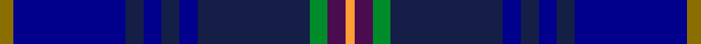

This page is one **sett** — a single exact thread-count. It belongs to the [tartan](/setts/y3dbi25db4dbi4db4dbi4db25g4dp4lo2/)
(the same proportion at any scale), whose colour order is pattern [GBBBBBBGBY](/stripes/gbbbbbbgby/).

Sourced from register-of-tartans.  It is a [10 stripe tartan](/stripes/stripes10/).

Original link https://www.tartanregister.gov.uk/tartanDetails.aspx?ref=11095

## Register references

External register numbers recorded for this tartan.

- Scottish Register of Tartans: [11095](https://www.tartanregister.gov.uk/tartanDetails.aspx?ref=11095)

## Thread count
Y/6 DBi50 DB8 DBi8 DB8 DBi8 DB50 G8 DP8 LO/4

One full sett is **306 threads**.

## Palette
<table><thead><tr><th>Colour</th><th>Shade</th><th>OKLCh</th></tr></thead><tbody><tr><td>DB</td><td><code style="background-color:#00008C;">#00008C</code> <small style="color:#888">#00008C</small></td><td><small style="color:#888">oklch(28.9% 0.200 264.1)</small></td></tr><tr><td>DB</td><td><code style="background-color:#141E46;">#141E46</code> <small style="color:#888">#141E46</small></td><td><small style="color:#888">oklch(25.2% 0.076 269.7)</small></td></tr><tr><td>G</td><td><code style="background-color:#008B2A;">#008B2A</code> <small style="color:#888">#008B2A</small></td><td><small style="color:#888">oklch(55.4% 0.170 145.9)</small></td></tr><tr><td>LO</td><td><code style="background-color:#FF9C34;">#FF9C34</code> <small style="color:#888">#FF9C34</small></td><td><small style="color:#888">oklch(77.9% 0.161 61.8)</small></td></tr><tr><td>DP</td><td><code style="background-color:#4B0B4F;">#4B0B4F</code> <small style="color:#888">#4B0B4F</small></td><td><small style="color:#888">oklch(30.1% 0.125 325.4)</small></td></tr><tr><td>Y</td><td><code style="background-color:#8B6E00;">#8B6E00</code> <small style="color:#888">#8B6E00</small></td><td><small style="color:#888">oklch(55.1% 0.113 90.4)</small></td></tr></tbody></table>

# Sample pattern

## Nearest tartan variants

The nearest existing variants by ΔTartan distance, with this cloth at the top so the swatches line up against it.

ΔTartan

Threads

Variant

Sett

—

306

<a href="/variants/s10/y3dbi25db4dbi4db4dbi4db25g4dp4lo2~x2~dbi1208266-db1003265/">Blue Peter</a>

<a href="/ttd/edit/#slug=ly3dbi24db4dbi4db20g4dp4ly2~x2~dbi1706275-db1404245&amp;base=y3dbi25db4dbi4db4dbi4db25g4dp4lo2~x2~dbi1208266-db1003265" title="compare in the TTD">2.67</a>

250

<a href="/variants/s8/ly3dbi24db4dbi4db20g4dp4ly2~x2~dbi1706275-db1404245/">Blue Peter</a>

2.86

—

<a href="/variants/s8/dy12dbi2dy2dbi30db3dbi2db13w4~x2~dbi1406275-db1204274/">Highlands School (N. Carolina) Corporate Tartan</a>

## Neighbour map

Every grey dot is one of 13620 variants placed by the first two principal components of the ΔTartan feature space (42% of its variance). Red is this tartan; blue dots are its nearest — click one to open its page.

<svg viewBox="0 0 640 380" role="img" style="max-width:100%;height:auto;border:1px solid #e0e0e0;border-radius:4px;display:block" xmlns="http://www.w3.org/2000/svg"><image href="/nn/cloud.v1.png" width="640" height="380"/><a href="/variants/s8/ly3dbi24db4dbi4db20g4dp4ly2~x2~dbi1706275-db1404245/"><circle cx="330.5" cy="216.3" r="4" fill="#3465a4"><title>Blue Peter</title></circle></a><a href="/variants/s8/dy12dbi2dy2dbi30db3dbi2db13w4~x2~dbi1406275-db1204274/"><circle cx="379.3" cy="209.9" r="4" fill="#3465a4"><title>Highlands School (N. Carolina) Corporate Tartan</title></circle></a><circle cx="325.0" cy="187.7" r="5" fill="#c00000"/><text x="320" y="376" text-anchor="middle" font-size="11" fill="#999">ground</text><text x="11" y="190" text-anchor="middle" font-size="11" fill="#999" transform="rotate(-90 11 190)">complexity</text></svg>

ID: /variants/s10/y3dbi25db4dbi4db4dbi4db25g4dp4lo2~x2~dbi1208266-db1003265/
