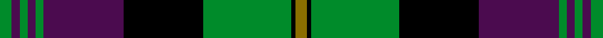

This page is one **sett** — a single exact thread-count. It belongs to the [tartan](/setts/y3k1g22k20dp20g2dp2g2dp2g3/)
(the same proportion at any scale), whose colour order is pattern [GBGBGBKGKG](/stripes/gbgbgbkgkg/).

Sourced from tartans-authority.  It is a [10 stripe tartan](/stripes/stripes10/).

Original link http://www.tartansauthority.com/tartan-ferret/display/4362/

## Register references

External register numbers recorded for this tartan.

- Scottish Tartans Authority (ITI): 4362

## Thread count
G/12 DP8 G8 DP8 G8 DP80 K80 G88 K4 Y/12

One full sett is **592 threads**.

## Palette
<table><thead><tr><th>Colour</th><th>Shade</th><th>OKLCh</th></tr></thead><tbody><tr><td>G</td><td><code style="background-color:#008B2A;">#008B2A</code> <small style="color:#888">#008B2A</small></td><td><small style="color:#888">oklch(55.4% 0.170 145.9)</small></td></tr><tr><td>K</td><td><code style="background-color:#000000;">#000000</code> <small style="color:#888">#000000</small></td><td><small style="color:#888">oklch(0.0% 0.000 0.0)</small></td></tr><tr><td>Y</td><td><code style="background-color:#8B6E00;">#8B6E00</code> <small style="color:#888">#8B6E00</small></td><td><small style="color:#888">oklch(55.1% 0.113 90.4)</small></td></tr><tr><td>DP</td><td><code style="background-color:#4B0B4F;">#4B0B4F</code> <small style="color:#888">#4B0B4F</small></td><td><small style="color:#888">oklch(30.1% 0.125 325.4)</small></td></tr></tbody></table>

# Sample pattern

## Nearest variants

The nearest existing variants by ΔTartan distance, with this cloth at the top so the swatches line up against it.

ΔTartan

Threads

Variant

Sett

—

592

<a href="/variants/s10/y3k1g22k20dp20g2dp2g2dp2g3~x4/">Urbino (Fashion)</a>

<a href="/ttd/edit/#slug=w6k1g28k24dp25g3dp3g3dp3g4~x2&amp;base=y3k1g22k20dp20g2dp2g2dp2g3~x4" title="compare in the TTD">0.58</a>

380

<a href="/variants/s10/w6k1g28k24dp25g3dp3g3dp3g4~x2/">Rennie (Personal)</a>

<a href="/ttd/edit/#slug=w6k1g29k23dp27g3dp3g3dp3g4~x2&amp;base=y3k1g22k20dp20g2dp2g2dp2g3~x4" title="compare in the TTD">0.60</a>

388

<a href="/variants/s10/w6k1g29k23dp27g3dp3g3dp3g4~x2/">Rennie</a>

<a href="/ttd/edit/#slug=w6k1g28k24dp25g3dp3g3dp3g4dp3~x2&amp;base=y3k1g22k20dp20g2dp2g2dp2g3~x4" title="compare in the TTD">1.92</a>

394

<a href="/variants/s11/w6k1g28k24dp25g3dp3g3dp3g4dp3~x2/">Rennie (Name)</a>

## Neighbour map

Every grey dot is one of 13620 variants placed by the first two principal components of the ΔTartan feature space (42% of its variance). Red is this tartan; blue dots are its nearest — click one to open its page.

<svg viewBox="0 0 640 380" role="img" style="max-width:100%;height:auto;border:1px solid #e0e0e0;border-radius:4px;display:block" xmlns="http://www.w3.org/2000/svg"><image href="/nn/cloud.v1.png" width="640" height="380"/><a href="/variants/s10/w6k1g28k24dp25g3dp3g3dp3g4~x2/"><circle cx="190.0" cy="119.3" r="4" fill="#3465a4"><title>Rennie (Personal)</title></circle></a><a href="/variants/s10/w6k1g29k23dp27g3dp3g3dp3g4~x2/"><circle cx="194.7" cy="117.3" r="4" fill="#3465a4"><title>Rennie</title></circle></a><a href="/variants/s11/w6k1g28k24dp25g3dp3g3dp3g4dp3~x2/"><circle cx="188.3" cy="113.1" r="4" fill="#3465a4"><title>Rennie (Name)</title></circle></a><circle cx="200.6" cy="126.9" r="5" fill="#c00000"/><text x="320" y="376" text-anchor="middle" font-size="11" fill="#999">ground</text><text x="11" y="190" text-anchor="middle" font-size="11" fill="#999" transform="rotate(-90 11 190)">complexity</text></svg>

ID: /variants/s10/y3k1g22k20dp20g2dp2g2dp2g3~x4/
