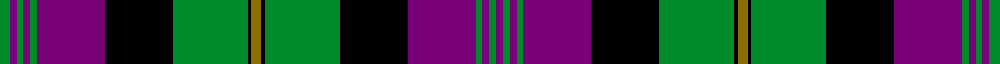

This page is one **sett** — a single exact thread-count. It belongs to the [tartan](/setts/y3k1g22k20dp20g2dp2g2dp2g3/)
(the same proportion at any scale), whose colour order is pattern [BGBGBKGKGKGKBGBGBG](/stripes/bgbgbkgkgkgkbgbgbg/).

Sourced from register-of-tartans.  It is a [18 stripe tartan](/stripes/stripes18/).

Original link https://www.tartanregister.gov.uk/tartanDetails.aspx?ref=4428

## Register references

External register numbers recorded for this tartan.

- Scottish Register of Tartans: [4428](https://www.tartanregister.gov.uk/tartanDetails.aspx?ref=4428)
- Scottish Tartans Authority (ITI): 4362

## Thread count
G/12 DP8 G8 DP8 G8 DP80 K80 G88 K4 Y12 K4 G88 K80 DP80 G8 DP8 G8 DP/8

One full sett is **1164 threads**.

## Palette
<table><thead><tr><th>Colour</th><th>Shade</th><th>OKLCh</th></tr></thead><tbody><tr><td>DP</td><td><code style="background-color:#4C1864;">#4C1864</code> <small style="color:#888">#4C1864</small></td><td><small style="color:#888">oklch(33.1% 0.131 312.8)</small></td></tr><tr><td>G</td><td><code style="background-color:#008B2A;">#008B2A</code> <small style="color:#888">#008B2A</small></td><td><small style="color:#888">oklch(55.4% 0.170 145.9)</small></td></tr><tr><td>K</td><td><code style="background-color:#000000;">#000000</code> <small style="color:#888">#000000</small></td><td><small style="color:#888">oklch(0.0% 0.000 0.0)</small></td></tr><tr><td>Y</td><td><code style="background-color:#8B6E00;">#8B6E00</code> <small style="color:#888">#8B6E00</small></td><td><small style="color:#888">oklch(55.1% 0.113 90.4)</small></td></tr><tr><td>DP</td><td><code style="background-color:#780078;">#780078</code> <small style="color:#888">#780078</small></td><td><small style="color:#888">oklch(40.2% 0.185 328.4)</small></td></tr></tbody></table>

# Sample pattern

ID: /variants/s10/y3k1g22k20dp20g2dp2g2dp2g3~x4~dp1607327/
