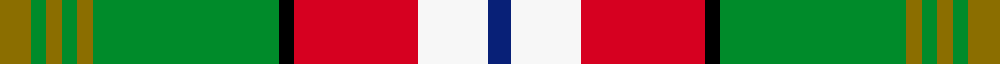
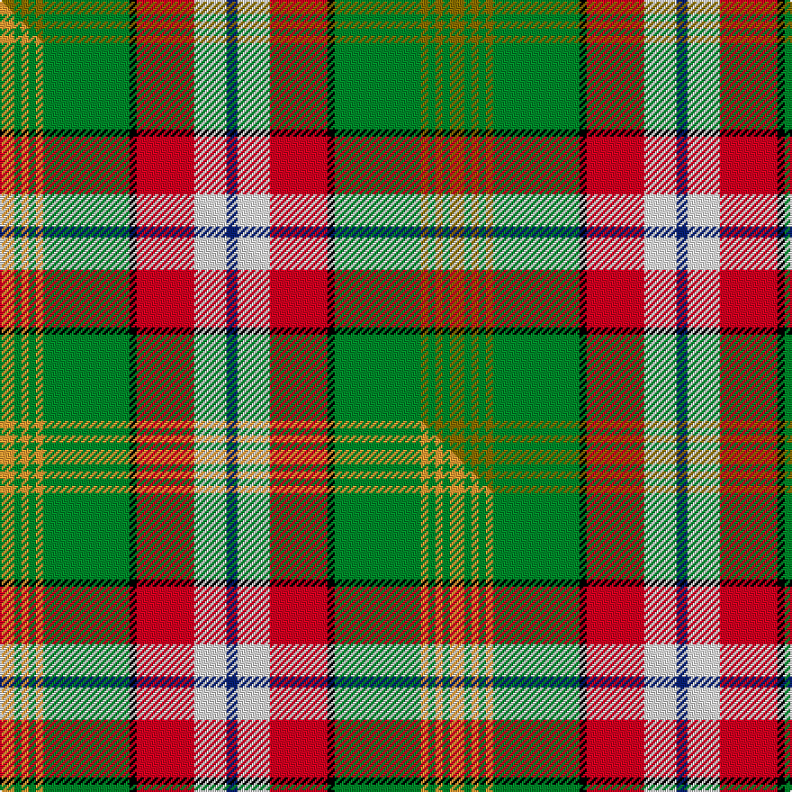

This page is one **sett** — a single exact thread-count. It belongs to the [tartan](/setts/y4g2y2g2y2g24k2r16w9db3/)
(the same proportion at any scale), whose colour order is pattern [BWRKGGGGGG](/stripes/bwrkgggggg/).

Part of the [North West Territories](/tartans/north-west-territories/) tartan — the named design grouping this sett with its other cloths.

Sourced from weddslist.  It is a [10 stripe tartan](/stripes/stripes10/).

Original link [http://www.weddslist.com/cgi-bin/tartans/pg.pl?source=sts](http://www.weddslist.com/cgi-bin/tartans/pg.pl?source=sts)

## Provenance

Earliest known date: 1969 Designed at the request of an official of the Canadian Commission who decreed that the predominant colours should be "Green and White - White for the snow covering the Territories for six months of every year and the Green for the other six months."

2 attestations — the source records this cloth was collapsed from (oldest owns this page)

<ul>
<li>undated — North West Territories (weddslist, <a href="http://www.weddslist.com/cgi-bin/tartans/pg.pl?source=sts">record</a>) </li>
<li>undated — North West Territories Canadian District Tartan (house-of-tartan, <a href="http://www.house-of-tartan.scotland.net/house/TartanViewjs.asp?colr=Def&tnam=662">record</a>) </li>
</ul>

Dataset <small>— provenance for this record, inherited from the source manifest</small>

<dl class="dataset-prov">
<dt>source</dt><dd><a href="/sources/weddslist/">Weddslist</a></dd>
<dt>data captured from</dt><dd><a href="https://github.com/thetartan/tartan-database/blob/master/data/weddslist/data.csv">https://github.com/thetartan/tartan-database/blob/master/data/weddslist/data.csv</a></dd>
<dt>data date</dt><dd>2016-11-17 <small>(dataset default)</small></dd>
<dt>licence</dt><dd><a href="https://creativecommons.org/licenses/by-nc-nd/4.0/">CC BY-NC-ND 4.0</a></dd>
</dl>

Capture chain <small>— the hands this data passed through, oldest first; each capture carries its own licence</small>

<ol class="capture-chain">
<li><a href="https://www.weddslist.com/tartans/">Weddslist</a> <small>the living privately compiled reference</small></li>
<li><a href="https://github.com/thetartan/tartan-database">thetartan/tartan-database</a> <small>2016-2017</small> · <a href="https://creativecommons.org/licenses/by-nc-nd/4.0/">CC BY-NC-ND 4.0</a> <small>Levko Kravets's frozen compilation — the capture we vendored, and where its CC licence text came from</small></li>
<li>this dictionary <small>captured 2026-06-10 · commit 5bf86c7566</small> <small>each re-capture is a git commit to data/sources</small></li>
</ol>

## Thread count
Y/8 G4 Y4 G4 Y4 G48 K4 R32 W18 DB/6

One full sett is **250 threads**.

## Palette
<table><thead><tr><th>Colour</th><th>Shade</th><th>OKLCh</th></tr></thead><tbody><tr><td>DB</td><td><code style="background-color:#082077;">#082077</code> <small style="color:#888">#082077</small></td><td><small style="color:#888">oklch(30.0% 0.149 265.1)</small></td></tr><tr><td>G</td><td><code style="background-color:#008B2A;">#008B2A</code> <small style="color:#888">#008B2A</small></td><td><small style="color:#888">oklch(55.4% 0.170 145.9)</small></td></tr><tr><td>K</td><td><code style="background-color:#000000;">#000000</code> <small style="color:#888">#000000</small></td><td><small style="color:#888">oklch(0.0% 0.000 0.0)</small></td></tr><tr><td>W</td><td><code style="background-color:#F7F7F7;">#F7F7F7</code> <small style="color:#888">#F7F7F7</small></td><td><small style="color:#888">oklch(97.6% 0.000 89.9)</small></td></tr><tr><td>R</td><td><code style="background-color:#D60020;">#D60020</code> <small style="color:#888">#D60020</small></td><td><small style="color:#888">oklch(55.2% 0.224 25.5)</small></td></tr><tr><td>Y</td><td><code style="background-color:#8B6E00;">#8B6E00</code> <small style="color:#888">#8B6E00</small></td><td><small style="color:#888">oklch(55.1% 0.113 90.4)</small></td></tr></tbody></table>

# Sample pattern

## Compared to the master

This cloth is one sett of its design; the master sett (the exemplar the design is anchored on) is below for comparison.

Its **ΔTartan distance** from the master is **0.90** — the same measure the nearest-tartans table ranks by (0 is identical; a re-scale of the same cloth is near 0, a recolour or a different proportion further).

<figure class="master-compare" style="margin:0">

this sett
master sett ★

<figcaption style="color:#888;font-size:smaller">One weave of this sett against the <a href="/setts/lo4g2lo2g2lo2g24k2r16w9db3/">master sett ★</a>, split on the diagonal: a shared proportion runs seamlessly across it with only the shades shifting; a different proportion breaks on it.</figcaption>
</figure>

## Nearest tartan variants

The nearest existing variants by ΔTartan distance, with this cloth at the top so the swatches line up against it.

ΔTartan

Threads

Variant

Sett

—

250

<a href="/variants/s10/y4g2y2g2y2g24k2r16w9db3~x2/">North West Territories</a>

<a href="/ttd/edit/#slug=lo4g2lo2g2lo2g24k2r16w9db3~x2&amp;base=y4g2y2g2y2g24k2r16w9db3~x2" title="compare in the TTD">0.90</a>

250

<a href="/variants/s10/lo4g2lo2g2lo2g24k2r16w9db3~x2/">North West Territories (District)</a>

<a href="/ttd/edit/#slug=lo4g2lo2g2lo2g24k2r16w9db3~x2~w3600000&amp;base=y4g2y2g2y2g24k2r16w9db3~x2" title="compare in the TTD">0.90</a>

250

<a href="/variants/s10/lo4g2lo2g2lo2g24k2r16w9db3~x2~w3600000/">North West Territories</a>

<a href="/ttd/edit/#slug=lb4r3y2r9lb3g24lb3r9k3r3w2~x2&amp;base=y4g2y2g2y2g24k2r16w9db3~x2" title="compare in the TTD">1.93</a>

248

<a href="/variants/s11/lb4r3y2r9lb3g24lb3r9k3r3w2~x2/">Wilson's, No 128</a>

<a href="/ttd/edit/#slug=w3lb25dr3r3dr3r8g21dr3k2~x2&amp;base=y4g2y2g2y2g24k2r16w9db3~x2" title="compare in the TTD">2.38</a>

274

<a href="/variants/s9/w3lb25dr3r3dr3r8g21dr3k2~x2/">Dunedin (USA) (District)</a>

<a href="/ttd/edit/#slug=w2r16k1lb2k1y4k1lb2k1g16lb1~x4&amp;base=y4g2y2g2y2g24k2r16w9db3~x2" title="compare in the TTD">2.57</a>

364

<a href="/variants/s11/w2r16k1lb2k1y4k1lb2k1g16lb1~x4/">Baxter (Clan)</a>

<a href="/ttd/edit/#slug=w2r16k1lb2k1y4k1lb2k1g16lb1~x2&amp;base=y4g2y2g2y2g24k2r16w9db3~x2" title="compare in the TTD">2.57</a>

182

<a href="/variants/s11/w2r16k1lb2k1y4k1lb2k1g16lb1~x2/">Baxter of Balgavies</a>

<a href="/ttd/edit/#slug=lo2lb14k1g11k2r2gi2k1~x4~g2508144-gi2604158&amp;base=y4g2y2g2y2g24k2r16w9db3~x2" title="compare in the TTD">2.59</a>

268

<a href="/variants/s8/lo2lb14k1g11k2r2gi2k1~x4~g2508144-gi2604158/">Mission (District)</a>

<a href="/ttd/edit/#slug=k3g3dy28ly3dy3ly28db3lyi2~x2~dy1603076-lyi3307090&amp;base=y4g2y2g2y2g24k2r16w9db3~x2" title="compare in the TTD">2.61</a>

282

<a href="/variants/s8/k3g3dy28ly3dy3ly28db3lyi2~x2~dy1603076-lyi3307090/">California Highway Patrol (Corporate</a>

<a href="/ttd/edit/#slug=g2k1g9ly3lb1k3lb1r3ly9lo1ly2~x4&amp;base=y4g2y2g2y2g24k2r16w9db3~x2" title="compare in the TTD">2.61</a>

264

<a href="/variants/s11/g2k1g9ly3lb1k3lb1r3ly9lo1ly2~x4/">Asman, Day Tan (Name)</a>

<a href="/ttd/edit/#slug=w4lb5lo3lb22dy4k3g16lo7k2lo7dy2~x2&amp;base=y4g2y2g2y2g24k2r16w9db3~x2" title="compare in the TTD">2.66</a>

288

<a href="/variants/s11/w4lb5lo3lb22dy4k3g16lo7k2lo7dy2~x2/">Cossar (Personal)</a>

## Neighbour map

Every grey dot is one of 13621 variants placed by the first two principal components of the ΔTartan feature space (42% of its variance). Red is this tartan; blue dots are its nearest — click one to open its page.

<svg viewBox="0 0 640 380" role="img" style="max-width:100%;height:auto;border:1px solid #e0e0e0;border-radius:4px;display:block" xmlns="http://www.w3.org/2000/svg"><image href="/nn/cloud.v1.png" width="640" height="380"/><a href="/variants/s10/lo4g2lo2g2lo2g24k2r16w9db3~x2/"><circle cx="152.7" cy="123.8" r="4" fill="#3465a4"><title>North West Territories (District)</title></circle></a><a href="/variants/s10/lo4g2lo2g2lo2g24k2r16w9db3~x2~w3600000/"><circle cx="159.5" cy="125.9" r="4" fill="#3465a4"><title>North West Territories</title></circle></a><a href="/variants/s11/lb4r3y2r9lb3g24lb3r9k3r3w2~x2/"><circle cx="153.4" cy="125.5" r="4" fill="#3465a4"><title>Wilson's, No 128</title></circle></a><a href="/variants/s9/w3lb25dr3r3dr3r8g21dr3k2~x2/"><circle cx="134.8" cy="135.5" r="4" fill="#3465a4"><title>Dunedin (USA) (District)</title></circle></a><a href="/variants/s11/w2r16k1lb2k1y4k1lb2k1g16lb1~x4/"><circle cx="143.2" cy="96.8" r="4" fill="#3465a4"><title>Baxter (Clan)</title></circle></a><a href="/variants/s11/w2r16k1lb2k1y4k1lb2k1g16lb1~x2/"><circle cx="143.2" cy="96.8" r="4" fill="#3465a4"><title>Baxter of Balgavies</title></circle></a><a href="/variants/s8/lo2lb14k1g11k2r2gi2k1~x4~g2508144-gi2604158/"><circle cx="145.5" cy="128.3" r="4" fill="#3465a4"><title>Mission (District)</title></circle></a><a href="/variants/s8/k3g3dy28ly3dy3ly28db3lyi2~x2~dy1603076-lyi3307090/"><circle cx="204.3" cy="122.4" r="4" fill="#3465a4"><title>California Highway Patrol (Corporate</title></circle></a><a href="/variants/s11/g2k1g9ly3lb1k3lb1r3ly9lo1ly2~x4/"><circle cx="119.3" cy="148.1" r="4" fill="#3465a4"><title>Asman, Day Tan (Name)</title></circle></a><a href="/variants/s11/w4lb5lo3lb22dy4k3g16lo7k2lo7dy2~x2/"><circle cx="104.9" cy="142.3" r="4" fill="#3465a4"><title>Cossar (Personal)</title></circle></a><circle cx="158.5" cy="126.7" r="5" fill="#c00000"/><text x="320" y="376" text-anchor="middle" font-size="11" fill="#999">ground</text><text x="11" y="190" text-anchor="middle" font-size="11" fill="#999" transform="rotate(-90 11 190)">complexity</text></svg>

ID: /variants/s10/y4g2y2g2y2g24k2r16w9db3~x2/
