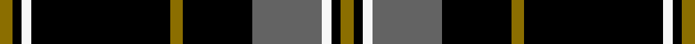

This page is one **sett** — a single exact thread-count. It belongs to the [tartan](/setts/y4k3w3k44y4k22n22w3k3y4/)
(the same proportion at any scale), whose colour order is pattern [GKWBKGKWKG](/stripes/gkwbkgkwkg/).

Sourced from register-of-tartans.  It is a [10 stripe tartan](/stripes/stripes10/).

Original link https://www.tartanregister.gov.uk/tartanDetails.aspx?ref=11159

## Register references

External register numbers recorded for this tartan.

- Scottish Register of Tartans: [11159](https://www.tartanregister.gov.uk/tartanDetails.aspx?ref=11159)

## Thread count
Y/4 K3 W3 K44 Y4 K22 N22 W3 K3 Y/4

One full sett is **216 threads**.

## Palette
<table><thead><tr><th>Colour</th><th>Shade</th><th>OKLCh</th></tr></thead><tbody><tr><td>K</td><td><code style="background-color:#000000;">#000000</code> <small style="color:#888">#000000</small></td><td><small style="color:#888">oklch(0.0% 0.000 0.0)</small></td></tr><tr><td>N</td><td><code style="background-color:#636363;">#636363</code> <small style="color:#888">#636363</small></td><td><small style="color:#888">oklch(50.0% 0.000 89.9)</small></td></tr><tr><td>W</td><td><code style="background-color:#F7F7F7;">#F7F7F7</code> <small style="color:#888">#F7F7F7</small></td><td><small style="color:#888">oklch(97.6% 0.000 89.9)</small></td></tr><tr><td>Y</td><td><code style="background-color:#8B6E00;">#8B6E00</code> <small style="color:#888">#8B6E00</small></td><td><small style="color:#888">oklch(55.1% 0.113 90.4)</small></td></tr></tbody></table>

# Sample pattern

## Nearest variants

The nearest existing variants by ΔTartan distance, with this cloth at the top so the swatches line up against it.

ΔTartan

Threads

Variant

Sett

—

216

<a href="/variants/s10/y4k3w3k44y4k22n22w3k3y4/">Ashers of Nairn</a>

<a href="/ttd/edit/#slug=ly8k7r3k7r3k38w2k3ly6~x2&amp;base=y4k3w3k44y4k22n22w3k3y4" title="compare in the TTD">1.88</a>

280

<a href="/variants/s9/ly8k7r3k7r3k38w2k3ly6~x2/">Bunnahabhain</a>

<a href="/ttd/edit/#slug=ly2k3w3k44ly4k22lb22w3k3ly2&amp;base=y4k3w3k44y4k22n22w3k3y4" title="compare in the TTD">2.38</a>

212

<a href="/variants/s10/ly2k3w3k44ly4k22lb22w3k3ly2/">Ashers of Nairn</a>

<a href="/ttd/edit/#slug=w5k3y6k5w3k30y2~x2&amp;base=y4k3w3k44y4k22n22w3k3y4" title="compare in the TTD">2.67</a>

202

<a href="/variants/s7/w5k3y6k5w3k30y2~x2/">Northern Kentucky University</a>

<a href="/ttd/edit/#slug=k1n2k7n11k18y2k1~x2&amp;base=y4k3w3k44y4k22n22w3k3y4" title="compare in the TTD">2.72</a>

164

<a href="/variants/s7/k1n2k7n11k18y2k1~x2/">DDB Canada (Fashion)</a>

## Neighbour map

Every grey dot is one of 13620 variants placed by the first two principal components of the ΔTartan feature space (42% of its variance). Red is this tartan; blue dots are its nearest — click one to open its page.

<svg viewBox="0 0 640 380" role="img" style="max-width:100%;height:auto;border:1px solid #e0e0e0;border-radius:4px;display:block" xmlns="http://www.w3.org/2000/svg"><image href="/nn/cloud.v1.png" width="640" height="380"/><a href="/variants/s9/ly8k7r3k7r3k38w2k3ly6~x2/"><circle cx="361.2" cy="105.6" r="4" fill="#3465a4"><title>Bunnahabhain</title></circle></a><a href="/variants/s10/ly2k3w3k44ly4k22lb22w3k3ly2/"><circle cx="334.9" cy="104.9" r="4" fill="#3465a4"><title>Ashers of Nairn</title></circle></a><a href="/variants/s7/w5k3y6k5w3k30y2~x2/"><circle cx="368.0" cy="144.0" r="4" fill="#3465a4"><title>Northern Kentucky University</title></circle></a><a href="/variants/s7/k1n2k7n11k18y2k1~x2/"><circle cx="359.0" cy="155.8" r="4" fill="#3465a4"><title>DDB Canada (Fashion)</title></circle></a><circle cx="309.9" cy="123.1" r="5" fill="#c00000"/><text x="320" y="376" text-anchor="middle" font-size="11" fill="#999">ground</text><text x="11" y="190" text-anchor="middle" font-size="11" fill="#999" transform="rotate(-90 11 190)">complexity</text></svg>

ID: /variants/s10/y4k3w3k44y4k22n22w3k3y4/
