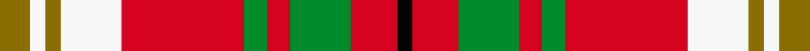

This is one **variant** — a specific cloth: this exact thread count and colourway, with its own
provenance below. It is one weaving of the [sett](/setts/y4w2y2w8r16g3r3g8r6k2/) (the scale-free proportion — the
same cloth at any scale or shade), whose colour order is pattern [GWGWRGRGRK](/stripes/gwgwrgrgrk/).

Part of the [Carolyn Melieres](/tartans/c/ca/carolyn-melieres/) tartan — the named design grouping this sett with its other cloths.

Sourced from house-of-tartan.  It is a [10 stripe tartan](/stripes/stripes10/).

Original link [http://www.house-of-tartan.scotland.net/house/TartanViewjs.asp?colr=Def&tnam=1171](http://www.house-of-tartan.scotland.net/house/TartanViewjs.asp?colr=Def&tnam=1171)

## Provenance

Earliest known date: 1966 A sample of this tartan was recorded by the Scottish Tartans Society during the period 1970 to 1990.

4 attestations — the source records this cloth was collapsed from (oldest owns this page)

<ul>
<li>1966 — Carolyn Melieres Family Tartan (house-of-tartan, <a href="http://www.house-of-tartan.scotland.net/house/TartanViewjs.asp?colr=Def&tnam=1171">record</a>) </li>
<li>01/01/1990 — Melieres, Carolyn (Personal) (register-of-tartans, <a href="https://www.tartanregister.gov.uk/tartanDetails.aspx?ref=2911">record</a>)  <em>See #1168 (original Scottish Tartans Authority reference) for full explanation. A sample of this tartan was recorded by the Scottish Tartans Society during the period 1970 to 1990. Canadian.</em></li>
<li>pre 1990 — Melieres, Carolyn (Personal) (tartans-authority, <a href="https://www.tartanregister.gov.uk/tartanDetails.aspx?ref=1171">record</a>)  <em>See #1168 for full explanation.</em></li>
<li>undated — Carolyn, Melieres (weddslist, <a href="http://www.weddslist.com/cgi-bin/tartans/pg.pl?source=sts">record</a>) </li>
</ul>

Dataset <small>— provenance for this record, inherited from the source manifest</small>

<dl class="dataset-prov">
<dt>source</dt><dd><a href="/sources/house-of-tartan/">House of Tartan</a></dd>
<dt>data captured from</dt><dd><a href="https://github.com/thetartan/tartan-database/blob/master/data/house-of-tartan/data.csv">https://github.com/thetartan/tartan-database/blob/master/data/house-of-tartan/data.csv</a></dd>
<dt>data date</dt><dd>1966 <small>(this record)</small></dd>
<dt>licence</dt><dd><a href="https://creativecommons.org/licenses/by-nc-nd/4.0/">CC BY-NC-ND 4.0</a></dd>
</dl>

Capture chain <small>— the hands this data passed through, oldest first; each capture carries its own licence</small>

<ol class="capture-chain">
<li><a href="http://www.house-of-tartan.scotland.net/">House of Tartan</a> <small>the weaver/retailer's database — the site is now offline; the URL is kept as the ultimate source's identity</small></li>
<li><a href="https://github.com/thetartan/tartan-database">thetartan/tartan-database</a> <small>2016-2017</small> · <a href="https://creativecommons.org/licenses/by-nc-nd/4.0/">CC BY-NC-ND 4.0</a> <small>Levko Kravets's frozen compilation — the capture we vendored, and where its CC licence text came from</small></li>
<li>this dictionary <small>captured 2026-06-10 · commit 5bf86c7566</small> <small>each re-capture is a git commit to data/sources</small></li>
</ol>

## Register references

External register numbers recorded for this tartan.

- Scottish Register of Tartans: [2911](https://www.tartanregister.gov.uk/tartanDetails.aspx?ref=2911)
- Scottish Tartans Authority (ITI): 1171
- Scottish Tartans World Register: 1171

## Thread count
Y/8 W4 Y4 W16 R32 G6 R6 G16 R12 K/4

One full sett is **204 threads**.

## Palette
<table><thead><tr><th>Colour</th><th>Shade</th><th>OKLCh</th></tr></thead><tbody><tr><td>G</td><td><code style="background-color:#008B2A;">#008B2A</code> <small style="color:#888">#008B2A</small></td><td><small style="color:#888">oklch(55.4% 0.170 145.9)</small></td></tr><tr><td>K</td><td><code style="background-color:#000000;">#000000</code> <small style="color:#888">#000000</small></td><td><small style="color:#888">oklch(0.0% 0.000 0.0)</small></td></tr><tr><td>W</td><td><code style="background-color:#F7F7F7;">#F7F7F7</code> <small style="color:#888">#F7F7F7</small></td><td><small style="color:#888">oklch(97.6% 0.000 89.9)</small></td></tr><tr><td>R</td><td><code style="background-color:#D60020;">#D60020</code> <small style="color:#888">#D60020</small></td><td><small style="color:#888">oklch(55.2% 0.224 25.5)</small></td></tr><tr><td>Y</td><td><code style="background-color:#8B6E00;">#8B6E00</code> <small style="color:#888">#8B6E00</small></td><td><small style="color:#888">oklch(55.1% 0.113 90.4)</small></td></tr></tbody></table>

# Sample pattern

## Nearest tartan variants

The nearest existing variants by ΔTartan distance, with this cloth at the top so the swatches line up against it.

ΔTartan

Threads

Variant

Sett

—

204

<a href="/variants/s10/y4w2y2w8r16g3r3g8r6k2~x2/">Carolyn Melieres Family Tartan</a>

<a href="/ttd/edit/#slug=g3w1g6r2dp2r1k2r10g1r2~x8&amp;base=y4w2y2w8r16g3r3g8r6k2~x2" title="compare in the TTD">2.46</a>

440

<a href="/variants/s10/g3w1g6r2dp2r1k2r10g1r2~x8/">Seton (Clan)</a>

<a href="/ttd/edit/#slug=y4r1y4ly1k1r6w1r4w1r6k1ly1y4w1~x8&amp;base=y4w2y2w8r16g3r3g8r6k2~x2" title="compare in the TTD">2.79</a>

536

<a href="/variants/s14/y4r1y4ly1k1r6w1r4w1r6k1ly1y4w1~x8/">Ogilvie - 1893 (Clan)</a>

<a href="/ttd/edit/#slug=lb1k1r10g10k5lb5r10k1lb1~x4&amp;base=y4w2y2w8r16g3r3g8r6k2~x2" title="compare in the TTD">2.86</a>

344

<a href="/variants/s9/lb1k1r10g10k5lb5r10k1lb1~x4/">Graham Red</a>

<a href="/ttd/edit/#slug=k2r1g8r3g3r14y1r1w2~x2&amp;base=y4w2y2w8r16g3r3g8r6k2~x2" title="compare in the TTD">2.86</a>

132

<a href="/variants/s9/k2r1g8r3g3r14y1r1w2~x2/">Melieres, Michel (Personal)</a>

<a href="/ttd/edit/#slug=lr24p3lr8p5k3r3k3lr3k3o24r4~x2&amp;base=y4w2y2w8r16g3r3g8r6k2~x2" title="compare in the TTD">2.88</a>

276

<a href="/variants/s11/lr24p3lr8p5k3r3k3lr3k3o24r4~x2/">Kerry (WCWM)</a>

<a href="/ttd/edit/#slug=r20k5g5r5w5n3g3~x4&amp;base=y4w2y2w8r16g3r3g8r6k2~x2" title="compare in the TTD">2.92</a>

276

<a href="/variants/s7/r20k5g5r5w5n3g3~x4/">Mangles, Peter and Annette (Personal)</a>

<a href="/ttd/edit/#slug=r12w2ly3w2r3k5r2ly18w2~x2&amp;base=y4w2y2w8r16g3r3g8r6k2~x2" title="compare in the TTD">2.94</a>

168

<a href="/variants/s9/r12w2ly3w2r3k5r2ly18w2~x2/">Ballater Trade or 'Fancy' Tartan</a>

<a href="/ttd/edit/#slug=w2k2r14g15k8w7r14k2w2&amp;base=y4w2y2w8r16g3r3g8r6k2~x2" title="compare in the TTD">2.98</a>

128

<a href="/variants/s9/w2k2r14g15k8w7r14k2w2/">Montrose</a>

<a href="/ttd/edit/#slug=k4r3g2db2r6g15r2db4g2r15g7k2r4w2~x2&amp;base=y4w2y2w8r16g3r3g8r6k2~x2" title="compare in the TTD">2.98</a>

268

<a href="/variants/s14/k4r3g2db2r6g15r2db4g2r15g7k2r4w2~x2/">MacKinnon #5</a>

<a href="/ttd/edit/#slug=db2r11g2r11g21r2k9lb2db11r11g2r11db2~x2&amp;base=y4w2y2w8r16g3r3g8r6k2~x2" title="compare in the TTD">3.01</a>

380

<a href="/variants/s13/db2r11g2r11g21r2k9lb2db11r11g2r11db2~x2/">Nicholson Clan Tartan</a>

## Neighbour map

Every grey dot is one of 13656 variants placed by the first two principal components of the ΔTartan feature space (42% of its variance). Red is this tartan; blue dots are its nearest — click one to open its page. The map is a flat projection of a many-dimensional space — [how to read it](/posts/neighbourhood-maps/).

<svg viewBox="0 0 640 380" role="img" style="max-width:100%;height:auto;border:1px solid #e0e0e0;border-radius:4px;display:block" xmlns="http://www.w3.org/2000/svg"><image href="/nn/cloud.v1.png" width="640" height="380"/><a href="/variants/s10/g3w1g6r2dp2r1k2r10g1r2~x8/"><circle cx="218.2" cy="148.6" r="4" fill="#3465a4"><title>Seton (Clan)</title></circle></a><a href="/variants/s14/y4r1y4ly1k1r6w1r4w1r6k1ly1y4w1~x8/"><circle cx="187.5" cy="173.5" r="4" fill="#3465a4"><title>Ogilvie - 1893 (Clan)</title></circle></a><a href="/variants/s9/lb1k1r10g10k5lb5r10k1lb1~x4/"><circle cx="177.3" cy="170.0" r="4" fill="#3465a4"><title>Graham Red</title></circle></a><a href="/variants/s9/k2r1g8r3g3r14y1r1w2~x2/"><circle cx="266.1" cy="128.8" r="4" fill="#3465a4"><title>Melieres, Michel (Personal)</title></circle></a><a href="/variants/s11/lr24p3lr8p5k3r3k3lr3k3o24r4~x2/"><circle cx="165.4" cy="141.1" r="4" fill="#3465a4"><title>Kerry (WCWM)</title></circle></a><a href="/variants/s7/r20k5g5r5w5n3g3~x4/"><circle cx="204.7" cy="174.5" r="4" fill="#3465a4"><title>Mangles, Peter and Annette (Personal)</title></circle></a><a href="/variants/s9/r12w2ly3w2r3k5r2ly18w2~x2/"><circle cx="185.3" cy="161.2" r="4" fill="#3465a4"><title>Ballater Trade or 'Fancy' Tartan</title></circle></a><a href="/variants/s9/w2k2r14g15k8w7r14k2w2/"><circle cx="136.4" cy="184.5" r="4" fill="#3465a4"><title>Montrose</title></circle></a><a href="/variants/s14/k4r3g2db2r6g15r2db4g2r15g7k2r4w2~x2/"><circle cx="157.3" cy="151.2" r="4" fill="#3465a4"><title>MacKinnon #5</title></circle></a><a href="/variants/s13/db2r11g2r11g21r2k9lb2db11r11g2r11db2~x2/"><circle cx="174.3" cy="147.4" r="4" fill="#3465a4"><title>Nicholson Clan Tartan</title></circle></a><circle cx="163.8" cy="168.5" r="5" fill="#c00000"/><text x="320" y="376" text-anchor="middle" font-size="11" fill="#999">ground</text><text x="11" y="190" text-anchor="middle" font-size="11" fill="#999" transform="rotate(-90 11 190)">complexity</text></svg>

ID: /variants/s10/y4w2y2w8r16g3r3g8r6k2~x2/
