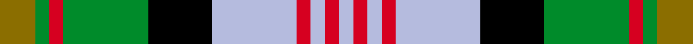

This page is one **sett** — a single exact thread-count. It belongs to the [tartan](/setts/y5g2r2g12k9lb12r2lb2r2lb2/)
(the same proportion at any scale), whose colour order is pattern [GGRGKWRWRW](/stripes/ggrgkwrwrw/).

Sourced from tartans-authority.  It is a [10 stripe tartan](/stripes/stripes10/).

Original link http://www.tartansauthority.com/tartan-ferret/display/5441/

## Register references

External register numbers recorded for this tartan.

- Scottish Tartans Authority (ITI): 5441

## Thread count
Y/10 G4 R4 G24 K18 LB24 R4 LB4 R4 LB/4

One full sett is **186 threads**.

## Palette
<table><thead><tr><th>Colour</th><th>Shade</th><th>OKLCh</th></tr></thead><tbody><tr><td>LB</td><td><code style="background-color:#B5BBDE;">#B5BBDE</code> <small style="color:#888">#B5BBDE</small></td><td><small style="color:#888">oklch(79.9% 0.050 277.6)</small></td></tr><tr><td>G</td><td><code style="background-color:#008B2A;">#008B2A</code> <small style="color:#888">#008B2A</small></td><td><small style="color:#888">oklch(55.4% 0.170 145.9)</small></td></tr><tr><td>K</td><td><code style="background-color:#000000;">#000000</code> <small style="color:#888">#000000</small></td><td><small style="color:#888">oklch(0.0% 0.000 0.0)</small></td></tr><tr><td>R</td><td><code style="background-color:#D60020;">#D60020</code> <small style="color:#888">#D60020</small></td><td><small style="color:#888">oklch(55.2% 0.224 25.5)</small></td></tr><tr><td>Y</td><td><code style="background-color:#8B6E00;">#8B6E00</code> <small style="color:#888">#8B6E00</small></td><td><small style="color:#888">oklch(55.1% 0.113 90.4)</small></td></tr></tbody></table>

# Sample pattern

## Nearest tartan variants

The nearest existing variants by ΔTartan distance, with this cloth at the top so the swatches line up against it.

ΔTartan

Threads

Variant

Sett

—

186

<a href="/variants/s10/y5g2r2g12k9lb12r2lb2r2lb2~x2/">Lobban (Personal)</a>

<a href="/ttd/edit/#slug=g8r1g2r3g12k12dy1lb12r3lb2r1lb8~x2&amp;base=y5g2r2g12k9lb12r2lb2r2lb2~x2" title="compare in the TTD">2.19</a>

228

<a href="/variants/s12/g8r1g2r3g12k12dy1lb12r3lb2r1lb8~x2/">Macallan Distillery</a>

<a href="/ttd/edit/#slug=dr3dg2n2dg3k6b2ly10b2~x2&amp;base=y5g2r2g12k9lb12r2lb2r2lb2~x2" title="compare in the TTD">2.94</a>

110

<a href="/variants/s8/dr3dg2n2dg3k6b2ly10b2~x2/">Burnfoot Check</a>

<a href="/ttd/edit/#slug=k1g8k4r1db8r1db1r8g1w1~x4&amp;base=y5g2r2g12k9lb12r2lb2r2lb2~x2" title="compare in the TTD">2.97</a>

264

<a href="/variants/s10/k1g8k4r1db8r1db1r8g1w1~x4/">Rattray of Lude</a>

## Neighbour map

Every grey dot is one of 13620 variants placed by the first two principal components of the ΔTartan feature space (42% of its variance). Red is this tartan; blue dots are its nearest — click one to open its page.

<svg viewBox="0 0 640 380" role="img" style="max-width:100%;height:auto;border:1px solid #e0e0e0;border-radius:4px;display:block" xmlns="http://www.w3.org/2000/svg"><image href="/nn/cloud.v1.png" width="640" height="380"/><a href="/variants/s12/g8r1g2r3g12k12dy1lb12r3lb2r1lb8~x2/"><circle cx="105.2" cy="148.7" r="4" fill="#3465a4"><title>Macallan Distillery</title></circle></a><a href="/variants/s8/dr3dg2n2dg3k6b2ly10b2~x2/"><circle cx="39.1" cy="190.9" r="4" fill="#3465a4"><title>Burnfoot Check</title></circle></a><a href="/variants/s10/k1g8k4r1db8r1db1r8g1w1~x4/"><circle cx="90.4" cy="159.7" r="4" fill="#3465a4"><title>Rattray of Lude</title></circle></a><circle cx="72.0" cy="181.9" r="5" fill="#c00000"/><text x="320" y="376" text-anchor="middle" font-size="11" fill="#999">ground</text><text x="11" y="190" text-anchor="middle" font-size="11" fill="#999" transform="rotate(-90 11 190)">complexity</text></svg>

ID: /variants/s10/y5g2r2g12k9lb12r2lb2r2lb2~x2/
