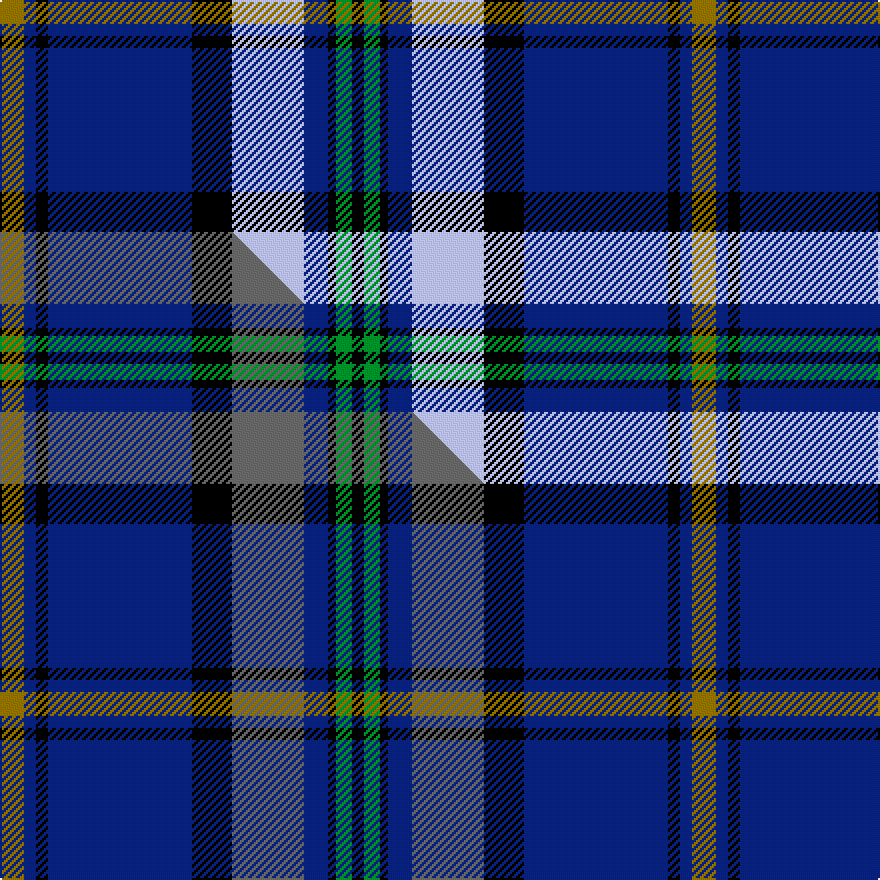

This is one **variant** — a specific cloth: this exact thread count and colourway, with its own
provenance below. It is one weaving of the [sett](/tartans/d/di/dinwiddie-hunting/) (the scale-free proportion — the
same cloth at any scale or shade), whose colour order is pattern [GBKBKWBKGK](/stripes/gbkbkwbkgk/).

Part of the [Dinwiddie Hunting](/tartans/d/di/dinwiddie-hunting/) tartan — the named design grouping this sett with its other cloths.

Sourced from tartans-authority.  It is a [10 stripe tartan](/stripes/stripes10/).

Original link <code>http://www.tartansauthority.com/tartan-ferret/display/7361/</code> — retired · [Internet Archive copy](https://web.archive.org/web/*/http://www.tartansauthority.com/tartan-ferret/display/7361/*)

Dataset <small>— provenance for this record, inherited from the source manifest</small>

<dl class="dataset-prov">
<dt>source</dt><dd><a href="/sources/tartans-authority/">Scottish Tartans Authority</a></dd>
<dt>data captured from</dt><dd><a href="https://github.com/thetartan/tartan-database/blob/master/data/tartans-authority/data.csv">https://github.com/thetartan/tartan-database/blob/master/data/tartans-authority/data.csv</a></dd>
<dt>data date</dt><dd>pre 2007 <small>(this record)</small></dd>
<dt>licence</dt><dd><a href="https://creativecommons.org/licenses/by-nc-nd/4.0/">CC BY-NC-ND 4.0</a></dd>
</dl>

Capture chain <small>— the hands this data passed through, oldest first; each capture carries its own licence</small>

<ol class="capture-chain">
<li><a href="https://www.tartansauthority.com/">Scottish Tartans Authority</a> <small>the heritage body’s archive — its tartan-ferret record browser is retired; dead record links are shown unlinked, with an Internet Archive copy (ITI numbers are not SRT references)</small></li>
<li><a href="https://github.com/thetartan/tartan-database">thetartan/tartan-database</a> <small>2016-2017</small> · <a href="https://creativecommons.org/licenses/by-nc-nd/4.0/">CC BY-NC-ND 4.0</a> <small>Levko Kravets's frozen compilation — the capture we vendored, and where its CC licence text came from</small></li>
<li>this dictionary <small>captured 2026-06-10 · commit 5bf86c7566</small> <small>each re-capture is a git commit to data/sources</small></li>
</ol>

## Register references

External register numbers recorded for this tartan.

- Scottish Tartans Authority (ITI): 7361

## Thread count
Y/12 DB6 K6 DB72 K20 LB36 DB12 K4 G8 K/6

One full sett is **346 threads**.

## Palette
<table><thead><tr><th>Colour</th><th>Shade</th><th>OKLCh</th></tr></thead><tbody><tr><td>DB</td><td><code style="background-color:#082077;">#082077</code> <small style="color:#888">#082077</small></td><td><small style="color:#888">oklch(30.0% 0.149 265.1)</small></td></tr><tr><td>G</td><td><code style="background-color:#008B2A;">#008B2A</code> <small style="color:#888">#008B2A</small></td><td><small style="color:#888">oklch(55.4% 0.170 145.9)</small></td></tr><tr><td>K</td><td><code style="background-color:#000000;">#000000</code> <small style="color:#888">#000000</small></td><td><small style="color:#888">oklch(0.0% 0.000 0.0)</small></td></tr><tr><td>LB</td><td><code style="background-color:#B5BBDE;">#B5BBDE</code> <small style="color:#888">#B5BBDE</small></td><td><small style="color:#888">oklch(79.9% 0.050 277.6)</small></td></tr><tr><td>Y</td><td><code style="background-color:#8B6E00;">#8B6E00</code> <small style="color:#888">#8B6E00</small></td><td><small style="color:#888">oklch(55.1% 0.113 90.4)</small></td></tr></tbody></table>

# Sample pattern

[Sample sheet (PDF)](swatch.pdf) — the woven sample, thread count and palette on one printable A4, rendered on demand (the same sheet the TTD print page downloads).

## Compared to the master

This cloth is one sett of its design; the master sett (the exemplar the design is anchored on) is below for comparison.

Its **ΔTartan distance** from the master is **1.00** — the same measure the nearest-tartans table ranks by (0 is identical; a re-scale of the same cloth is near 0, a recolour or a different proportion further).

<figure class="master-compare" style="margin:0">

this sett
master sett ★

<figcaption style="color:#888;font-size:smaller">One weave of this sett against the <a href="/setts/y6db3k3db36k10n18db6k2g4k3/">master sett ★</a>, split on the diagonal: a shared proportion runs seamlessly across it with only the shades shifting; a different proportion breaks on it.</figcaption>
</figure>

## Nearest tartan variants

The nearest existing variants by ΔTartan distance, with this cloth at the top so the swatches line up against it.

ΔTartan

Threads

Variant

Sett

—

346

<a href="/variants/s10/y6db3k3db36k10lb18db6k2g4k3~x2/">Dinwiddie Hunting (Name)</a>

<a href="/ttd/edit/#slug=y6db3k3db36k10n18db6k2g4k3~x2&amp;base=y6db3k3db36k10lb18db6k2g4k3~x2" title="compare in the TTD">1.00</a>

346

<a href="/variants/s10/y6db3k3db36k10n18db6k2g4k3~x2/">Dinwiddie Hunting</a>

<a href="/ttd/edit/#slug=k17lb2k3db16t28db2t3lo2~x2~lb82-t5410246&amp;base=y6db3k3db36k10lb18db6k2g4k3~x2" title="compare in the TTD">2.02</a>

254

<a href="/variants/s8/k17lb2k3db16t28db2t3lo2~x2~lb82-t5410246/">Banff and Buchan</a>

<a href="/ttd/edit/#slug=y3w12k3w3k3w3k7db48k7db3g14w3~x2&amp;base=y6db3k3db36k10lb18db6k2g4k3~x2" title="compare in the TTD">2.22</a>

424

<a href="/variants/s12/y3w12k3w3k3w3k7db48k7db3g14w3~x2/">MacDowall</a>

<a href="/ttd/edit/#slug=db8w2k8g12r2db3r2db24r2~x2&amp;base=y6db3k3db36k10lb18db6k2g4k3~x2" title="compare in the TTD">2.27</a>

232

<a href="/variants/s9/db8w2k8g12r2db3r2db24r2~x2/">Burt #2 (Name)</a>

<a href="/ttd/edit/#slug=r3db20k6lb5k4lb3k2r1db2~x2&amp;base=y6db3k3db36k10lb18db6k2g4k3~x2" title="compare in the TTD">2.32</a>

174

<a href="/variants/s9/r3db20k6lb5k4lb3k2r1db2~x2/">Scottish Knights Templar Int. (Corp)</a>

<a href="/ttd/edit/#slug=db14k2g3k2g3k2db12dr4db10dr3db10dr4lb28dr4~x2&amp;base=y6db3k3db36k10lb18db6k2g4k3~x2" title="compare in the TTD">2.35</a>

368

<a href="/variants/s14/db14k2g3k2g3k2db12dr4db10dr3db10dr4lb28dr4~x2/">Wcwm 1138</a>

<a href="/ttd/edit/#slug=k3b6k4dr6b18db53b18k8b6k3lo2~x2~b6306264&amp;base=y6db3k3db36k10lb18db6k2g4k3~x2" title="compare in the TTD">2.37</a>

498

<a href="/variants/s11/k3b6k4dr6b18db53b18k8b6k3lo2~x2~b6306264/">Australia 2000</a>

<a href="/ttd/edit/#slug=r3db20k6w5k4w3k2r1db2~x2&amp;base=y6db3k3db36k10lb18db6k2g4k3~x2" title="compare in the TTD">2.38</a>

174

<a href="/variants/s9/r3db20k6w5k4w3k2r1db2~x2/">Knights Templar International Corporate Tartan</a>

<a href="/ttd/edit/#slug=db3k2db22k9g2lp2g2lp2g8k2w3~x2&amp;base=y6db3k3db36k10lb18db6k2g4k3~x2" title="compare in the TTD">2.40</a>

216

<a href="/variants/s11/db3k2db22k9g2lp2g2lp2g8k2w3~x2/">Scottish Rugby Union Corporate Tartan</a>

<a href="/ttd/edit/#slug=k5db26k2db4k2db26k3lr36k3dbi30k3t2~db2114264-lr70-dbi3409246-t6107234&amp;base=y6db3k3db36k10lb18db6k2g4k3~x2" title="compare in the TTD">2.42</a>

277

<a href="/variants/s12/k5db26k2db4k2db26k3lr36k3dbi30k3t2~db2114264-lr70-dbi3409246-t6107234/">Daniel Welsh Name Tartan</a>

## Neighbour map

Every grey dot is one of 13662 variants placed by the first two principal components of the ΔTartan feature space (42% of its variance). Red is this tartan; blue dots are its nearest — click one to open its page. The map is a flat projection of a many-dimensional space — [how to read it](/posts/neighbourhood-maps/).

<svg viewBox="0 0 640 380" role="img" style="max-width:100%;height:auto;border:1px solid #e0e0e0;border-radius:4px;display:block" xmlns="http://www.w3.org/2000/svg"><image href="/nn/cloud.v1.png" width="640" height="380"/><a href="/variants/s10/y6db3k3db36k10n18db6k2g4k3~x2/"><circle cx="250.5" cy="128.5" r="4" fill="#3465a4"><title>Dinwiddie Hunting</title></circle></a><a href="/variants/s8/k17lb2k3db16t28db2t3lo2~x2~lb82-t5410246/"><circle cx="192.5" cy="147.7" r="4" fill="#3465a4"><title>Banff and Buchan</title></circle></a><a href="/variants/s12/y3w12k3w3k3w3k7db48k7db3g14w3~x2/"><circle cx="186.9" cy="98.2" r="4" fill="#3465a4"><title>MacDowall</title></circle></a><a href="/variants/s9/db8w2k8g12r2db3r2db24r2~x2/"><circle cx="239.1" cy="145.2" r="4" fill="#3465a4"><title>Burt #2 (Name)</title></circle></a><a href="/variants/s9/r3db20k6lb5k4lb3k2r1db2~x2/"><circle cx="226.1" cy="127.3" r="4" fill="#3465a4"><title>Scottish Knights Templar Int. (Corp)</title></circle></a><a href="/variants/s14/db14k2g3k2g3k2db12dr4db10dr3db10dr4lb28dr4~x2/"><circle cx="177.3" cy="123.9" r="4" fill="#3465a4"><title>Wcwm 1138</title></circle></a><a href="/variants/s11/k3b6k4dr6b18db53b18k8b6k3lo2~x2~b6306264/"><circle cx="229.0" cy="100.1" r="4" fill="#3465a4"><title>Australia 2000</title></circle></a><a href="/variants/s9/r3db20k6w5k4w3k2r1db2~x2/"><circle cx="213.6" cy="123.7" r="4" fill="#3465a4"><title>Knights Templar International Corporate Tartan</title></circle></a><a href="/variants/s11/db3k2db22k9g2lp2g2lp2g8k2w3~x2/"><circle cx="163.5" cy="131.6" r="4" fill="#3465a4"><title>Scottish Rugby Union Corporate Tartan</title></circle></a><a href="/variants/s12/k5db26k2db4k2db26k3lr36k3dbi30k3t2~db2114264-lr70-dbi3409246-t6107234/"><circle cx="177.9" cy="121.0" r="4" fill="#3465a4"><title>Daniel Welsh Name Tartan</title></circle></a><circle cx="210.3" cy="115.5" r="5" fill="#c00000"/><text x="320" y="376" text-anchor="middle" font-size="11" fill="#999">ground</text><text x="11" y="190" text-anchor="middle" font-size="11" fill="#999" transform="rotate(-90 11 190)">complexity</text></svg>

ID: /variants/s10/y6db3k3db36k10lb18db6k2g4k3~x2/
