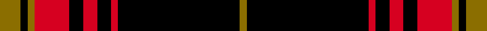

This is one **variant** — a specific cloth: this exact thread count and colourway, with its own
provenance below. It is one weaving of the [sett](/setts/y6k2y2r10k4r4k4r2k35y2/) (the scale-free proportion — the
same cloth at any scale or shade), whose colour order is pattern [GKGRKRKRKG](/stripes/gkgrkrkrkg/).

Part of the [Einigkeit](/tartans/e/ei/einigkeit/) tartan — the named design grouping this sett with its other cloths.

Sourced from register-of-tartans.  It is a [10 stripe tartan](/stripes/stripes10/).

Original link [https://www.tartanregister.gov.uk/tartanDetails.aspx?ref=10949](https://www.tartanregister.gov.uk/tartanDetails.aspx?ref=10949)

2 attestations — the source records this cloth was collapsed from (oldest owns this page)

<ul>
<li>19/10/2013 — Einigkeit (register-of-tartans, <a href="https://www.tartanregister.gov.uk/tartanDetails.aspx?ref=10949">record</a>)  <em>Einigkeit or unity is the first word of the German national anthem. This tartan is intended for any German or anyone with German roots or links who wishes to wear it. The black, red, and gold colours reflect the German flag.</em></li>
<li>2013 — Einigkeit (tartans-authority, <a href="https://www.tartanregister.gov.uk/tartanDetails.aspx?ref=10949">record</a>)  <em>Einigkeit or unity is the first word of the German national anthem. This tartan is intended for any German or anyone with German roots or links who wishes to wear it. The black, red, and gold colours reflect the German flag.</em></li>
</ul>

Dataset <small>— provenance for this record, inherited from the source manifest</small>

<dl class="dataset-prov">
<dt>source</dt><dd><a href="/sources/register-of-tartans/">Scottish Register of Tartans</a></dd>
<dt>data captured from</dt><dd><a href="https://github.com/thetartan/tartan-database/blob/master/data/register-of-tartans/data.csv">https://github.com/thetartan/tartan-database/blob/master/data/register-of-tartans/data.csv</a></dd>
<dt>data date</dt><dd>19/10/2013 <small>(this record)</small></dd>
<dt>licence</dt><dd><a href="https://www.tartanregister.gov.uk/copyright">Crown copyright</a></dd>
</dl>

Capture chain <small>— the hands this data passed through, oldest first; each capture carries its own licence</small>

<ol class="capture-chain">
<li><a href="https://www.tartanregister.gov.uk/">Scottish Register of Tartans</a> · <a href="https://www.tartanregister.gov.uk/copyright">Crown copyright</a> <small>the living register — still published by National Records of Scotland</small></li>
<li><a href="https://github.com/thetartan/tartan-database">thetartan/tartan-database</a> <small>2016-2017</small> · <a href="https://creativecommons.org/licenses/by-nc-nd/4.0/">CC BY-NC-ND 4.0</a> <small>Levko Kravets's frozen compilation — the capture we vendored, and where its CC licence text came from</small></li>
<li>this dictionary <small>captured 2026-06-10 · commit 5bf86c7566</small> <small>each re-capture is a git commit to data/sources</small></li>
</ol>

## Register references

External register numbers recorded for this tartan.

- Scottish Register of Tartans: [10949](https://www.tartanregister.gov.uk/tartanDetails?ref=10949)
- Scottish Tartans Authority (ITI): 10949

## Thread count
Y/12 K4 Y4 R20 K8 R8 K8 R4 K70 Y/4

One full sett is **268 threads**.

## Palette
<table><thead><tr><th>Colour</th><th>Shade</th><th>OKLCh</th></tr></thead><tbody><tr><td>K</td><td><code style="background-color:#000000;">#000000</code> <small style="color:#888">#000000</small></td><td><small style="color:#888">oklch(0.0% 0.000 0.0)</small></td></tr><tr><td>R</td><td><code style="background-color:#D60020;">#D60020</code> <small style="color:#888">#D60020</small></td><td><small style="color:#888">oklch(55.2% 0.224 25.5)</small></td></tr><tr><td>Y</td><td><code style="background-color:#8B6E00;">#8B6E00</code> <small style="color:#888">#8B6E00</small></td><td><small style="color:#888">oklch(55.1% 0.113 90.4)</small></td></tr></tbody></table>

# Sample pattern

## Nearest tartan variants

The nearest existing variants by ΔTartan distance, with this cloth at the top so the swatches line up against it.

ΔTartan

Threads

Variant

Sett

—

268

<a href="/variants/s10/y6k2y2r10k4r4k4r2k35y2~x2/">Einigkeit</a>

<a href="/ttd/edit/#slug=y1k3r24k3r3k24r3k3w1~x2&amp;base=y6k2y2r10k4r4k4r2k35y2~x2" title="compare in the TTD">1.59</a>

256

<a href="/variants/s9/y1k3r24k3r3k24r3k3w1~x2/">Maciver of Strathendry Castle Dress (Personal)</a>

<a href="/ttd/edit/#slug=w2k3r10k5r3k5r15k35w1~x2&amp;base=y6k2y2r10k4r4k4r2k35y2~x2" title="compare in the TTD">1.69</a>

310

<a href="/variants/s9/w2k3r10k5r3k5r15k35w1~x2/">Bertea, A H (Personal)</a>

<a href="/ttd/edit/#slug=dr4w4dr3k8w3dr3k20dr40w2dr4&amp;base=y6k2y2r10k4r4k4r2k35y2~x2" title="compare in the TTD">1.97</a>

174

<a href="/variants/s10/dr4w4dr3k8w3dr3k20dr40w2dr4/">South Carolina, University of</a>

<a href="/ttd/edit/#slug=ly8k7r3k7r3k38w2k3ly6~x2&amp;base=y6k2y2r10k4r4k4r2k35y2~x2" title="compare in the TTD">2.14</a>

280

<a href="/variants/s9/ly8k7r3k7r3k38w2k3ly6~x2/">Bunnahabhain</a>

<a href="/ttd/edit/#slug=k4w1r4k2g2r3g2k20r2k2~x2&amp;base=y6k2y2r10k4r4k4r2k35y2~x2" title="compare in the TTD">2.14</a>

156

<a href="/variants/s10/k4w1r4k2g2r3g2k20r2k2~x2/">Valdres, Kvam &amp; Vang #3</a>

<a href="/ttd/edit/#slug=k4w1r4k2g2r3k22r2k2r2&amp;base=y6k2y2r10k4r4k4r2k35y2~x2" title="compare in the TTD">2.20</a>

82

<a href="/variants/s10/k4w1r4k2g2r3k22r2k2r2/">Valdres Kvam and Vang District Tartan</a>

<a href="/ttd/edit/#slug=r8k79n4k4lb4k6n22k6r16k6&amp;base=y6k2y2r10k4r4k4r2k35y2~x2" title="compare in the TTD">2.24</a>

296

<a href="/variants/s10/r8k79n4k4lb4k6n22k6r16k6/">King Robert the Bruce Memorial, The</a>

<a href="/ttd/edit/#slug=k30r3k2r3k2r27k30r4~x2&amp;base=y6k2y2r10k4r4k4r2k35y2~x2" title="compare in the TTD">2.45</a>

336

<a href="/variants/s8/k30r3k2r3k2r27k30r4~x2/">Murray of Ochtertyre #2</a>

<a href="/ttd/edit/#slug=r8k1r1k5r1k1r8k1r1k30r1y2~x2&amp;base=y6k2y2r10k4r4k4r2k35y2~x2" title="compare in the TTD">2.47</a>

220

<a href="/variants/s12/r8k1r1k5r1k1r8k1r1k30r1y2~x2/">Calgary, University of (Estimated Threadcount)</a>

<a href="/ttd/edit/#slug=k42lb2r3k5r16k8y2k3~x2&amp;base=y6k2y2r10k4r4k4r2k35y2~x2" title="compare in the TTD">2.67</a>

234

<a href="/variants/s8/k42lb2r3k5r16k8y2k3~x2/">Highland Brewing Company (USA)</a>

## Neighbour map

Every grey dot is one of 13621 variants placed by the first two principal components of the ΔTartan feature space (42% of its variance). Red is this tartan; blue dots are its nearest — click one to open its page.

<svg viewBox="0 0 640 380" role="img" style="max-width:100%;height:auto;border:1px solid #e0e0e0;border-radius:4px;display:block" xmlns="http://www.w3.org/2000/svg"><image href="/nn/cloud.v1.png" width="640" height="380"/><a href="/variants/s9/y1k3r24k3r3k24r3k3w1~x2/"><circle cx="295.1" cy="97.4" r="4" fill="#3465a4"><title>Maciver of Strathendry Castle Dress (Personal)</title></circle></a><a href="/variants/s9/w2k3r10k5r3k5r15k35w1~x2/"><circle cx="353.0" cy="100.8" r="4" fill="#3465a4"><title>Bertea, A H (Personal)</title></circle></a><a href="/variants/s10/dr4w4dr3k8w3dr3k20dr40w2dr4/"><circle cx="340.8" cy="124.2" r="4" fill="#3465a4"><title>South Carolina, University of</title></circle></a><a href="/variants/s9/ly8k7r3k7r3k38w2k3ly6~x2/"><circle cx="361.1" cy="105.8" r="4" fill="#3465a4"><title>Bunnahabhain</title></circle></a><a href="/variants/s10/k4w1r4k2g2r3g2k20r2k2~x2/"><circle cx="337.7" cy="98.0" r="4" fill="#3465a4"><title>Valdres, Kvam &amp; Vang #3</title></circle></a><a href="/variants/s10/k4w1r4k2g2r3k22r2k2r2/"><circle cx="364.1" cy="90.9" r="4" fill="#3465a4"><title>Valdres Kvam and Vang District Tartan</title></circle></a><a href="/variants/s10/r8k79n4k4lb4k6n22k6r16k6/"><circle cx="341.2" cy="95.3" r="4" fill="#3465a4"><title>King Robert the Bruce Memorial, The</title></circle></a><a href="/variants/s8/k30r3k2r3k2r27k30r4~x2/"><circle cx="366.9" cy="161.0" r="4" fill="#3465a4"><title>Murray of Ochtertyre #2</title></circle></a><a href="/variants/s12/r8k1r1k5r1k1r8k1r1k30r1y2~x2/"><circle cx="379.7" cy="74.1" r="4" fill="#3465a4"><title>Calgary, University of (Estimated Threadcount)</title></circle></a><a href="/variants/s8/k42lb2r3k5r16k8y2k3~x2/"><circle cx="390.9" cy="104.4" r="4" fill="#3465a4"><title>Highland Brewing Company (USA)</title></circle></a><circle cx="343.3" cy="114.8" r="5" fill="#c00000"/><text x="320" y="376" text-anchor="middle" font-size="11" fill="#999">ground</text><text x="11" y="190" text-anchor="middle" font-size="11" fill="#999" transform="rotate(-90 11 190)">complexity</text></svg>

ID: /variants/s10/y6k2y2r10k4r4k4r2k35y2~x2/
