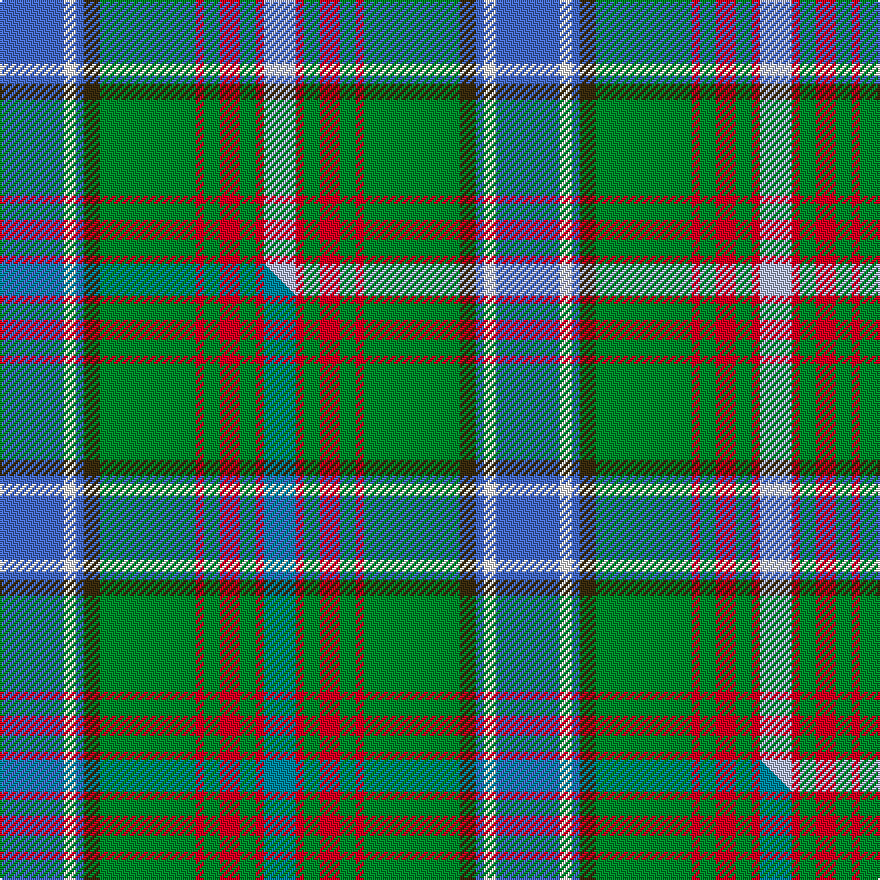

This is one **variant** — a specific cloth: this exact thread count and colourway, with its own
provenance below. It is one weaving of the [sett](/tartans/c/cu/currie-of-arran/) (the scale-free proportion — the
same cloth at any scale or shade), whose colour order is pattern [BWBGGRGRGRW](/stripes/bwbggrgrgrw/).

Part of the [Currie of Arran](/tartans/c/cu/currie-of-arran/) tartan — the named design grouping this sett with its other cloths.

Sourced from tartans-authority.  It is a [11 stripe tartan](/stripes/stripes11/).

Original link <code>http://www.tartansauthority.com/tartan-ferret/display/499/</code> — retired · [Internet Archive copy](https://web.archive.org/web/*/http://www.tartansauthority.com/tartan-ferret/display/499/*)

Dataset <small>— provenance for this record, inherited from the source manifest</small>

<dl class="dataset-prov">
<dt>source</dt><dd><a href="/sources/tartans-authority/">Scottish Tartans Authority</a></dd>
<dt>data captured from</dt><dd><a href="https://github.com/thetartan/tartan-database/blob/master/data/tartans-authority/data.csv">https://github.com/thetartan/tartan-database/blob/master/data/tartans-authority/data.csv</a></dd>
<dt>data date</dt><dd>1977 <small>(this record)</small></dd>
<dt>licence</dt><dd><a href="https://creativecommons.org/licenses/by-nc-nd/4.0/">CC BY-NC-ND 4.0</a></dd>
</dl>

Capture chain <small>— the hands this data passed through, oldest first; each capture carries its own licence</small>

<ol class="capture-chain">
<li><a href="https://www.tartansauthority.com/">Scottish Tartans Authority</a> <small>the heritage body’s archive — its tartan-ferret record browser is retired; dead record links are shown unlinked, with an Internet Archive copy (ITI numbers are not SRT references)</small></li>
<li><a href="https://github.com/thetartan/tartan-database">thetartan/tartan-database</a> <small>2016-2017</small> · <a href="https://creativecommons.org/licenses/by-nc-nd/4.0/">CC BY-NC-ND 4.0</a> <small>Levko Kravets's frozen compilation — the capture we vendored, and where its CC licence text came from</small></li>
<li>this dictionary <small>captured 2026-06-10 · commit 5bf86c7566</small> <small>each re-capture is a git commit to data/sources</small></li>
</ol>

## Register references

External register numbers recorded for this tartan.

- Scottish Tartans Authority (ITI): 499

## Thread count
B/32 W6 B4 DY8 G48 R4 G8 R10 G8 R4 LB/16

One full sett is **248 threads**.

## Palette
<table><thead><tr><th>Colour</th><th>Shade</th><th>OKLCh</th></tr></thead><tbody><tr><td>B</td><td><code style="background-color:#466CC8;">#466CC8</code> <small style="color:#888">#466CC8</small></td><td><small style="color:#888">oklch(55.1% 0.149 265.0)</small></td></tr><tr><td>G</td><td><code style="background-color:#008B2A;">#008B2A</code> <small style="color:#888">#008B2A</small></td><td><small style="color:#888">oklch(55.4% 0.170 145.9)</small></td></tr><tr><td>LB</td><td><code style="background-color:#B5BBDE;">#B5BBDE</code> <small style="color:#888">#B5BBDE</small></td><td><small style="color:#888">oklch(79.9% 0.050 277.6)</small></td></tr><tr><td>R</td><td><code style="background-color:#D60020;">#D60020</code> <small style="color:#888">#D60020</small></td><td><small style="color:#888">oklch(55.2% 0.224 25.5)</small></td></tr><tr><td>W</td><td><code style="background-color:#F7F7F7;">#F7F7F7</code> <small style="color:#888">#F7F7F7</small></td><td><small style="color:#888">oklch(97.6% 0.000 89.9)</small></td></tr><tr><td>DY</td><td><code style="background-color:#3A2B0D;">#3A2B0D</code> <small style="color:#888">#3A2B0D</small></td><td><small style="color:#888">oklch(30.0% 0.049 82.0)</small></td></tr></tbody></table>

# Sample pattern

## Compared to the master

This cloth is one sett of its design; the master sett (the exemplar the design is anchored on) is below for comparison.

Its **ΔTartan distance** from the master is **0.06** — the same measure the nearest-tartans table ranks by (0 is identical; a re-scale of the same cloth is near 0, a recolour or a different proportion further).

<figure class="master-compare" style="margin:0">

this sett
master sett ★

<figcaption style="color:#888;font-size:smaller">One weave of this sett against the <a href="/setts/b16w3b2dy4g24r2g4r5g4r2t8/">master sett ★</a>, split on the diagonal: a shared proportion runs seamlessly across it with only the shades shifting; a different proportion breaks on it.</figcaption>
</figure>

## Nearest tartan variants

The nearest existing variants by ΔTartan distance, with this cloth at the top so the swatches line up against it.

ΔTartan

Threads

Variant

Sett

—

248

<a href="/variants/s11/b16w3b2dy4g24r2g4r5g4r2lb8~x2/">Currie of Arran (Clan/family)</a>

<a href="/ttd/edit/#slug=b16w3b2dy4g24r2g4r5g4r2t8~x2&amp;base=b16w3b2dy4g24r2g4r5g4r2lb8~x2" title="compare in the TTD">0.06</a>

248

<a href="/variants/s11/b16w3b2dy4g24r2g4r5g4r2t8~x2/">Currie of Arran</a>

<a href="/ttd/edit/#slug=db16w3db1y4g24r1g3r4g3r1lb8~x2&amp;base=b16w3b2dy4g24r2g4r5g4r2lb8~x2" title="compare in the TTD">0.54</a>

224

<a href="/variants/s11/db16w3db1y4g24r1g3r4g3r1lb8~x2/">Currie</a>

<a href="/ttd/edit/#slug=g11r4g4r7g41o11lb4db41r4db8&amp;base=b16w3b2dy4g24r2g4r5g4r2lb8~x2" title="compare in the TTD">1.66</a>

251

<a href="/variants/s10/g11r4g4r7g41o11lb4db41r4db8/">Stewart of Appin, Ancient hunting</a>

<a href="/ttd/edit/#slug=g11r4g4r7g41dy11lb4db41r4db8&amp;base=b16w3b2dy4g24r2g4r5g4r2lb8~x2" title="compare in the TTD">1.66</a>

251

<a href="/variants/s10/g11r4g4r7g41dy11lb4db41r4db8/">Stewart of Appin Hunting Clan Tartan</a>

<a href="/ttd/edit/#slug=lb18w1lb4w1ly4dg1ly2dg12r2dg4~x2&amp;base=b16w3b2dy4g24r2g4r5g4r2lb8~x2" title="compare in the TTD">2.21</a>

152

<a href="/variants/s10/lb18w1lb4w1ly4dg1ly2dg12r2dg4~x2/">Michigan, State of</a>

<a href="/ttd/edit/#slug=db18w1db4w1lo4g1lo2g12r2g4~x2~w98-lo6911069&amp;base=b16w3b2dy4g24r2g4r5g4r2lb8~x2" title="compare in the TTD">2.21</a>

152

<a href="/variants/s10/db18w1db4w1lo4g1lo2g12r2g4~x2~w98-lo6911069/">Michigan, State of (District)</a>

<a href="/ttd/edit/#slug=db22g6db5lb2g22r6g5r4g9w3~x2&amp;base=b16w3b2dy4g24r2g4r5g4r2lb8~x2" title="compare in the TTD">2.29</a>

286

<a href="/variants/s10/db22g6db5lb2g22r6g5r4g9w3~x2/">MacConnell Clan Tartan</a>

<a href="/ttd/edit/#slug=db4dg41ly4g4ly4g9r18ly4w4~x2~dg4007180-g5613156&amp;base=b16w3b2dy4g24r2g4r5g4r2lb8~x2" title="compare in the TTD">2.36</a>

352

<a href="/variants/s9/db4dg41ly4g4ly4g9r18ly4w4~x2~dg4007180-g5613156/">Gallagher Ancient</a>

<a href="/ttd/edit/#slug=lb38db18lb4lyi3g10ly3g4lb3ly17r4~x2~lyi8517093-ly6307084&amp;base=b16w3b2dy4g24r2g4r5g4r2lb8~x2" title="compare in the TTD">2.37</a>

332

<a href="/variants/s10/lb38db18lb4lyi3g10ly3g4lb3ly17r4~x2~lyi8517093-ly6307084/">State Seal of Delaware (Fashion)</a>

<a href="/ttd/edit/#slug=w3db15r6db3r3db4dg11g3dg3g28lo3~x2&amp;base=b16w3b2dy4g24r2g4r5g4r2lb8~x2" title="compare in the TTD">2.56</a>

316

<a href="/variants/s11/w3db15r6db3r3db4dg11g3dg3g28lo3~x2/">Wojtek Memorial Trust</a>

## Neighbour map

Every grey dot is one of 13662 variants placed by the first two principal components of the ΔTartan feature space (42% of its variance). Red is this tartan; blue dots are its nearest — click one to open its page. The map is a flat projection of a many-dimensional space — [how to read it](/posts/neighbourhood-maps/).

<svg viewBox="0 0 640 380" role="img" style="max-width:100%;height:auto;border:1px solid #e0e0e0;border-radius:4px;display:block" xmlns="http://www.w3.org/2000/svg"><image href="/nn/cloud.v1.png" width="640" height="380"/><a href="/variants/s11/b16w3b2dy4g24r2g4r5g4r2t8~x2/"><circle cx="216.0" cy="162.4" r="4" fill="#3465a4"><title>Currie of Arran</title></circle></a><a href="/variants/s11/db16w3db1y4g24r1g3r4g3r1lb8~x2/"><circle cx="211.1" cy="113.5" r="4" fill="#3465a4"><title>Currie</title></circle></a><a href="/variants/s10/g11r4g4r7g41o11lb4db41r4db8/"><circle cx="217.4" cy="170.7" r="4" fill="#3465a4"><title>Stewart of Appin, Ancient hunting</title></circle></a><a href="/variants/s10/g11r4g4r7g41dy11lb4db41r4db8/"><circle cx="217.0" cy="171.0" r="4" fill="#3465a4"><title>Stewart of Appin Hunting Clan Tartan</title></circle></a><a href="/variants/s10/lb18w1lb4w1ly4dg1ly2dg12r2dg4~x2/"><circle cx="229.3" cy="136.9" r="4" fill="#3465a4"><title>Michigan, State of</title></circle></a><a href="/variants/s10/db18w1db4w1lo4g1lo2g12r2g4~x2~w98-lo6911069/"><circle cx="238.7" cy="142.0" r="4" fill="#3465a4"><title>Michigan, State of (District)</title></circle></a><a href="/variants/s10/db22g6db5lb2g22r6g5r4g9w3~x2/"><circle cx="235.5" cy="179.2" r="4" fill="#3465a4"><title>MacConnell Clan Tartan</title></circle></a><a href="/variants/s9/db4dg41ly4g4ly4g9r18ly4w4~x2~dg4007180-g5613156/"><circle cx="206.3" cy="152.9" r="4" fill="#3465a4"><title>Gallagher Ancient</title></circle></a><a href="/variants/s10/lb38db18lb4lyi3g10ly3g4lb3ly17r4~x2~lyi8517093-ly6307084/"><circle cx="206.2" cy="155.3" r="4" fill="#3465a4"><title>State Seal of Delaware (Fashion)</title></circle></a><a href="/variants/s11/w3db15r6db3r3db4dg11g3dg3g28lo3~x2/"><circle cx="154.9" cy="160.0" r="4" fill="#3465a4"><title>Wojtek Memorial Trust</title></circle></a><circle cx="200.2" cy="155.6" r="5" fill="#c00000"/><text x="320" y="376" text-anchor="middle" font-size="11" fill="#999">ground</text><text x="11" y="190" text-anchor="middle" font-size="11" fill="#999" transform="rotate(-90 11 190)">complexity</text></svg>

ID: /variants/s11/b16w3b2dy4g24r2g4r5g4r2lb8~x2/
