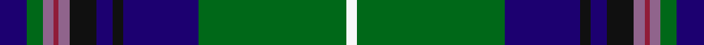

This page is one **sett** — a single exact thread-count. It belongs to the [tartan](/setts/db10g6o4r2o4k10db6k4db28g55w4/)
(the same proportion at any scale), whose colour order is pattern [BGRRRKBKBGW](/stripes/bgrrrkbkbgw/).

Sourced from tartans-authority.  It is a [11 stripe tartan](/stripes/stripes11/).

Original link http://www.tartansauthority.com/tartan-ferret/display/6801/

## Register references

External register numbers recorded for this tartan.

- Scottish Tartans Authority (ITI): 6801

## Thread count
DB/10 G6 LP4 DR2 LP4 K10 DB6 K4 DB28 G55 W/4

One full sett is **252 threads**.

## Palette

Palette: <strong>Tartan Register</strong> <small style="color:#888">(5 of 6 colours)</small>
<table><thead><tr><th>Colour</th><th>Threads</th><th>Shade</th><th>Base</th><th>OKLCh</th></tr></thead><tbody><tr><td>DB/</td><td style="text-align:right;font-variant-numeric:tabular-nums">10</td><td><code style="background-color:#1C0070;">#1C0070</code> <small style="color:#888">#1C0070</small></td><td>B <code style="background-color:#2A418A;">#2A418A</code></td><td><small style="color:#888">oklch(26.3% 0.162 277.1)</small></td></tr><tr><td>G</td><td style="text-align:right;font-variant-numeric:tabular-nums">6</td><td><code style="background-color:#006818;">#006818</code> <small style="color:#888">#006818</small></td><td>G <code style="background-color:#006100;">#006100</code></td><td><small style="color:#888">oklch(45.0% 0.142 145.0)</small></td></tr><tr><td>LP</td><td style="text-align:right;font-variant-numeric:tabular-nums">4</td><td><code style="background-color:#90648C;">#90648C</code> <small style="color:#888">#90648C</small></td><td>R <code style="background-color:#CC0000;">#CC0000</code></td><td><small style="color:#888">oklch(56.3% 0.080 329.7)</small></td></tr><tr><td>DR</td><td style="text-align:right;font-variant-numeric:tabular-nums">2</td><td><code style="background-color:#901C38;">#901C38</code> <small style="color:#888">#901C38</small></td><td>R <code style="background-color:#CC0000;">#CC0000</code></td><td><small style="color:#888">oklch(43.2% 0.150 13.1)</small></td></tr><tr><td>LP</td><td style="text-align:right;font-variant-numeric:tabular-nums">4</td><td><code style="background-color:#90648C;">#90648C</code> <small style="color:#888">#90648C</small></td><td>R <code style="background-color:#CC0000;">#CC0000</code></td><td><small style="color:#888">oklch(56.3% 0.080 329.7)</small></td></tr><tr><td>K</td><td style="text-align:right;font-variant-numeric:tabular-nums">10</td><td><code style="background-color:#101010;">#101010</code> <small style="color:#888">#101010</small></td><td>K <code style="background-color:#000000;">#000000</code></td><td><small style="color:#888">oklch(17.3% 0.000 89.9)</small></td></tr><tr><td>DB</td><td style="text-align:right;font-variant-numeric:tabular-nums">6</td><td><code style="background-color:#1C0070;">#1C0070</code> <small style="color:#888">#1C0070</small></td><td>B <code style="background-color:#2A418A;">#2A418A</code></td><td><small style="color:#888">oklch(26.3% 0.162 277.1)</small></td></tr><tr><td>K</td><td style="text-align:right;font-variant-numeric:tabular-nums">4</td><td><code style="background-color:#101010;">#101010</code> <small style="color:#888">#101010</small></td><td>K <code style="background-color:#000000;">#000000</code></td><td><small style="color:#888">oklch(17.3% 0.000 89.9)</small></td></tr><tr><td>DB</td><td style="text-align:right;font-variant-numeric:tabular-nums">28</td><td><code style="background-color:#1C0070;">#1C0070</code> <small style="color:#888">#1C0070</small></td><td>B <code style="background-color:#2A418A;">#2A418A</code></td><td><small style="color:#888">oklch(26.3% 0.162 277.1)</small></td></tr><tr><td>G</td><td style="text-align:right;font-variant-numeric:tabular-nums">55</td><td><code style="background-color:#006818;">#006818</code> <small style="color:#888">#006818</small></td><td>G <code style="background-color:#006100;">#006100</code></td><td><small style="color:#888">oklch(45.0% 0.142 145.0)</small></td></tr><tr><td>W/</td><td style="text-align:right;font-variant-numeric:tabular-nums">4</td><td><code style="background-color:#F8F8F8;">#F8F8F8</code> <small style="color:#888">#F8F8F8</small></td><td>W <code style="background-color:#F7F7F7;">#F7F7F7</code></td><td><small style="color:#888">oklch(97.9% 0.000 89.9)</small></td></tr></tbody></table>

## Nearest tartans

The nearest existing variants by ΔTartan distance, with this tartan at the top so the swatches line up against it.

ΔTartan

Tartan

Sett

—

<a href="/ttd/edit/#slug=db10g6o4r2o4k10db6k4db28g55w4">1314 (Corporate)</a> <a class="nn-out" href="/variants/s11/db10g6o4r2o4k10db6k4db28g55w4/" title="open its dictionary page">↗</a>

0.67

<a href="/ttd/edit/#slug=db66k2db10k15g15r4g15r4g30ly2w4&amp;base=db10g6o4r2o4k10db6k4db28g55w4">Mulcahy</a> <a class="nn-out" href="/variants/s11/db66k2db10k15g15r4g15r4g30ly2w4/" title="open its dictionary page">↗</a>

0.85

<a href="/ttd/edit/#slug=ly3dt2k1dt24k2dt2k2dt2k2dg8m2dg8k1w2~x2&amp;base=db10g6o4r2o4k10db6k4db28g55w4">Alexander-Johnstone (Personal)</a> <a class="nn-out" href="/variants/s14/ly3dt2k1dt24k2dt2k2dt2k2dg8m2dg8k1w2~x2/" title="open its dictionary page">↗</a>

0.86

<a href="/ttd/edit/#slug=w2db20dg2g2dg2g4dg8ly2r1~x2&amp;base=db10g6o4r2o4k10db6k4db28g55w4">Nova Scotia</a> <a class="nn-out" href="/variants/s9/w2db20dg2g2dg2g4dg8ly2r1~x2/" title="open its dictionary page">↗</a>

0.93

<a href="/ttd/edit/#slug=db5r2lo7r2db42g28k5db10k15g5w3r3&amp;base=db10g6o4r2o4k10db6k4db28g55w4">Heritage Sequane</a> <a class="nn-out" href="/variants/s12/db5r2lo7r2db42g28k5db10k15g5w3r3/" title="open its dictionary page">↗</a>

0.94

<a href="/ttd/edit/#slug=r2k1db30k6g12ly1db2ly1g12k3w1~x2&amp;base=db10g6o4r2o4k10db6k4db28g55w4">Hororata</a> <a class="nn-out" href="/variants/s11/r2k1db30k6g12ly1db2ly1g12k3w1~x2/" title="open its dictionary page">↗</a>

0.95

<a href="/ttd/edit/#slug=db3t3g30db25dp4r3ly2dp1~x2&amp;base=db10g6o4r2o4k10db6k4db28g55w4">Young</a> <a class="nn-out" href="/variants/s8/db3t3g30db25dp4r3ly2dp1~x2/" title="open its dictionary page">↗</a>

0.95

<a href="/ttd/edit/#slug=ly3db1k2g26db28w1db1r2~x2&amp;base=db10g6o4r2o4k10db6k4db28g55w4">Johnston, Diana Hunting (Personal)</a> <a class="nn-out" href="/variants/s8/ly3db1k2g26db28w1db1r2~x2/" title="open its dictionary page">↗</a>

0.96

<a href="/ttd/edit/#slug=g4ly1t3dbi15g2r2g14db1t28dbi2~x2&amp;base=db10g6o4r2o4k10db6k4db28g55w4">Heriot Watt University</a> <a class="nn-out" href="/variants/s10/g4ly1t3dbi15g2r2g14db1t28dbi2~x2/" title="open its dictionary page">↗</a>

0.97

<a href="/ttd/edit/#slug=db38w2db2k10g2ly2g22k3r3k3r3~x2&amp;base=db10g6o4r2o4k10db6k4db28g55w4">Hunnisett/Edinchip (Name)</a> <a class="nn-out" href="/variants/s11/db38w2db2k10g2ly2g22k3r3k3r3~x2/" title="open its dictionary page">↗</a>

0.99

<a href="/ttd/edit/#slug=g4ly2g24r2k12db3k2db2k2db12w1db1w3~x2&amp;base=db10g6o4r2o4k10db6k4db28g55w4">Baron of Greencastle (Personal)</a> <a class="nn-out" href="/variants/s13/g4ly2g24r2k12db3k2db2k2db12w1db1w3~x2/" title="open its dictionary page">↗</a>

## Neighbour map

Every grey dot is one of 14360 variants placed by the first two principal components of the ΔTartan feature space (44% of its variance). Red is this tartan; blue dots are its nearest — click one to open its page.

<svg viewBox="0 0 640 380" role="img" style="max-width:100%;height:auto;border:1px solid #e0e0e0;border-radius:4px;display:block" xmlns="http://www.w3.org/2000/svg"><image href="/nn/cloud.v1.png" width="640" height="380"/><a href="/variants/s11/db66k2db10k15g15r4g15r4g30ly2w4/"><circle cx="273.7" cy="102.7" r="4" fill="#3465a4"><title>Mulcahy</title></circle></a><a href="/variants/s14/ly3dt2k1dt24k2dt2k2dt2k2dg8m2dg8k1w2~x2/"><circle cx="261.7" cy="94.4" r="4" fill="#3465a4"><title>Alexander-Johnstone (Personal)</title></circle></a><a href="/variants/s9/w2db20dg2g2dg2g4dg8ly2r1~x2/"><circle cx="231.2" cy="115.7" r="4" fill="#3465a4"><title>Nova Scotia</title></circle></a><a href="/variants/s12/db5r2lo7r2db42g28k5db10k15g5w3r3/"><circle cx="223.7" cy="111.5" r="4" fill="#3465a4"><title>Heritage Sequane</title></circle></a><a href="/variants/s11/r2k1db30k6g12ly1db2ly1g12k3w1~x2/"><circle cx="232.9" cy="84.9" r="4" fill="#3465a4"><title>Hororata</title></circle></a><a href="/variants/s8/db3t3g30db25dp4r3ly2dp1~x2/"><circle cx="268.4" cy="117.6" r="4" fill="#3465a4"><title>Young</title></circle></a><a href="/variants/s8/ly3db1k2g26db28w1db1r2~x2/"><circle cx="293.0" cy="107.2" r="4" fill="#3465a4"><title>Johnston, Diana Hunting (Personal)</title></circle></a><a href="/variants/s10/g4ly1t3dbi15g2r2g14db1t28dbi2~x2/"><circle cx="230.6" cy="102.8" r="4" fill="#3465a4"><title>Heriot Watt University</title></circle></a><a href="/variants/s11/db38w2db2k10g2ly2g22k3r3k3r3~x2/"><circle cx="240.6" cy="109.7" r="4" fill="#3465a4"><title>Hunnisett/Edinchip (Name)</title></circle></a><a href="/variants/s13/g4ly2g24r2k12db3k2db2k2db12w1db1w3~x2/"><circle cx="193.3" cy="92.6" r="4" fill="#3465a4"><title>Baron of Greencastle (Personal)</title></circle></a><circle cx="253.3" cy="100.4" r="5" fill="#c00000"/></svg>

ID: /variants/s11/db10g6o4r2o4k10db6k4db28g55w4/
