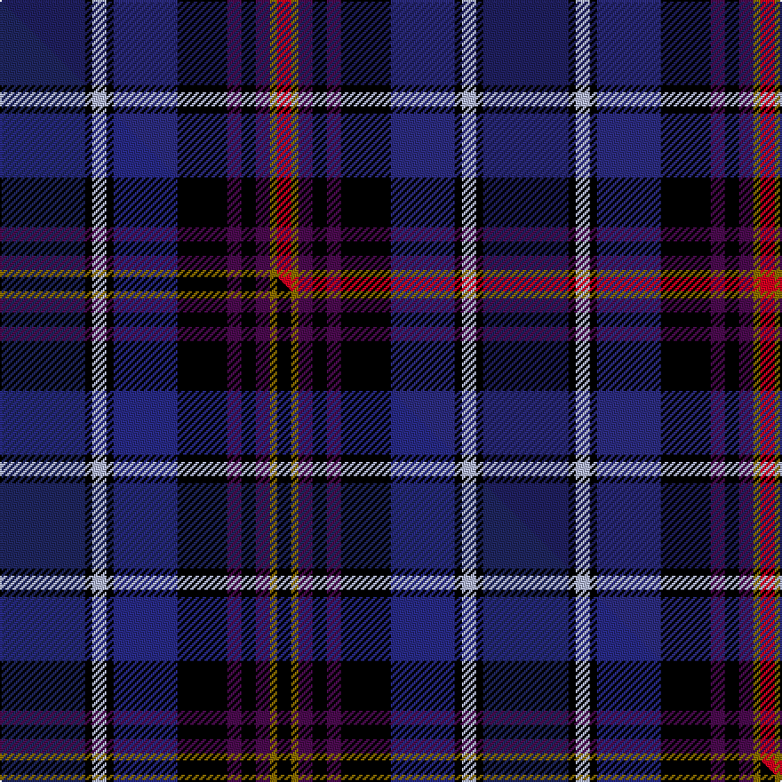

This page is one **sett** — a single exact thread-count. It belongs to the [tartan](/setts/db12k1lb2k1dbi9k7dp2k2dp2y1r2/)
(the same proportion at any scale), whose colour order is pattern [BKWKBKBKBGR](/stripes/bkwkbkbkbgr/).

Part of the [Churchill](/tartans/churchill/) tartan — the named design grouping this sett with its other cloths.

Sourced from tartans-authority.  It is a [11 stripe tartan](/stripes/stripes11/).

Original link http://www.tartansauthority.com/tartan-ferret/display/4031/

## Register references

External register numbers recorded for this tartan.

- Scottish Tartans Authority (ITI): 4031

## Thread count
DB/48 K4 LB8 K4 DBi36 K28 DP8 K8 DP8 Y4 R/8

One full sett is **272 threads**.

## Palette
<table><thead><tr><th>Colour</th><th>Shade</th><th>OKLCh</th></tr></thead><tbody><tr><td>LB</td><td><code style="background-color:#B5BBDE;">#B5BBDE</code> <small style="color:#888">#B5BBDE</small></td><td><small style="color:#888">oklch(79.9% 0.050 277.6)</small></td></tr><tr><td>DB</td><td><code style="background-color:#2C2C80;">#2C2C80</code> <small style="color:#888">#2C2C80</small></td><td><small style="color:#888">oklch(35.0% 0.138 276.6)</small></td></tr><tr><td>DB</td><td><code style="background-color:#202060;">#202060</code> <small style="color:#888">#202060</small></td><td><small style="color:#888">oklch(28.9% 0.111 276.9)</small></td></tr><tr><td>K</td><td><code style="background-color:#000000;">#000000</code> <small style="color:#888">#000000</small></td><td><small style="color:#888">oklch(0.0% 0.000 0.0)</small></td></tr><tr><td>DP</td><td><code style="background-color:#4B0B4F;">#4B0B4F</code> <small style="color:#888">#4B0B4F</small></td><td><small style="color:#888">oklch(30.1% 0.125 325.4)</small></td></tr><tr><td>R</td><td><code style="background-color:#D60020;">#D60020</code> <small style="color:#888">#D60020</small></td><td><small style="color:#888">oklch(55.2% 0.224 25.5)</small></td></tr><tr><td>Y</td><td><code style="background-color:#8B6E00;">#8B6E00</code> <small style="color:#888">#8B6E00</small></td><td><small style="color:#888">oklch(55.1% 0.113 90.4)</small></td></tr></tbody></table>

# Sample pattern

## Compared to the master

This cloth is one sett of its design; the master sett (the exemplar the design is anchored on) is below for comparison.

Its **ΔTartan distance** from the master is **1.08** — the same measure the nearest-tartans table ranks by (0 is identical; a re-scale of the same cloth is near 0, a recolour or a different proportion further).

<figure class="master-compare" style="margin:0">

this sett
master sett ★

<figcaption style="color:#888;font-size:smaller">One weave of this sett against the <a href="/setts/db12k1lb2k1dbi9k7dp2k2dp2y1k2/">master sett ★</a>, split on the diagonal: a shared proportion runs seamlessly across it with only the shades shifting; a different proportion breaks on it.</figcaption>
</figure>

## Nearest tartan variants

The nearest existing variants by ΔTartan distance, with this cloth at the top so the swatches line up against it.

ΔTartan

Threads

Variant

Sett

—

272

<a href="/variants/s11/db12k1lb2k1dbi9k7dp2k2dp2y1r2~x4~db1204274-dbi1406275/">Churchill (Personal)</a>

<a href="/ttd/edit/#slug=dt12k1lb2k1db9k7dp2k2dp2y1k2~x4~dt1204274-db1406275&amp;base=db12k1lb2k1dbi9k7dp2k2dp2y1r2~x4~db1204274-dbi1406275" title="compare in the TTD">0.30</a>

272

<a href="/variants/s11/db12k1lb2k1dbi9k7dp2k2dp2y1k2~x4~db1204274-dbi1406275/">Churchill (Personal)</a>

<a href="/ttd/edit/#slug=k3dp16dg5dp3o2dp2k12db23w2~x2&amp;base=db12k1lb2k1dbi9k7dp2k2dp2y1r2~x4~db1204274-dbi1406275" title="compare in the TTD">2.39</a>

262

<a href="/variants/s9/k3dp16dg5dp3o2dp2k12db23w2~x2/">Crieff Highland Gathering</a>

<a href="/ttd/edit/#slug=k3dp16g5dp3b2dp2k12db23w2~x2&amp;base=db12k1lb2k1dbi9k7dp2k2dp2y1r2~x4~db1204274-dbi1406275" title="compare in the TTD">2.45</a>

262

<a href="/variants/s9/k3dp16g5dp3b2dp2k12db23w2~x2/">Creiff Highland Gathering</a>

<a href="/ttd/edit/#slug=dp27y2dp2k12g6o2g12k12db12r2db2~x2&amp;base=db12k1lb2k1dbi9k7dp2k2dp2y1r2~x4~db1204274-dbi1406275" title="compare in the TTD">2.63</a>

306

<a href="/variants/s11/dp27y2dp2k12g6o2g12k12db12r2db2~x2/">Boxell, Baron (Personal)</a>

<a href="/ttd/edit/#slug=dp27y2dp2k12g6o2g12k12db12r2db2~x2~dp1105325&amp;base=db12k1lb2k1dbi9k7dp2k2dp2y1r2~x4~db1204274-dbi1406275" title="compare in the TTD">2.66</a>

306

<a href="/variants/s11/dp27y2dp2k12g6o2g12k12db12r2db2~x2~dp1105325/">Boxell of West Niddry, Baron (Personal)</a>

<a href="/ttd/edit/#slug=db24k24ki2w6ki2y2ki16lb5r6w2~x2~k0504259-ki0700000&amp;base=db12k1lb2k1dbi9k7dp2k2dp2y1r2~x4~db1204274-dbi1406275" title="compare in the TTD">2.76</a>

304

<a href="/variants/s10/db24k24ki2w6ki2y2ki16lb5r6w2~x2~k0504259-ki0700000/">Scotland's International - Home (Fas</a>

<a href="/ttd/edit/#slug=n6k1n2k2n1k4db10dy4dp1dy3lb1~x4&amp;base=db12k1lb2k1dbi9k7dp2k2dp2y1r2~x4~db1204274-dbi1406275" title="compare in the TTD">2.80</a>

252

<a href="/variants/s11/n6k1n2k2n1k4db10dy4dp1dy3lb1~x4/">Wcwm 1893-2</a>

<a href="/ttd/edit/#slug=t6k3dt19k6dt4k3dp12g4dp12w2t5~x2~t2205244-dt1204274&amp;base=db12k1lb2k1dbi9k7dp2k2dp2y1r2~x4~db1204274-dbi1406275" title="compare in the TTD">2.80</a>

282

<a href="/variants/s11/t6k3db19k6db4k3dp12g4dp12w2t5~x2~t2205244-db1204274/">Scotland Forever Fashion Weavers Tartan</a>

<a href="/ttd/edit/#slug=dt24g2dt12k2w2k3o2k3db4k3o2k3w2k2r12g2db24~x2~dt1204274-db1406275&amp;base=db12k1lb2k1dbi9k7dp2k2dp2y1r2~x4~db1204274-dbi1406275" title="compare in the TTD">2.90</a>

320

<a href="/variants/s17/db24g2db12k2w2k3o2k3dbi4k3o2k3w2k2r12g2dbi24~x2~db1204274-dbi1406275/">Selkirk Corporate District Tartan</a>

<a href="/ttd/edit/#slug=db24b2db12k2w2k3dg2k3n4k3dg2k3w2k2r12b2n24~x2~db0805267-n1604274&amp;base=db12k1lb2k1dbi9k7dp2k2dp2y1r2~x4~db1204274-dbi1406275" title="compare in the TTD">2.90</a>

320

<a href="/variants/s17/db24b2db12k2w2k3dg2k3dbi4k3dg2k3w2k2r12b2dbi24~x2~db0805267-dbi1604274/">Selkirk</a>

## Neighbour map

Every grey dot is one of 13620 variants placed by the first two principal components of the ΔTartan feature space (42% of its variance). Red is this tartan; blue dots are its nearest — click one to open its page.

<svg viewBox="0 0 640 380" role="img" style="max-width:100%;height:auto;border:1px solid #e0e0e0;border-radius:4px;display:block" xmlns="http://www.w3.org/2000/svg"><image href="/nn/cloud.v1.png" width="640" height="380"/><a href="/variants/s11/db12k1lb2k1dbi9k7dp2k2dp2y1k2~x4~db1204274-dbi1406275/"><circle cx="111.3" cy="128.8" r="4" fill="#3465a4"><title>Churchill (Personal)</title></circle></a><a href="/variants/s9/k3dp16dg5dp3o2dp2k12db23w2~x2/"><circle cx="163.1" cy="152.6" r="4" fill="#3465a4"><title>Crieff Highland Gathering</title></circle></a><a href="/variants/s9/k3dp16g5dp3b2dp2k12db23w2~x2/"><circle cx="147.2" cy="148.3" r="4" fill="#3465a4"><title>Creiff Highland Gathering</title></circle></a><a href="/variants/s11/dp27y2dp2k12g6o2g12k12db12r2db2~x2/"><circle cx="94.3" cy="119.5" r="4" fill="#3465a4"><title>Boxell, Baron (Personal)</title></circle></a><a href="/variants/s11/dp27y2dp2k12g6o2g12k12db12r2db2~x2~dp1105325/"><circle cx="94.5" cy="119.4" r="4" fill="#3465a4"><title>Boxell of West Niddry, Baron (Personal)</title></circle></a><a href="/variants/s10/db24k24ki2w6ki2y2ki16lb5r6w2~x2~k0504259-ki0700000/"><circle cx="53.1" cy="116.6" r="4" fill="#3465a4"><title>Scotland's International - Home (Fas</title></circle></a><a href="/variants/s11/n6k1n2k2n1k4db10dy4dp1dy3lb1~x4/"><circle cx="113.1" cy="162.0" r="4" fill="#3465a4"><title>Wcwm 1893-2</title></circle></a><a href="/variants/s11/t6k3db19k6db4k3dp12g4dp12w2t5~x2~t2205244-db1204274/"><circle cx="114.2" cy="170.9" r="4" fill="#3465a4"><title>Scotland Forever Fashion Weavers Tartan</title></circle></a><a href="/variants/s17/db24g2db12k2w2k3o2k3dbi4k3o2k3w2k2r12g2dbi24~x2~db1204274-dbi1406275/"><circle cx="106.7" cy="85.2" r="4" fill="#3465a4"><title>Selkirk Corporate District Tartan</title></circle></a><a href="/variants/s17/db24b2db12k2w2k3dg2k3dbi4k3dg2k3w2k2r12b2dbi24~x2~db0805267-dbi1604274/"><circle cx="101.5" cy="85.1" r="4" fill="#3465a4"><title>Selkirk</title></circle></a><circle cx="105.1" cy="126.1" r="5" fill="#c00000"/><text x="320" y="376" text-anchor="middle" font-size="11" fill="#999">ground</text><text x="11" y="190" text-anchor="middle" font-size="11" fill="#999" transform="rotate(-90 11 190)">complexity</text></svg>

ID: /variants/s11/db12k1lb2k1dbi9k7dp2k2dp2y1r2~x4~db1204274-dbi1406275/
