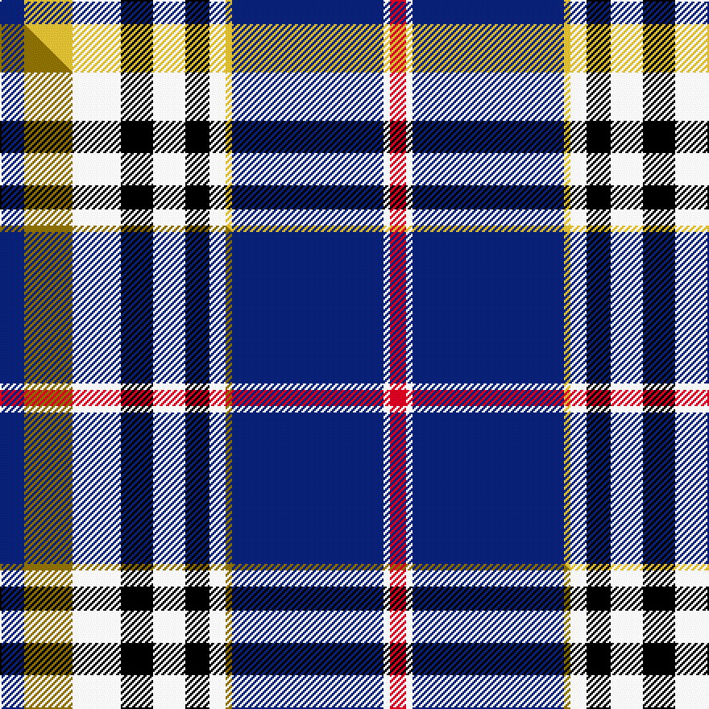

This page is one **sett** — a single exact thread-count. It belongs to the [tartan](/setts/db15ly30w30k20w20k15w10ly4db94w4r10/)
(the same proportion at any scale), whose colour order is pattern [BYWKWKWYBWR](/stripes/bywkwkwybwr/).

Part of the [Ar Lenn Vor](/tartans/ar-lenn-vor/) tartan — the named design grouping this sett with its other cloths.

Sourced from tartans-authority.  It is a [11 stripe tartan](/stripes/stripes11/).

Original link http://www.tartansauthority.com/tartan-ferret/display/11207/

## Register references

External register numbers recorded for this tartan.

- Scottish Register of Tartans: [11207](https://www.tartanregister.gov.uk/tartanDetails?ref=11207)
- Scottish Tartans Authority (ITI): 11207

## Thread count
DB/15 LY30 W30 K20 W20 K15 W10 LY4 DB94 W4 R/10

One full sett is **479 threads**.

## Palette
<table><thead><tr><th>Colour</th><th>Shade</th><th>OKLCh</th></tr></thead><tbody><tr><td>DB</td><td><code style="background-color:#082077;">#082077</code> <small style="color:#888">#082077</small></td><td><small style="color:#888">oklch(30.0% 0.149 265.1)</small></td></tr><tr><td>K</td><td><code style="background-color:#000000;">#000000</code> <small style="color:#888">#000000</small></td><td><small style="color:#888">oklch(0.0% 0.000 0.0)</small></td></tr><tr><td>R</td><td><code style="background-color:#D60020;">#D60020</code> <small style="color:#888">#D60020</small></td><td><small style="color:#888">oklch(55.2% 0.224 25.5)</small></td></tr><tr><td>W</td><td><code style="background-color:#F7F7F7;">#F7F7F7</code> <small style="color:#888">#F7F7F7</small></td><td><small style="color:#888">oklch(97.6% 0.000 89.9)</small></td></tr><tr><td>LY</td><td><code style="background-color:#DCBC32;">#DCBC32</code> <small style="color:#888">#DCBC32</small></td><td><small style="color:#888">oklch(80.0% 0.150 95.2)</small></td></tr></tbody></table>

# Sample pattern

## Compared to the master

This cloth is one sett of its design; the master sett (the exemplar the design is anchored on) is below for comparison.

Its **ΔTartan distance** from the master is **0.07** — the same measure the nearest-tartans table ranks by (0 is identical; a re-scale of the same cloth is near 0, a recolour or a different proportion further).

<figure class="master-compare" style="margin:0">

this sett
master sett ★

<figcaption style="color:#888;font-size:smaller">One weave of this sett against the <a href="/setts/db15y30w30k20w20k15w10y4db94w4r10/">master sett ★</a>, split on the diagonal: a shared proportion runs seamlessly across it with only the shades shifting; a different proportion breaks on it.</figcaption>
</figure>

## Nearest tartan variants

The nearest existing variants by ΔTartan distance, with this cloth at the top so the swatches line up against it.

ΔTartan

Threads

Variant

Sett

—

479

<a href="/variants/s11/db15ly30w30k20w20k15w10ly4db94w4r10/">Ar Lenn Vor</a>

<a href="/ttd/edit/#slug=db15y30w30k20w20k15w10y4db94w4r10&amp;base=db15ly30w30k20w20k15w10ly4db94w4r10" title="compare in the TTD">0.07</a>

479

<a href="/variants/s11/db15y30w30k20w20k15w10y4db94w4r10/">Ar Lenn Vor</a>

<a href="/ttd/edit/#slug=dr2db6lr2db2k9lb30k9db5lr4db2dr2~x2&amp;base=db15ly30w30k20w20k15w10ly4db94w4r10" title="compare in the TTD">1.94</a>

284

<a href="/variants/s11/dr2db6lr2db2k9lb30k9db5lr4db2dr2~x2/">Rangers Dress (Sports)</a>

<a href="/ttd/edit/#slug=k4lb26k2lb4k2lb26k3db36k3dg30k3w2&amp;base=db15ly30w30k20w20k15w10ly4db94w4r10" title="compare in the TTD">2.10</a>

276

<a href="/variants/s12/k4lb26k2lb4k2lb26k3db36k3dg30k3w2/">Ellis (Welsh Name)</a>

<a href="/ttd/edit/#slug=w6dg2w27k10db4k4db4k4db15r2db2r4~x2&amp;base=db15ly30w30k20w20k15w10ly4db94w4r10" title="compare in the TTD">2.19</a>

316

<a href="/variants/s12/w6dg2w27k10db4k4db4k4db15r2db2r4~x2/">Sutherland Dress, Old (Dance)</a>

<a href="/ttd/edit/#slug=dbi42lb2w2lb2dbi5k12w32db4~x2~dbi1404245-db1106275&amp;base=db15ly30w30k20w20k15w10ly4db94w4r10" title="compare in the TTD">2.21</a>

312

<a href="/variants/s8/dbi42lb2w2lb2dbi5k12w32db4~x2~dbi1404245-db1106275/">Comrie, Navy Blue (Dance)</a>

<a href="/ttd/edit/#slug=db4r2db31k10g4w21g2~x2&amp;base=db15ly30w30k20w20k15w10ly4db94w4r10" title="compare in the TTD">2.34</a>

284

<a href="/variants/s7/db4r2db31k10g4w21g2~x2/">Sinclair Dress (Dance)</a>

<a href="/ttd/edit/#slug=k3lb6k4dr6lb18db53lb18k8lb6k3lo2~x2&amp;base=db15ly30w30k20w20k15w10ly4db94w4r10" title="compare in the TTD">2.43</a>

498

<a href="/variants/s11/k3lb6k4dr6lb18db53lb18k8lb6k3lo2~x2/">Australia 2000 (Fashion)</a>

<a href="/ttd/edit/#slug=lo1n8lb2k15lb20dr1lb1dr1lb8n3lb1~x2&amp;base=db15ly30w30k20w20k15w10ly4db94w4r10" title="compare in the TTD">2.50</a>

240

<a href="/variants/s11/lo1n8lb2k15lb20dr1lb1dr1lb8n3lb1~x2/">Harris (Personal)</a>

<a href="/ttd/edit/#slug=w4db1dbi12db1r8w8db8w2db1w2db24ly4db1r2~x2~db1404245-dbi1406275&amp;base=db15ly30w30k20w20k15w10ly4db94w4r10" title="compare in the TTD">2.59</a>

300

<a href="/variants/s14/w4db1dbi12db1r8w8db8w2db1w2db24ly4db1r2~x2~db1404245-dbi1406275/">Submariners (Unofficial)</a>

<a href="/ttd/edit/#slug=w5g2w23k7db4k3db3k3db11r2db2r3~x2&amp;base=db15ly30w30k20w20k15w10ly4db94w4r10" title="compare in the TTD">2.62</a>

256

<a href="/variants/s12/w5g2w23k7db4k3db3k3db11r2db2r3~x2/">Sutherland, Dress</a>

## Neighbour map

Every grey dot is one of 13620 variants placed by the first two principal components of the ΔTartan feature space (42% of its variance). Red is this tartan; blue dots are its nearest — click one to open its page.

<svg viewBox="0 0 640 380" role="img" style="max-width:100%;height:auto;border:1px solid #e0e0e0;border-radius:4px;display:block" xmlns="http://www.w3.org/2000/svg"><image href="/nn/cloud.v1.png" width="640" height="380"/><a href="/variants/s11/db15y30w30k20w20k15w10y4db94w4r10/"><circle cx="177.4" cy="108.9" r="4" fill="#3465a4"><title>Ar Lenn Vor</title></circle></a><a href="/variants/s11/dr2db6lr2db2k9lb30k9db5lr4db2dr2~x2/"><circle cx="157.6" cy="113.2" r="4" fill="#3465a4"><title>Rangers Dress (Sports)</title></circle></a><a href="/variants/s12/k4lb26k2lb4k2lb26k3db36k3dg30k3w2/"><circle cx="153.7" cy="111.2" r="4" fill="#3465a4"><title>Ellis (Welsh Name)</title></circle></a><a href="/variants/s12/w6dg2w27k10db4k4db4k4db15r2db2r4~x2/"><circle cx="132.2" cy="122.9" r="4" fill="#3465a4"><title>Sutherland Dress, Old (Dance)</title></circle></a><a href="/variants/s8/dbi42lb2w2lb2dbi5k12w32db4~x2~dbi1404245-db1106275/"><circle cx="210.0" cy="116.9" r="4" fill="#3465a4"><title>Comrie, Navy Blue (Dance)</title></circle></a><a href="/variants/s7/db4r2db31k10g4w21g2~x2/"><circle cx="166.3" cy="126.2" r="4" fill="#3465a4"><title>Sinclair Dress (Dance)</title></circle></a><a href="/variants/s11/k3lb6k4dr6lb18db53lb18k8lb6k3lo2~x2/"><circle cx="207.4" cy="93.8" r="4" fill="#3465a4"><title>Australia 2000 (Fashion)</title></circle></a><a href="/variants/s11/lo1n8lb2k15lb20dr1lb1dr1lb8n3lb1~x2/"><circle cx="235.4" cy="108.9" r="4" fill="#3465a4"><title>Harris (Personal)</title></circle></a><a href="/variants/s14/w4db1dbi12db1r8w8db8w2db1w2db24ly4db1r2~x2~db1404245-dbi1406275/"><circle cx="219.5" cy="110.2" r="4" fill="#3465a4"><title>Submariners (Unofficial)</title></circle></a><a href="/variants/s12/w5g2w23k7db4k3db3k3db11r2db2r3~x2/"><circle cx="135.4" cy="127.6" r="4" fill="#3465a4"><title>Sutherland, Dress</title></circle></a><circle cx="174.3" cy="108.5" r="5" fill="#c00000"/><text x="320" y="376" text-anchor="middle" font-size="11" fill="#999">ground</text><text x="11" y="190" text-anchor="middle" font-size="11" fill="#999" transform="rotate(-90 11 190)">complexity</text></svg>

ID: /variants/s11/db15ly30w30k20w20k15w10ly4db94w4r10/
