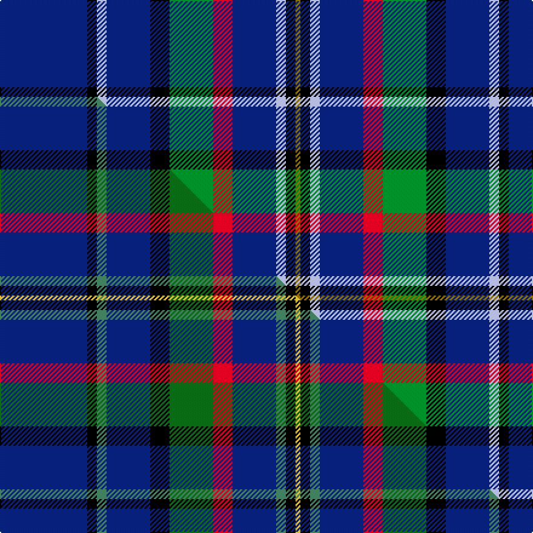

This is one **variant** — a specific cloth: this exact thread count and colourway, with its own
provenance below. It is one weaving of the [sett](/setts/db18k2lb2db9k4g9r4db9lb2k2y1/) (the scale-free proportion — the
same cloth at any scale or shade), whose colour order is pattern [BKWBKGRBWKG](/stripes/bkwbkgrbwkg/).

Part of the [Amarillo](/tartans/a/am/amarillo/) tartan — the named design grouping this sett with its other cloths.

Sourced from house-of-tartan.  It is a [11 stripe tartan](/stripes/stripes11/).

Original link [http://www.house-of-tartan.scotland.net/house/TartanViewjs.asp?colr=Def&tnam=2190](http://www.house-of-tartan.scotland.net/house/TartanViewjs.asp?colr=Def&tnam=2190)

## Provenance

Earliest known date: 1996 Designed for the city of Amarillo in Texas, USA, by Dr. Phil Smith, at West Chester University in Penn. The tartan has been adopted by the city authorities.

Dataset <small>— provenance for this record, inherited from the source manifest</small>

<dl class="dataset-prov">
<dt>source</dt><dd><a href="/sources/house-of-tartan/">House of Tartan</a></dd>
<dt>data captured from</dt><dd><a href="https://github.com/thetartan/tartan-database/blob/master/data/house-of-tartan/data.csv">https://github.com/thetartan/tartan-database/blob/master/data/house-of-tartan/data.csv</a></dd>
<dt>data date</dt><dd>1996 <small>(this record)</small></dd>
<dt>licence</dt><dd><a href="https://creativecommons.org/licenses/by-nc-nd/4.0/">CC BY-NC-ND 4.0</a></dd>
</dl>

Capture chain <small>— the hands this data passed through, oldest first; each capture carries its own licence</small>

<ol class="capture-chain">
<li><a href="http://www.house-of-tartan.scotland.net/">House of Tartan</a> <small>the weaver/retailer's database — the site is now offline; the URL is kept as the ultimate source's identity</small></li>
<li><a href="https://github.com/thetartan/tartan-database">thetartan/tartan-database</a> <small>2016-2017</small> · <a href="https://creativecommons.org/licenses/by-nc-nd/4.0/">CC BY-NC-ND 4.0</a> <small>Levko Kravets's frozen compilation — the capture we vendored, and where its CC licence text came from</small></li>
<li>this dictionary <small>captured 2026-06-10 · commit 5bf86c7566</small> <small>each re-capture is a git commit to data/sources</small></li>
</ol>

## Thread count
DB/72 K8 LB8 DB36 K16 G36 R16 DB36 LB8 K8 Y/4

One full sett is **420 threads**.

## Palette
<table><thead><tr><th>Colour</th><th>Shade</th><th>OKLCh</th></tr></thead><tbody><tr><td>LB</td><td><code style="background-color:#B5BBDE;">#B5BBDE</code> <small style="color:#888">#B5BBDE</small></td><td><small style="color:#888">oklch(79.9% 0.050 277.6)</small></td></tr><tr><td>DB</td><td><code style="background-color:#082077;">#082077</code> <small style="color:#888">#082077</small></td><td><small style="color:#888">oklch(30.0% 0.149 265.1)</small></td></tr><tr><td>G</td><td><code style="background-color:#008B2A;">#008B2A</code> <small style="color:#888">#008B2A</small></td><td><small style="color:#888">oklch(55.4% 0.170 145.9)</small></td></tr><tr><td>K</td><td><code style="background-color:#000000;">#000000</code> <small style="color:#888">#000000</small></td><td><small style="color:#888">oklch(0.0% 0.000 0.0)</small></td></tr><tr><td>R</td><td><code style="background-color:#D60020;">#D60020</code> <small style="color:#888">#D60020</small></td><td><small style="color:#888">oklch(55.2% 0.224 25.5)</small></td></tr><tr><td>Y</td><td><code style="background-color:#8B6E00;">#8B6E00</code> <small style="color:#888">#8B6E00</small></td><td><small style="color:#888">oklch(55.1% 0.113 90.4)</small></td></tr></tbody></table>

# Sample pattern

## Compared to the master

This cloth is one sett of its design; the master sett (the exemplar the design is anchored on) is below for comparison.

Its **ΔTartan distance** from the master is **0.62** — the same measure the nearest-tartans table ranks by (0 is identical; a re-scale of the same cloth is near 0, a recolour or a different proportion further).

<figure class="master-compare" style="margin:0">

this sett
master sett ★

<figcaption style="color:#888;font-size:smaller">One weave of this sett against the <a href="/setts/db18k2g2db9k4dg9r4db9g2k2ly1/">master sett ★</a>, split on the diagonal: a shared proportion runs seamlessly across it with only the shades shifting; a different proportion breaks on it.</figcaption>
</figure>

## Nearest tartan variants

The nearest existing variants by ΔTartan distance, with this cloth at the top so the swatches line up against it.

ΔTartan

Threads

Variant

Sett

—

420

<a href="/variants/s11/db18k2lb2db9k4g9r4db9lb2k2y1~x4/">Amarillo District Tartan</a>

<a href="/ttd/edit/#slug=db18k2g2db9k4dg9r4db9g2k2ly1~x4~g2203152-dg1806142&amp;base=db18k2lb2db9k4g9r4db9lb2k2y1~x4" title="compare in the TTD">0.62</a>

420

<a href="/variants/s11/db18k2g2db9k4dg9r4db9g2k2ly1~x4~g2203152-dg1806142/">Amarillo</a>

<a href="/ttd/edit/#slug=b19k1lyi1b10k4y9dp4b9lyi1k1ly2~x4~b2206256-lyi2602166&amp;base=db18k2lb2db9k4g9r4db9lb2k2y1~x4" title="compare in the TTD">1.62</a>

404

<a href="/variants/s11/b19k1yi1b10k4y9dp4b9yi1k1ly2~x4~b2206256-yi2602166/">Cian of Ely (Clan)</a>

<a href="/ttd/edit/#slug=db16k1lb1db10k4b8dp4db7lb1k1lo2~x2~dp1607335-lo2706066&amp;base=db18k2lb2db9k4g9r4db9lb2k2y1~x4" title="compare in the TTD">1.71</a>

184

<a href="/variants/s11/db16k1lb1db10k4b8dp4db7lb1k1lo2~x2~dp1607335-lo2706066/">Cian (Carroll), Clan</a>

<a href="/ttd/edit/#slug=db34g10db5r2k8dy2w3dy2k8r2db5g10db28k3~x2&amp;base=db18k2lb2db9k4g9r4db9lb2k2y1~x4" title="compare in the TTD">1.95</a>

414

<a href="/variants/s14/db34g10db5r2k8dy2w3dy2k8r2db5g10db28k3~x2/">Lambert (Front Royal) Dress</a>

<a href="/ttd/edit/#slug=db35g10lb10k10db23y1db3r2~x2&amp;base=db18k2lb2db9k4g9r4db9lb2k2y1~x4" title="compare in the TTD">2.04</a>

302

<a href="/variants/s8/db35g10lb10k10db23y1db3r2~x2/">Lapsley, The Tom</a>

<a href="/ttd/edit/#slug=db35g10lb10k10db23ly1db3r2~x2&amp;base=db18k2lb2db9k4g9r4db9lb2k2y1~x4" title="compare in the TTD">2.04</a>

302

<a href="/variants/s8/db35g10lb10k10db23ly1db3r2~x2/">Lapsley, The Tom (Personal)</a>

<a href="/ttd/edit/#slug=dr4lb3db6t4db24k6g4db2lb23db23g4~x2&amp;base=db18k2lb2db9k4g9r4db9lb2k2y1~x4" title="compare in the TTD">2.30</a>

396

<a href="/variants/s11/dr4lb3db6t4db24k6g4db2lb23db23g4~x2/">New Millennium</a>

<a href="/ttd/edit/#slug=db8w2k8g12r2db3r2db24r2~x2&amp;base=db18k2lb2db9k4g9r4db9lb2k2y1~x4" title="compare in the TTD">2.37</a>

232

<a href="/variants/s9/db8w2k8g12r2db3r2db24r2~x2/">Burt #2 (Name)</a>

<a href="/ttd/edit/#slug=dy2db25r4g4r4w3db3k3db6w2~x2&amp;base=db18k2lb2db9k4g9r4db9lb2k2y1~x4" title="compare in the TTD">2.38</a>

216

<a href="/variants/s10/dy2db25r4g4r4w3db3k3db6w2~x2/">University of Edinburgh Business Sch</a>

<a href="/ttd/edit/#slug=dy2db25r4g4r4w3db3k3db6w2~x2~db1406275&amp;base=db18k2lb2db9k4g9r4db9lb2k2y1~x4" title="compare in the TTD">2.42</a>

216

<a href="/variants/s10/dy2db25r4g4r4w3db3k3db6w2~x2~db1406275/">University of Edinburgh Business School, The</a>

## Neighbour map

Every grey dot is one of 13621 variants placed by the first two principal components of the ΔTartan feature space (42% of its variance). Red is this tartan; blue dots are its nearest — click one to open its page. The map is a flat projection of a many-dimensional space — [how to read it](/posts/neighbourhood-maps/).

<svg viewBox="0 0 640 380" role="img" style="max-width:100%;height:auto;border:1px solid #e0e0e0;border-radius:4px;display:block" xmlns="http://www.w3.org/2000/svg"><image href="/nn/cloud.v1.png" width="640" height="380"/><a href="/variants/s11/db18k2g2db9k4dg9r4db9g2k2ly1~x4~g2203152-dg1806142/"><circle cx="260.1" cy="126.0" r="4" fill="#3465a4"><title>Amarillo</title></circle></a><a href="/variants/s11/b19k1yi1b10k4y9dp4b9yi1k1ly2~x4~b2206256-yi2602166/"><circle cx="292.4" cy="115.8" r="4" fill="#3465a4"><title>Cian of Ely (Clan)</title></circle></a><a href="/variants/s11/db16k1lb1db10k4b8dp4db7lb1k1lo2~x2~dp1607335-lo2706066/"><circle cx="285.0" cy="129.9" r="4" fill="#3465a4"><title>Cian (Carroll), Clan</title></circle></a><a href="/variants/s14/db34g10db5r2k8dy2w3dy2k8r2db5g10db28k3~x2/"><circle cx="256.5" cy="95.5" r="4" fill="#3465a4"><title>Lambert (Front Royal) Dress</title></circle></a><a href="/variants/s8/db35g10lb10k10db23y1db3r2~x2/"><circle cx="322.7" cy="104.5" r="4" fill="#3465a4"><title>Lapsley, The Tom</title></circle></a><a href="/variants/s8/db35g10lb10k10db23ly1db3r2~x2/"><circle cx="321.7" cy="104.6" r="4" fill="#3465a4"><title>Lapsley, The Tom (Personal)</title></circle></a><a href="/variants/s11/dr4lb3db6t4db24k6g4db2lb23db23g4~x2/"><circle cx="202.1" cy="131.0" r="4" fill="#3465a4"><title>New Millennium</title></circle></a><a href="/variants/s9/db8w2k8g12r2db3r2db24r2~x2/"><circle cx="239.4" cy="145.5" r="4" fill="#3465a4"><title>Burt #2 (Name)</title></circle></a><a href="/variants/s10/dy2db25r4g4r4w3db3k3db6w2~x2/"><circle cx="260.4" cy="112.7" r="4" fill="#3465a4"><title>University of Edinburgh Business Sch</title></circle></a><a href="/variants/s10/dy2db25r4g4r4w3db3k3db6w2~x2~db1406275/"><circle cx="268.0" cy="113.4" r="4" fill="#3465a4"><title>University of Edinburgh Business School, The</title></circle></a><circle cx="240.1" cy="119.4" r="5" fill="#c00000"/><text x="320" y="376" text-anchor="middle" font-size="11" fill="#999">ground</text><text x="11" y="190" text-anchor="middle" font-size="11" fill="#999" transform="rotate(-90 11 190)">complexity</text></svg>

ID: /variants/s11/db18k2lb2db9k4g9r4db9lb2k2y1~x4/
