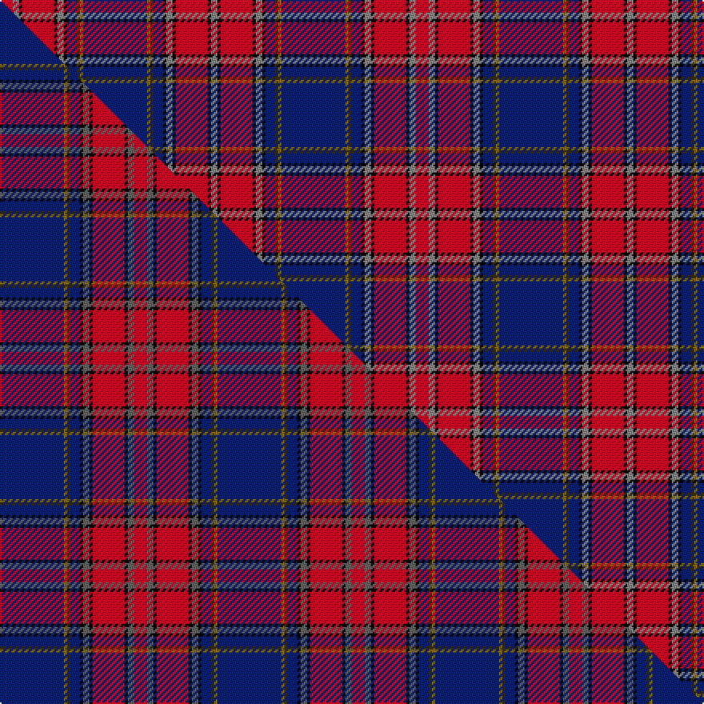

This is one **variant** — a specific cloth: this exact thread count and colourway, with its own
provenance below. It is one weaving of the [sett](/setts/db20y1dy1db3k1o2k1r10k1o2r4/) (the scale-free proportion — the
same cloth at any scale or shade), whose colour order is pattern [RKRKRKBGGBGGBKRKRKRR](/stripes/rkrkrkbggbggbkrkrkrr/).

Part of the [Blais](/tartans/b/bl/blais/) tartan — the named design grouping this sett with its other cloths.

Sourced from house-of-tartan.  It is a [20 stripe tartan](/stripes/stripes20/).

Original link [http://www.house-of-tartan.scotland.net/house/TartanViewjs.asp?colr=Def&tnam=2321](http://www.house-of-tartan.scotland.net/house/TartanViewjs.asp?colr=Def&tnam=2321)

## Provenance

Earliest known date: 1997 For Francine Paquet Blais's Canadian family with a direct line of descent from 1669. (STS)

Dataset <small>— provenance for this record, inherited from the source manifest</small>

<dl class="dataset-prov">
<dt>source</dt><dd><a href="/sources/house-of-tartan/">House of Tartan</a></dd>
<dt>data captured from</dt><dd><a href="https://github.com/thetartan/tartan-database/blob/master/data/house-of-tartan/data.csv">https://github.com/thetartan/tartan-database/blob/master/data/house-of-tartan/data.csv</a></dd>
<dt>data date</dt><dd>1997 <small>(this record)</small></dd>
<dt>licence</dt><dd><a href="https://creativecommons.org/licenses/by-nc-nd/4.0/">CC BY-NC-ND 4.0</a></dd>
</dl>

Capture chain <small>— the hands this data passed through, oldest first; each capture carries its own licence</small>

<ol class="capture-chain">
<li><a href="http://www.house-of-tartan.scotland.net/">House of Tartan</a> <small>the weaver/retailer's database — the site is now offline; the URL is kept as the ultimate source's identity</small></li>
<li><a href="https://github.com/thetartan/tartan-database">thetartan/tartan-database</a> <small>2016-2017</small> · <a href="https://creativecommons.org/licenses/by-nc-nd/4.0/">CC BY-NC-ND 4.0</a> <small>Levko Kravets's frozen compilation — the capture we vendored, and where its CC licence text came from</small></li>
<li>this dictionary <small>captured 2026-06-10 · commit 5bf86c7566</small> <small>each re-capture is a git commit to data/sources</small></li>
</ol>

## Thread count
R/8 O4 K2 R20 K2 O4 K2 DB6 DY2 Y2 DB40 Y2 DY2 DB6 K2 O4 K2 R20 K2 O/4

One full sett is **260 threads**.

## Palette
<table><thead><tr><th>Colour</th><th>Shade</th><th>OKLCh</th></tr></thead><tbody><tr><td>DB</td><td><code style="background-color:#082077;">#082077</code> <small style="color:#888">#082077</small></td><td><small style="color:#888">oklch(30.0% 0.149 265.1)</small></td></tr><tr><td>K</td><td><code style="background-color:#000000;">#000000</code> <small style="color:#888">#000000</small></td><td><small style="color:#888">oklch(0.0% 0.000 0.0)</small></td></tr><tr><td>O</td><td><code style="background-color:#888888;">#888888</code> <small style="color:#888">#888888</small></td><td><small style="color:#888">oklch(62.7% 0.000 89.9)</small></td></tr><tr><td>Y</td><td><code style="background-color:#787878;">#787878</code> <small style="color:#888">#787878</small></td><td><small style="color:#888">oklch(57.3% 0.000 89.9)</small></td></tr><tr><td>R</td><td><code style="background-color:#D60020;">#D60020</code> <small style="color:#888">#D60020</small></td><td><small style="color:#888">oklch(55.2% 0.224 25.5)</small></td></tr><tr><td>DY</td><td><code style="background-color:#3A2B0D;">#3A2B0D</code> <small style="color:#888">#3A2B0D</small></td><td><small style="color:#888">oklch(30.0% 0.049 82.0)</small></td></tr><tr><td>Y</td><td><code style="background-color:#8B6E00;">#8B6E00</code> <small style="color:#888">#8B6E00</small></td><td><small style="color:#888">oklch(55.1% 0.113 90.4)</small></td></tr></tbody></table>

# Sample pattern

## Compared to the master

This cloth is one sett of its design; the master sett (the exemplar the design is anchored on) is below for comparison.

Its **ΔTartan distance** from the master is **0.03** — the same measure the nearest-tartans table ranks by (0 is identical; a re-scale of the same cloth is near 0, a recolour or a different proportion further).

<figure class="master-compare" style="margin:0">

this sett
master sett ★

<figcaption style="color:#888;font-size:smaller">One weave of this sett against the <a href="/setts/db20y1dy1db3k1n2k1r10k1n2r4/">master sett ★</a>, split on the diagonal: a shared proportion runs seamlessly across it with only the shades shifting; a different proportion breaks on it.</figcaption>
</figure>

## Nearest tartan variants

The nearest existing variants by ΔTartan distance, with this cloth at the top so the swatches line up against it.

ΔTartan

Threads

Variant

Sett

—

260

<a href="/variants/s11/db20y1dy1db3k1o2k1r10k1o2r4~x2~o2500000/">Blais Family Tartan</a>

<a href="/ttd/edit/#slug=db20y1dy1db3k1n2k1r10k1n2r4~x2&amp;base=db20y1dy1db3k1o2k1r10k1o2r4~x2~o2500000" title="compare in the TTD">0.03</a>

136

<a href="/variants/s11/db20y1dy1db3k1n2k1r10k1n2r4~x2/">Blais (Personal)</a>

<a href="/ttd/edit/#slug=db20y1dy1db3k1n2k1r10k1n2r4~x4&amp;base=db20y1dy1db3k1o2k1r10k1o2r4~x2~o2500000" title="compare in the TTD">0.03</a>

272

<a href="/variants/s11/db20y1dy1db3k1n2k1r10k1n2r4~x4/">Blais (Personal)</a>

<a href="/ttd/edit/#slug=db20y1o1db3k1n2k1r10k1n2r4~x2&amp;base=db20y1dy1db3k1o2k1r10k1o2r4~x2~o2500000" title="compare in the TTD">0.61</a>

136

<a href="/variants/s11/db20y1o1db3k1n2k1r10k1n2r4~x2/">Blais</a>

<a href="/ttd/edit/#slug=db4dy3db22n6w2k6w2r26k3r4~x2&amp;base=db20y1dy1db3k1o2k1r10k1o2r4~x2~o2500000" title="compare in the TTD">2.50</a>

296

<a href="/variants/s10/db4dy3db22n6w2k6w2r26k3r4~x2/">Asman, Dress (Name)</a>

<a href="/ttd/edit/#slug=db4dy3db22n6w2k6w2r26k3r4~x2~db1406275&amp;base=db20y1dy1db3k1o2k1r10k1o2r4~x2~o2500000" title="compare in the TTD">2.51</a>

296

<a href="/variants/s10/db4dy3db22n6w2k6w2r26k3r4~x2~db1406275/">Asman Dress Family Tartan</a>

<a href="/ttd/edit/#slug=db41r2k42w2g41r3y2r3g3r31k3y2r3k5r3y2k3r31db3r3y2r3~x2&amp;base=db20y1dy1db3k1o2k1r10k1o2r4~x2~o2500000" title="compare in the TTD">2.83</a>

844

<a href="/variants/s22/db41r2k42w2g41r3y2r3g3r31k3y2r3k5r3y2k3r31db3r3y2r3~x2/">Hay or Leith</a>

<a href="/ttd/edit/#slug=db20w3db4w3db4w3r22g2k1g2dy16w1k2w1~x2&amp;base=db20y1dy1db3k1o2k1r10k1o2r4~x2~o2500000" title="compare in the TTD">2.90</a>

294

<a href="/variants/s14/db20w3db4w3db4w3r22g2k1g2dy16w1k2w1~x2/">Salaberry-de-Valleyfield Traditional</a>

<a href="/ttd/edit/#slug=r24db2w2k2r2db27dg6db2ly2k2r2db2dg23~x2&amp;base=db20y1dy1db3k1o2k1r10k1o2r4~x2~o2500000" title="compare in the TTD">2.91</a>

298

<a href="/variants/s13/r24db2w2k2r2db27dg6db2ly2k2r2db2dg23~x2/">Montreal Olympics (1976) (Corporate)</a>

<a href="/ttd/edit/#slug=k3r1y1k2r16db2r1y1r2db15r1k15w1g15r2y1r1g2r16k2y1r1k3&amp;base=db20y1dy1db3k1o2k1r10k1o2r4~x2~o2500000" title="compare in the TTD">2.94</a>

204

<a href="/variants/s23/k3r1y1k2r16db2r1y1r2db15r1k15w1g15r2y1r1g2r16k2y1r1k3/">Hay and Leith</a>

<a href="/ttd/edit/#slug=k3r1y1k2r16db2r1y1r2db15r1k15w1g15r2y1r1g2r16k2y1r1k3~x2&amp;base=db20y1dy1db3k1o2k1r10k1o2r4~x2~o2500000" title="compare in the TTD">2.94</a>

408

<a href="/variants/s23/k3r1y1k2r16db2r1y1r2db15r1k15w1g15r2y1r1g2r16k2y1r1k3~x2/">Leith, (Hay)</a>

## Neighbour map

Every grey dot is one of 13621 variants placed by the first two principal components of the ΔTartan feature space (42% of its variance). Red is this tartan; blue dots are its nearest — click one to open its page. The map is a flat projection of a many-dimensional space — [how to read it](/posts/neighbourhood-maps/).

<svg viewBox="0 0 640 380" role="img" style="max-width:100%;height:auto;border:1px solid #e0e0e0;border-radius:4px;display:block" xmlns="http://www.w3.org/2000/svg"><image href="/nn/cloud.v1.png" width="640" height="380"/><a href="/variants/s11/db20y1dy1db3k1n2k1r10k1n2r4~x2/"><circle cx="251.1" cy="82.6" r="4" fill="#3465a4"><title>Blais (Personal)</title></circle></a><a href="/variants/s11/db20y1dy1db3k1n2k1r10k1n2r4~x4/"><circle cx="251.1" cy="82.6" r="4" fill="#3465a4"><title>Blais (Personal)</title></circle></a><a href="/variants/s11/db20y1o1db3k1n2k1r10k1n2r4~x2/"><circle cx="250.1" cy="82.2" r="4" fill="#3465a4"><title>Blais</title></circle></a><a href="/variants/s10/db4dy3db22n6w2k6w2r26k3r4~x2/"><circle cx="145.1" cy="113.3" r="4" fill="#3465a4"><title>Asman, Dress (Name)</title></circle></a><a href="/variants/s10/db4dy3db22n6w2k6w2r26k3r4~x2~db1406275/"><circle cx="151.0" cy="114.3" r="4" fill="#3465a4"><title>Asman Dress Family Tartan</title></circle></a><a href="/variants/s22/db41r2k42w2g41r3y2r3g3r31k3y2r3k5r3y2k3r31db3r3y2r3~x2/"><circle cx="124.2" cy="46.1" r="4" fill="#3465a4"><title>Hay or Leith</title></circle></a><a href="/variants/s14/db20w3db4w3db4w3r22g2k1g2dy16w1k2w1~x2/"><circle cx="123.2" cy="77.1" r="4" fill="#3465a4"><title>Salaberry-de-Valleyfield Traditional</title></circle></a><a href="/variants/s13/r24db2w2k2r2db27dg6db2ly2k2r2db2dg23~x2/"><circle cx="152.1" cy="100.3" r="4" fill="#3465a4"><title>Montreal Olympics (1976) (Corporate)</title></circle></a><a href="/variants/s23/k3r1y1k2r16db2r1y1r2db15r1k15w1g15r2y1r1g2r16k2y1r1k3/"><circle cx="122.4" cy="56.2" r="4" fill="#3465a4"><title>Hay and Leith</title></circle></a><a href="/variants/s23/k3r1y1k2r16db2r1y1r2db15r1k15w1g15r2y1r1g2r16k2y1r1k3~x2/"><circle cx="122.4" cy="56.2" r="4" fill="#3465a4"><title>Leith, (Hay)</title></circle></a><circle cx="170.9" cy="56.4" r="5" fill="#c00000"/><text x="320" y="376" text-anchor="middle" font-size="11" fill="#999">ground</text><text x="11" y="190" text-anchor="middle" font-size="11" fill="#999" transform="rotate(-90 11 190)">complexity</text></svg>

ID: /variants/s11/db20y1dy1db3k1o2k1r10k1o2r4~x2~o2500000/
